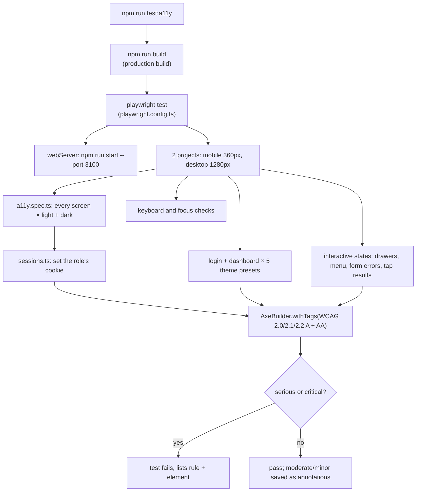

# Accessibility: the automated audit and the patterns it enforces

Talaan aims for WCAG 2.2 AA (see CLAUDE.md's UX quality bar). This doc explains how that is checked, which shared building blocks carry the accessibility behavior so individual screens don't have to, and how to keep a new screen passing.

## The short version

- `npm run test:a11y` builds the app, starts it on port 3100, opens every screen in a real Chromium browser, and runs **axe** (an automated accessibility checker) on each one.
- Any **serious** or **critical** axe finding fails the run. **Moderate** and **minor** findings are attached to the report as notes, without failing it.
- A second group of tests checks keyboard behavior axe can't see: the skip link, focus staying inside a drawer, focus coming back when it closes, and the 44px tap-station buttons.
- CI runs the same audit on every push, after the build step (`.github/workflows/ci.yml`).

## How a run works



### Signing in without a login form

Each screen is opened *as* a role by setting the same cookie the dev role switcher and the parent login set. From `e2e/sessions.ts`:

```ts
export const PERSONAS = {
  anonymous: null,
  super_admin: { cookie: "talaan-dev-session", value: "staff-0001" },
  principal: { cookie: "talaan-dev-session", value: "staff-principal-school-balanga" },
  teacher: { cookie: "talaan-dev-session", value: "staff-teacher-school-balanga" },
  parent: { cookie: "talaan-parent-session", value: "parent-balanga-1" },
} as const;
```

This works against a production build because only *changing* the dev session is blocked in production (`assertDevSessionMutationAllowed`). Reading the cookie is allowed.

### The check itself

From `e2e/a11y.spec.ts`:

```ts
async function expectNoBlockingViolations(page: Page) {
  // A fade-in caught halfway reads as low contrast, so wait for one-off
  // animations to settle (endless ones, like a spinner, never will).
  await page.waitForFunction(() =>
    document
      .getAnimations()
      .every((a) => a.playState !== "running" || a.effect?.getTiming().iterations === Infinity),
  );
  const { violations } = await new AxeBuilder({ page }).withTags(WCAG_TAGS).analyze();
  ...
}
```

Two details matter:
- **The animation wait.** axe measures colors as they are *right now*. A result card fading in reads as low contrast halfway through. Looping animations are ignored, or the wait would never end.
- **`WCAG_TAGS`** limits axe to WCAG rules. axe also has "best-practice" rules (landmarks, heading order). Those aren't WCAG failures, so they don't gate CI, but Step 27 ran them once and fixed what they found (see below).

### What's covered

| Group | What |
|---|---|
| Screens | Login, not found, parent login and signup, then every staff screen as principal, teacher (including the access-denied page) and super admin, and the three parent portal screens. Each in light and dark, at 360px and 1280px. |
| Presets | Login and dashboard under school, ocean, emerald, crimson and violet, light and dark. |
| Interactive states | Mobile nav drawer, Add student drawer before and after a failed submit, Edit student drawer and the card replace confirmation, Add school drawer, all four tap station results, parent login and link-a-child errors, and the notification bell menu. |
| Keyboard | Skip link first and working (staff and parent), Tab kept inside a drawer, Esc closes it and focus goes back to the button *or table row* that opened it, mobile nav focus return, and tap station buttons at least 44px tall. |
| Light/dark toggle | The menu open in the staff top bar, the parent header and on the login page (axe), and choosing Dark with only the keyboard, surviving a reload, then "Match device" going back. |

Not covered: `/design-system`. It is dev-only, so the production build returns "not found" for it.

## The shared building blocks

Most accessibility behavior lives in a few shared components, so every screen gets it for free.

### Skip link (`src/components/skip-link.tsx`)

The first thing Tab reaches in the staff app and the parent portal. It is hidden until focused, then jumps past the sidebar or header to the page content.

```tsx
export const MAIN_CONTENT_ID = "main-content";

export function SkipLink() {
  return (
    <a
      href={`#${MAIN_CONTENT_ID}`}
      className="sr-only rounded-md border border-border bg-background ... focus:not-sr-only focus:fixed focus:px-4 focus:py-2.5 focus:top-3 focus:left-3 focus:z-50 ..."
    >
      Skip to main content
    </a>
  );
}
```

The `<main>` it points to has `tabIndex={-1}`, so it can receive focus from the link, and `outline-none`, because a focus ring around the whole page area isn't useful. Padding is set with `focus:` variants on purpose: `not-sr-only` resets padding to 0, so plain `px-4` would lose.

### Landmarks

Screen reader users can jump between page regions ("landmarks"), so every page's content sits in one:
- `<main>` on every page. In the staff app and parent portal it comes from the layout. Login, parent login and signup, and not-found have their own `<main>`.
- `<aside aria-label="Sidebar">` for the desktop sidebar (`sidebar.tsx`).
- `<header>` for the top bar, and `<nav aria-label="Main navigation">` for the links.

### Scrollable tables (`src/components/ui/table.tsx`)

A table wider than a phone scrolls sideways inside its own box. If nothing inside it can take focus (Attendance and Staff have no buttons in their rows), a keyboard user can't scroll it at all. `Table` takes a `label`, and with one its scroll box becomes a named, focusable region that the arrow keys scroll:

```tsx
function Table({ className, label, ...props }: React.ComponentProps<"table"> & { label?: string }) {
  return (
    <div
      data-slot="table-container"
      role={label ? "region" : undefined}
      aria-label={label}
      tabIndex={label ? 0 : undefined}
      className="relative w-full overflow-x-auto rounded-[inherit] outline-none focus-visible:ring-2 focus-visible:ring-ring/50 focus-visible:ring-inset"
    >
```

The ring is `ring-inset` because the feature-level wrapper around each table also clips overflow, and an outside ring would be cut off.

### Drawers return focus (`src/components/ui/sheet.tsx`)

Radix only returns focus on close when a sheet is opened by its own `<SheetTrigger>`. Our add/edit drawers are opened from code (a header button or a table row click). Without help, closing one dropped focus at the top of the page. `SheetContent` now remembers what had focus when it opened and hands it back:

```tsx
onOpenAutoFocus={(event) => {
  openerRef.current =
    document.activeElement instanceof HTMLElement ? document.activeElement : null
  onOpenAutoFocus?.(event)
}}
onCloseAutoFocus={(event) => {
  onCloseAutoFocus?.(event)
  const opener = openerRef.current
  if (event.defaultPrevented || !opener?.isConnected) return
  event.preventDefault()
  opener.focus()
}}
```

`onOpenAutoFocus` runs *before* Radix moves focus into the sheet, so `document.activeElement` is still the button that opened it.

### Menus that aren't modal (`notifications-bell.tsx`)

A modal Radix menu hides the rest of the page from screen readers (`aria-hidden`) while its links stay tabbable, which axe reports as serious. The notification bell uses `<DropdownMenu modal={false}>`. Esc, Tab and clicking outside still close it.

### Form errors

Forms don't use `role="alert"` for field errors. Each invalid input gets `aria-invalid` and `aria-describedby` pointing at its message, and React Hook Form moves focus to the first invalid field on submit, so a screen reader reads the field and its error together. The audit checks exactly that: after a failed submit, the focused element has `aria-invalid="true"`.

## Quick recipes

**Audit a new screen.** Add one line to `SCREENS` in `e2e/a11y.spec.ts`:
```ts
{ name: "reports (principal)", path: "/reports", as: "principal" },
```
It then runs in light and dark at both sizes automatically.

**Audit something that only appears after a click.** Add a test under `"interactive states"`: sign in, click to open it, wait for it to be visible, then `await expectNoBlockingViolations(page)`.

**Add a new table.** Give it a label: `<Table label="Reports">`. That's all a keyboard user needs to scroll it on a phone.

**Add a new drawer.** Use `SheetContent` as usual. Focus return is automatic, whether it's opened by `SheetTrigger` or by code.

**Add a new dropdown that only shows information** (like the bell): prefer `modal={false}`.

**Read a failure.** The test output lists the axe rule id (for example `color-contrast`), its impact and a CSS selector for each element. Search the rule id at dequeuniversity.com/rules/axe for an explanation. `npx playwright show-report` opens the full HTML report, and in CI it's uploaded as the `playwright-report` artifact when the audit fails.

**Run just part of it.** `npx playwright test -g "tap station"` runs tests whose name matches. Add `--project=mobile` for only the 360px run. Run `npm run build` first if the code changed, because the audit tests the production build.
