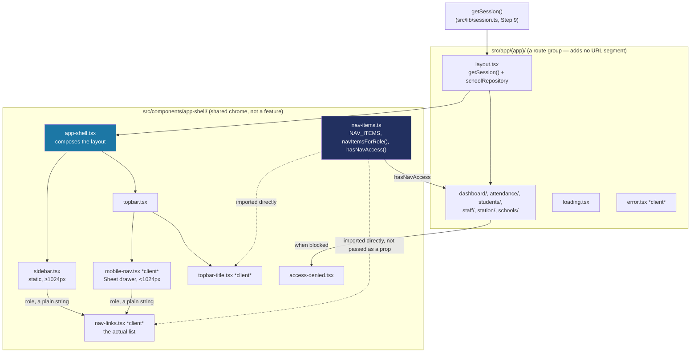
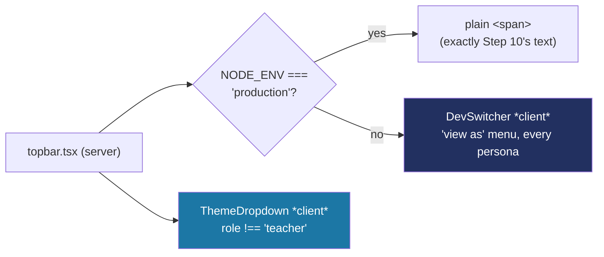
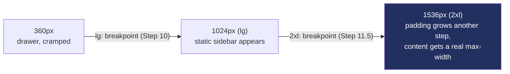

# How the app shell, navigation and route guards work

Step 10 builds the chrome every signed-in screen renders inside from now on: the sidebar, the top bar, the mobile drawer, and the logic that decides which of those a role actually sees — plus what happens when someone reaches a page their role isn't supposed to. This is a genuinely different subsystem from Step 9's data-access layer (`docs/DATA-ACCESS.md`): that one was about *reading data*, this one is about *what's even on screen*. See `docs/BUILD-LOG.md`'s Step 10 entry for the decisions and the bugs hit along the way; this document is the reference for how the mechanism works.

## The shape of it



## `nav-items.ts`: one list, three jobs

Every nav-related decision in the app — what the sidebar shows, what the mobile drawer shows, and what a route guard allows — reads from the same array, so they can never quietly drift apart (a role that could reach a page by URL but never see it in the menu, or vice versa):

```ts
export const NAV_ITEMS: readonly NavItem[] = [
  { segment: "schools", href: "/schools", label: "Schools", icon: School, roles: ["super_admin"] },
  { segment: "dashboard", href: "/dashboard", label: "Dashboard", icon: LayoutDashboard, roles: ALL_ROLES },
  // ...attendance, students, staff, station
];

export function navItemsForRole(role: Role): NavItem[] {
  return NAV_ITEMS.filter((item) => item.roles.includes(role));
}

export function hasNavAccess(role: Role, segment: NavSegment): boolean {
  const item = NAV_ITEMS.find((candidate) => candidate.segment === segment);
  return item ? item.roles.includes(role) : true;
}
```

`navItemsForRole` drives what renders in the sidebar/drawer. `hasNavAccess` drives the route guards below — same source list, two different questions asked of it.

## A real bug: you can't hand a component to a Client Component

The first version of this had `Sidebar` (a Server Component) call `navItemsForRole(role)` itself, then pass the resulting array — each item carrying its actual icon component — down into `NavLinks`, which has to be a Client Component (it uses `usePathname()` to know which link is "current," and that hook only works in the browser). That crashed at runtime:

> Functions cannot be passed directly to Client Components unless you explicitly expose it by marking it with "use server"

**Why:** a Server Component and a Client Component don't just call each other like two normal functions — data crossing that boundary gets serialized (turned into a plain data message) so it can be sent to the browser. Plain data (strings, numbers, plain objects/arrays of those) survives that trip. A React component — which is really a function — does not.

**The fix:** `NavLinks` (and `MobileNav`, one layer up) don't receive the resolved item list at all. They take only `role: Role` — a plain string — and call `navItemsForRole(role)` themselves:

```tsx
// nav-links.tsx — "use client"
export function NavLinks({ role, onNavigate, className }: { role: Role; ... }) {
  const pathname = usePathname();
  const items = navItemsForRole(role); // resolved here, in the browser bundle
  // ...
}
```

This works because `nav-items.ts` has no `"use client"` or `"use server"` directive — it's a plain shared module. Server Components that import it run it on the server; Client Components that import it get it bundled into the browser JS. Nothing about it is tied to one side, so there's nothing to serialize across the boundary — only the `role` string crosses it now.

**The general rule this taught:** whenever a Server Component hands data to a Client Component as a prop, ask "would this survive being turned into JSON?" A string, number, plain object or array of those: yes. A function, class instance, or React component reference: no — resolve it on whichever side actually needs it instead.

## Route guards: `hasNavAccess`, checked per page

There's no proxy/middleware file here (Next 16 renamed that to `proxy.js`, but this doesn't need one) — each restricted page just checks its own access at the top, using the exact same `NAV_ITEMS` the sidebar reads from:

```tsx
// src/app/(app)/staff/page.tsx
export default async function StaffPage() {
  const session = await getSession();

  if (!hasNavAccess(session.role, "staff")) {
    return (
      <AccessDenied reason="Teacher accounts don't manage staff at this school — that needs a principal or super admin sign-in." />
    );
  }

  return /* the real page */;
}
```

A teacher who never sees "Staff" in their own sidebar and types `/staff` directly gets a real, specific, in-shell message (`AccessDenied`) — not a silent redirect, and not a generic 404. `reason` is written per call site so it names the actual role and page, not a boilerplate "access denied."

**Why not a redirect, and why not `notFound()`:** a silent bounce to `/dashboard` hides *why* nothing happened, which fails CLAUDE.md's "clear messages" bar. `notFound()` would render as if the page didn't exist at all — misleading for something that exists but is restricted. A plain, honest message with a way back is the friendlier and more accurate choice for a school app where roles aren't a secret.

## Why the page title now lives in two places: `<h1>` (top bar) and `<h2>` (page content)

`TopbarTitle` is a small Client Component that reads the current route segment (`useSelectedLayoutSegment()` — layouts themselves can't see the current path, since they don't rerender on navigation) and looks up its label from `NAV_ITEMS`:

```tsx
// topbar-title.tsx — "use client"
export function TopbarTitle() {
  const segment = useSelectedLayoutSegment();
  const label = NAV_ITEMS.find((item) => item.segment === segment)?.label ?? "Talaan";
  return <h1 className="...">{label}</h1>;
}
```

That `<h1>` is now the one true top-level heading for every screen inside the shell. Each page's own `PageHeader` (Step 6) used to also render an `<h1>` with the identical text — two "this is the most important heading" on one page, which breaks screen-reader heading navigation. `PageHeader` got a small additive `as?: "h1" | "h2"` prop (default `"h1"`, so its two standalone usages outside the shell — `/` and `/design-system` — are unaffected) and every page inside `(app)/` passes `as="h2"`. The reference prototype already modeled this correctly (its own top bar renders `<h1>`, its page functions render `<h2>`) — worth matching, not reinventing.

## The responsive split: `Sidebar` vs. `MobileNav`

Both render the exact same `NavLinks`, just packaged differently:

- **`Sidebar`** — a plain, always-rendered `<div>`, hidden below `lg` (1024px) and shown as a static 256px column at `lg` and up: `className="hidden lg:flex"`. No JavaScript needed to decide this — it's a CSS media query.
- **`MobileNav`** — a Client Component wrapping shadcn's `Sheet` (built on Radix's `Dialog` — focus trap and Escape-to-close come for free), visible only below `lg` (`className="lg:hidden"` on its trigger button). Its `NavLinks` gets an `onNavigate` callback that calls `setOpen(false)`, so tapping a link closes the drawer instead of leaving it open over the new page.

## Step 11: the top bar's right side — `DevSwitcher` and `ThemeDropdown`

Step 10 left the top bar's right side as a static "Principal, Balanga City NSHS" text span. Step 11 makes it interactive, and adds a second control next to it:



**`DevSwitcher`** replaces the static text with a button showing the exact same text, opening a `DropdownMenuRadioGroup` grouped by school (`DropdownMenuLabel` per school, a "Platform" group for the school-less super admin). Picking a persona calls two Server Actions in sequence, inside `startTransition` (the documented way to invoke a Server Action from a plain click handler, not a `<form>`):

```tsx
function switchTo(staffId: string) {
  startTransition(async () => {
    await setDevSession(staffId); // src/lib/session-actions.ts
    await clearThemeOverride(); // src/lib/theme/theme-override-actions.ts — see docs/STYLING-SYSTEM.md
  });
}
```

The `topbar.tsx` server component decides whether `DevSwitcher` renders **at all** — `process.env.NODE_ENV !== "production"` — the same belt-and-suspenders pattern `assertDevSessionMutationAllowed` already used inside the action itself (Step 9): the UI not rendering a button is never treated as the actual security boundary, only as a convenience on top of one.

**`ThemeDropdown`** is unrelated to the dev/production split — CLAUDE.md calls for keeping it in real, "demo" builds, since a school truly will get theme control eventually (Step 21 just hasn't wired up saving yet). It renders whenever `role !== "teacher"`, in production or not. Its own Server Action (`setThemeOverride`) checks the role server-side too, independently of the UI — see `docs/STYLING-SYSTEM.md`'s Step 11 section for what it actually does to the page's colors.

**Both controls disappear below `sm` (640px)**, same reasoning as Step 10's original identity chip: a 360px top bar only has room for the menu button and the page title before things start truncating.

## Step 11.5: big screens — grow generously, then stop

Every check so far (Steps 1-11) was at 360px and 1280px, per CLAUDE.md's two named check points. Using the real app on a real large monitor surfaced a real gap: nothing in the shell had ever been given behavior past `lg` (1024px) — `grep -rn "xl:\|2xl:" src` returned nothing, anywhere, before this step. On a 1920px+ screen the sidebar stayed 256px, every piece of text stayed exactly its 1280px size, and the content area — already unconstrained, already `flex-1` — just showed a large empty rectangle, because there was nothing sized to notice the extra room.

**The target matters, and changes the fix.** Confirmed with the owner this is about a bigger desktop/laptop monitor, viewed up close — not a wall-mounted TV/lobby display (which would need a "10-foot UI": much bigger text, simpler layout, viewed from across a room). Up close, inflating body text to fill a wide monitor just looks oversized — the actual fix is making better use of *width*, and growing only the handful of things that should visibly scale (page titles, breathing room), not everything.



**Content stops growing past a point, on purpose.** `AppShell`'s `<main>` wraps `{children}` in `<div className="w-full 2xl:max-w-[1600px]">` — below 1536px this does nothing (unchanged since Step 10); at 1536px and up, content is capped at 1600px instead of stretching into a single absurdly wide block on an ultrawide monitor. No `mx-auto` — the cap doesn't center the content, it just stops it from stretching further, so it stays flush with the top bar's title above it (which does span full width) instead of becoming a visually disconnected island. This mirrors how real dashboard products (Linear, Notion, GitHub) behave: navigation chrome (the 256px sidebar, the top bar height) stays a constant width regardless of monitor size — only the *content* area grows, and even it stops at a sane point rather than "growing forever," because very long line lengths and very wide tables get harder to scan, not easier.

**Typography grows in two more places, following the pattern `TopbarTitle` already started in Step 10** (`sm:text-xl`): `PageHeader`'s title steps up at `lg`/`2xl` (`text-2xl` → `lg:text-3xl` → `2xl:text-4xl`), and its description at `lg` (`text-sm` → `lg:text-base`). Nothing else grows — body copy inside pages stays put, since (per the target above) that's the text someone's actually reading up close, not glancing at from across a room.

**Why the placeholder pages changed too, not just the container.** With next-to-no real content yet (Steps 13+ haven't built the real dashboard/tables), a wider container alone wouldn't visibly demonstrate anything — a slightly-less-narrow box around two lines of text still looks like a mostly-empty page. Each placeholder's plain `<p>` became an `EmptyState` panel (icon + "Not built yet" + the same explanatory copy) — genuinely the right component for this now (unlike `AccessDenied`, which deliberately avoided `EmptyState`'s dashed border in Step 10 because "empty, add content" was the wrong metaphor for "you're blocked" — here "nothing built here yet" is exactly what `EmptyState` means). This is honest scope, not a trick: the full "this really fills my monitor" payoff still lands once Steps 13+ add real cards/tables/grids that can actually use the reclaimed width — this step makes sure they inherit good behavior automatically instead of every future page re-deciding it, and makes today's shell and placeholders look intentional in the meantime, not just "technically ready."

## Quick recipes

**I want to add a new page to the shell** (e.g. a student detail page): add `src/app/(app)/students/[id]/page.tsx`. It automatically gets the sidebar/top bar from `(app)/layout.tsx` — nothing else to wire up. If it should be restricted, add the guard pattern from the "Route guards" section above.

**I'm building real content for a page past Step 12 and want it to behave well on a big screen:** you don't need to do anything extra for the outer container — `(app)/layout.tsx` already caps it at 1600px past 1536px width. If the content itself is data-dense (a table, a multi-column grid), let it use the *full* available width inside that container rather than adding your own narrower max-width — a wide table or a grid that adds columns as space allows is exactly the kind of thing that should benefit from the reclaimed room. If it's prose-heavy (a form, a long description), a narrower `max-w-prose`/`max-w-xl` wrapper *inside* the page is fine and often better for readability — that's a per-page call, not something the shell should force.

**I want to add a new top-level nav item:** add one entry to `NAV_ITEMS` in `nav-items.ts` (segment, href, label, icon, roles) — the sidebar, the mobile drawer, and the top bar title all pick it up automatically. Create the matching `src/app/(app)/<segment>/page.tsx`.

**I want to change who can see an existing page:** edit that item's `roles` array in `nav-items.ts`. Nothing else needs touching — the nav and the guard both read from the same place.

**I want to add a heading inside a page that lives in `(app)/`:** use `<PageHeader as="h2" title="..." />`, not a bare `<h1>` — the top bar already owns the page's `<h1>`.

**I want to know if a role can reach a given section from plain code** (not inside a page): `hasNavAccess(role, "staff")` — returns a boolean, no React needed.
