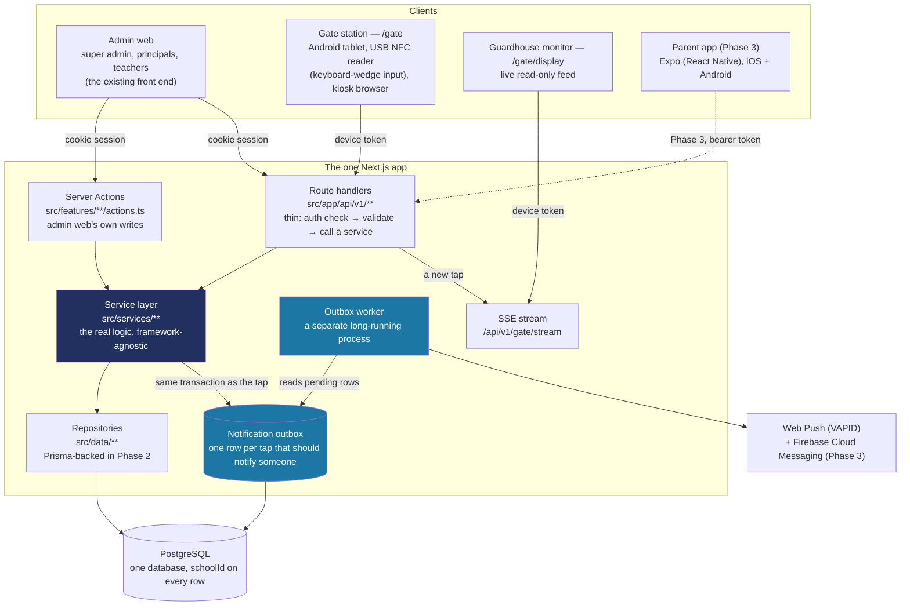
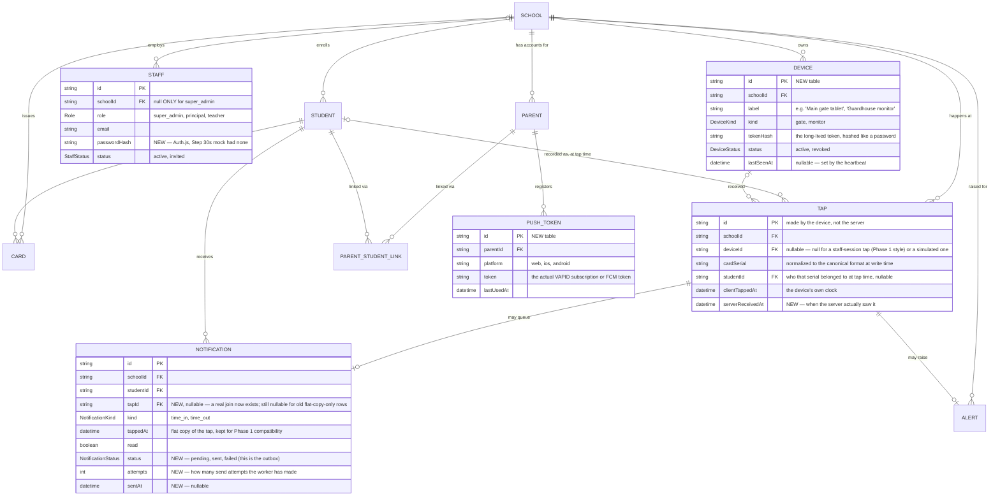

# Backend architecture (proposed)

This is the proposed design for Phase 2, written before any backend code exists — a reference to build against, not a record of what's already built (that's what `docs/BUILD-LOG.md` and the `docs/backend/step-NN-*.md` recipes are for, once each piece is actually implemented). It will likely be revised once real code and the "Open questions" below have answers; treat it as the current best plan, not a frozen spec.

**Why this document exists:** as of 2026-10-03, one Next.js app became the backend for four different clients instead of one. That's a big enough shift that the database shape, the API shape and the auth shape all needed working through together, in one place, before any of Phase 2's remaining steps get a recipe. See `CLAUDE.md`'s "Backend architecture" section for the short version and the principles; this document is the long version.

## The one idea to hold on to

**Everything talks to one Next.js app, and that app has exactly one copy of the real logic.** Four very different clients (a browser, an Android kiosk, a guardhouse display, eventually a phone app) all hit the same API, and the API's route handlers are deliberately thin — they check who's calling, validate the request, call into a service function, and return its result as JSON. The service function is where the actual rules live (normalize this serial, find this student, is this a duplicate, write the tap and the outbox row together). A route handler and a Server Action calling the exact same service function is what makes "the web app already does this" and "the gate device needs to do this too" the same amount of work the second time, not a rewrite.

## The four clients



1. **Admin web** — the already-built front end. Super admin, principals and teachers. No change in how it talks to the app (Server Components, Server Actions) — it keeps using cookie sessions, not the versioned API.
2. **Gate station (`/gate`)** — an Android tablet with a USB NFC reader in keyboard mode, running a kiosk browser pointed at this page. The reader "types" the card's serial into whatever has focus; the page watches for a burst of keystrokes with no more than about 80ms between them, and treats a longer pause as "that scan is done." Signs in once with a long-lived device token, not a staff login — nobody re-types a password at a gate every morning.
3. **Guardhouse monitor (`/gate/display`)** — a second screen, usually just above or beside the gate, showing the last several taps as they happen: photo, name, grade. Read-only, no input. Uses the same device-token mechanism as the gate station — confirmed 2026-10-03.
4. **Parent app (Phase 3, not started)** — a separate Expo (React Native) app. Talks to the exact same `/api/v1` endpoints the web parent portal could also use, authenticated with the same kind of token. This replaces the earlier idea of wrapping the Next.js app itself in Capacitor (see `CLAUDE.md`'s "Plan history"). Small and parent-only by design: sign up or sign in, link a child, receive push notifications for that child's taps, and view the feed. It never gets staff, gate or admin screens.

## Database: tables and relationships

Most of this is `docs/DATA-MODEL.md`'s existing design, carried forward unchanged — Phase 1's types and Zod schemas were already written to match a real database, not just a mock. What's **new** here: `Device`, `PushToken`, and extending `Notification` to double as the outbox. What's **reworded**: `Staff` gains a real password hash; nothing in the shape changes.



Everything not shown above (`School`, `Student`, `Card`, `Alert`, `ParentStudentLink`) is unchanged from `docs/DATA-MODEL.md` — see that document for their full fields and the reasoning behind them (why Card is its own record, why Tap stores its own `studentId` rather than looking one up live, and so on). That reasoning still holds; this document only covers what's different.

**`Notification` doubling as the outbox, instead of a separate table.** The pasted architecture spec describes "a row in a notification outbox" as its own thing from "a parent-visible notification." Phase 1 already has exactly one record per tap-that-should-notify-someone (`docs/NOTIFICATIONS.md`), and it already carries everything a feed needs. Adding `status`/`attempts`/`sentAt` to that same table, rather than introducing a second `NotificationOutbox` table that the worker drains into this one, means no join and no risk of the two ever disagreeing about what was actually sent. If delivery tracking grows more complex later (per-channel retries, per-parent-not-just-per-student state), split it out then — this is the simpler default, not a permanent constraint.

**Why `Tap.deviceId` is nullable.** A tap can come from three different places: the real `/gate` kiosk (has a `deviceId`), a staff session typing into the dashboard's "Simulate a tap" (no device, has a staff session instead), or — once Auth.js exists — a staff member standing in for a station that doesn't have its own token yet (`docs/PLAN.md`'s "early stations may instead identify themselves by a logged-in staff session"). The column has to tolerate all three without forcing a fake device row into existence for the latter two.

## API: endpoints under `/api/v1`

Only endpoints a **non-browser client** needs to call move to this versioned, token-authenticated API. Admin web's own writes stay as Server Actions (`src/features/*/actions.ts`) — nothing calls them over HTTP from outside this app, so there's no API contract to version or document separately. Auth.js keeps its own conventional route (typically `/api/auth/*`), outside the `/v1` prefix — that's a fixed convention of the library, not a route we're designing.

| Method & path | Who calls it | Auth | What it does |
|---|---|---|---|
| ~~`POST /api/v1/devices/register`~~ | — | — | **Replaced for now (Step 43, 2026-10-09)** by a command, `npm run device:create -- --school <id> --kind gate\|monitor --label "…"`, which creates the `Device` row and prints the token once. It works locally and on the production server, and there's no admin screen for devices yet. An endpoint comes back if an admin screen is built. |
| `POST /api/v1/gate/taps` | Gate station | Device token | Body: `{ clientTapId, cardSerial, clientTappedAt }`. Normalizes the serial, finds the student in that device's school, checks the debounce window, writes the `Tap` + outbox `Notification` in one transaction, publishes to the SSE stream. Returns the resolved outcome (valid / duplicate / lost card / unknown card) plus display info (name, grade, photo) for the kiosk's own confirmation screen. |
| `GET /api/v1/gate/stream` | Guardhouse monitor | Device token | Server-sent events: one event per new tap at that device's school, already resolved (so the monitor never has to re-derive anything). |
| `POST /api/v1/devices/heartbeat` (**built, Step 43**) | Gate station (at setup) | Device token | Updates `Device.lastSeenAt` and answers `{ device: { id, schoolId, label, kind }, serverTime }`, or 401 for a missing, unknown or revoked token. **No timer (decided 2026-10-09):** the gate calls it once, when its token is entered, to confirm the token and show "Connected as …". During the day, recording a tap also sets `lastSeenAt`, in the same write. The guardhouse monitor sends no heartbeat. A 5-minute check-in while idle can be added later, if a dashboard "gate offline" display turns out to need it. |
| `POST /api/v1/parents/signup` | Parent web portal, parent app | None (creates the account) | Same validation as today's mock signup; stores a real password hash. |
| `POST /api/v1/parents/login` | Parent web portal, parent app | Email + password | Issues the same token shape to both: an access token (short-lived) and a refresh token. The web portal keeps them in an httpOnly cookie; the Phase 3 app keeps them in secure device storage. Same endpoint, same response shape, different storage — not a different API. |
| `POST /api/v1/parents/refresh` | Parent web portal, parent app | Refresh token | Issues a new access token without asking for the password again. |
| `POST /api/v1/parents/link-child` | Parent web portal, parent app | Parent access token | Same LRN + last name + birth date check as today. |
| `GET /api/v1/parents/notifications` | Parent web portal, parent app | Parent access token | Same shape `getParentNotifications()` already returns today. |
| `POST /api/v1/parents/notifications/:id/read` | Parent web portal, parent app | Parent access token | Same as today's `markNotificationRead`. |
| `POST /api/v1/push-tokens` | Parent web portal (Web Push), parent app (FCM, Phase 3) | Parent access token | Registers or refreshes a `PushToken` for the signed-in parent. |

## Auth: three kinds of identity, not one

- **Staff** — Auth.js, a cookie session (JWT strategy, so no extra `Session` table). Browser-only; there's no staff-facing mobile client, so there's nothing to gain from also issuing staff a bearer token. This is already the Phase 2 roadmap's plan (`docs/PLAN.md`); nothing about the new architecture changes it.
- **Gate/monitor devices** — a long-lived opaque bearer token per device, created once by staff with `npm run device:create` (Step 43) and typed into the kiosk's own setup screen (or baked into the kiosk browser's start URL). Stored **hashed** in `Device.tokenHash`, the same way a password would be — the plaintext is shown exactly once, at creation. Sent as `Authorization: Bearer <token>` on every `/api/v1/gate/*` and `/api/v1/devices/heartbeat` call. Long-lived on purpose: a physical kiosk is set up once by staff, not signed into every morning. Built in Step 43: `src/services/devices/device-token.ts` (a `tal_dev_` prefix plus 32 random bytes, sha256 for the stored hash, since a random token has nothing to guess and the lookup needs the same hash every time) and `src/services/devices/authenticate-device.ts` (one `null` for missing, unknown and revoked alike).
- **Parents** — a short-lived access token plus a longer-lived refresh token (both JWTs), issued by `/api/v1/parents/login` and `/signup`. The same pair, the same shape, works for both the web parent portal (held in an httpOnly cookie, same as any web session) and the Phase 3 Expo app (held in the device's secure storage) — one auth implementation serving both clients, which is the entire point of "token-based auth so web and mobile share it."

## Folder structure

```
src/
  app/
    (app)/              staff admin pages — unchanged
    gate/
      page.tsx           the kiosk tap screen (NEW)
      display/
        page.tsx          the guardhouse monitor, consuming the SSE stream (NEW)
    parent/               existing parent web portal — unchanged
    api/
      v1/                 NEW — every endpoint a non-browser client calls
        devices/
          register/route.ts
          heartbeat/route.ts
        gate/
          taps/route.ts
          stream/route.ts
        parents/
          signup/route.ts
          login/route.ts
          refresh/route.ts
          link-child/route.ts
          notifications/route.ts
        push-tokens/route.ts
  services/               NEW — the real logic, importable from a route handler or a Server Action alike
    taps/
      record-tap.ts        normalize serial → find student → dedupe → write Tap + outbox row, one transaction
    notifications/
      outbox.ts             the shared read/write helpers for the outbox columns on Notification
      dispatch.ts           what the worker actually calls per pending row (send, mark sent/failed)
    devices/
      auth.ts               verify a device token, look up its Device + school
    parents/
      auth.ts               verify credentials, issue/refresh tokens
  workers/                 NEW — the outbox worker's actual entry point: a small script, run as its own
                            long-running process (a second Heroku dyno, not a request handler)
  features/                existing — UI-facing schemas/types/components; admin Server Actions here call
                            into src/services/* instead of re-implementing logic a route handler also needs
  data/                    existing repository interfaces — Prisma-backed implementations arrive through
                            Phase 2's existing roadmap (Steps 31-34), unaffected by this document
```

**Why a route handler stays thin.** `src/app/api/v1/gate/taps/route.ts` should only ever: verify the device token, parse and validate the request body, call `services/taps/recordTap(...)`, and return its result as JSON. Every actual decision (what counts as a duplicate, how a serial gets normalized, whether to notify anyone) lives in `src/services/`, where it's a plain, testable function that doesn't know it's being called from an HTTP request at all — the same shape `docs/ATTENDANCE-MODEL.md`'s `resolveStationTap()` already proved out in Phase 1 for exactly this reason.

## Decisions made since this document was first written (2026-10-03)

- **Database and hosting: confirmed, no change.** PostgreSQL via Docker locally (Step 30) with Prisma, and Heroku (Basic dyno, funded by the GitHub Student credit) with Heroku Postgres in production. Heroku already runs as a long-lived process rather than serverless functions, which is exactly what the SSE monitor stream and the outbox worker both need.
- **Debounce window: confirmed at 1-2 minutes, not a few seconds.** Once a card is tapped, that same card can't register another tap for 1-2 minutes — specifically so a student lingering near the reader, or a card bumped twice by accident, can't double-count as two separate passes through the gate. The "few seconds" wording that first came up for this was a mistake, not a real alternative — minutes was the actual, already-documented intent all along.
- **Postgres version: 18, locally and in production (decided 2026-10-05).** Heroku Postgres supports 16 to 18, so the local Docker container uses `postgres:18`. When the Heroku Postgres add-on gets created, ask for version 18 too, so both run the same major version. Note: the Postgres 18 Docker image keeps its data in `/var/lib/postgresql/18/docker`, so the volume mounts at `/var/lib/postgresql`, not the older `/var/lib/postgresql/data` (see Step 30's recipe).
- **Guardhouse monitor auth: confirmed — a device token**, the same mechanism as the gate station (see "The four clients" above).
- **How the monitor is set up, and who else can watch the feed (decided 2026-10-09).** The owner first asked why a TV that only *shows* taps needs registering at all. It still needs some kind of access check: the feed shows minors' names, photos and grades live, the app is on the public internet, and an open link can't be shut off for one screen once it leaks. The decisions:
  - **A guardhouse TV uses a link with its key built in** (option A of four discussed). Staff create a `monitor` device once (`npm run device:create -- --kind monitor`, later a button in Settings) and open `/gate/display?key=tal_dev_…` on the TV's browser, bookmarked or set as the start page. On that first visit the server swaps the key for a long-lived httpOnly cookie and redirects to plain `/gate/display`, so the key doesn't stay in the address bar. No login screen, nothing to type each morning, and one leaked link is revoked without touching the other screens. A `monitor` token can only watch: the tap endpoint accepts `gate` tokens only.
  - **A principal or super admin can watch the same live feed from their own browser, without registering anything.** Their staff sign-in is the access check. `/gate/display` (and the dashboard's live tap feed) accepts either a monitor device cookie or a signed-in principal/super admin session for that school. Until real staff sign-in (Step 50), the dev session stands in.
  - **Teachers don't get the live feed at all (confirmed by the owner, 2026-10-10).** The monitor has two jobs: the guard compares each tapping student's photo with the person holding the card, and the principal can watch arrivals. A teacher already sees which of their own students are in on the dashboard and attendance pages, so the live feed adds nothing for them.
  - **One URL for every school; the school comes from who is asking, never from the URL** (owner question, 2026-10-09). Every school's TV opens the same `/gate/display`. The server reads the school from the monitor's token (`Device.schoolId`) or from the principal's session (`session.schoolId`), and only ever sends that school's taps. No subdomain per school is needed. Nothing in the URL picks the school, so editing the URL can't show another school's feed. A super admin, who belongs to no single school, picks one the way they already do across the admin pages. Subdomains (`balanga.…`) could come later for branding only, and would still not be what keeps schools apart. Step 51 adds tests proving one school can't see another's data.
  - **No timed heartbeat (owner decision, 2026-10-09).** The owner asked whether pinging every minute is needed, and what happens when the guard switches the tablet off after the morning rush. Decided: the heartbeat endpoint is the setup check only, and every tap updates `lastSeenAt`, so the rush costs no extra requests. A tablet switched off simply shows "last seen 9:12 AM", with no alarm, and carries on when it's switched back on. The monitor sends nothing: a dead TV is a black screen the guard can see, and it can't lose taps. A 5-minute check-in while idle stays an option for after the demo.
  - Rejected: a staff account left signed in on the guardhouse TV (anyone at the TV could open the admin pages); a public page with less detail (no photo defeats the guard's check of face against card); a fully public page.
- **Tap direction: confirmed — keep guessing it from order, don't store it explicitly.** A tap, by itself, only says "this card was read at this time" — the reader has no idea whether the student was walking in or walking out, the same way a single turnstile just sees "someone passed." With one reader at one gate and no second reader, button or time-of-day rule to base an explicit direction on, the app keeps assuming the 1st tap of the day is "time in," the 2nd is "time out," the 3rd is "time in" again, and so on — worked out fresh from the tap list each time, never stored as a label. This is the same approach `docs/ATTENDANCE-MODEL.md` and `docs/PLAN.md` already had decided; this document's first draft re-raised it and the owner re-confirmed it.

- **The gate keeps its own copy of the roster and photos (decided 2026-10-10).** `GET /api/v1/gate/roster` (device token) returns the school's active cards with each student's name, grade, section and photo address. The `/gate` page downloads it once, keeps photo thumbnails in the browser's storage, and refreshes by asking "anything new?" every few minutes. A conditional request answers "unchanged" in a few bytes, and a changed photo has a new address, so only it downloads. On a tap, the photo and name come from the device instantly while `POST /api/v1/gate/taps` decides the status. The device holds only what the screen shows, never the LRN, birth date or guardian details, and wipes it when its token is revoked. This is also the base for the offline queue.
- **Student photos: thumbnails in S3-compatible storage, behind an interface (decided 2026-10-10).** The demo must show photos: the photo is how the guard confirms identity. Photos are resized to a small thumbnail (about 256×256, about 15 KB) in the staff member's browser before upload, so no image library runs on the server and no original is ever stored. Storage sits behind a `PhotoStorage` interface: a local folder in development, any S3-compatible service in production (Cloudflare R2's free tier is the likely first choice; S3, Backblaze B2 and MinIO speak the same protocol). It's chosen by environment variables alone. The student row stores the photo's key (`photos/<studentId>/<version>.webp`), never a provider URL, so moving provider needs no database change. The owner's standing rule behind this, in `CLAUDE.md`: cheap to run, easy to move. Which S3 client to use, if any, is a dependency question for that step.

## Open questions (still unresolved)

These need an answer before the recipes that depend on them can be written — later Phase 2 steps touching the tap API will name the specific question they're blocked on.

1. **What does your actual NFC reader output?** Answered 2026-10-09. The owner's USB reader, with the NFC stickers bought for the pilot, types a **10-digit decimal number with leading zeros** per tap, for example `0211299923`, `0211626835`, `0212495443`, `0212790867`, `0213292883` (five stickers, no duplicates). NFC Tools on a phone, held to the first sticker, shows **tag type ISO 14443-3A, serial number `53:2E:98:0C:14:00:01`**, a 7-byte UID. `0211299923` is `0x0C982E53`: **the reader sends only the first 4 of the 7 bytes, in reverse order** (little-endian). **Decision:** `normalizeCardSerial` turns the 10 digits into the first 4 UID bytes in their real order, `53:2E:98:0C`. `cardSerialSchema` already accepts 4 to 10 bytes, so nothing else changes. It also accepts hex typed by hand, with or without colons. Both the gate and the admin "link a card" field use it. **4-byte and 7-byte serials are both accepted (owner decision, 2026-10-09).** Input can be the reader's 10 digits (4 bytes), or hex with or without colons, 4 or 7 bytes (a phone app, a full-UID reader, typed by hand). Each is stored as given in its real byte order. The card lookup at the gate (Step 45) tries an exact match first. If there's none, it matches on the first 4 bytes, so a card linked by its full 7-byte UID is still found when this reader sends 4, and the other way round. Because the stored value is the start of the real UID, a later full-UID reader (a phone with Web NFC, a turnstile) can be matched by prefix. **Known limit:** the last 3 bytes never reach the app, and on these stickers bytes 1 and 4 (`53`, `0C`) were the same on all five, so two stickers could in theory show the same 4 bytes. `Card.serial` is unique (Step 39) and the link form checks first, so a clash shows up as "already linked" when staff link the card, never as the wrong student at the gate. The risk goes away entirely if the reader can be set to send the full UID. **Enter key (confirmed the same day):** the reader presses Enter after each number, so the `/gate` page treats Enter as the end of a scan, with the ~80ms keystroke gap only as a fallback for telling the reader's typing apart from a person's. Nothing about this reader is open any more.

## Quick recipes

**I'm starting the recipe for a Phase 2 step that touches one of the open questions above.** Don't guess — ask first, or point back to this section. A recipe that bakes in a guess (e.g. assuming the reader's output format) is expensive to unwind once the owner has already typed and run it.

**I want to add a new `/api/v1` endpoint.** Put the real logic in a new or existing `src/services/**` function first, as a plain function that takes its dependencies as arguments (same pattern as Phase 1's `notifyParentsForTap(tap, deps)` in `docs/NOTIFICATIONS.md`) — then write the route handler as the thin wrapper described above. This keeps the function callable from a test, a Server Action, or another service without ever touching `next/server` types.

**I want to know if something is still true once Prisma models exist.** This document describes the *proposed* shape. Once Steps 31+ actually define `schema.prisma`, that file becomes the source of truth for the database shape — update this document's ER diagram to match it if they drift, the same way `docs/DATA-MODEL.md` stays in sync with the Zod schemas it describes.
