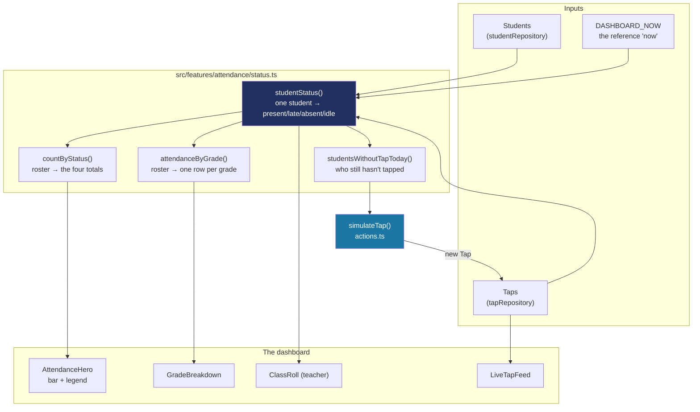

# How attendance is worked out

Step 8 built what a `Tap` *is* (`docs/DATA-MODEL.md`). Step 9 built how it gets *read* (`docs/DATA-ACCESS.md`). Step 13 builds the piece in between those and the screen: **turning a pile of tap records into "who is in school right now"**.

This is a genuinely separate subsystem from both, and it's the one every attendance-shaped screen sits on — the dashboard (Step 13), the attendance page (Step 17), the tap station (Step 19 — still to come), and any report after that. See `docs/BUILD-LOG.md`'s Step 13 and Step 17 entries for the decisions as they were made; this document is the reference for how the mechanism works.

## The one idea to hold on to

**A student's attendance status is never stored. It is always calculated.**

Nothing in the database (or, today, the seed data) says "Juan is present". What exists is:

- a **roster** — every student in the school
- a list of **taps** — "this card was tapped at this gate at this time"

Everything a principal sees is derived from those two lists plus one more input: **what time it is now**. That last one matters more than it looks — the same taps mean different things at 7:50 AM ("most people haven't arrived yet") than at 9:15 AM ("these eight didn't come in").

Why derive instead of store? Because a stored status goes stale and can disagree with the taps that produced it. Deriving it means there is exactly one source of truth (the taps), and any screen that asks the same question gets the same answer.

## The shape of it



## The four statuses, and the two cutoffs that produce them

`studentStatus(studentId, taps, now)` answers one question about one student, and there are only four possible answers — the same four fixed status colors the design system reserves (`docs/STYLING-SYSTEM.md`):

| Status | When | Shown as |
|---|---|---|
| **Present** | They tapped today, at or before the late cutoff | Green |
| **Late** | They tapped today, after the late cutoff | Amber |
| **Not yet tapped** | No tap today, and it's still before the absent cutoff | Grey |
| **Absent** | No tap today, and it's now past the absent cutoff | Red |

The logic is two questions in sequence — *did they tap?*, then *how does the clock compare?*:

```ts
export function studentStatus(studentId: string, taps: Tap[], now: string = DASHBOARD_NOW): AttendanceStatus {
  const tap = todaysTap(studentId, taps, now);
  if (tap) {
    return minutesOfDay(tap.tappedAt) <= LATE_CUTOFF_MINUTES ? "present" : "late";
  }
  return minutesOfDay(now) >= ABSENT_CUTOFF_MINUTES ? "absent" : "idle";
}
```

Three constants carry the real rules, all in `src/features/attendance/status.ts`:

- **`LATE_CUTOFF_MINUTES`** — 8:05 AM. An 8:00 start with a five-minute grace period. Tap at or before it and you're present; after it and you're late.
- **`ABSENT_CUTOFF_MINUTES`** — 9:00 AM. Before this, a student who hasn't tapped is just "not yet tapped" — they might still be on the way. After it, the app calls it absent.
- **`DASHBOARD_NOW`** — see the next section.

**Two details that are easy to get wrong:**

*Only the earliest tap of the day counts.* `todaysTap()` sorts and takes the first one. A student who taps twice (a mis-tap, or a future time-out tap) must not be able to turn "present" into "late" with their second tap.

*Taps from other days are ignored.* The date is compared before the time, so yesterday's tap can never make someone look present today.

## `DASHBOARD_NOW`: why the app has a fixed clock right now

The dashboard does **not** call `new Date()`. It uses a constant:

```ts
export const DASHBOARD_NOW = "2026-06-20T09:15:00Z";
```

This looks wrong until you see why. Phase 1 has no live tap API — every tap in the app is sample data, and all of it is dated 2026-06-20. If the code asked for the real current date, it would look for "today's taps", find none on any other day, and show a school where nobody turned up at all. The fixed clock is what makes the sample data mean something.

9:15 AM specifically, because it's past both cutoffs — so the sample data shows real present, real late and real absent students at the same time, rather than a screen where one of those is always zero.

**What replaces it in Phase 2:** this constant becomes the actual current time, and every function already accepts `now` as an argument precisely so that swap is a one-line change rather than a rewrite. That's also why the unit tests pass their own `now` in — they test the *rules*, not one particular moment.

> **Timezones:** every timestamp is read with `getUTCHours()`, never `getHours()`. These timestamps represent the school's own wall-clock time, written as if it were UTC. Converting them to whatever timezone happens to be running the code would show the wrong time to some readers.

## Aggregating: counts and per-grade rows

Two thin wrappers do all the summarising, and both just call `studentStatus()` in a loop:

- **`countByStatus(students, taps, now)`** → `{ present, late, absent, idle }`. Every student lands in exactly one bucket, so the four always add up to the roster size. That's what makes the segmented bar's proportions honest.
- **`attendanceByGrade(students, taps, now)`** → one row per grade level, each with the grade's student count and its "in school" percentage (present + late, over the grade's total).

`attendanceByGrade` only returns grades that **actually exist at that school**. Two of the three demo schools only have three grade levels each — they'd otherwise show three permanently-empty rows for grades they don't teach.

## "Simulate a tap", end to end

There's no real tap station yet (Step 19, and real hardware in Phase 2), so the dashboard has a button that manufactures one. It is a genuinely useful piece of plumbing to understand, because it's the same path a real tap will take.

`simulateTap()` in `src/features/attendance/actions.ts`:

1. Reads the session. A **teacher** only ever draws from their own advisory class; a principal draws from the whole school.
2. Asks `studentsWithoutTapToday()` who hasn't tapped — **idle students before absent ones**, so the demo tells a "still arriving" story before a "the day already ended" one.
3. Walks that list looking for someone with an **active ID card**. No card, no tap — exactly like the real gate. A student with no card is collected into a separate list instead.
4. Creates the tap through `tapRepository.create()` (idempotent by tap id, like a real station's upload).
5. Calls **`refresh()`**, and returns a typed result saying what actually happened.

### The `refresh()` line is load-bearing

```ts
import { refresh } from "next/cache";
// ...
refresh();
```

Without it the button appears to do nothing. Step 11's dev switcher gets a free re-render because it sets a **cookie**, and Next re-renders the page automatically when a Server Action changes one. `simulateTap` changes *data*, not a cookie — so it gets no such thing, and has to ask. See `docs/LEARNING-LOG.md`'s "Staying put but showing new data" entry for the three-way comparison (`cookie` / `redirect()` / `refresh()`).

### Why it returns a result instead of just running

```ts
export type SimulateTapResult =
  | { tapped: true; studentName: string }
  | { tapped: false; reason: "no-school" | "everyone-in" }
  | { tapped: false; reason: "no-card"; studentNames: string[] };
```

Three different things can happen, and the person clicking deserves to know which. The first version always said "Tap recorded", including when it had tapped nobody — which is how a student with no ID card ended up looking like a bug (`docs/BUILD-LOG.md`, Step 13 review round 1). Now a card-less student is named, and the class roll says "No ID card linked yet" on that row instead of "No tap yet", so the reason is visible before anyone clicks anything.

## The attendance page (Step 17): picking one class, one day

The dashboard's `ClassRoll` always shows "my whole school" or "my one advisory class" — there's no way to pick a *different* class, or look at a day other than `DASHBOARD_NOW`. The attendance page (`src/app/(app)/attendance/page.tsx`) is that browsing screen: a date, grade and section in the URL (same shareable-URL, back-button-works shape as the Students list — see `docs/URL-DRIVEN-LISTS.md`), resolved server-side in `src/features/attendance/attendance-search-params.ts`.

Two things make this resolution non-trivial:

- **The class picker has no "all" option.** Unlike the Students list's grade filter, this page always shows exactly one class at a time — "pick a date and *class*" — so `resolveClassSelection()` has to always return *some* real class, even when the URL names one that doesn't exist (a stale link, a hand-edited query string, or nothing at all yet). It falls back to the first class that actually has students, the same shape as the prototype's own `if (!SECTIONS[grade].includes(section)) section = SECTIONS[grade][0]`.
- **A teacher's own class always wins.** `resolveClassSelection()` takes an optional `lockedTo` — a teacher's advisory grade/section — and when it's set, everything else is ignored outright, not just hidden in the UI. That's the same real server-side guard the Students list's `searchStudents(..., { restrictTo })` already uses: a teacher who hand-edits the URL to another grade/section still only ever sees their own class, because the page never asks the URL what class to show for a locked-in teacher in the first place.

The other wrinkle is the date. Every seed tap is dated to `DASHBOARD_NOW`'s day (`ATTENDANCE_SEED_DATE`, exported from `attendance-search-params.ts` so nothing hardcodes "2026-06-20" a second time) — so this page treats that one date as real and every other date as "no records", rather than trying to derive attendance for a day it has no data for at all. Picking any other date shows an empty state with a link straight back to the seed date, for the same class.

## Quick recipes

**I want to change when "late" starts.** Edit `LATE_CUTOFF_MINUTES` in `src/features/attendance/status.ts`. It's minutes since midnight (`8 * 60 + 5`). The unit tests in `status.test.ts` assert the boundary on both sides, so change those too — that's deliberate, it makes the rule impossible to change by accident.

**I want the dashboard to show a different moment of the school day.** Change `DASHBOARD_NOW`. Set it before 9:00 AM and un-tapped students read as "not yet tapped" rather than "absent"; set it before 8:05 AM and everyone who has tapped reads as present.

**I want attendance numbers on a new screen.** Import `countByStatus` / `attendanceByGrade` from `src/features/attendance/status.ts` and feed them a roster and a tap list from the repositories. Don't re-derive statuses by hand — these functions are unit-tested and the screens should agree with each other.

**I want to show one student's status somewhere.** `studentStatus(student.id, taps)` returns the status; pass it straight to `<StatusPill status={...} />` (`docs/COMPONENTS.md`), which already knows the colors and labels.

**I want the actual arrival time, not just the status.** `todaysTap(student.id, taps)` returns the tap itself; `formatTapTime(tap.tappedAt)` renders it as "7:56 AM".

**I'm adding real taps in Phase 2.** Replace `DASHBOARD_NOW` with the real current time and give `tapRepository` a database-backed implementation. Nothing in `status.ts` should need to change — it already takes `now` as a parameter and never reaches for a clock or a database itself.

**I want a new screen that browses one class at a time (like the attendance page).** Reuse `classOptionsFromRoster()` and `resolveClassSelection()` from `src/features/attendance/attendance-search-params.ts` rather than writing new grade/section fallback logic — they already handle "the URL names a class that doesn't exist" and "this role is locked to one class" correctly.
