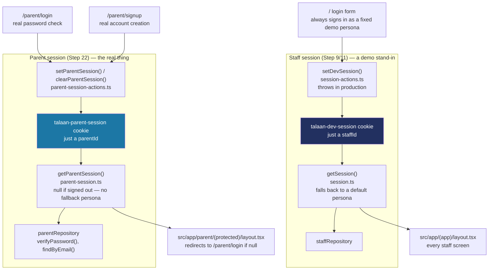

# How sign-in works: two separate sessions

Talaan has two completely independent sign-in mechanisms living side by side: staff (principals, teachers, super admins) and parents. They were built two steps apart — staff's dev session in Step 9, parents' real signup/login in Step 22 — and deliberately never share code, because they mean genuinely different things. Staff's session is a **dev-only stand-in** for a real sign-in that doesn't exist yet (Phase 2 adds Auth.js); parent's session is **the real feature**, built now because Step 22's own "done when" line requires an account that actually persists across a sign-out and sign-in. See `docs/BUILD-LOG.md`'s Step 22 entry for the decisions behind this, and `docs/LEARNING-LOG.md`'s "Two separate logins in one app" entry for the short version.

## The shape of it



A browser can hold both cookies at once — signed in as a staff member and as a parent, in the same tab — because they're stored, read and cleared entirely separately. Neither `getSession()` nor `getParentSession()` knows the other exists.

## Why staff's session has a production guard and parent's doesn't

Staff's `setDevSession()` calls `assertDevSessionMutationAllowed()`, which throws outside development. That guard exists because signing in as staff is currently just picking a name from a list (`DemoShortcuts`, or a valid-looking form submission that ignores what was actually typed) — a shortcut standing in for a real sign-in until Phase 2's Auth.js work lands. It has to be impossible to reach in production, per CLAUDE.md's own rule.

Parent sign-in has no equivalent guard, because it isn't a shortcut. `signInParent()` genuinely checks a submitted password against `ParentRepository.verifyPassword()`, and `signUpParent()` genuinely creates a new account nothing else can see or use for you. It behaves the same way in every environment — the only thing that's still "Phase 1" about it is *where* the password lives (see below), not whether the check itself is real.

## Where a parent's password actually lives

Phase 1 has no database — every mock repository is really a JavaScript array sitting in server memory. `ParentRepository` follows that same pattern for passwords: `createMockParentRepository` keeps a plain `Map<parentId, password>` in its own closure, right alongside the array of `Parent` records, and never exposes it through any method that returns a `Parent`:

```ts
// src/data/repositories/parent-repository.ts
const passwordsByParentId = new Map<string, string>(
  data.map((parent) => [parent.id, options.seedPassword ?? SEED_PARENT_PASSWORD]),
);
```

Two things fall out of that shape:
- **A `Parent` object never carries a password.** Nothing has to remember to strip a secret field before rendering a parent's name somewhere — there's no field to strip, because the password lives in a completely separate map, keyed by id.
- **Every seed parent can sign in.** The map is pre-filled with a fixed demo password (`SEED_PARENT_PASSWORD = "Talaan123!"`) for whatever data the repository starts with, so `parent-one@balanga.example` (one of Step 20's seed accounts, already linked to real students) can sign in today, not just a freshly-signed-up account.

This is a real password check against real (if in-memory) data — genuinely different from staff's "any password gets you in as the demo principal." What it *isn't* is secure: a plain-text map is fine when there's no real account behind it to protect, but it must not survive into Phase 2, where Auth.js brings real hashing. Every place this shows up in the code says so in a comment, so it can't quietly get mistaken for the real thing later.

## Quick recipes

**I want to add a new page only a signed-in parent can reach.** Put it under `src/app/parent/(protected)/` — the layout there already calls `getParentSession()` and redirects to `/parent/login` if it's `null`. Call `getParentSession()` again inside the page itself too (same pattern the dashboard/students pages use for the staff session) rather than trying to pass it down as a prop from the layout.

**I want to check whether the current visitor is signed in as a parent, from a Server Component or a server action.** `import { getParentSession } from "@/lib/parent-session"` — it returns `{ parentId, schoolId } | null`, never throws.

**I want to add a parent-facing mutation (a new server action).** Follow `linkChild` in `src/features/parents/auth-actions.ts`: call `getParentSession()` first and bail out with a `formError` if it's `null`, re-validate the input with the same Zod schema the form already checked, then call the repository.

**I want to know if this is the staff session or the parent session.** If the code imports from `@/lib/session` or `@/lib/session-actions`, it's staff (dev-only, has a production guard). If it imports from `@/lib/parent-session` or `@/lib/parent-session-actions`, it's the parent portal (real, no guard).
