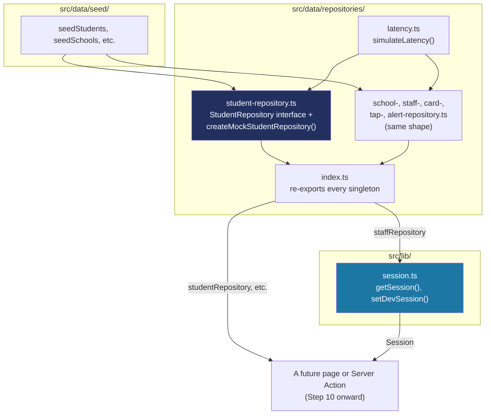

# How data access and the dev session work

Step 8 built what a School/Student/Card/Tap/Alert *is* (`docs/DATA-MODEL.md`). Step 9 builds how any of that data actually gets *read* — the repository pattern that sits between the seed data and everything that will use it, plus `getSession()`, the dev-only stand-in for real login. This is a genuinely different subsystem from Step 8's: that one was about the shape of data, this one is about *access* to it. See `docs/BUILD-LOG.md`'s Step 9 entry for the decisions; this document is the reference for how the mechanism works.

**None of this is the back end either** — same as Step 8, everything here is still Phase 1 front-end code (in-memory arrays, no network, no real login). See `docs/LEARNING-LOG.md`'s "Domain modeling" entry, and the **[One Server, Two Jobs](https://claude.ai/artifact/6Sfdb2DEQhoTe9Qxz7d2QR)** artifact for the fuller picture of how this maps onto Phase 2.

## The shape of it



Nothing outside `src/data/` imports `seedStudents` (or any other seed array) directly — every future page, Server Action, or Route Handler talks to `studentRepository.listBySchool(schoolId)` instead. That single rule is what makes Phase 2's swap-to-a-real-database possible without touching UI code (CLAUDE.md's own stated goal for this layer).

## The repository pattern: an interface, a mock, a singleton

Every one of the six repositories (`school`, `staff`, `student`, `card`, `tap`, `alert`) follows the exact same three-part shape. Taking `student-repository.ts` as the example:

```ts
export interface StudentRepository {
  listBySchool(schoolId: string): Promise<Student[]>;
  getById(id: string): Promise<Student | null>;
}

export function createMockStudentRepository(
  data: Student[] = seedStudents,
  options: { latencyMs?: number } = {},
): StudentRepository {
  const latencyMs = options.latencyMs ?? DEFAULT_LATENCY_MS;
  return {
    async listBySchool(schoolId) {
      await simulateLatency(latencyMs);
      return data.filter((student) => student.schoolId === schoolId);
    },
    // ...
  };
}

export const studentRepository = createMockStudentRepository();
```

- **The interface** is the actual contract — this is what Phase 2's real, Prisma-backed implementation will also satisfy. A page written against `StudentRepository` never has to change when the mock is replaced; only what's *behind* the interface changes.
- **The factory function** (`createMockStudentRepository`) takes the data it serves as a parameter, defaulting to the real seed data — so a test can hand it three students instead of the full 72, and get a small, focused, fast test out of it, without touching the real seed data.
- **The exported singleton** (`studentRepository`) is the one instance the rest of the app actually imports. It's just `createMockStudentRepository()` called once with no arguments — the real seed data, the default latency.

**Read-only until a step actually needs to write.** Through Step 14, none of the six repositories had a `create`/`update` method — only `list`/`get`. Step 9's own done-when criterion ("no UI code talks to seed data directly") only needed reads. Step 15 added `StudentRepository.create`/`update` for the add/edit drawer. Step 16 added `CardRepository.create`/`markLost` — `markLost` rather than a generic `update`, since a card's only ever-mutated field is `status`, and naming the method after the actual business action ("mark lost") reads better at every call site than a generic setter would. Steps 18 and 19 will each add exactly the write method *they* need when they need it — extending an existing repository file when its feature step arrives is normal, expected growth, not scope creep.

```ts
async create(student) {
  await simulateLatency(latencyMs);
  if (!data.some((existing) => existing.id === student.id)) {
    data.push(student);
  }
  return student;
},
async update(student) {
  await simulateLatency(latencyMs);
  const index = data.findIndex((existing) => existing.id === student.id);
  if (index === -1) return null;
  data[index] = student;
  return student;
},
```

`create` is idempotent by `id` — the same shape `TapRepository.create` already used for Step 13's "Simulate a tap" button, so a repeated call (a real station's retried request, in Phase 2) is a no-op rather than a duplicate. `update` is stricter: it returns `null` when the id doesn't exist, rather than silently doing nothing, so a caller that got the id wrong finds out immediately instead of the write vanishing quietly.

## Simulated latency, and why tests don't wait for it

```ts
export function simulateLatency(latencyMs: number): Promise<void> {
  if (latencyMs <= 0) return Promise.resolve();
  const jitter = Math.random() * latencyMs * 0.4;
  return new Promise((resolve) => setTimeout(resolve, latencyMs + jitter));
}
```

Every mock method awaits this before returning data, so nothing built against a repository can silently assume data arrives instantly — a real database call over a real network never does, and code that forgot to `await` a repository call would work by accident against an instant mock and then break against a real one. The default (`DEFAULT_LATENCY_MS = 150`, randomized a bit) is what the app's real singletons use.

Every repository test passes `{ latencyMs: 0 }` explicitly, which the function short-circuits to an immediate resolve — so the "network realism" this exists for never slows down `npm run test`. 104 tests still run in about a second of actual test time.

## The dev session: `getSession()` and `setDevSession()`

CLAUDE.md: `getSession()` returns `{ userId, role, schoolId }` from a dev-only cookie, and switching it must be "impossible to enable in production." `src/lib/session.ts` splits this into two kinds of function on purpose:

**The actual logic — plain, unit-testable functions:**

```ts
export async function resolveSession(
  staffId: string | undefined,
  repository: StaffRepository,
): Promise<Session> {
  const staff =
    (staffId ? await repository.getById(staffId) : null) ??
    (await repository.getById(DEFAULT_DEV_STAFF_ID));
  if (!staff) throw new Error(/* ... */);
  return { userId: staff.id, role: staff.role, schoolId: staff.schoolId };
}

export function assertDevSessionMutationAllowed(): void {
  if (process.env.NODE_ENV === "production") {
    throw new Error("Dev session switching is disabled in production.");
  }
}
```

**Thin wrappers that touch Next.js's request-scoped `cookies()`:**

```ts
export async function getSession(): Promise<Session> {
  const cookieStore = await cookies();
  const staffId = cookieStore.get(DEV_SESSION_COOKIE)?.value;
  return resolveSession(staffId, staffRepository);
}

export async function setDevSession(staffId: string): Promise<void> {
  "use server";
  assertDevSessionMutationAllowed();
  const cookieStore = await cookies();
  cookieStore.set(DEV_SESSION_COOKIE, staffId, { httpOnly: true, sameSite: "lax", path: "/" });
}
```

**Why split it this way:** `cookies()` only works inside a real Next.js request (a Server Component, Server Action, or Route Handler) — calling it directly from a Vitest test throws, since there's no request to read cookies from. Rather than mocking `next/headers`, the actual decision-making logic (`resolveSession`'s fallback behavior, the production guard) is pulled out into plain functions that take their inputs as arguments — `src/lib/session.test.ts` tests those directly, with a small fake `StaffRepository`, no mocking needed. The two Next-specific functions are left as thin, low-risk glue (a couple of lines each) that isn't separately unit-tested.

**The fallback persona.** If the cookie is missing (Step 11's switcher UI doesn't exist yet) or points at a staff id that no longer exists, `resolveSession` falls back to a fixed default (Balanga's principal) — so the app always has someone sensible to render as, today, with zero UI built for it yet.

**`"use server"` is inline, not at the top of the file.** `session.ts` also exports plain types and functions (`Session`, `resolveSession`) that aren't Server Actions — a file-level `"use server"` directive would require *every* export to be an async function, which doesn't fit. Placing the directive as the first line inside just `setDevSession`'s body marks only that one function as a Server Function; everything else in the file stays a normal export. Confirmed this compiles and builds correctly (`npm run build`) before trusting it, not just assumed from Next's docs.

**Why the guard is inside the function, not just left out of any UI:** a Server Function is reachable by a direct POST request from anywhere, not only from whatever button ends up calling it — Next's own docs warn about this explicitly. `assertDevSessionMutationAllowed()` runs as the very first line, so even a raw request to this function in a production deployment is refused, regardless of what UI does or doesn't exist to call it.

## Quick recipes

**I want to add a write method to a repository** (e.g. `StudentRepository.create`): add the method to the interface, implement it in the matching `createMock*Repository` factory (mutate the closed-over `data` array, still behind the same simulated latency), and add a test. Do this in whichever step actually needs it, not preemptively.

**I want to read data or the session in a new Server Component or Server Action:** `import { studentRepository } from "@/data/repositories"` (or whichever repository), and `import { getSession } from "@/lib/session"` — both are plain `async` calls, no setup needed.

**I want to test code that depends on a repository:** call the matching `createMock*Repository([...fixtureData], { latencyMs: 0 })` instead of importing the real singleton — a small, explicit fixture, no delay, no dependency on the real 72-student seed set.

**I want to know what the currently-logged-in dev persona is without building Step 11 yet:** `getSession()` already works today — it just always resolves to the fallback persona until a cookie exists to override it.
