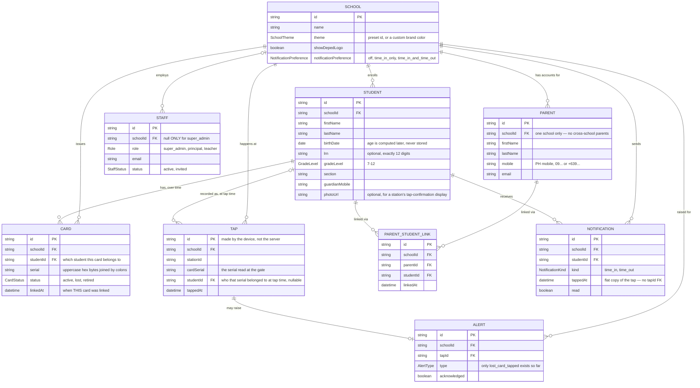
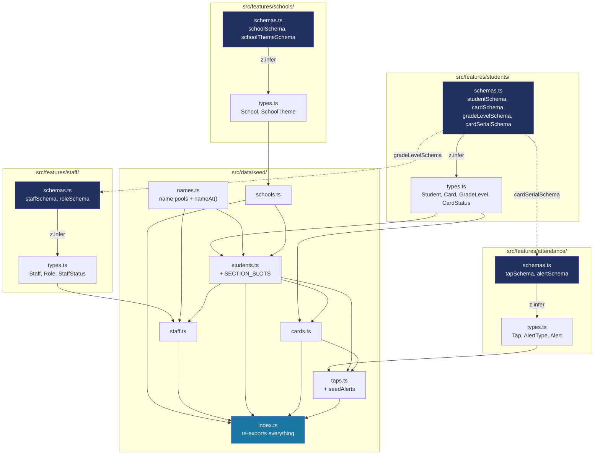

# How the domain data model works

Step 8 added the layer everything from here on is built against: what a School, Staff member, Student, Card, Tap and Alert actually *are* (as TypeScript types), what makes one *valid* (as Zod schemas), and a full set of fake-but-realistic sample records (seed data) standing in for a real database until Phase 2. This is a from-scratch explanation of how those three pieces fit together — `docs/BUILD-LOG.md`'s Step 8 entry covers the decisions and a couple of real bugs hit along the way; this document is the reference for how the mechanism itself works.

**None of this is the back end.** No screen changed, and there's still no database or server — everything here is still Phase 1 front-end code (plain TypeScript files and validation logic, nothing that talks to a network). Think of it as the shared vocabulary both sides will eventually agree on: the seed data is built to match it now, and Phase 2's real database code will use the exact same shapes later. See `docs/LEARNING-LOG.md`'s "Domain modeling: types vs. schemas" entry for the plain-language version of this distinction.

**See also:** [`docs/STYLING-SYSTEM.md`](STYLING-SYSTEM.md) and [`docs/COMPONENTS.md`](COMPONENTS.md) for the two other subsystems this one doesn't touch — colors and components are a completely separate concern from what a Student record contains.

## The data itself: entities, fields and relationships

This is the actual shape of the data — every field, and how each thing connects to the others. If you only read one diagram in this document, make it this one.



**How to read the symbols:** `||` means "exactly one," `o{` / `o|` means "zero-or-many" / "zero-or-one" (the `{` crow's foot is what means "many"), and the symbol touching an entity describes that entity's own count in the relationship. Two lines deliberately use "zero-or-one" instead of "exactly one," both for real reasons already in the schemas: `SCHOOL |o--o{ STAFF` (a `super_admin`'s `schoolId` is `null` — see `docs/BUILD-LOG.md`'s Step 8 entry) and `STUDENT |o--o{ TAP` (an unrecognized card tapped at a station has `studentId: null`).

**The line that answers your card-replacement question is `STUDENT ||--o{ CARD`.** Read it as "one Student, to zero-or-many Cards." A student doesn't have *a* card, they have a whole *list* of Card rows that grows every time a card is replaced. Nothing is ever overwritten; the seed data actually demonstrates this today, for `student-0001`:

| id | studentId | serial | status | linkedAt |
|---|---|---|---|---|
| `card-student-0001-lost` | `student-0001` | `04:...` (old) | `lost` | 2026-06-01 |
| `card-student-0001-active` | `student-0001` | `04:...` (new) | `active` | 2026-06-15 |

**Replacing a card, in this design, is always two steps — never editing the old row:**
1. Find the student's current card where `status: "active"` and set its `status` to `"lost"`. That row keeps existing exactly as it was, just relabeled — it's now history.
2. Insert a **brand-new** Card row: a new `id`, the same `studentId`, a new `serial`, `status: "active"`, `linkedAt` set to now.

Do this every time a card is lost over a student's whole 4-5 years, and you end up with a full, permanent history of every card that student has ever had — one `active` at any given moment, any number of `lost`/`retired` ones behind it, all still there and queryable. This is exactly what Step 16 ("Card link and replace") will build as an actual button/flow — the data shape to support it already exists today, which is what the seed-data row above proves.

One honest caveat, visible if you look closely at the diagram: `TAP.cardSerial` matches `CARD.serial` — a **value** match, not a link by `id` the way `Card.studentId` links to `Student.id`. That's deliberate: a tap station only ever reads a serial off a physical card, it has no idea what a database `id` even is. A repository (Step 9) will be the thing that looks up "which card currently has this serial" when a tap comes in.

## The parent side (Step 20): a many-to-many link, and a flat-copy notification

`PARENT`, `PARENT_STUDENT_LINK` and `NOTIFICATION` are new in Step 20. The shape worth noticing is the **two** relationships on `PARENT_STUDENT_LINK` — `PARENT ||--o{ PARENT_STUDENT_LINK` and `STUDENT ||--o{ PARENT_STUDENT_LINK`. That's how a many-to-many reads in an ER diagram: neither the parent nor the student holds the other's id (either would force "one child per parent" or "one guardian per child"). A third record carries both ids instead, and "a parent's children" / "a child's guardians" are each just a query over that one record.

`NOTIFICATION` deliberately stores a **flat copy** of the tap (`studentId`, `tappedAt`) plus a derived `kind`, rather than a `tapId` foreign key. That's an intentional deferral, not an oversight: a `tapId` can be added in Phase 2 once there's a real Tap API to join against. Until then the notification carries everything a feed needs on its own, and a later join can be introduced without invalidating any existing record.

## The shape of it, in one picture: which files define what



Read the top half as: **the schema is the source of truth, the type is derived from it** — never the other way around, and never hand-written twice. The bottom half (`src/data/seed/`) is real, typed data built against those types, the way Step 9's mock repositories (and eventually a real database) will hand data to the UI.

## `schemas.ts` first, `types.ts` second

CLAUDE.md's code structure lists each feature folder as holding "components, actions, schemas, types" — two separate files. The risk with two files describing the same thing is drift: add a field to one, forget the other, and nothing tells you they've fallen out of sync. The fix is to only describe the shape *once* — as a Zod schema — and let TypeScript derive its type from that:

```ts
// src/features/students/schemas.ts
export const studentSchema = z.object({
  id: z.string().min(1),
  schoolId: z.string().min(1),
  firstName: z.string().min(1, "Enter a first name"),
  // ...
  gradeLevel: gradeLevelSchema,
});
```

```ts
// src/features/students/types.ts
import type { z } from "zod";
import type { studentSchema } from "./schemas";

export type Student = z.infer<typeof studentSchema>;
```

`z.infer<typeof studentSchema>` reads the schema's own definition and produces the exact matching TypeScript type — `gradeLevelSchema` being `z.union([z.literal(7), ..., z.literal(12)])` means `Student["gradeLevel"]` is the literal union `7 | 8 | 9 | 10 | 11 | 12`, not just `number`. Add a field, rename one, make one optional — do it once, in the schema, and both the compile-time type *and* the runtime validation update together.

## Why some things are their own record instead of a field

**Card is its own record (`{ id, schoolId, studentId, serial, status }`), not a field on Student.** CLAUDE.md: "Replacing a card marks the old one lost" — a student can accumulate a *history* of cards, not just one at a time. If Card were fields on Student (`cardSerial`, `cardStatus`), replacing a card would mean overwriting that history — there'd be nowhere to keep the old, now-`lost` card once a new one is linked. A separate record pointing back with `studentId` means the old `lost` card and the new `active` one both keep existing side by side; "this student's current card" just becomes *the query* "find this student's card with `status: "active"`" (Step 9's repository layer will do exactly that), not a fact baked into the Student record itself.

**Tap stores its own `studentId`, captured at the moment of the tap** — not looked up live from whatever card that serial happens to belong to *now*. If a card gets relinked to a different student next month, an old tap record must keep meaning what it meant when it happened, not silently change meaning retroactively.

## A schema can enforce a rule a type alone can't: `Staff.schoolId`

CLAUDE.md says to keep `schoolId` on every type from the start, since every record belongs to one school — except a `super_admin`, who manages *every* school, not one. `Staff.schoolId` is typed `string | null`, and a `.refine()` on `staffSchema` enforces which roles are allowed to have which:

```ts
export const staffSchema = z
  .object({ /* ... */ schoolId: z.string().min(1).nullable(), role: roleSchema /* ... */ })
  .refine((staff) => staff.role === "super_admin" || staff.schoolId !== null, {
    message: "Only a super admin can have no school",
    path: ["schoolId"],
  })
  .refine((staff) => staff.role !== "super_admin" || staff.schoolId === null, {
    message: "A super admin isn't scoped to a single school",
    path: ["schoolId"],
  });
```

The type alone (`schoolId: string | null`) can't express "null only if this other field is `'super_admin'`" — TypeScript's structural types don't cross-check one field against another. A `.refine()` is Zod's way of adding exactly that kind of rule, checked at runtime whenever data is parsed. `src/features/staff/schemas.test.ts` proves both directions: a `principal` with a null `schoolId` is rejected, and a `super_admin` *with* a `schoolId` is rejected too.

## A brand color is data, not a styling choice

`School.theme` is a **discriminated union** — either a built-in preset, or a school's own custom brand color:

```ts
export const schoolThemeSchema = z.discriminatedUnion("kind", [
  z.object({ kind: z.literal("preset"), presetId: z.enum(presetIds) }),
  z.object({ kind: z.literal("custom"), brandColor: z.string().regex(/^#([0-9a-fA-F]{3}|[0-9a-fA-F]{6})$/) }),
]);
```

`presetIds` is derived from the real `themePresets` array (`src/lib/theme/presets.ts`), not a hand-copied list — a preset added there automatically becomes valid here too. The `"custom"` variant's `brandColor` is a real hex string (Step 21 will feed it straight into `src/lib/theme/contrast.ts`'s `generateCustomPalette` to build a whole palette from it), and it's worth being explicit about *why* this doesn't break the "no raw colors" rule from `docs/STYLING-SYSTEM.md`: CLAUDE.md's actual wording is "no raw colors... **in components or pages**" — this is a school's own data, not a hardcoded look. `scripts/check-tokens.mjs` exempts `schemas.ts`/`schemas.test.ts` files for exactly this reason (see `STYLING-SYSTEM.md`'s Step 8 update).

## Two fields added after review: `notificationPreference` and `photoUrl`

Both came from the same conversation, while reviewing this document's own ER diagram — a good example of why drawing the picture *before* committing is worth doing.

**`School.notificationPreference`** is a three-value enum, not a boolean, because "on or off" wasn't enough: a school might want parents notified only when a student arrives, or both on arrival and dismissal, or not at all.

```ts
export const notificationPreferenceSchema = z.enum(["off", "time_in_only", "time_in_and_time_out"]);
```

This is deliberately named for *when*, not *how* — SMS is the actual channel (a paid provider, chosen in Phase 2), but if push notifications get added later, they can reuse this exact same preference rather than needing a second, parallel setting. It's set once per school by that school's principal or super admin — never per individual parent. The seed data (`src/data/seed/schools.ts`) deliberately gives each of the 3 schools a different value, so all three states are exercised by `seed.test.ts` from day one, not just the "happy path" default.

This also ties back to `Tap`'s offline design (see `SECTION_SLOTS` and the caveat above): a tap made while a station is offline is still generated and queued **on the device** — it doesn't wait for a server round-trip to exist. A notification can only be sent once that queued tap actually reaches the server; there's nothing to add to the schema for this (the device-made `id` already makes offline queuing safe — see "Why some things are their own record instead of a field" above), it's a rule about the *server-side sequencing* Phase 2 will implement, not a new field.

**`Student.photoUrl`** is optional, for a possible future station screen that shows the tapping student's photo and name — so whoever's staffing the gate can visually confirm the right student tapped. Explicitly not required: most schools won't have this set up, and the core notification feature doesn't depend on it existing.

## The seed data: how 72 students, 12 sections and 3 schools fit together

`src/data/seed/students.ts`'s `SECTION_SLOTS` is the actual structure everything else is built from:

| School | Grades represented | Sections |
|---|---|---|
| `school-balanga` (the real pilot, `school` preset) | 7-12 (all six) | Rizal, Bonifacio, Mabini, Luna, Aguinaldo, Silang |
| `school-oceanview` (`ocean` preset) | 7-9 | Lapu-Lapu, Del Pilar, Jacinto |
| `school-crimsonridge` (`crimson` preset) | 10-12 | Aglipay, Ponce, Tandang Sora |

12 section slots × 6 students each = 72 students. Names come from `names.ts`'s `nameAt(index)` — a small hand-picked pool of common Filipino first/last names, deterministically paired by index (never `Math.random()`), so the exact same data comes out every time the app runs and every time the tests run. Birth dates are computed backward from a fixed school-year anchor (`SCHOOL_YEAR_START = 2026`) and a typical age per grade — never a stored "age" field, per CLAUDE.md's own rule.

`src/data/seed/cards.ts` gives most students one `active` card (a deterministic, plausible 7-byte hex serial, not a real NFC UID); a few are deliberately left without one yet ("not yet issued"), and student `student-0001` gets a full history — an old `lost` card *and* the `active` replacement — so Step 16's card-replace screen has something real to point at. `src/data/seed/taps.ts` uses that same lost card's serial for one deliberate lost-card tap, and pairs it with a matching entry in `seedAlerts` — proving the whole chain (card → tap → alert) actually connects, not just that each piece parses on its own.

## Seed data has its own tests, separate from schema tests

`src/features/*/schemas.test.ts` checks that *a* record is valid or invalid in isolation (a bad LRN, an out-of-range grade). `src/data/seed/seed.test.ts` checks something schemas can't: facts about the *whole* generated set — exactly 3 schools/7 staff/72 students, every record's `schoolId` actually points at a real seed school, no student ever ends up with two `active` cards at once, no two cards ever share a serial. These are exactly the kind of mistake that's easy to introduce while writing generator code (an off-by-one in a loop, an id typo) and invisible until something actually counts or cross-checks the result — see `docs/BUILD-LOG.md`'s Step 8 entry for a real bug (`07:510` as a "time") this same principle caught in `taps.ts` before it ever shipped.

## Quick recipes

**I want to add a field to an existing type (say, `Student.middleInitial`):** add it to `studentSchema` in `src/features/students/schemas.ts` only — `types.ts`'s `Student` type updates automatically via `z.infer`. Update `src/data/seed/students.ts` to actually supply it, then run `npm run test` — `seed.test.ts` will fail loudly if any seed record doesn't satisfy the updated schema.

**I want a brand-new domain type:** pick the feature folder it belongs to (or create one), add a `z.object({...})` to that folder's `schemas.ts`, then `export type X = z.infer<typeof xSchema>;` in `types.ts`. Add a `schemas.test.ts` covering at least one valid case and the specific invalid cases that matter (a required field missing, a format that's wrong).

**I want more/different seed data:** edit the relevant file in `src/data/seed/`. If you change `SECTION_SLOTS` or `STUDENTS_PER_SECTION` in `students.ts`, `seed.test.ts`'s shape checks (exact counts, "12 sections") will tell you if the new numbers don't add up.

**I want to validate this in a real form later:** Step 15 (student add/edit) and Step 18 (staff invite) will pass these exact same schemas straight to React Hook Form's `zodResolver` — nothing new to write, the validation rules already exist here.
