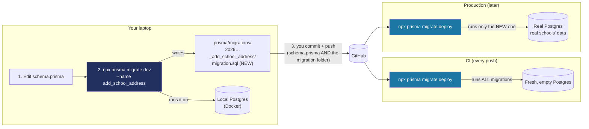
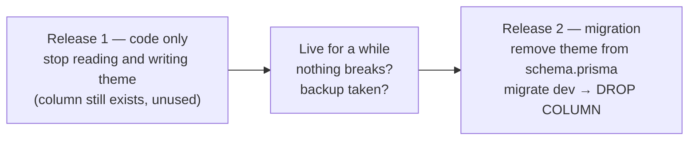

# How database migrations work

A lesson on the words (schema, migration, `migrate dev`, `migrate deploy`) and on what happens when the database has to change after schools are already using it. Every example uses this project's real `School` model and its real first migration (Step 32). The step-by-step commands live in the Phase 2 recipes ([Step 32](backend/step-32-school-model-first-migration.md), [Step 34](backend/step-34-postgres-in-ci.md)). This page explains the idea behind them.

## The one idea to hold on to

There are **three different things**, and most confusion comes from mixing them up:

| | What it is | Where it lives | Who changes it |
|---|---|---|---|
| **The schema** | What you *want* the database to look like | `prisma/schema.prisma` | You, by editing the file |
| **The migrations** | The *steps* that get a database from "empty" to "looks like the schema" | `prisma/migrations/*/migration.sql` | `migrate dev` writes them; you commit them |
| **The database** | What *actually* exists right now: real tables, real rows | Postgres (Docker on your laptop, a fresh one in CI, the real one in production) | `migrate dev` (laptop) or `migrate deploy` (everywhere else) run the steps |

An analogy you already know: **migrations are git commits for the database's shape.**

- `schema.prisma` is like your working files: the latest version of what you want.
- Each migration is like a commit: one small, named change, kept forever, in order.
- Each database is like a clone of the repo. It might be up to date, or a few commits behind. Prisma checks which migrations it has already run (in its own table, `_prisma_migrations`) and runs only the missing ones, like `git pull` bringing only the new commits.

You never send a database "the schema". You send it the **list of steps**, and each database works through the ones it hasn't done yet.

## The words, defined

- **Table:** one kind of thing, such as `School`. Like a spreadsheet tab.
- **Column:** one property of that thing, such as `name` or `logoUrl`. Like a spreadsheet column. Each has a type (`TEXT`, `BOOLEAN`, `JSONB`…) and rules (required or optional, a default value).
- **Row:** one actual record, such as Balanga City NSHS. Like a spreadsheet row.
- **Shape (or structure):** the tables and columns. **Data:** the rows inside them. *Migrations change the shape.* Your app (and the seed) changes the data.
- **Migration:** one folder in `prisma/migrations/` holding a `migration.sql` file, the exact SQL that makes one change to the shape. The folder name is a timestamp plus the name you chose, so they sort in order.
- **`_prisma_migrations`:** a table Prisma creates in every database to record which migration folders it has already run there.
- **Drift:** when a database's real shape no longer matches its migration history, usually because someone changed it by hand. `migrate dev` notices this and offers to reset your *local* database.

Your real first migration, `prisma/migrations/20261006032548_add_school/migration.sql`, is just SQL that Prisma wrote for you from `schema.prisma`:

```sql
-- CreateEnum
CREATE TYPE "NotificationPreference" AS ENUM ('off', 'time_in_only', 'time_in_and_time_out');

-- CreateTable
CREATE TABLE "School" (
    "id" TEXT NOT NULL,
    "name" TEXT NOT NULL,
    "theme" JSONB NOT NULL,
    "logoUrl" TEXT,
    ...
);
```

## `migrate dev` vs. `migrate deploy`: one change's whole journey



- **`migrate dev`** (laptop only) *writes* migrations. It compares `schema.prisma` with your local database, writes a new `migration.sql` for the difference, and runs it locally. It can ask questions ("this will delete data, continue?") and can offer to wipe your local database. That's fine on a laptop and unacceptable anywhere else.
- **`migrate deploy`** (CI, production) *only runs* migrations. It never looks at `schema.prisma`, never writes a file, never asks anything, never wipes anything. It runs the committed migration files that this database hasn't run yet, in order.

So the migration files are the hand-off between the two. Whatever you commit is exactly what production will run. This is why **the migration folder must be committed together with the `schema.prisma` change**: commit one without the other and CI or production ends up with a different database than your laptop.

## Worked example 1: adding something (the easy case)

Say schools want an address on their record. Add one line to the model:

```prisma
model School {
  id      String  @id @default(uuid())
  name    String
  address String?          // ← new, optional
  ...
}
```

```bash
npx prisma migrate dev --name add_school_address
npx prisma generate      # Prisma 7: refresh the typed client so `school.address` exists in TypeScript
```

Prisma writes a new migration next to the first one:

```sql
-- AlterTable
ALTER TABLE "School" ADD COLUMN "address" TEXT;
```

Commit `schema.prisma` and the new migration folder together. In production, `migrate deploy` sees that `add_school` has already run and runs only `add_school_address`. Every existing school keeps all its data and gets an empty `address`.

The same steps apply to a **whole new table** (say, `Student` in a later step). Add a `model Student { … }` block, run `migrate dev`, and the migration says `CREATE TABLE "Student" …`. Adding things is safe because nothing existing is touched.

**One catch:** a new *required* column (`address String`, no `?`) on a table that already has rows. Postgres can't invent a value for the schools that already exist, so `migrate dev` stops and tells you so. Fix it by making it optional (`String?`) or giving it a default (`@default("")`).

## Worked example 2: your question, removing the color picker

"I removed the option to pick a custom color. Is that a migration?" **It depends on whether the database's shape changes.** Here, it doesn't.

A school's theme is stored in **one** column, `theme`, of type `Json`. Postgres only knows "this column holds some JSON". It doesn't know what's inside it. The two possible shapes are a TypeScript and Zod rule (`schoolThemeSchema` in `src/features/schools/schemas.ts`), not a database rule:

```ts
{ kind: "preset", presetId: "school" }   // a ready-made preset
{ kind: "custom", brandColor: "#223060" } // the custom color picker
```

So removing the custom color option is **a code change, not a migration**:

1. Delete the "Custom" picker from Settings > Appearance.
2. Remove the `custom` option from `schoolThemeSchema`, so the server refuses it too.
3. **Deal with schools that already saved a custom color.** This is the part that's easy to forget. Their rows still say `{ kind: "custom", … }`. If your code now only understands presets, those schools could break. You have two choices:
   - Keep *reading* `custom` (so old rows still work) but stop *offering* it. This is the safest option.
   - Or convert those rows to a preset. That's a **data fix**, not a shape change. If you want every database to get the same fix automatically, you can still ship it as a migration. Create an empty one with `npx prisma migrate dev --create-only --name convert_custom_themes`, then write the SQL in it yourself:
     ```sql
     UPDATE "School"
     SET "theme" = '{"kind":"preset","presetId":"school"}'
     WHERE "theme"->>'kind' = 'custom';
     ```

**The question to ask every time:** *"Am I adding, removing or changing a table or a column in `schema.prisma`?"*
- **Yes:** it's a migration (`migrate dev`).
- **No, it's only screens, rules or JSON contents:** it's a code change. Then ask the second question: *"Do existing rows still make sense with the new code?"* If not, you need a data fix.

## Worked example 3: actually deleting a column (the dangerous case)

Now say you drop theming entirely, so the `theme` column itself goes. Delete the line from `schema.prisma`, and `migrate dev` writes:

```sql
ALTER TABLE "School" DROP COLUMN "theme";
```

`migrate dev` warns you first ("All the data in the column will be lost"). On your laptop that's fine. In production, **every school's saved theme is gone for good** the moment `migrate deploy` runs it. There's no undo except a backup.

Deleting is also risky for another reason. During a deploy, the old version of the app can still be running for a short moment, and it still reads `theme`. So the safe pattern is **two separate releases**, often called *expand and contract*:



Release 1 can always be rolled back, because the column and its data are still there. Release 2 is just cleanup.

**Renaming is a hidden delete.** If you rename `logoUrl` to `logoPath` in `schema.prisma`, Prisma can't tell that it's a rename. It writes `DROP COLUMN "logoUrl"` plus `ADD COLUMN "logoPath"`, and the logos are gone. Use `migrate dev --create-only`, then edit the SQL to `ALTER TABLE "School" RENAME COLUMN "logoUrl" TO "logoPath";` before applying it.

## Rules that keep you out of trouble

1. **Never edit a migration that has already run** (on any machine, and especially once it's committed). Write a new migration that fixes it, the same way you fix a bug with a new commit instead of rewriting an old one.
2. **Commit `schema.prisma` and its migration folder in the same commit.**
3. **`migrate dev` and `migrate reset` are for your laptop only.** Both can wipe data. Anywhere else, use only `migrate deploy`.
4. **Read the SQL before you commit it.** Open the new `migration.sql`. If you see `DROP`, stop and ask "whose data is in that?"
5. **Adding is safe, removing is slow.** Add freely. Remove in two releases, with a backup.
6. **Never change a real database by hand** (no clicking around in a database tool to add a column). That causes drift: the database no longer matches its own history.

## Foundations worth learning, in this order

1. **Basic SQL:** `SELECT`, `INSERT`, `UPDATE`, `DELETE` (data), and `CREATE TABLE`, `ALTER TABLE`, `DROP` (shape). Prisma writes it for you, but you have to be able to *read* the migration it wrote. Practice in `psql` against your Docker database.
2. **Relational basics:** primary keys (`id`), foreign keys (a `Student` row pointing at its `School`), one-to-many and many-to-many (your `ParentStudentLink`). These start mattering once `Student` and `Card` arrive.
3. **Migrations as version control:** this page. Shape changes are ordered, committed and replayable.
4. **Backward-compatible changes:** expand and contract (worked example 3). This matters as soon as one real school uses the app.
5. **Transactions:** "all of these writes happen, or none do". Used for recording a tap together with its notification (see `docs/ARCHITECTURE.md`).
6. **Backups and restore:** `pg_dump` and testing that a restore actually works, before production holds real student records.

## Quick recipes

| I want to… | Do this |
|---|---|
| Add a table or column | Edit `schema.prisma` → `npx prisma migrate dev --name <what_changed>` → `npx prisma generate` → commit both |
| Add a required column to a table with rows | Give it `@default(...)`, or make it optional (`?`) |
| Change only screens, validation or JSON contents | No migration. Check whether existing rows still fit the new code |
| Fix existing data the same way everywhere | `npx prisma migrate dev --create-only --name <fix_name>`, write an `UPDATE` in it, then `npx prisma migrate dev` |
| Rename a column without losing data | `--create-only`, then change the generated DROP/ADD to `RENAME COLUMN` |
| Delete a column or table | Release 1: stop using it in code. Release 2: remove it from the schema and migrate |
| See which migrations a database has run | `npx prisma migrate status` |
| Start my *local* database over from scratch | `npx prisma migrate reset` (laptop only: wipes it and re-runs every migration), then `npx prisma db seed` |
| Bring CI or production up to date | `npx prisma migrate deploy` (CI already does this, see Step 34) |
