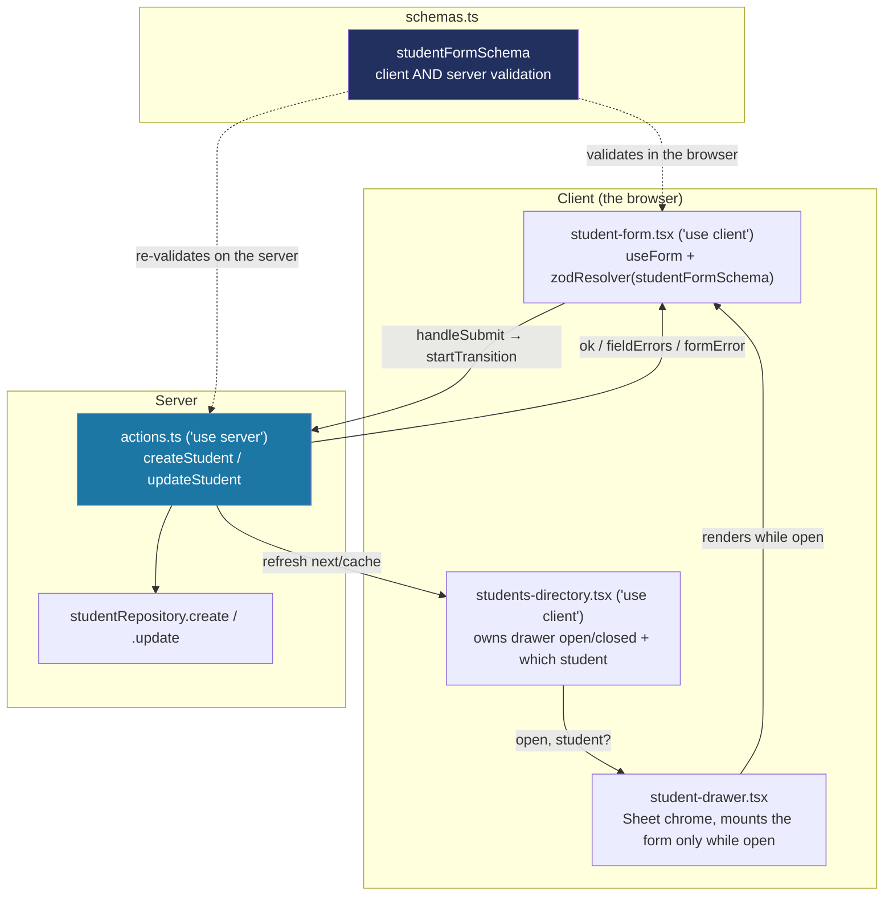

# How a drawer-based add/edit form works

Step 15 built the Students "Add student" / "Edit student" drawer — the first screen in the app that actually *writes* data, not just reads it. It's also the first of several: Steps 16 (card link/replace), 18 (staff invite), 20 (add a school) and 21 (appearance settings) all follow the same shape, so this document explains the one mechanism behind it rather than re-explaining it each time.

**The core idea:** one Zod schema is the single source of truth for what a valid submission looks like. React Hook Form uses it to validate in the browser (instant feedback, no round trip for an obvious mistake); the exact same schema re-validates on the server, inside a Server Action, before anything is written (CLAUDE.md: "Zod schemas are shared by forms and server actions, and validated on both sides"). Neither side trusts the other.

## The shape of it



## Why drawer state lives above both the trigger and the table

The "Add student" button sits in the page header; clicking a row also has to open the *same* drawer, just pre-filled. Both need to share one piece of state (is the drawer open, and for which student, if any) — so that state lives in one client component, `students-directory.tsx`, that renders all three: the header (with its button), the table (with its row click), and the drawer. `page.tsx` stays a plain Server Component that only does session lookup and data fetching, and hands already-resolved, serializable props down to `StudentsDirectory`. This is exactly why `students-table.tsx` needed `"use client"` in this step — a Server Component can pass a client component a function prop, but can't attach an `onClick` itself.

```ts
// students-directory.tsx
const [drawer, setDrawer] = useState<{ open: boolean; student?: Student }>({ open: false });

<Button onClick={() => setDrawer({ open: true, student: undefined })}>Add student</Button>
<StudentsTable onRowClick={canEdit ? (student) => setDrawer({ open: true, student }) : undefined} />
<StudentDrawer open={drawer.open} student={drawer.student} onOpenChange={...} onSuccess={...} />
```

`onRowClick` is only ever passed for a principal or super admin — teachers get `undefined`, so their table renders with no `role="button"`, no `tabIndex`, no click handler at all, identical to before this step.

## One schema, two shapes (when a schema transforms)

`studentFormSchema` doesn't just reuse `studentSchema`'s fields — a blank LRN or middle name has to mean "not provided," not "provided and invalid," so both fields end in `.optional().transform((v) => (v ? v : undefined))`:

```ts
lrn: z
  .union([lrnSchema, z.literal("")])
  .optional()
  .transform((value) => (value ? value : undefined)),
```

A transform like this means the schema's **input** shape (what a form field can hold — `string | undefined`, key optional) and **output** shape (what comes out of a successful parse — `string | undefined`, key always present) genuinely differ. `types.ts` exports both, named for which side they're on:

```ts
export type StudentFormValues = z.input<typeof studentFormSchema>;  // what the form fields hold
export type StudentFormInput = z.infer<typeof studentFormSchema>;   // what a validated submission looks like
```

`useForm` needs to know about both when a resolver transforms its data — its third generic is the transformed ("submitted") type:

```ts
useForm<StudentFormValues, unknown, StudentFormInput>({
  resolver: zodResolver(studentFormSchema),
  defaultValues: student ? valuesFrom(student) : emptyValues(),
});
```

If a future form's schema has no transforms at all (the login form, for instance), the input and output shapes are identical and this split isn't needed — `useForm<LoginInput>` alone is fine, same as Step 12.

## Wiring a non-native input (shadcn `Select`) into the form

`register()` only works for elements with a real DOM `ref` and native `onChange` — a plain `<input>`. The grade field uses shadcn's `Select` (Radix-based), which isn't one, so it goes through `Controller` instead, converting between the Select's string value and the schema's numeric `GradeLevel` at the boundary:

```tsx
<Controller
  control={control}
  name="gradeLevel"
  render={({ field }) => (
    <Select value={String(field.value)} onValueChange={(value) => field.onChange(Number(value))}>
      ...
    </Select>
  )}
/>
```

Any future field backed by a shadcn primitive that isn't a plain `<input>`/`<textarea>` (a `Switch`, a `DatePicker`, another `Select`) follows this same `Controller` shape.

## Reading a live field value: `useWatch`, not `watch`

The birth date field shows a live "Age N" hint as you type. The obvious approach, `watch("birthDate")`, works but returns a plain function the React Compiler can't safely memoize around — `npm run lint` flags it (`react-hooks/incompatible-library`). `useWatch({ control, name: "birthDate" })` is the hook-shaped equivalent designed for this; same live value, no warning. Use `useWatch` any time a form needs to react to its own current value (a computed hint, a conditional field), not `watch`.

## The server side: re-validate, then write, then `refresh()`

```ts
// actions.ts
export async function createStudent(input: StudentFormInput): Promise<StudentFormActionResult> {
  const session = await getSession();
  if (!session.schoolId || session.role === "teacher") {
    return { ok: false, formError: "You don't have permission to add students." };
  }

  const parsed = studentFormSchema.safeParse(input);
  if (!parsed.success) return { ok: false, fieldErrors: fieldErrorsFrom(parsed.error) };

  await studentRepository.create({ id: crypto.randomUUID(), schoolId: session.schoolId, ...parsed.data });
  refresh();
  return { ok: true };
}
```

Three things every write action does, in this order:
1. **Check the session, not just the UI.** A Server Action is a real HTTP endpoint, reachable directly — the same reasoning `assertDevSessionMutationAllowed()` documents for the dev session switcher (`docs/DATA-ACCESS.md`). The role/school check runs first, before touching any data.
2. **Re-validate with the same schema the client already used.** Not because the client is untrusted exactly, but because nothing guarantees the request came from that form at all.
3. **Write, then `refresh()`** (`next/cache`) so the Server Component tree re-fetches and the list reflects the change — the same mechanism Step 13's "Simulate a tap" already established.

The action returns a small result type the form can act on directly, rather than throwing:

```ts
export type StudentFormActionResult =
  | { ok: true }
  | { ok: false; formError?: string; fieldErrors?: Partial<Record<keyof StudentFormInput, string>> };
```

`fieldErrors` get mapped onto the form with `setError(field, { message })` per field; a `formError` (permission denied, student not found) shows as a toast instead, since it isn't about any one field.

## Quick recipes

**I want to build the next drawer form (Step 16/18/20/21).** Copy the four-file shape: a `*FormSchema` in that feature's `schemas.ts` (transform any "blank means not provided" field the same way `lrn`/`middleName` do here), a `*-form.tsx` client component (`useForm` + `zodResolver`, `Controller` for any non-native input), a thin `*-drawer.tsx` wrapping it in `Sheet`, and a `"use server"` `actions.ts` that re-validates and calls the repository's write method. Reuse `StudentFormActionResult`'s shape (`{ ok: true } | { ok: false; formError?; fieldErrors? }`) for the new action's return type too.

**I want a form whose schema has no transforms.** Skip the `StudentFormValues`/`StudentFormInput` split — `useForm<TheInputType>` alone is enough, same as the login form (Step 12).

**I want to wire a non-`<input>` shadcn component into a form.** Use `Controller`, not `register()` — see the grade `Select` above.

**I want a value that updates live as the user types.** `useWatch({ control, name })`, not the form's own `watch()` — see the `react-hooks/incompatible-library` note above.
