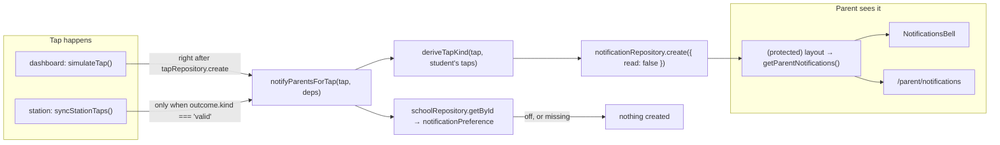

# How parent notifications work (Step 24)

SMS was dropped from the plan on 2026-09-22; this is the **in-app channel only** — a bell and a feed inside the parent portal, driven by the same simulated-tap mechanism the staff dashboard already uses. This doc covers the whole mechanism: how a tap becomes a notification, who sees it, and where the Phase 1 simplifications are.

## The one idea to hold on to

**A notification is created once, at tap time — never derived at read time.** When a tap is recorded, the app immediately decides (from the school's preference) whether parents should hear about it, and writes one `Notification` row. When a parent later opens their bell or feed, the app just *reads* that row — it never re-derives anything. This is the opposite of how attendance status works (`docs/ATTENDANCE-MODEL.md`: present/late/absent are computed on read from raw taps), and for a good reason: a school's notification preference is a *moment-in-time* decision. If the principal turns notifications off tomorrow, yesterday's "your child tapped in" should still be in the feed — the parent was told, and the record of being told should survive the setting change.

Everything else in this file is a consequence of that one idea.

## The shape of it

A notification is a small, flat record (`src/features/parents/schemas.ts`):

```ts
notificationSchema = z.object({
  id: z.string().min(1),
  schoolId: z.string().min(1),
  studentId: z.string().min(1),
  kind: z.enum(["time_in", "time_out"]),
  tappedAt: z.iso.datetime(),
  read: z.boolean(),
});
```

Two deliberate design choices, both documented at the schema itself:

- **It copies the tap's data (`studentId`, `tappedAt`) rather than referencing the tap by id.** No `tapId` foreign key in Phase 1 — the mock layer has nothing real to join against, and a flat copy is simpler and works forever. Phase 2 can add `tapId` once a real Tap API exists.
- **It has no `parentId`.** A notification is "about student X tapping", not "for parent Y". Parents are joined in through `ParentStudentLink`s at read time, which is what makes one notification serve every guardian of a child.

`kind` is *derived from the tap sequence* (never stored as a label on a tap — same "derive, don't store" principle as attendance): a student's 1st tap of the day is a time-in, the 2nd is a time-out, the 3rd is a time-in again, and so on. That rule lives in `deriveTapKind()` (`src/features/attendance/status.ts`) and counts only that student's same-day taps strictly before this one (same-timestamp ties break by id, so the sequence is always deterministic).

## The flow, end to end



The fan-out helper (`src/features/attendance/notify-parents.ts`) is the whole decision in one place:

```ts
export async function notifyParentsForTap(tap: Tap, deps: NotifyParentsDeps): Promise<Notification | null> {
  if (!tap.studentId) return null;

  const school = await deps.schoolRepository.getById(tap.schoolId);
  if (!school || school.notificationPreference === "off") return null;

  const studentTaps = await deps.tapRepository.listByStudent(tap.studentId);
  const kind = deriveTapKind(tap, studentTaps);
  if (kind === "time_out" && school.notificationPreference === "time_in_only") return null;

  return deps.notificationRepository.create({
    id: crypto.randomUUID(),
    schoolId: tap.schoolId,
    studentId: tap.studentId,
    kind,
    tappedAt: tap.tappedAt,
    read: false,
  });
}
```

Repositories arrive as parameters (`deps`) rather than being imported from the singletons, so tests can hand it fresh mock instances — the same pattern `lib/session.ts`'s `resolveSession(staffId, repository)` established.

### The two call sites

1. **`simulateTap()`** (`src/features/attendance/actions.ts`) — the dashboard's "Simulate a tap" button records the tap, then immediately fans it out:

   ```ts
   await tapRepository.create(tap);
   await notifyParentsForTap(tap, { schoolRepository, tapRepository, notificationRepository });
   refresh();
   ```

2. **`syncStationTaps()`** (`src/features/station/station-actions.ts`) — the tap station, but **only for `outcome.kind === "valid"`**. A lost-card tap raises an `Alert` instead (the designed response — pinging a parent "your lost card was tapped" before staff has seen it would be noise), and an unknown-card tap has `studentId: null` and nobody to notify.

Both call sites keep their existing `refresh()` — the fan-out helper itself never touches `next/cache`, so it stays testable as a plain function.

## Reading it back: the parent side

`getParentNotifications(parentId)` (`src/features/parents/notifications-data.ts`) is the single read path, used by **both** consumers:

- The **bell** (`NotificationsBell`, rendered in `src/app/parent/(protected)/layout.tsx`'s header) shows the five newest items in a dropdown plus the unread count on its badge; the layout fetches once and passes items down, and the actions' `refresh()` re-renders the layout too — which is how the badge clears in place after "Mark all as read".
- The **page** (`/parent/notifications`) shows everything, grouped by day.

The read path joins links → students → notifications in parallel and sorts newest first; it never filters by school *itself*, because a `Parent` belongs to exactly one school (`docs/AUTH.md`) and their links are school-scoped by construction.

Marking read goes through two server actions in `src/features/parents/notification-actions.ts`, both gated on `getParentSession()` **plus** link membership (`parentStudentLinkRepository.listByParent`) and a `schoolId` match — a parent can only mark their own children's notifications read:

- `markNotificationRead(id)` — one item (the bell's item click and the feed's unread-row click).
- `markAllNotificationsRead()` — everything currently unread (the bell's and the page's "Mark all as read" buttons).

## Where Phase 1 deliberately simplifies

- **Shared read state.** One `read` flag per notification, shared by every guardian of the same child — Step 20's approved model, no schema change. Phase 2 moves to per-parent records.
- **Live taps can only be time-ins today.** The simulate button and the station only ever produce a student's first tap of the day, so a *live* time-out notification can't be created in Phase 1. The alternation logic (`deriveTapKind`) and the preference gating are unit-tested instead (`status.test.ts`, `notify-parents.test.ts`), and the seed data includes a `time_out` notification so the rendering is real on screen.
- **No pagination or search on the feed.** The mock data is tiny; both arrive with Phase 2's database. The page already says so in its own comment.

## Quick recipes

**I want a new way to record taps (Phase 2's real Tap API, another simulate path).** After `tapRepository.create(tap)`, call `notifyParentsForTap(tap, { schoolRepository, tapRepository, notificationRepository })`. Skip it for taps with `studentId: null`, and consider skipping it for alert-raising taps (the lost-card pattern). Keep `refresh()` where it already is — in the action, not in the helper.

**I want to change when notifications fire.** Edit `notifyParentsForTap()` — the preference table lives in its doc comment. Every outcome (off / time-in-only / both, plus null-student and unknown-school skips) has a unit test in `src/features/attendance/notify-parents.test.ts`; extend those before the behavior.

**I want a new screen to show notifications.** Import `getParentNotifications(parentId)` from `src/features/parents/notifications-data.ts` — it returns `{ notification, student }[]` sorted newest-first. Reuse `notificationKindLabel()` for the "tapped in / tapped out" wording and `formatTapTime()`/`formatTapDate()` for the times, so every screen spells and formats them identically.

**I want per-parent read state (Phase 2).** Add a `parentId` to the notification records (or a separate read-receipt table), and update `countUnreadNotifications()` / `markAllNotificationsRead()` in `src/features/parents/notifications-data.ts` and `notification-actions.ts` — both already funnel every read/read-count through one function each, so those are the only places that change.

**I want to see the full sequence of a student's taps (bell → details, Phase 2).** The `Notification` carries no tap list — it's a flat copy. Join back through `tapRepository.listByStudent(notification.studentId)` filtered to the same day, or wait for the Phase 2 `tapId` column and join directly.
