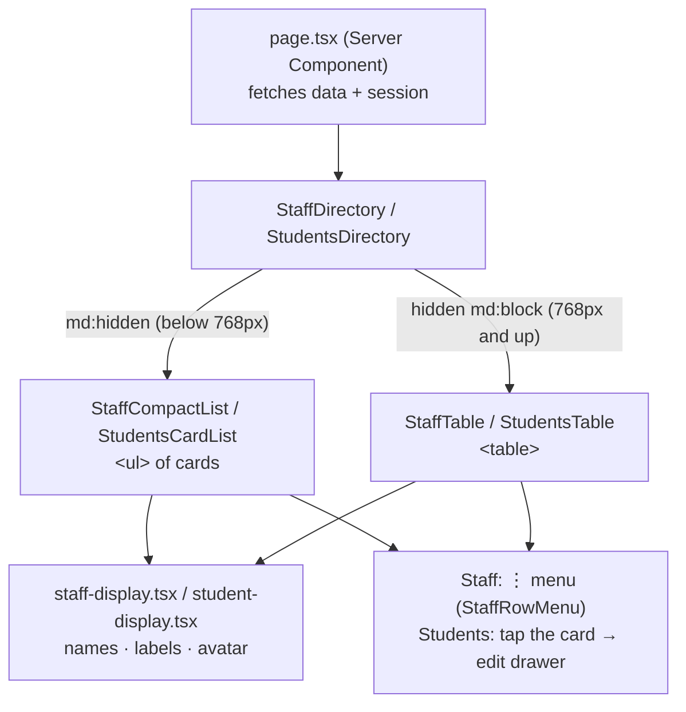

# Responsive lists and drawers

How a list of records (staff, students, schools…) changes shape between a phone and a desktop, and how drawers fit on a phone. Built on the Staff page in Step 27.6, turned into cards and applied to Students in Step 27.7; Step 27.8 carries it to every other list.

## 1. The idea

A desktop table is built for **scanning many rows at once**: every column lines up, so the eye runs down "Status" and spots the odd one out. On a phone there isn't room for the columns, and the two usual shortcuts both fail:

- **Shrinking the text** until the table fits makes it unreadable.
- **Scrolling the table sideways** hides columns off-screen, so you lose track of which row you're on, and it breaks WCAG 1.4.10 (Reflow: content must fit a 320px-wide screen without scrolling in two directions).

So below 768px the same records become **cards**: one short card per record, saying only what tells people apart. A phone list has to stay quick to scroll with 30 staff or 500 students, so every line on a card has to earn its place.



## 2. Swapping with CSS, not JavaScript

Both views are rendered, and CSS shows one of them (`src/features/staff/staff-directory.tsx`):

```tsx
<div className="md:hidden">
  <StaffCompactList items={items} currentUserId={currentUserId} />
</div>
<div className="hidden md:block">
  <StaffTable items={items} currentUserId={currentUserId} />
</div>
```

Why not measure the screen in JavaScript and render only one? Because the server doesn't know the screen size. It would have to guess, send the wrong layout to half the devices, and swap it after loading, which makes the page jump. With CSS the server's HTML is right for every device from the first paint. `display: none` also removes the hidden view from screen readers, so nobody hears the list twice.

## 3. Anatomy of a card

`src/features/students/students-card-list.tsx` and `src/features/staff/staff-compact-list.tsx`:

```
┌─────────────────────────────────────────┐
│ (RA)  Reynaldo Abad            [Present]│  avatar · name · today's status
│       Grade 12 – Silang                 │  one line that tells students apart
└─────────────────────────────────────────┘
   8px gap (gap-2): separate cards, one per record
┌─────────────────────────────────────────┐
│ (RC)  Rosa Castillo             [Absent]│
│       Grade 8 – Bonifacio      [No card]│  card tag only when it's the exception
└─────────────────────────────────────────┘
┌─────────────────────────────────────────┐
│ (JP)  Jose Pascual                    ⋮ │  staff: the ⋮ menu instead of a status
│       Adviser, Grade 7 – Rizal          │
└─────────────────────────────────────────┘
```

**How it got here.**
- **Step 27.6, first try:** tall cards with the email and a labelled Role | Advisory class | Status grid, about 190px per person. Too slow to scroll.
- **Step 27.6, review round 1:** one bordered list with thin dividers, about 64px per row, saying only what tells people apart.
- **Step 27.7:** the owner shared a phone mockup for Students and chose its **separate cards** over the divided list, keeping the short content. Staff switched too, so both pages look the same. Each card is still about 64–70px (`min-h-16`, 8px apart), so the list stays quick to scroll. The cost of cards over dividers is about one row fewer per screen.

**What was taken from the Step 27.7 mockup, and what wasn't:**

| Mockup idea | Decision | Why |
|---|---|---|
| Name and initials first, grade and section underneath | Taken | Tells students apart better than the guardian's name the table shows. |
| Today's status as a badge on the right | Taken | It's what a principal scans the list for. |
| Separate cards | Taken (owner's choice) | Staff changed to match. |
| "Linked" tag on every card | Changed | Status by exception: only "No card" or "Lost" show. |
| Age or LRN in small text | Left out | Students are minors, so the list shows as little as possible. They stay in the edit drawer. |
| Red outline on an absent student's card | Left out | Looks like an error or a selected card. The red badge already says it. |
| Scrolling filter "pills" | Changed | Choices off the edge are hidden, the same problem as a sideways table. Two dropdowns side by side instead. |
| "+ Add" beside the title | Taken | See section 6. |
| Count and page buttons on one row | Taken | With 44px buttons. |
| Bottom navigation bar | Not now (owner's decision) | Principals have 6 sections and super admins 7, more than a bottom bar holds. |

The rules each card follows:

- **Say what tells records apart, once.** A student's second line is `gradeAndSection()` ("Grade 12 – Silang"). A teacher's list is all one class, where that line would repeat on every card, so `subtitle="time-in"` shows "In at 7:12 AM" or "No tap yet" instead. A staff member's is `staffSummary()` ("Adviser, Grade 7 – Rizal"), which already implies the role. No column labels, because the content explains itself.
- **Status by exception.** A linked card shows nothing; "No card" and "Lost" get a tag under today's status. For staff, Active shows nothing and only a pending invite gets the amber "Invited" tag. A tag on every card would be noise that hides the one that matters.
- **Secondary details move behind a tap.** A student's age, LRN and guardian are in the edit drawer. A staff member's email is the first line of the ⋮ menu.

Details that matter:

- **It's a real list.** `<ul aria-label="Students">` with one `<li>` per card, and each name is an `<h3>` (the page title is the `<h2>`), so screen-reader heading navigation jumps card to card.
- **The whole student card is tappable, but the name stays a heading.** A `<button>` can't contain a heading, so the button sits *inside* the `<h3>`, and its invisible `::after` is stretched over the whole card (`after:absolute after:inset-0` with `relative` on the `<li>`). A tap anywhere on the card lands on the button. Its accessible name is "Edit Reynaldo Abad", the same as the desktop table rows. The focus ring is drawn on the card with `has-focus-visible:ring-2`, since the button itself is only as big as the name. Teachers get plain text with no button, because they can't edit.
- **Long text wraps rather than widening the page.** Names use `wrap-break-word`, and the text column is `min-w-0 flex-1`: without `min-w-0` a flex child refuses to shrink below its content's width, and wrapping never happens.
- **The staff ⋮ sits in a fixed 44×44px box at the card's edge** (`size-11`), even when a card has no menu, so every card's text lines up. It stays 32px in the desktop table, where it's clicked with a mouse.

## 4. The ⋮ row menu

`src/features/staff/staff-row-menu.tsx` is **one component used by both views**, so the table and the phone list can't offer different actions.

- **What each row offers comes from one rule**, `staffRowActions(staff, currentUserId)` in `row-actions.ts`. The menu uses it to decide what to show, and the server actions use it to refuse anything the menu wouldn't have shown (a server action can be called directly, not just from the button).
- **No actions means no menu.** Your own, already accepted, account renders no ⋮ at all, rather than a menu that opens onto nothing.
- **Destructive actions confirm first.** Remove opens a `Dialog` ("Remove Maria Ramos?") instead of acting straight away.
- **Focus goes somewhere sensible afterwards.** Cancel returns focus to the ⋮ button. After a removal that row is about to disappear, so focus moves to the page's main area (the skip link's target), not the page body.
- On phones the menu's first line is the person's email (`DropdownMenuLabel`, `md:hidden`), since the compact row leaves it out.
- The menu is `modal={false}`, like the theme toggle and notification bell (see docs/ACCESSIBILITY.md), and its items are taller on phones (`py-2.5 md:py-1`).

## 5. Drawers on a phone

`src/features/staff/staff-drawer.tsx` and `staff-form.tsx`:

- **Full width below 640px.** The shadcn `Sheet` defaults to `w-3/4` (281px on a 375px phone). A plain `w-full` override **loses** to it, because the Sheet's rule is `data-[side=right]:w-3/4`, and the attribute selector makes it more specific. The override has to use the same prefix, which `tailwind-merge` then recognises and replaces:

  ```tsx
  <SheetContent className="flex flex-col gap-0 data-[side=right]:w-full">
  ```

  From 640px up the Sheet's own `data-[side=right]:sm:max-w-sm` still caps it at 384px, so desktop is unchanged.
- **Fields stack one per row** (`grid-cols-1 sm:grid-cols-2`), so a select's placeholder ("Select a grade") is never cut off.
- **Long helper text goes behind an ⓘ toggle.** A plain show/hide button (`aria-expanded`, `aria-controls`), not a hover tooltip, because touch screens have no hover.
- **Footer buttons are pinned and thumb-sized.** The form is `flex-1 overflow-hidden` with its own scrolling body, so Cancel and Submit stay visible however long the form gets. On phones they share the width and are 44px tall: `[&>button]:h-11 [&>button]:flex-1 sm:[&>button]:h-8 sm:[&>button]:flex-none` on the footer.
- **Fieldset legends need their own margin** (`mb-3`). A `<legend>` doesn't take part in its fieldset's flex `gap`, so without one it sits right on top of the first field.

## 6. Header, toolbar and pagination on a phone

Added in Step 27.7, so the whole Students screen fits a phone, not just the list.

- **`PageHeader` is a two-column grid** (`src/components/page-header.tsx`), not a stack. On a phone the button sits beside the title and the description runs full width underneath. From 640px up the button moves to the right of both lines:

  ```tsx
  <div className="grid grid-cols-[minmax(0,1fr)_auto] items-center gap-x-3 gap-y-1">
    <Heading className="col-start-1 row-start-1 …">{title}</Heading>
    <p className="col-span-2 col-start-1 row-start-2 sm:col-span-1 …">{description}</p>
    <div className="col-start-2 row-start-1 sm:row-end-3 …">{actions}</div>
  </div>
  ```

  Use `row-end-3`, not `row-span-2`: Tailwind's `row-span-2` sets the whole `grid-row` shorthand, which throws away `row-start-1` and lets the button drop to the second row. This happened on the first try (see docs/BUILD-LOG.md, Step 27.7).
- **Short button labels on phones.** "Add student" shows as "Add" (`Add<span className="hidden sm:inline">student</span>`), with `aria-label="Add student"` so screen readers and voice control still get the full name. The visible "Add" is the start of the label, which WCAG 2.5.3 (Label in Name) requires.
- **Toolbar.** Search spans the full width. The grade and card filters share the row below it (`grid-cols-2`, or one column for a teacher, who has no grade filter), and all three are 44px tall on phones. Select triggers need `data-[size=default]:h-11`, not `h-11`, for the same "more specific rule wins" reason as the drawer width in section 5.
- **Pagination** stays on one row (`flex flex-wrap justify-between`) with 44px page buttons. "Showing 1–10 of 36" drops the word "students" below 640px to make room. It only wraps on the very narrowest screens.

## 7. Red buttons and hover contrast

The audit found that shadcn's destructive button darkened its translucent red tint on hover, dropping the text to 4.12:1 (light) and 3.87:1 (dark), below AA's 4.5:1. It only showed up once the confirmation dialog happened to open under the pointer. `src/components/ui/button.tsx` now fills the button with the solid `destructive`/`destructive-foreground` token pair on hover, which passes in both modes and reads clearly as "this is the dangerous one".

## 8. How it's checked

- `src/features/staff/staff-compact-list.test.tsx` checks:
  - Name plus summary, with no column labels.
  - A teacher's role when there's no class.
  - Only Invited is flagged, never Active.
  - The email appears only in the menu, along with the menu's actions.
  - Your own account has no menu.
  - Remove asks first.
- `e2e/a11y.spec.ts`:
  - "staff row menu and remove confirmation": axe with the menu open and with the dialog open, then Cancel returns focus to ⋮.
  - "small screens › /staff and /students fit the screen width": at 360px the list is shown, the table is hidden, axe finds nothing blocking, and `scrollWidth <= clientWidth`. A new list page is one more entry in `LIST_PAGES`.
- `src/features/students/students-card-list.test.tsx` checks:
  - Name, grade and section, and today's status, with no LRN, age or guardian.
  - The card tag only when the card isn't linked.
  - A teacher's time in instead of the class.
  - Tapping a card opens that student, and a read-only list has no buttons.

## 9. Quick recipes

**Turn another table into cards on phones**
1. Move the table's label helpers (names, wording, avatar) into a shared `<feature>-display.tsx` so both views use them.
2. Decide what goes on each card: the name, one line that tells records apart, the one status people scan for, and a tag only for the exceptional status. Everything else goes behind the ⋮ menu or the record's own drawer.
3. Write the card list: a `<ul aria-label className="flex flex-col gap-2">` of `<li className="relative flex min-h-16 items-center gap-3 rounded-lg border border-border bg-card px-4 py-3">` with an `<h3>` name and `min-w-0 flex-1` on the text column. For a card that opens something, put a stretched `<button>` inside the `<h3>` (`students-card-list.tsx`). For row actions, use a ⋮ in a fixed `size-11` box (`staff-compact-list.tsx`).
4. In the directory component, wrap the list in `md:hidden` and the table in `hidden md:block`.
5. Add the page to `LIST_PAGES` in the "small screens" test in `e2e/a11y.spec.ts`.
6. Check it at 320, 375, 390, 428, 768 and 1280px with a deliberately long record.

**Give a page header a button that fits on a phone**
Pass it as `actions` to `PageHeader`, and if its label is more than one short word, show only the verb below 640px: `Add<span className="hidden sm:inline">school</span>` with `aria-label="Add school"`.

**Add an action to a row menu**
1. Add a `can…` flag to the feature's row-actions rule, with a unit test.
2. Add a server action that re-checks the session, the school and that same rule.
3. Add a `DropdownMenuItem` shown only when the flag is true. If it's destructive, open a confirmation `Dialog` instead of acting directly.

**Fix a drawer that's cramped on a phone**
Add `data-[side=right]:w-full` to its `SheetContent`, stack paired fields with `grid-cols-1 sm:grid-cols-2`, and put the footer-button classes above on its `SheetFooter`.
