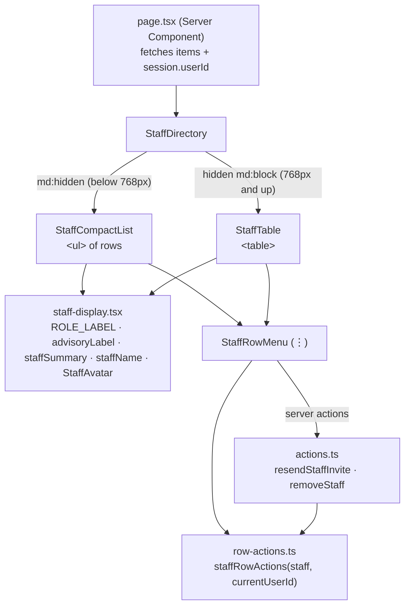

# Responsive lists and drawers

How a list of records (staff, students, schools…) changes shape between a phone and a desktop, and how drawers fit on a phone. Built on the Staff page in Step 27.6; Step 27.7 applies the same pattern to every other list.

## 1. The idea

A desktop table is built for **scanning many rows at once**: every column lines up, so the eye runs down "Status" and spots the odd one out. On a phone there isn't room for the columns, and the two usual shortcuts both fail:

- **Shrinking the text** until the table fits makes it unreadable.
- **Scrolling the table sideways** hides columns off-screen, so you lose track of which row you're on, and it breaks WCAG 1.4.10 (Reflow: content must fit a 320px-wide screen without scrolling in two directions).

So below 768px the same records become a **compact list**: one short row per record, saying only what tells people apart. A phone list has to stay quick to scroll with 30 staff or 500 students, so every line in a row has to earn its place.



## 2. Swapping with CSS, not JavaScript

Both views are rendered, and CSS shows one of them (`src/features/staff/staff-directory.tsx`):

```tsx
<div className="md:hidden">
  <StaffCompactList items={items} currentUserId={currentUserId} />
</div>
<div className="hidden md:block">
  <StaffTable items={items} currentUserId={currentUserId} />
</div>
```

Why not measure the screen in JavaScript and render only one? Because the server doesn't know the screen size. It would have to guess, send the wrong layout to half the devices, and swap it after loading, which makes the page jump. With CSS the server's HTML is right for every device from the first paint. `display: none` also removes the hidden view from screen readers, so nobody hears the list twice.

## 3. Anatomy of a compact row

`src/features/staff/staff-compact-list.tsx`:

```
┌─────────────────────────────────────────┐
│ (MR)  Maria Ramos                     ⋮ │  ~64px: avatar · name + one line · menu
│       Principal                         │
├─────────────────────────────────────────┤  divide-y: one list, not separate cards
│ (JP)  Jose Pascual                    ⋮ │
│       Adviser, Grade 7 – Rizal          │
├─────────────────────────────────────────┤
│ (MD)  Maria Concepcion Evangelista      │  a long name wraps and keeps the full width
│       Dela Cruz-Villanueva            ⋮ │
│       Teacher  [Invited]                │  status only when it's the exception
└─────────────────────────────────────────┘
```

**How it got here.** The first version (review round 1) was a stack of separate cards, each with the email and a labelled Role | Advisory class | Status grid. It was about 190px per person, so a long list took ages to scroll, and the labels repeated the same three words on every card. The rules that replaced it:

- **Say what tells people apart, once.** The second line is `staffSummary()` in `staff-display.tsx`: "Adviser, Grade 7 – Rizal" for a teacher with a class ("adviser" is the word Philippine schools use, and it already implies the teacher role), otherwise just the role. No column labels, because the content explains itself.
- **Status by exception.** Almost everyone is Active, so Active shows nothing, and only a pending invite gets the amber "Invited" tag. A tag on every row would be noise that hides the one that matters. The tag sits on the second line, not beside the name, so a long name keeps the row's full width.
- **Secondary details move behind a tap.** The email is the first line of the ⋮ menu (phone only, since the desktop table shows it already).
- **One list, not a pile of cards.** One bordered box with thin dividers (`divide-y`) is denser, and it reads as "a list of people" rather than a set of separate objects.

Details that matter:

- **It's a real list.** `<ul aria-label="Staff">` with one `<li>` per person, and each name is an `<h3>` (the page title is the `<h2>`), so screen-reader heading navigation jumps person to person.
- **Long text wraps rather than widening the page.** Names use `wrap-break-word`, and the text column is `min-w-0 flex-1`: without `min-w-0` a flex child refuses to shrink below its content's width, and wrapping never happens.
- **The ⋮ sits in a fixed 44×44px box at the row's edge** (`size-11`), even when a row has no menu, so every row's text lines up. It stays 32px in the desktop table, where it's clicked with a mouse.

## 4. The ⋮ row menu

`src/features/staff/staff-row-menu.tsx` is **one component used by both views**, so the table and the phone list can't offer different actions.

- **What each row offers comes from one rule**, `staffRowActions(staff, currentUserId)` in `row-actions.ts`. The menu uses it to decide what to show, and the server actions use it to refuse anything the menu wouldn't have shown (a server action can be called directly, not just from the button).
- **No actions means no menu.** Your own, already accepted, account renders no ⋮ at all, rather than a menu that opens onto nothing.
- **Destructive actions confirm first.** Remove opens a `Dialog` ("Remove Maria Ramos?") instead of acting straight away.
- **Focus goes somewhere sensible afterwards.** Cancel returns focus to the ⋮ button. After a removal that row is about to disappear, so focus moves to the page's main area (the skip link's target), not the page body.
- On phones the menu's first line is the person's email (`DropdownMenuLabel`, `md:hidden`), since the compact row leaves it out.
- The menu is `modal={false}`, like the theme toggle and notification bell (see docs/ACCESSIBILITY.md), and its items are taller on phones (`py-2.5 md:py-1`).

## 5. Drawers on a phone

`src/features/staff/staff-drawer.tsx` and `staff-form.tsx`:

- **Full width below 640px.** The shadcn `Sheet` defaults to `w-3/4` (281px on a 375px phone). A plain `w-full` override **loses** to it, because the Sheet's rule is `data-[side=right]:w-3/4`, and the attribute selector makes it more specific. The override has to use the same prefix, which `tailwind-merge` then recognises and replaces:

  ```tsx
  <SheetContent className="flex flex-col gap-0 data-[side=right]:w-full">
  ```

  From 640px up the Sheet's own `data-[side=right]:sm:max-w-sm` still caps it at 384px, so desktop is unchanged.
- **Fields stack one per row** (`grid-cols-1 sm:grid-cols-2`), so a select's placeholder ("Select a grade") is never cut off.
- **Long helper text goes behind an ⓘ toggle.** A plain show/hide button (`aria-expanded`, `aria-controls`), not a hover tooltip, because touch screens have no hover.
- **Footer buttons are pinned and thumb-sized.** The form is `flex-1 overflow-hidden` with its own scrolling body, so Cancel and Submit stay visible however long the form gets. On phones they share the width and are 44px tall: `[&>button]:h-11 [&>button]:flex-1 sm:[&>button]:h-8 sm:[&>button]:flex-none` on the footer.
- **Fieldset legends need their own margin** (`mb-3`). A `<legend>` doesn't take part in its fieldset's flex `gap`, so without one it sits right on top of the first field.

## 6. Red buttons and hover contrast

The audit found that shadcn's destructive button darkened its translucent red tint on hover, dropping the text to 4.12:1 (light) and 3.87:1 (dark), below AA's 4.5:1. It only showed up once the confirmation dialog happened to open under the pointer. `src/components/ui/button.tsx` now fills the button with the solid `destructive`/`destructive-foreground` token pair on hover, which passes in both modes and reads clearly as "this is the dangerous one".

## 7. How it's checked

- `src/features/staff/staff-compact-list.test.tsx` checks:
  - Name plus summary, with no column labels.
  - A teacher's role when there's no class.
  - Only Invited is flagged, never Active.
  - The email appears only in the menu, along with the menu's actions.
  - Your own account has no menu.
  - Remove asks first.
- `e2e/a11y.spec.ts`:
  - "staff row menu and remove confirmation": axe with the menu open and with the dialog open, then Cancel returns focus to ⋮.
  - "small screens › staff page fits the screen width": at 360px the list is shown, the table is hidden, and `scrollWidth <= clientWidth`.

## 8. Quick recipes

**Turn another table into a compact list on phones**
1. Move the table's label helpers (role/status wording, formatting) into a shared `<feature>-display.tsx` so both views use them.
2. Decide what goes in each row: the name, one summary line that tells records apart, and a tag only for the exceptional status. Everything else goes behind the ⋮ menu or the record's own page.
3. Write `<Feature>CompactList`: a `<ul aria-label className="divide-y … rounded-lg border">` of `min-h-16` rows with an `<h3>` name, `min-w-0` on the text column, and the ⋮ in a fixed `size-11` box.
4. In the directory component, wrap the list in `md:hidden` and the table in `hidden md:block`.
5. Add the page to the "small screens" test in `e2e/a11y.spec.ts`.
6. Check it at 320, 375, 390, 428, 768 and 1280px with a deliberately long record.

**Add an action to a row menu**
1. Add a `can…` flag to the feature's row-actions rule, with a unit test.
2. Add a server action that re-checks the session, the school and that same rule.
3. Add a `DropdownMenuItem` shown only when the flag is true. If it's destructive, open a confirmation `Dialog` instead of acting directly.

**Fix a drawer that's cramped on a phone**
Add `data-[side=right]:w-full` to its `SheetContent`, stack paired fields with `grid-cols-1 sm:grid-cols-2`, and put the footer-button classes above on its `SheetFooter`.
