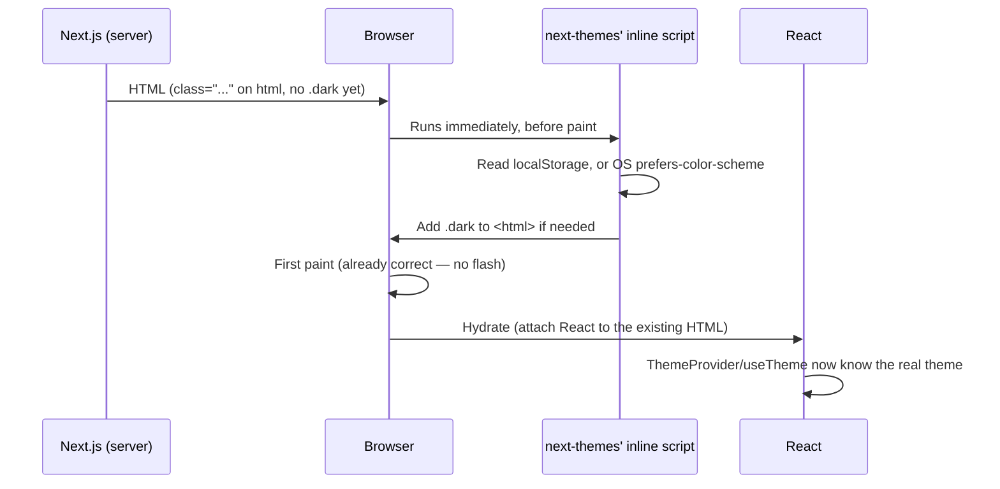
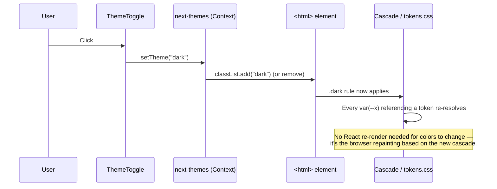

# How the styling system works

This is a from-scratch explanation of the token/theming code added in Step 4 — not just *what* files exist, but *how they connect* and *why*, so you can trace it yourself next time. `docs/BUILD-LOG.md` covers the decisions and debugging story for Step 4; this document is the reference for how the mechanism itself works, for whenever you need to add a token, use one in a new component, or just remember how the pieces fit.

If you already know CSS custom properties (`var(--x)`) and how the CSS cascade picks a value when there are multiple candidates, skip to [The files, one by one](#the-files-one-by-one). If those two things are new to you, read the next section first — everything else is built on them.

## The two ideas everything else depends on

**1. A CSS custom property is just a named value that can change.** `--foreground: oklch(25.2% 0.061 262.8);` defines a variable called `--foreground`. Anywhere else in CSS, `color: var(--foreground)` means "use whatever `--foreground` currently is." The key word is *currently* — unlike a Sass variable (which gets baked into a fixed value when the stylesheet compiles), a CSS custom property is resolved live, in the browser, every time it's used. That's what makes it possible to change a value at runtime with no rebuild.

**2. The CSS cascade lets a *later* or *more specific* rule win.** If `:root { --foreground: navy; }` and, separately, `.dark { --foreground: white; }` both exist, an element only gets the `.dark` value if that element is actually inside something with `class="dark"` on it. No `.dark` ancestor → falls back to `:root`'s value. This is the entire mechanism dark mode uses: **the token names never change, only which rule currently applies to them.** Every component that says `bg-primary` or `text-foreground` is completely unaware of light/dark — it just asks for "primary" and the cascade decides which actual color that resolves to right now.

Everything below is just: where do `:root` and `.dark` get defined, how does Tailwind turn `--foreground` into a class you can write as `text-foreground`, and what decides whether `.dark` is present on the page.

## The files, one by one


Read that as: `tokens.css` and `base.css` are plain CSS with no Tailwind-specific syntax — `globals.css` is the one file that pulls everything together and is the only CSS file actually imported by any `.tsx` file (`layout.tsx`, line 4: `import "./globals.css"`). `theme-provider.tsx` and `theme-toggle.tsx` are separate from the CSS entirely — they're the *React* half, responsible for deciding whether `.dark` is on the page at all.

### 1. `src/styles/tokens.css` — the values

```css
:root {
  --background: oklch(97.5% 0.006 255.5);
  --foreground: oklch(25.2% 0.061 262.8);
  --primary: oklch(32.5% 0.087 268.9);
  /* ...more ... */
}

.dark {
  --background: oklch(19.8% 0.037 264.2);
  --foreground: oklch(95.1% 0.016 262.8);
  --primary: oklch(67.5% 0.081 231.4);
  /* ...more ... */
}
```

This file does exactly one job: define what each named token *is*, for two situations — the default (`:root`, meaning "no `.dark` class present anywhere above this element") and dark (`.dark`, meaning "this element is inside something with `class="dark"`"). Nothing here is Tailwind-specific — this would work in a plain HTML page with no build tool at all. It's also the *only* file allowed to contain a literal color value (`oklch(...)`), per CLAUDE.md's design-system rule — every other file references a token by name.

### 2. `src/styles/base.css` — using tokens on raw HTML elements

```css
body {
  background: var(--background);
  color: var(--foreground);
  font-family: var(--font-body);
}

h1, h2, h3, h4, h5, h6 {
  font-family: var(--font-heading);
}
```

This is where tokens actually get *applied* to something, for the handful of elements that need styling before any component even renders (the page background, default text color, heading font). Notice it already uses `var(--font-body)` — a token that doesn't exist yet in `tokens.css`. That's deliberate: `--font-body` and `--font-heading` are defined one file over, in `globals.css`, because they depend on values that only exist inside a React component (see the layout section below). CSS doesn't care which file a custom property was declared in, only that it's declared *somewhere* before it's used — the cascade doesn't see file boundaries, only the final combined stylesheet.

### 3. `src/app/globals.css` — the hub

```css
@import "tailwindcss";
@import "../styles/tokens.css";
@import "../styles/base.css";

@custom-variant dark (&:where(.dark, .dark *));

@theme inline {
  --color-background: var(--background);
  --color-primary: var(--primary);
  --font-heading: var(--font-lexend);
  /* ...more ... */
}
```

Three separate jobs happen in this one file:

- **`@import` lines**: pull in Tailwind itself, then our two plain-CSS files, in order. Order matters here the same way it would in any CSS file — later rules can override earlier ones.
- **`@custom-variant dark ...`**: this one line is *why* writing `dark:bg-card` in a component works at all. Tailwind v4 needs to be told what "dark mode" means for this project — by default it only knows about the OS-level `prefers-color-scheme` media query. This line teaches it a second definition: "anything matching `.dark` or a descendant of `.dark`." Since `next-themes` is the thing that actually adds `class="dark"` to `<html>`, this is the line that connects Tailwind's `dark:` prefix to next-themes' toggle.
- **`@theme inline { ... }`**: this is Tailwind-specific syntax (not plain CSS) and is the part that actually generates utility classes. `--color-primary: var(--primary);` tells Tailwind's build step "register a theme color named `primary`, and whenever you need its value, don't bake in a number — reference the `--primary` custom property live." That's what `inline` means here: without it, Tailwind would try to resolve `var(--primary)` to a fixed value at build time (which is wrong, since the real value depends on light/dark at *runtime*). With `inline`, Tailwind instead emits CSS like:
  ```css
  .bg-primary { background-color: var(--color-primary); }
  ```
  — a plain reference, which the browser resolves fresh every time, respecting whatever `:root`/`.dark` currently says `--background` (via `--color-background`) is. This is the exact mechanism that makes `bg-primary` "just work" in both modes with no extra code anywhere else.

Every color/font/duration token that needs a Tailwind utility class (`bg-*`, `text-*`, `font-*`, `duration-*`) has to be listed here. Radius (`rounded-*`) and shadow (`shadow-*`) utilities *don't* need to be listed here — Tailwind already ships default utilities under those exact names, and our `tokens.css` values for `--radius-sm`, `--shadow-sm`, etc. simply override Tailwind's built-in defaults through the ordinary cascade (our `:root` block loads after Tailwind's internal one). See `docs/BUILD-LOG.md`'s Step 4 entry for how that was confirmed rather than assumed.

### 4. `src/components/theme-provider.tsx` — deciding *whether* `.dark` exists

```tsx
"use client";
import { ThemeProvider as NextThemesProvider } from "next-themes";

export function ThemeProvider({ children, ...props }) {
  return (
    <NextThemesProvider attribute="class" defaultTheme="system" enableSystem {...props}>
      {children}
    </NextThemesProvider>
  );
}
```

This component doesn't touch any of our CSS. Its entire job is: (a) on first load, check the browser's saved preference (`localStorage`) or the OS-level setting if there's no saved preference (`defaultTheme="system"`, `enableSystem`), and (b) add or remove the literal string `"dark"` from `<html>`'s `class` attribute (`attribute="class"`) whenever the active theme changes. It's a thin wrapper around the real `next-themes` library only so the rest of the app imports one local, project-specific component instead of the library directly — if a default ever needed to change (say, `defaultTheme="light"` instead of `"system"`), there's exactly one place to do it.

The critical bit for "no flash of the wrong theme": `next-themes` injects a tiny `<script>` into the page that runs synchronously, before the browser paints anything, and sets the class immediately. That's a different, older technique than `useEffect` (which would run *after* the first paint and cause a visible flash) — see `node_modules/next/dist/docs/01-app/02-guides/preventing-flash-before-hydration.md` for Next.js's own explanation of exactly this problem, which `next-themes` implements for us.

### 5. `src/components/theme-toggle.tsx` — the button that calls `setTheme`

```tsx
"use client";
import { useEffect, useState } from "react";
import { useTheme } from "next-themes";

export function ThemeToggle() {
  const { resolvedTheme, setTheme } = useTheme();
  const [mounted, setMounted] = useState(false);

  useEffect(() => { setMounted(true); }, []);

  if (!mounted) return <button disabled>Toggle theme</button>;

  const isDark = resolvedTheme === "dark";
  return (
    <button onClick={() => setTheme(isDark ? "light" : "dark")}>
      {isDark ? "Switch to light mode" : "Switch to dark mode"}
    </button>
  );
}
```

`useTheme()` is a React hook from `next-themes` that reads whatever `ThemeProvider` currently knows (it works via React Context — `ThemeProvider` is a *provider*, `useTheme()` is a *consumer*, standard React data-flow, nothing custom-built here). `setTheme("dark")` is the one function call that actually changes things: it updates `next-themes`' internal state, which re-runs the class-toggling logic from `theme-provider.tsx`, which adds/removes `.dark` on `<html>`, which changes which cascade rule wins in `tokens.css`, which changes what every `var(--...)` resolves to, which is why the whole page repaints — **no component other than this button ever has to know a color changed.** That's the entire point of building it this way: color logic lives in exactly one place (the CSS), and React only ever flips a class name.

The `mounted` dance (disabled placeholder button until `useEffect` fires once) exists because the *server* has no idea what the user's saved preference is — it always renders not knowing yet. If this component tried to show "Switch to light/dark mode" immediately, the very first thing it says on the server might not match what the browser decides once it actually reads `localStorage`, and React would throw a hydration-mismatch warning. Waiting one tick (`mounted`) sidesteps that by rendering something theme-neutral until the real answer is known. This is `next-themes`' own documented pattern, not something invented for this project.

### 6. `src/app/layout.tsx` — where it all actually gets plugged in

```tsx
import { Atkinson_Hyperlegible, Lexend } from "next/font/google";
import { ThemeProvider } from "@/components/theme-provider";
import "./globals.css";

const lexend = Lexend({ variable: "--font-lexend", weight: [...] });
const atkinsonHyperlegible = Atkinson_Hyperlegible({ variable: "--font-atkinson", weight: [...] });

export default function RootLayout({ children }) {
  return (
    <html className={`${lexend.variable} ${atkinsonHyperlegible.variable} ...`} suppressHydrationWarning>
      <body>
        <ThemeProvider>{children}</ThemeProvider>
      </body>
    </html>
  );
}
```

This is the one file that touches nearly everything, so it's worth being precise about each piece:

- **`import "./globals.css"`** — this is what actually gets all of our CSS (tokens, base, Tailwind, the theme mapping) included in the app at all. Without this line, none of the other files would matter — nothing would load them.
- **`Lexend({ variable: "--font-lexend", ... })`** — `next/font/google` downloads the font at build time (self-hosted, per CLAUDE.md, so nothing is fetched from Google at runtime) and returns an object whose `.variable` property is a *CSS class name* that, when applied to an element, defines a `--font-lexend` custom property scoped to that element and its descendants. This is the missing piece from the `base.css` section above: `--font-lexend` and `--font-atkinson` are created here, by `next/font`, then consumed in `globals.css`'s `@theme inline` block (`--font-heading: var(--font-lexend)`), then finally used in `base.css` (`font-family: var(--font-heading)`). Three files, one chain.
- **`className={`${lexend.variable} ${atkinsonHyperlegible.variable} ...`}`** on `<html>` — this is what actually applies those two font classes, making `--font-lexend`/`--font-atkinson` available to the entire page (since `<html>` is the outermost element, every descendant inherits them).
- **`suppressHydrationWarning`** on `<html>` — tells React "don't panic if this element's attributes don't match between server and client." It's needed because `next-themes`' inline script (see above) edits `<html>`'s `class` attribute directly, outside of React's knowledge, before React ever hydrates. Without this, React would log a scary-looking warning about something that's actually working as intended.
- **`<ThemeProvider>{children}</ThemeProvider>`** — everything the app renders (every page, every future component) ends up *inside* this provider, which is what makes `useTheme()` available anywhere in the tree via React Context.

### 7. `src/app/page.tsx` — the payoff

```tsx
<div className="bg-primary text-primary-foreground">Primary</div>
```

This is the only file in the list that a typical new feature will actually touch day to day. It never imports any CSS file, never mentions light or dark, never imports `next-themes`. It just uses class names — `bg-primary`, `text-status-absent`, `shadow-md` — the same way you'd use any other Tailwind utility. All the machinery above exists so that this line can stay this simple.

## Two things happening at runtime, step by step

**On first page load:**


**When the toggle button is clicked:**


## Quick recipes

**I want to add a brand-new token** (say, a `--warning` color): add it to both `:root` and `.dark` in `tokens.css`, then add `--color-warning: var(--warning);` to the `@theme inline` block in `globals.css`. Now `bg-warning`/`text-warning`/etc. exist as utilities everywhere.

**I want to use an existing token in a new component**: just use the Tailwind utility (`bg-card`, `text-muted-foreground`, `border-border`, ...). Never write a hex/oklch value directly in a component — if the token you need doesn't exist yet, add it to `tokens.css` first (previous recipe).

**I want to change what a color actually looks like**: edit its value in `tokens.css` only (both `:root` and `.dark` if it should differ between modes). Never hunt through components — nothing outside `tokens.css` should contain a literal color.

**I want to know if something is using a raw color it shouldn't**: this is exactly what Step 7's `check:tokens` script (not built yet) will automate — until then, a raw hex/oklch/rgb value or a Tailwind palette class (`bg-blue-500`) anywhere outside `src/styles/tokens.css` is a sign something's wrong.
