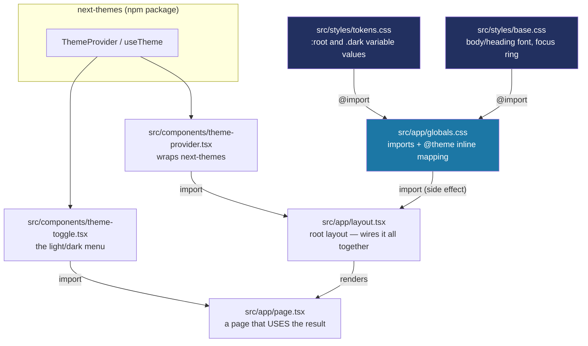
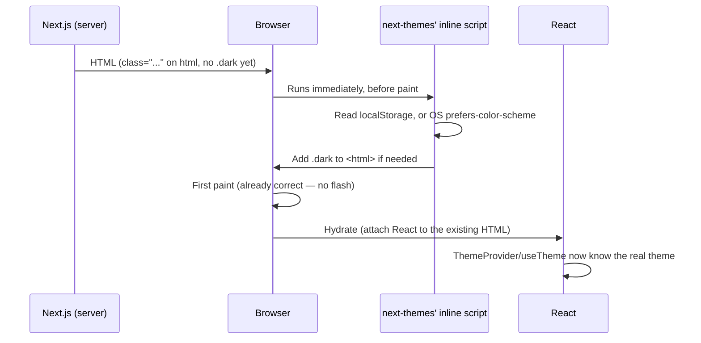
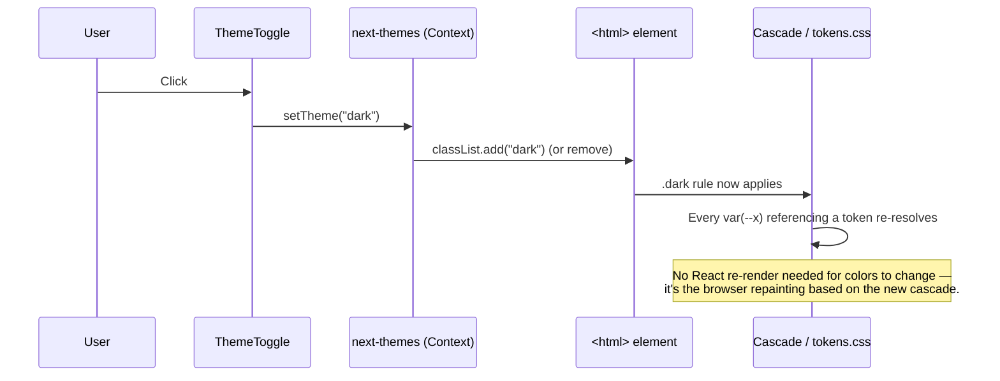
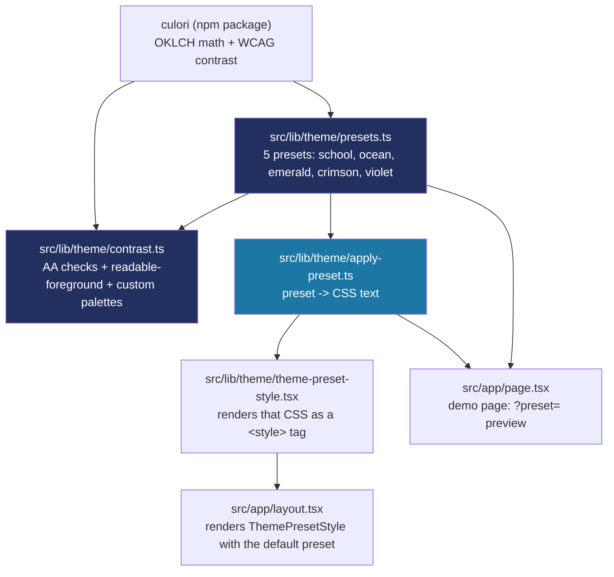
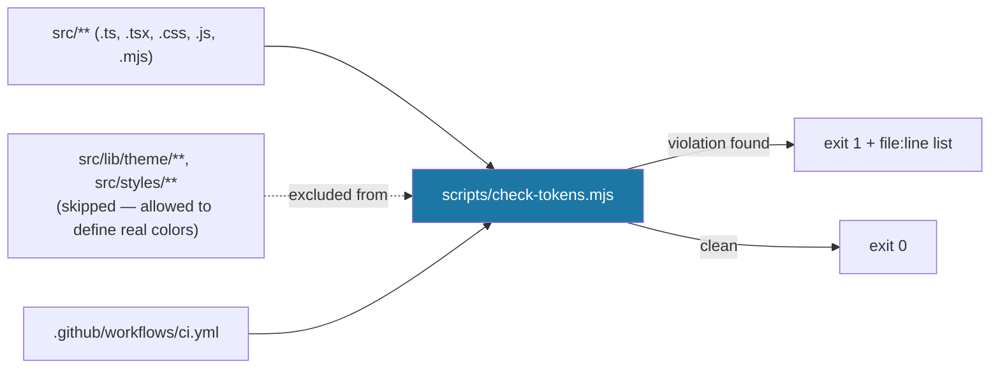
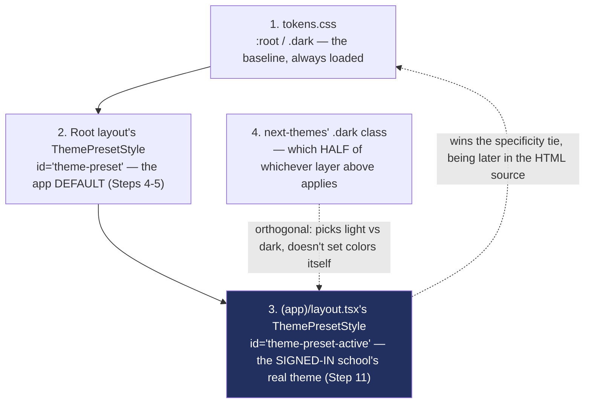
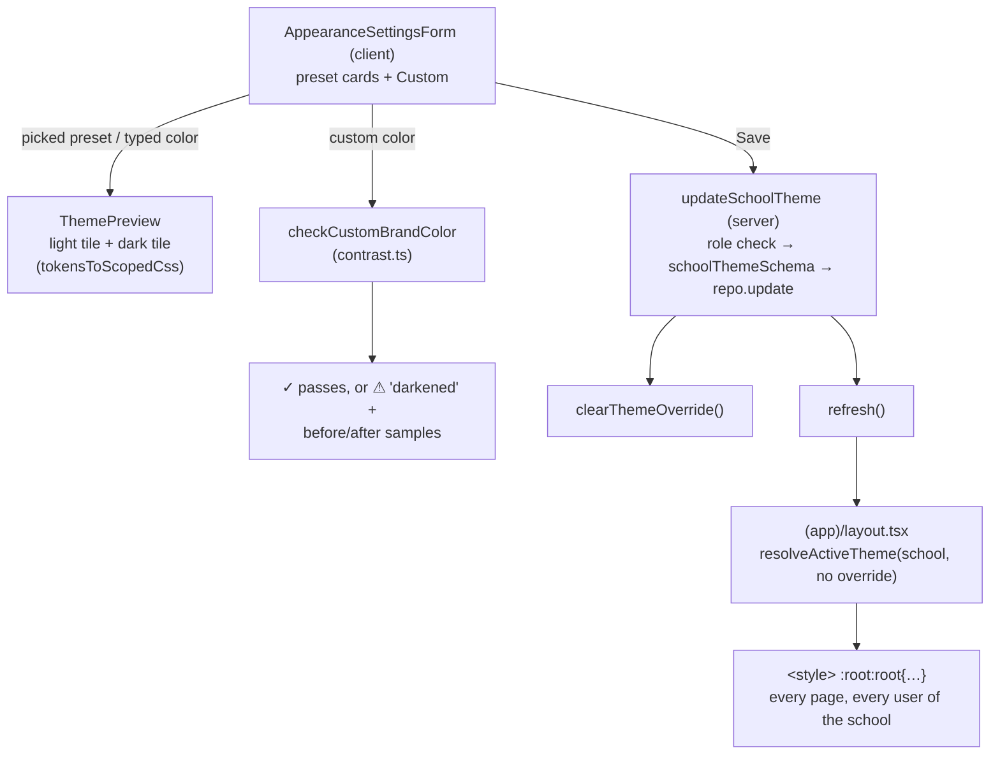

# How the styling system works

This is a from-scratch explanation of the token/theming code added in Step 4 — not just *what* files exist, but *how they connect* and *why*, so you can trace it yourself next time. `docs/BUILD-LOG.md` covers the decisions and debugging story for Step 4; this document is the reference for how the mechanism itself works, for whenever you need to add a token, use one in a new component, or just remember how the pieces fit.

**Interactive companion:** [Talaan Theme Layers](https://claude.ai/artifact/HWXYY2M2GwdxXAkY9djNwy) — a live, clickable version of the Step 5 explanation below (the override switch, the specificity trick, the file map), built with the project's real color values. Saved here so the link isn't only sitting in a chat.

**See also:** [`docs/COMPONENTS.md`](COMPONENTS.md) — the component library (shadcn/ui) built in Step 6 on top of this color system.

If you already know CSS custom properties (`var(--x)`) and how the CSS cascade picks a value when there are multiple candidates, skip to [The files, one by one](#the-files-one-by-one). If those two things are new to you, read the next section first — everything else is built on them.

## The two ideas everything else depends on

**1. A CSS custom property is just a named value that can change.** `--foreground: oklch(25.2% 0.061 262.8);` defines a variable called `--foreground`. Anywhere else in CSS, `color: var(--foreground)` means "use whatever `--foreground` currently is." The key word is *currently* — unlike a Sass variable (which gets baked into a fixed value when the stylesheet compiles), a CSS custom property is resolved live, in the browser, every time it's used. That's what makes it possible to change a value at runtime with no rebuild.

**2. The CSS cascade lets a *later* or *more specific* rule win.** If `:root { --foreground: navy; }` and, separately, `.dark { --foreground: white; }` both exist, an element only gets the `.dark` value if that element is actually inside something with `class="dark"` on it. No `.dark` ancestor → falls back to `:root`'s value. This is the entire mechanism dark mode uses: **the token names never change, only which rule currently applies to them.** Every component that says `bg-primary` or `text-foreground` is completely unaware of light/dark — it just asks for "primary" and the cascade decides which actual color that resolves to right now.

Everything below is just: where do `:root` and `.dark` get defined, how does Tailwind turn `--foreground` into a class you can write as `text-foreground`, and what decides whether `.dark` is present on the page.

## The files, one by one



Read that as: `tokens.css` and `base.css` are plain CSS with no Tailwind-specific syntax — `globals.css` is the one file that pulls everything together and is the only CSS file actually imported by any `.tsx` file (`layout.tsx`, line 4: `import "./globals.css"`). `theme-provider.tsx` and `theme-toggle.tsx` are separate from the CSS entirely — they're the *React* half, responsible for deciding whether `.dark` is on the page at all.

### 1. `src/styles/tokens.css` — the values

```css
:root {
  --background: oklch(97.5% 0.006 255.5);
  --foreground: oklch(25.2% 0.061 262.8);
  --primary: oklch(32.5% 0.087 268.9);
  /* ...more ... */
}

.dark {
  --background: oklch(19.8% 0.037 264.2);
  --foreground: oklch(95.1% 0.016 262.8);
  --primary: oklch(67.5% 0.081 231.4);
  /* ...more ... */
}
```

This file does exactly one job: define what each named token *is*, for two situations — the default (`:root`, meaning "no `.dark` class present anywhere above this element") and dark (`.dark`, meaning "this element is inside something with `class="dark"`"). Nothing here is Tailwind-specific — this would work in a plain HTML page with no build tool at all. It's also the *only* file allowed to contain a literal color value (`oklch(...)`), per CLAUDE.md's design-system rule — every other file references a token by name.

### 2. `src/styles/base.css` — using tokens on raw HTML elements

```css
body {
  background: var(--background);
  color: var(--foreground);
  font-family: var(--font-body);
}

h1, h2, h3, h4, h5, h6 {
  font-family: var(--font-heading);
}
```

This is where tokens actually get *applied* to something, for the handful of elements that need styling before any component even renders (the page background, default text color, heading font). Notice it already uses `var(--font-body)` — a token that doesn't exist yet in `tokens.css`. That's deliberate: `--font-body` and `--font-heading` are defined one file over, in `globals.css`, because they depend on values that only exist inside a React component (see the layout section below). CSS doesn't care which file a custom property was declared in, only that it's declared *somewhere* before it's used — the cascade doesn't see file boundaries, only the final combined stylesheet.

### 3. `src/app/globals.css` — the hub

```css
@import "tailwindcss";
@import "../styles/tokens.css";
@import "../styles/base.css";

@custom-variant dark (&:where(.dark, .dark *));

@theme inline {
  --color-background: var(--background);
  --color-primary: var(--primary);
  --font-heading: var(--font-lexend);
  /* ...more ... */
}
```

Three separate jobs happen in this one file:

- **`@import` lines**: pull in Tailwind itself, then our two plain-CSS files, in order. Order matters here the same way it would in any CSS file — later rules can override earlier ones.
- **`@custom-variant dark ...`**: this one line is *why* writing `dark:bg-card` in a component works at all. Tailwind v4 needs to be told what "dark mode" means for this project — by default it only knows about the OS-level `prefers-color-scheme` media query. This line teaches it a second definition: "anything matching `.dark` or a descendant of `.dark`." Since `next-themes` is the thing that actually adds `class="dark"` to `<html>`, this is the line that connects Tailwind's `dark:` prefix to next-themes' toggle.
- **`@theme inline { ... }`**: this is Tailwind-specific syntax (not plain CSS) and is the part that actually generates utility classes. `--color-primary: var(--primary);` tells Tailwind's build step "register a theme color named `primary`, and whenever you need its value, don't bake in a number — reference the `--primary` custom property live." That's what `inline` means here: without it, Tailwind would try to resolve `var(--primary)` to a fixed value at build time (which is wrong, since the real value depends on light/dark at *runtime*). With `inline`, Tailwind instead emits CSS like:
  ```css
  .bg-primary { background-color: var(--color-primary); }
  ```
  — a plain reference, which the browser resolves fresh every time, respecting whatever `:root`/`.dark` currently says `--background` (via `--color-background`) is. This is the exact mechanism that makes `bg-primary` "just work" in both modes with no extra code anywhere else.

Every color/font/duration token that needs a Tailwind utility class (`bg-*`, `text-*`, `font-*`, `duration-*`) has to be listed here. Radius (`rounded-*`) and shadow (`shadow-*`) utilities *don't* need to be listed here — Tailwind already ships default utilities under those exact names, and our `tokens.css` values for `--radius-sm`, `--shadow-sm`, etc. simply override Tailwind's built-in defaults through the ordinary cascade (our `:root` block loads after Tailwind's internal one). See `docs/BUILD-LOG.md`'s Step 4 entry for how that was confirmed rather than assumed.

### 4. `src/components/theme-provider.tsx` — deciding *whether* `.dark` exists

```tsx
"use client";
import { ThemeProvider as NextThemesProvider } from "next-themes";

export function ThemeProvider({ children, ...props }) {
  return (
    <NextThemesProvider attribute="class" defaultTheme="system" enableSystem {...props}>
      {children}
    </NextThemesProvider>
  );
}
```

This component doesn't touch any of our CSS. Its entire job is: (a) on first load, check the browser's saved preference (`localStorage`) or the OS-level setting if there's no saved preference (`defaultTheme="system"`, `enableSystem`), and (b) add or remove the literal string `"dark"` from `<html>`'s `class` attribute (`attribute="class"`) whenever the active theme changes. It's a thin wrapper around the real `next-themes` library only so the rest of the app imports one local, project-specific component instead of the library directly — if a default ever needed to change (say, `defaultTheme="light"` instead of `"system"`), there's exactly one place to do it.

The critical bit for "no flash of the wrong theme": `next-themes` injects a tiny `<script>` into the page that runs synchronously, before the browser paints anything, and sets the class immediately. That's a different, older technique than `useEffect` (which would run *after* the first paint and cause a visible flash) — see `node_modules/next/dist/docs/01-app/02-guides/preventing-flash-before-hydration.md` for Next.js's own explanation of exactly this problem, which `next-themes` implements for us.

### 5. `src/components/theme-toggle.tsx`: the menu that calls `setTheme`

Until Step 27.5 this was a plain text button that only appeared on `/design-system`. It's now a sun/moon icon that opens a three-option menu (Light, Dark, Match device), placed in the staff top bar, the parent portal header and the corner of the three login pages:

```tsx
"use client";
import { Monitor, Moon, Sun } from "lucide-react";
import { useTheme } from "next-themes";

const MODES = [
  { value: "light", label: "Light", Icon: Sun },
  { value: "dark", label: "Dark", Icon: Moon },
  { value: "system", label: "Match device", Icon: Monitor },
] as const;

export function ThemeToggle() {
  const { theme, setTheme } = useTheme();
  return (
    <DropdownMenu modal={false}>
      <DropdownMenuTrigger asChild>
        <Button variant="ghost" size="icon-lg" aria-label="Light or dark mode">
          <Sun className="dark:hidden" aria-hidden="true" />
          <Moon className="hidden dark:block" aria-hidden="true" />
        </Button>
      </DropdownMenuTrigger>
      <DropdownMenuContent align="end" className="w-44">
        <DropdownMenuLabel>Light or dark</DropdownMenuLabel>
        <DropdownMenuRadioGroup value={theme ?? "system"} onValueChange={setTheme}>
          {MODES.map(({ value, label, Icon }) => ( /* one radio item each */ ))}
        </DropdownMenuRadioGroup>
      </DropdownMenuContent>
    </DropdownMenu>
  );
}
```

The old version needed a `mounted` flag, because it read `resolvedTheme` to pick its label, and that value isn't known on the server. The new trigger avoids the problem entirely. It renders *both* icons and lets CSS pick one: `dark:hidden` on the sun, `hidden dark:block` on the moon. The server and the browser produce identical HTML, so there's nothing to mismatch and no flicker. The menu itself only renders when opened, by which time `theme` holds the saved choice.

`theme` is what the person *chose* (`"light"`, `"dark"` or `"system"`). `resolvedTheme` is what's actually showing. The radio group uses `theme`, so "Match device" stays ticked even while the device happens to be dark.

`useTheme()` is a React hook from `next-themes` that reads whatever `ThemeProvider` currently knows (it works via React Context — `ThemeProvider` is a *provider*, `useTheme()` is a *consumer*, standard React data-flow, nothing custom-built here). `setTheme("dark")` is the one function call that actually changes things: it updates `next-themes`' internal state, which re-runs the class-toggling logic from `theme-provider.tsx`, which adds/removes `.dark` on `<html>`, which changes which cascade rule wins in `tokens.css`, which changes what every `var(--...)` resolves to, which is why the whole page repaints — **no component other than this menu ever has to know a color changed.** That's the entire point of building it this way: color logic lives in exactly one place (the CSS), and React only ever flips a class name.

### 6. `src/app/layout.tsx` — where it all actually gets plugged in

```tsx
import { Atkinson_Hyperlegible, Lexend } from "next/font/google";
import { ThemeProvider } from "@/components/theme-provider";
import "./globals.css";

const lexend = Lexend({ variable: "--font-lexend", weight: [...] });
const atkinsonHyperlegible = Atkinson_Hyperlegible({ variable: "--font-atkinson", weight: [...] });

export default function RootLayout({ children }) {
  return (
    <html className={`${lexend.variable} ${atkinsonHyperlegible.variable} ...`} suppressHydrationWarning>
      <body>
        <ThemeProvider>{children}</ThemeProvider>
      </body>
    </html>
  );
}
```

This is the one file that touches nearly everything, so it's worth being precise about each piece:

- **`import "./globals.css"`** — this is what actually gets all of our CSS (tokens, base, Tailwind, the theme mapping) included in the app at all. Without this line, none of the other files would matter — nothing would load them.
- **`Lexend({ variable: "--font-lexend", ... })`** — `next/font/google` downloads the font at build time (self-hosted, per CLAUDE.md, so nothing is fetched from Google at runtime) and returns an object whose `.variable` property is a *CSS class name* that, when applied to an element, defines a `--font-lexend` custom property scoped to that element and its descendants. This is the missing piece from the `base.css` section above: `--font-lexend` and `--font-atkinson` are created here, by `next/font`, then consumed in `globals.css`'s `@theme inline` block (`--font-heading: var(--font-lexend)`), then finally used in `base.css` (`font-family: var(--font-heading)`). Three files, one chain.
- **`className={`${lexend.variable} ${atkinsonHyperlegible.variable} ...`}`** on `<html>` — this is what actually applies those two font classes, making `--font-lexend`/`--font-atkinson` available to the entire page (since `<html>` is the outermost element, every descendant inherits them).
- **`suppressHydrationWarning`** on `<html>` — tells React "don't panic if this element's attributes don't match between server and client." It's needed because `next-themes`' inline script (see above) edits `<html>`'s `class` attribute directly, outside of React's knowledge, before React ever hydrates. Without this, React would log a scary-looking warning about something that's actually working as intended.
- **`<ThemeProvider>{children}</ThemeProvider>`** — everything the app renders (every page, every future component) ends up *inside* this provider, which is what makes `useTheme()` available anywhere in the tree via React Context.

### 7. `src/app/page.tsx` — the payoff

```tsx
<div className="bg-primary text-primary-foreground">Primary</div>
```

This is the only file in the list that a typical new feature will actually touch day to day. It never imports any CSS file, never mentions light or dark, never imports `next-themes`. It just uses class names — `bg-primary`, `text-status-absent`, `shadow-md` — the same way you'd use any other Tailwind utility. All the machinery above exists so that this line can stay this simple.

## Two things happening at runtime, step by step

**On first page load:**


**When the toggle button is clicked:**


## Quick recipes

**I want to add a brand-new token** (say, a `--warning` color): add it to both `:root` and `.dark` in `tokens.css`, then add `--color-warning: var(--warning);` to the `@theme inline` block in `globals.css`. Now `bg-warning`/`text-warning`/etc. exist as utilities everywhere.

**I want to use an existing token in a new component**: just use the Tailwind utility (`bg-card`, `text-muted-foreground`, `border-border`, ...). Never write a hex/oklch value directly in a component — if the token you need doesn't exist yet, add it to `tokens.css` first (previous recipe).

**I want to change what a color actually looks like**: edit its value in `tokens.css` only (both `:root` and `.dark` if it should differ between modes). Never hunt through components — nothing outside `tokens.css` should contain a literal color.

**I want to know if something is using a raw color it shouldn't**: run `npm run check:tokens` (also runs in CI on every push). It scans everything under `src/` except `src/lib/theme/` and `src/styles/` for a raw hex/oklch/rgb/hsl literal or a Tailwind palette class (`bg-blue-500`) and fails with the exact file and line if it finds one. See the Step 7 section below for how it works.

**I want to check a theme change across every preset and every component before it ships**: visit `/design-system` (dev-only — 404s in a production build). See the Step 7 section below.

## Step 5: theme presets and the contrast helper

Step 4 (above) hardcoded exactly one theme — Balanga City NSHS's colors — directly into `tokens.css`. Step 5 turns "one fixed theme" into "swappable presets, checked for accessibility by a computer instead of eyeballed." Everything in this section is new; nothing from Step 4 changed.

### Why this was two separate steps, not one

It would have been possible to design all 5 presets and the accessibility checks before writing a single line of `tokens.css`. That wasn't done on purpose, for reasons worth writing down rather than leaving as an unexplained choice in `docs/PLAN.md`:

1. **Step 4 had to prove the *mechanism* works before Step 5 could add more *data* to it.** Before any theme can be swapped, something has to make *any* theme render correctly at all — the CSS custom properties, the Tailwind `@theme inline` mapping that turns `--primary` into a usable `bg-primary` class, and the `next-themes` toggle that flips `.dark` on `<html>`. That's real plumbing, with real ways to get it wrong (see Step 4's "Tailwind v4 mechanics worth knowing" note above — radius/shadow defaults, the `@custom-variant dark` line). Building that plumbing against a *single*, already-designed palette meant Step 4 could be checked with one simple, human-judgeable question: "does this look like the approved prototype?" If the plumbing and four new brand palettes had been built at the same time, a rendering bug and simply a bad color choice would have looked identical from the outside — much harder to tell apart, and much harder to review in one sitting.

2. **Step 4's one palette wasn't arbitrary — it was already hand-verified.** The `school` colors come from `design/school-portal-prototype.html`, a palette a human had already designed and checked for contrast before any of this project's code existed. Step 4 could lean on that: extract the values faithfully, confirm the extraction matches, done — see Step 4's "Computing exact colors instead of eyeballing them" note above, which checked contrast on the results but wasn't inventing new colors. Step 5's other four palettes (`ocean`, `emerald`, `crimson`, `violet`) don't have that luxury: nobody hand-designed and checked them first, so *before* they could be trusted, Step 5 had to build a system capable of checking any palette automatically.

3. **That's the real difference between the two steps, in one sentence:** Step 4 checked one palette's accessibility *by hand*, once, with a throwaway script written for that purpose and then discarded. Step 5 turned that manual, one-time check into `presets.test.ts` and `contrast.ts` — a permanent, automatic check that runs on every `npm run test`, for as many palettes as this project ever adds, forever. Step 5 couldn't have come *before* Step 4, because there was nothing yet to automate the checking *of* — Step 4 had to exist first to give the first real, trustworthy example to build the automated version against (and, per the bug story below, to give something to sanity-check the new automated system against: Step 5's `presets.test.ts` includes a check that `school`'s values still match `tokens.css` exactly, which only means something because Step 4's values were already known-correct).

4. This also matches how `docs/PLAN.md` is deliberately structured: each step is sized to be one thing the owner can review in one sitting (see `CLAUDE.md`'s step protocol — "Implement only that step... small enough for me to review in one sitting"). "Does dark mode work at all" and "are these four new brand colors both good-looking and provably accessible" are two different kinds of question, best reviewed and approved separately rather than bundled into one large, harder-to-audit change.



### Why OKLCH, not hex, for the token *values* themselves

Hex/RGB has no channel that matches how the eye actually perceives brightness — HSL's "lightness" comes closest but still lies (pure blue and pure yellow at the "same" HSL lightness look very different in brightness). OKLCH's `L` channel is *perceptually uniform*: `50%` means roughly the same perceived brightness regardless of hue. That property is the entire reason this step is straightforward to build correctly: "make this color pass 4.5:1 contrast" becomes "raise or lower one number," and "generate a palette from one brand color" becomes "vary lightness/chroma, keep the hue." Both are unreliable operations in raw hex/RGB. You can still *give* Claude a brand color as hex, same as CLAUDE.md's own `#223060` — it just gets converted to OKLCH once, the same way `tokens.css`'s values already were in Step 4.

### 1. `src/lib/theme/presets.ts` — the data

A `ThemePreset` has an `id`, a `name`, and `light`/`dark` objects covering only the *themed* color tokens (`background`, `foreground`, `card`, `primary`, `link`, `highlight`, `muted`, `accent`, `border`, `ring`, and each token's `-foreground` pair). Radius, shadow, motion and the four fixed status colors (present/late/absent/idle) are **not** here — they stay in `tokens.css`, identical across every preset, because CLAUDE.md is explicit that status colors are never themed.

`school`'s values are the literal strings already in `tokens.css` — picking it is provably a no-op. The other four (`ocean`, `emerald`, `crimson`, `violet`) are built with a small `oklchToken(lightness, chroma, hue)` helper that calls culori's `clampChroma` before formatting the CSS string. That clamping step matters for a subtle reason (see the next section) — a saturated color authored by hand can sit just outside what a screen can actually display, and a browser will silently render the nearest color it *can* display instead, which could be a slightly different color (and slightly different contrast ratio) than what was actually tested.

### 2. A real bug this step hit: rounding after clamping can un-clamp a color

The first version of `oklchToken` clamped chroma into gamut, then rounded the clamped numbers for a readable CSS string (`32.500000001% ` isn't a value a human should have to read). That rounding happened *after* clamping — which turned out to be backwards. Clamping finds the exact chroma that's on the boundary of what a screen can show; rounding that boundary value can round it *up*, past the boundary, right back out of gamut. `src/lib/theme/contrast.test.ts`'s `generateCustomPalette` test caught this for real (a generated color failed culori's own `displayable()` check), not hypothetically.

The fix, in `src/lib/theme/oklch.ts`'s `toOklchString()`: round lightness and hue *first*, clamp chroma *against those already-rounded numbers* (not the raw ones), then round the resulting chroma *down*, never up. Rounding down can only move a color further from the gamut boundary, never past it — so the exact string that gets written to the page is guaranteed displayable, not just the unrounded number that was checked before formatting.

### 3. `src/lib/theme/contrast.ts` — the AA checks

Three small, independent pieces, all built on culori:
- `contrastRatio(a, b)` / `meetsAA(ratio)` — WCAG's actual contrast formula, not an approximation.
- `pickReadableForeground(background, candidates)` — tries each candidate in order, falls back to whichever of pure black/white contrasts more if none pass. That fallback is provably always AA-safe: the worst case (black vs. white contrast tied) works out to about 4.58:1, just above the 4.5 threshold.
- `generateCustomPalette(brandColor)` — for a future "Custom brand color" picker (a later step): takes one color, derives a full light+dark token set from it, nudging any color that doesn't naturally pass AA (never just leaving it to fail), the same "adjust or reject" rule CLAUDE.md asks for.

`src/lib/theme/presets.test.ts` is what actually enforces "every preset passes AA" — it loops over all 5 presets, both modes, and every foreground/background pairing, and fails with the exact pairing and ratio if one doesn't clear 4.5:1. It also checks that `school`'s values still match `tokens.css`'s literal text, so the two files can't silently drift apart.

### 4. `src/lib/theme/apply-preset.ts` + `theme-preset-style.tsx` — applying a preset with no flash

`presetToCss(preset)` turns a preset into plain CSS text: `:root:root{...}.dark.dark{...}`. The doubled selector (`:root:root`, not `:root`) is deliberate — it still matches the exact same `<html>` element, but raises the CSS specificity just enough to reliably beat `tokens.css`'s own plain `:root`/`.dark` rules, regardless of which stylesheet the browser happens to parse first. `<ThemePresetStyle presetId={...} />` renders that text as a `<style>` tag, and `layout.tsx` places it as the first thing inside `<body>`, before `<ThemeProvider>` — the same place `next-themes`' own flash-prevention script already lives (Step 4).

This needs no client-side script, unlike the light/dark toggle. Light/dark depends on a value only the *browser* knows (a saved preference in `localStorage`), so the server has to guess and a script corrects it before paint. A theme preset, in Phase 1, has no such gap — `DEFAULT_THEME_PRESET_ID` is a plain constant the server already knows when it renders the page, so there's nothing to patch after the fact.

**Step 11 update — a second `<ThemePresetStyle>`, not a changed prop on this one.** This section originally said a later step would "pass a real preset id into the same component instead of the hardcoded default." That's not quite what happened, once a real session/school existed to resolve a theme from — see the Step 11 section below for why, and for `ThemePresetStyle`'s actual current prop (`tokens`, not `presetId`).

### 5. `src/app/page.tsx` — a temporary way to see every preset

The demo page reads `?preset=` from the URL (only a `page.tsx` can do this — a `layout.tsx` never receives search params) and recolors just its own content via a scoped `<style>` block (`presetToScopedCss`), never touching `<html>`. Visit `/?preset=ocean` (or `emerald`/`crimson`/`violet`) to see any preset, in either light or dark mode via the existing toggle. This is explicitly a **Step 5 verification aid** — a real preset picker (a dropdown, then a full settings page) is later-step work; this one exists only so the presets can be checked in a browser today.

## Step 7: the style guide page and `check:tokens`

Step 4 built the mechanism, Step 5 added swappable data, Step 6 added a component library on top. Step 7 adds the two things that make sure all of that stays correct as the app grows: a page to actually *look* at every token and component together, and a script that enforces "no raw colors" automatically instead of relying on someone noticing during review.

### `/design-system` — reusing Step 5's mechanism, not a new one

`src/app/design-system/page.tsx` is deliberately built from pieces that already existed rather than inventing new theming machinery:

```tsx
export default async function DesignSystemPage({ searchParams }: PageProps<"/design-system">) {
  if (process.env.NODE_ENV === "production") {
    notFound();
  }
  const params = await searchParams;
  const preset = getThemePreset(typeof params.preset === "string" ? params.preset : undefined);
  const previewCss = presetToScopedCss(preset, PREVIEW_SELECTOR);
  // ...renders <style>{previewCss}</style>, a preset switcher, ThemeToggle,
  // and <StyleGuideContent /> (src/app/design-system/_components/) inside
  // a div carrying PREVIEW_SELECTOR's data attribute.
}
```

This is exactly the Step 5 demo page's `?preset=` + `presetToScopedCss` trick (see section 5 above), just promoted from "temporary verification aid" to "the permanent, dev-only style guide," with a bigger gallery (radius/elevation/motion tokens, and component *states* like disabled and invalid, not just one example of each). Color mode still comes from the real `ThemeToggle` — there's no separate light/dark switch on this page.

**Why not show every preset's light and dark side by side at once?** That was the first idea, and it doesn't actually work cleanly: Tailwind's dark-mode rule (`@custom-variant dark (&:where(.dark, .dark *));`, section 3 above) matches *any* descendant of *any* `.dark`-classed ancestor, with no way to opt a nested subtree back out. A "light-forced" panel nested anywhere under the real `<html class="dark">` would still be a structural descendant of `.dark` — so while its CSS-variable colors could be forced light directly, any component using a `dark:`-specific utility class (like the outline Button's `dark:bg-input/30` — a bonus rule layered on top of the token colors, not derived from them) would still pick that up, since Tailwind's selector-matching can't be told "except this branch." One active preset+mode at a time, controlled by the same real `ThemeToggle` and `<html>` state the rest of the app uses, has no such gap — it's not a simulation, it's the real thing.

**Why `notFound()` in the component body, not routing config:** a `middleware.ts` rule or a build-time route exclusion would also work, but both are *external* to the page — someone could refactor routing later and silently bring the page back in production without ever touching `design-system/page.tsx` itself. Checking `process.env.NODE_ENV` at the top of the page means the guard travels with the file; deleting or editing the page is the only way to change its production behavior.

### `scripts/check-tokens.mjs` — a plain-text scan, not a linter plugin

This is a small standalone Node script (same style as `scripts/progress.mjs`), not an ESLint rule — no new dependency needed for something this targeted. It walks every `.ts`/`.tsx`/`.css`/`.js`/`.mjs` file under `src/`, skips `src/lib/theme/` and `src/styles/` (the files CLAUDE.md's design-system rule 7 explicitly allows to contain real color values), and flags two things line by line:

1. **A color literal**: a hex code, or `rgb()`/`hsl()`/`oklch()`/etc. called with a literal number right after the paren (`\b(?:rgb|rgba|hsl|hsla|oklch|oklab|lab|lch)\(\s*[\d.]`). That last part matters — `color-mix(in oklch, var(--secondary), ...)` (used by `button.tsx`'s outline variant, as an arbitrary Tailwind value: `in_oklch,var(...)`) contains the word "oklch" but never has a `(` immediately after it, so it correctly doesn't match; it's referencing a color *space* to interpolate in, not hardcoding a color.
2. **A Tailwind built-in palette class**: `bg-blue-500`, `text-emerald-600`, and every other `<prefix>-<palette-name>-<shade>` combination Tailwind ships by default. This is a plain naming pattern, easy to enumerate, and doesn't need to inspect what a class actually resolves to.

Run with `npm run check:tokens`; it's also a CI step (`.github/workflows/ci.yml`, right after Lint) so a raw color can't merge even if nobody happens to look at the diff. It exits non-zero with a `file:line` list on any hit, and prints a clean pass message otherwise. Checked against the whole codebase as it stood before this step existed: zero violations — confirming the patterns aren't accidentally too strict before trusting them to gate CI.

**Step 8 update — `schemas.ts` files are exempt too, not just the theme files.** CLAUDE.md's actual rule is "no raw colors... *in components or pages*" — Step 8 added `School.theme`'s `"custom"` variant, where a school types in one real brand color (a hex string) as plain domain *data*, validated by `src/features/schools/schemas.ts`. That's not a hardcoded styling choice, it's the literal thing being modeled, so `check-tokens.mjs` now also skips any file matching `schemas.ts`/`schemas.test.ts` — these never render anything, the same reasoning that exempts `src/lib/theme/`. Everything else (components, pages) is still checked exactly as before.



## Step 11: a fourth override layer — the signed-in school's real theme, and a live preview on top

Steps 4-7 built a mechanism that could only ever show one preset: whatever `DEFAULT_THEME_PRESET_ID` says, because there was no session yet to ask "whose theme is this?" Step 11 is the step where a real session (`getSession()`, Step 9) and a real school record finally exist at the same time as the theming mechanism — so this is where "each school's own saved theme" and "a live preview dropdown" actually plug in.

### The three-layer stack becomes four



Layer 3 is new, and it's deliberately *not* a change to layer 2's component — it's a second instance of the exact same `ThemePresetStyle`, rendered from `src/app/(app)/layout.tsx` instead of the root layout. Both use the identical `:root:root`/`.dark.dark` doubled-selector trick (see the Step 5 section above), so both have identical CSS specificity — and when two rules tie on specificity, the one *later in the HTML source* wins. Because `(app)/layout.tsx` renders inside `{children}` in the root layout, its `<style>` tag always comes after the root's, so every page inside the shell gets the school's real theme, while `/` and `/design-system` (outside the shell, which never render `(app)/layout.tsx`) keep just the plain default from layer 2, untouched.

This is why **the root layout needed zero changes** for Step 11 (only its one `ThemePresetStyle` call site was updated to match that component's new prop, below) — the actual "which school, which theme" decision lives entirely in `(app)/layout.tsx`, where the session already is.

### `ThemePresetStyle`'s prop changed from `presetId` to `tokens`

```tsx
// src/lib/theme/theme-preset-style.tsx
export function ThemePresetStyle({
  tokens,
  id = "theme-preset",
}: {
  tokens: { light: ThemeColorTokens; dark: ThemeColorTokens };
  id?: string;
}) {
  return <style id={id} dangerouslySetInnerHTML={{ __html: presetToCss(tokens) }} />;
}
```

Steps 4-5 gave it a `presetId: string` and had it look the preset up internally — fine when the only possible source was `getThemePreset()`. Step 11 needed to feed it a school's *custom* brand-color palette too (`generateCustomPalette`, built in Step 5 but unused until now), which isn't a named preset at all. Rather than teach the component every possible source, it now just takes the already-resolved `{ light, dark }` tokens — the *caller* decides where those came from. `presetToCss` needed the same widening, from `(preset: ThemePreset)` to `(tokens: { light, dark })`, since it only ever read those two fields anyway.

### `src/lib/theme/active-theme.ts` — "what theme is on screen right now"

```ts
export function resolveSchoolTheme(theme: SchoolTheme): ResolvedTheme {
  if (theme.kind === "custom") {
    return generateCustomPalette(theme.brandColor);
  }
  const preset = getThemePreset(theme.presetId);
  return { light: preset.light, dark: preset.dark };
}

export function resolveActiveTheme(school: School | null, overridePresetId?: ThemePresetId): ResolvedTheme {
  if (overridePresetId) {
    const preset = getThemePreset(overridePresetId);
    return { light: preset.light, dark: preset.dark };
  }
  if (school) return resolveSchoolTheme(school.theme);
  return resolveSchoolTheme({ kind: "preset", presetId: DEFAULT_THEME_PRESET_ID });
}
```

`resolveSchoolTheme` is the first real caller of `generateCustomPalette` outside its own unit test — a school's `theme` field (Step 8) is a discriminated union (`{kind: "preset", presetId}` or `{kind: "custom", brandColor}`), and this is where that union finally gets resolved into actual colors. `resolveActiveTheme` layers the live preview override on top: override wins if one is set, otherwise the school's own theme, otherwise the app default (a super admin with no school in view). `(app)/layout.tsx` calls this once per request and hands the result straight to layer 3's `ThemePresetStyle`.

### The live preview: a cookie, not a database write

The top-bar theme dropdown (`src/components/app-shell/theme-dropdown.tsx`, principal/super admin only) recolors everything instantly, but **on purpose doesn't save anything to the school record** — that's Step 21's job. It sets a plain per-browser cookie instead:

```ts
// src/lib/theme/theme-override-actions.ts — "use server" at the top of the file
export async function setThemeOverride(presetId: ThemePresetId): Promise<void> {
  const session = await getSession();
  if (session.role === "teacher") throw new Error("Teacher accounts can't change the theme.");
  const cookieStore = await cookies();
  cookieStore.set(THEME_OVERRIDE_COOKIE, presetId, { httpOnly: true, sameSite: "lax", path: "/" });
}
```

No flash, and no client-side script needed to apply it — per Next's own Server Actions docs, *"Mutates cookies through `cookies()`... Setting or deleting a cookie automatically re-renders the current page."* Setting the cookie is itself what triggers the server to re-render with the new theme in the very same round trip; nothing about the flash-prevention story from Steps 4-5 had to change.

**A real bug this step hit, and the fix that came out of it:** the natural first instinct was to have `setDevSession` (the dev switcher's persona-switch action, Step 9/11) call `clearThemeOverride()` directly, so switching persona always resets the preview. That would have made `session.ts` import from `theme-override-actions.ts`, which already imports `getSession` *from* `session.ts` for the check above — the two files would import each other. Fixed by keeping `clearThemeOverride` as its own independent Server Action instead, called as a second step right after `setDevSession` from the dev switcher's own click handler (`src/components/app-shell/dev-switcher.tsx`), not from inside `setDevSession` itself. Same end result (persona switch always clears the preview), no cycle.

**Another one, easy to miss until the build actually fails:** a Server Action that a *Client Component imports directly* (not just receives as a prop from a Server Component) must live in a file with `"use server"` at the **top of the file**, not inline inside the function. Inline placement (the pattern `session.ts`'s `setDevSession` used to use, back in Step 9, before it moved to its own file) only works for an action a Server Component defines and passes *down* as a prop — a different call shape than a Client Component reaching up and importing the function by name. Got this wrong on the first pass (moved `setDevSession` to its own file but kept theme-override's actions inline), and `npm run build` failed immediately with a clear "depends on next/headers... in the Pages Router" error pointing at the exact import chain — Turbopack couldn't cleanly split the client-safe reference from the rest of the module. Fixed by giving every Server Action a Client Component imports directly its own dedicated file (`session-actions.ts`, `theme-override-actions.ts`), with the file-level directive — see `docs/BUILD-LOG.md`'s Step 11 entry for the full trace.

## Quick recipes (Step 11 additions)

**I want to know what theme is actually showing right now, given a school and a possible preview override:** `resolveActiveTheme(school, overridePresetId)` (`src/lib/theme/active-theme.ts`) — pure function, no React needed.

**I want to add a Server Action a Client Component will import directly:** give it its own file with `"use server"` on the very first line, not inline inside the function — see `session-actions.ts` or `theme-override-actions.ts` for the pattern. Inline `"use server"` is only for an action a Server Component defines locally and passes down as a prop.

**I want to preview a theme without saving it anywhere:** that's exactly what `setThemeOverride`/the top-bar dropdown already do — a cookie, not a repository write. Don't add a `SchoolRepository.update` method for this; that belongs to Step 21, when there's an actual "Save" action to attach it to.

## Step 26: Appearance settings — saving a theme to the school record

Step 11 left one thing unfinished: the top-bar dropdown could only *preview* a theme (a cookie, per browser). Step 26 adds the real, saved version on **Settings > Appearance**, where a principal or super admin picks a preset or a custom brand color and saves it to the school record. Everyone at that school gets it on their next page load, because `(app)/layout.tsx` already renders `resolveActiveTheme(school, override)` on every request (Step 11). No new rendering mechanism was needed. Step 26 only adds a way to *write* `school.theme`.



### The preview: two tiles, each with its own copy of the variables

`src/features/schools/theme-preview.tsx` draws the same small sample screen twice. Each tile has its own scoped copy of one mode's tokens, from a new helper in `apply-preset.ts`:

```ts
export function tokensToScopedCss(tokens: ThemeColorTokens, selector: string): string {
  return `${selector}{${declarationsFor(tokens)}}`;
}
```

`presetToScopedCss` (Step 5) always pairs light with a `.dark` variant, so a tile using it follows the page's own mode. The dark tile needs to stay dark even when the page is light, so each tile uses a plain single-mode selector (`[data-theme-preview-tile="dark"]`).

**The rule that makes the tiles work:** every element in a tile sets its own color utility (`text-foreground`, `text-card-foreground`…) instead of inheriting one. A CSS variable is resolved *where the property is declared*. If the tile simply inherited `color` from the page, the page would have already turned `var(--foreground)` into the page theme's color, and the tile's own variables would be ignored.

`presetToScopedCss` also now accepts any `{ light, dark }` pair, not only a named preset, so the "Custom" gallery card's swatch can show a palette generated while the user is typing.

### The contrast check: correct and say so, reject only what isn't a color

`generateCustomPalette` (Step 5) already guarantees AA by nudging lightness. Step 26 adds a reporting helper so the correction is visible to the principal:

```ts
// src/lib/theme/contrast.ts
export function checkCustomBrandColor(brandColor: string): CustomBrandColorCheck {
  const brand = parseOklch(brandColor);
  const { light } = generateCustomPalette(brandColor);
  const button = parseOklch(light.primary);
  return {
    buttonColor: light.primary,
    buttonTextColor: light.primaryForeground,
    ratio: contrastRatio(light.primary, light.primaryForeground),
    adjusted: Math.abs(brand.l - button.l) > VISIBLE_LIGHTNESS_CHANGE,
  };
}
```

- **Invalid text** (`#12`, `blue`) is **rejected**: `schoolThemeSchema`'s hex regex, shown inline, blocks Save. The same schema runs again in `updateSchoolTheme` on the server.
- **A valid but too-light color** (the highlight yellow `#F9E321`, pure white) is **corrected, not rejected**: buttons use a darker shade of the same hue, and the form shows "Your color" next to "Buttons use" with the real contrast ratio. `adjusted` compares OKLCH *lightness* only, because lightness is what `nudgeLightnessUntilReadable` changes.

### The top-bar dropdown now has a "Saved theme" option

Before Step 26 the dropdown's value was always one of the five preset ids. That broke once a school could save a custom color: the dropdown showed "School colors" while a completely different palette was on screen. Its value is now a `ThemeSelection`:

```ts
// src/lib/theme/presets.ts
export type ThemeSelection = ThemePresetId | "saved";

// src/app/(app)/layout.tsx
const themeSelection = overridePresetId ?? (school ? "saved" : DEFAULT_THEME_PRESET_ID);
```

Choosing "Saved theme" calls `clearThemeOverride()`, which removes the preview. The `school` preset option is now just "School", its own name, since "School colors" wrongly suggested "whatever this school saved". A super admin with no school in view has nothing saved, so that option is hidden for them.

Saving on Settings > Appearance **also clears the preview cookie**. Otherwise a principal who previewed Violet in the top bar and then saved Ocean would still see Violet, and would reasonably think the save had failed.

## Quick recipes (Step 26 additions)

**I want to show a theme's light and dark look side by side, whatever mode the page is in:** `tokensToScopedCss(theme.light, sel1) + tokensToScopedCss(theme.dark, sel2)`, and give every element inside an explicit color utility. See `theme-preview.tsx`.

**I want to know whether a custom brand color will be changed before it is used:** `checkCustomBrandColor(hex).adjusted`, with `.buttonColor` for what buttons will actually use.

**I want to change a school's saved theme from code (a seed, a test):** `schoolRepository.update({ ...school, theme: { kind: "custom", brandColor: "#…" } })`. Nothing else needs to change; the layout resolves it on the next request.
