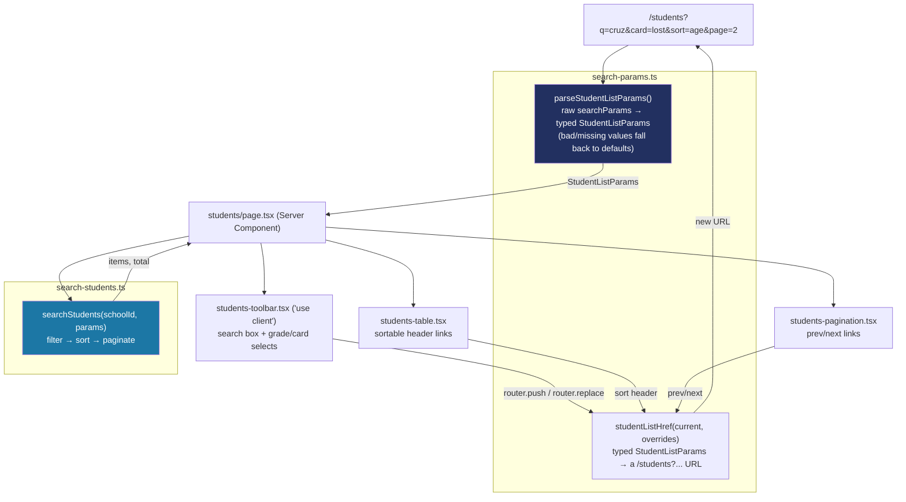

# How a searchable, sortable, paginated list works

Step 14 built the Students list, the first screen with real search, filters, sorting and pagination. CLAUDE.md's UX bar requires all of that to live in the URL — "server-driven search, filter, sort and pagination kept in the URL, so pages are shareable and the back button works" — so this document explains the one mechanism behind it, since Step 17 (Attendance) and any future list screen reuse the exact same shape.

**Not a new front-end trick.** This is the oldest pattern on the web: the page's state lives in the URL, the server reads it and renders the right page, and links change it. No client-side table state, no "hydrate then refetch" — a plain `GET /students?grade=8&sort=age` request already returns the fully-filtered, fully-sorted, correct page.

## The shape of it



Every piece of state — the search text, the grade filter, the card-status filter, which column is sorted and which direction, the page number — lives in exactly one place: the URL query string. Nothing is held in React state that the URL doesn't already know, other than the search box's own in-progress keystrokes (see below).

## Why changing a page, filter or sort shows a brief loading state

Every navigation described above — a sort-header click, a filter change, a pagination arrow — is a genuine new request to the server, not a script re-filtering data the browser already has. Nothing here loads the whole student roster into the browser up front; each request only ever gets back the one page of (up to 10) students it asked for. This is what actually lets the same code work for a school of 36 students today and a school of several hundred once Phase 2 replaces the mock data with a real database — nobody's browser ever holds more student data than the one page currently on screen.

That's also why clicking "Next" isn't instant. Two things add up into the small pause you'll see:

1. **The round trip itself.** A Server Component re-runs on the server for every new URL — `searchStudents()` runs again, taps are re-fetched, the page re-renders — then the result is sent back down, same as any ordinary link click on any website.
2. **A deliberate, simulated delay.** Every mock repository call (`src/data/repositories/latency.ts`, added in Step 9) waits roughly 150ms before answering, even though the underlying "database" is really just an in-memory array that could answer instantly. This exists so that no code here can silently assume data arrives immediately — a real database call over a real network never does, and code that got away with skipping an `await` against an instant mock would only surface as a bug once Phase 2 swapped in the real thing.

Next.js shows the nearest `loading.tsx` automatically while a navigation is waiting on data — that's the skeleton you see flash in. It's the same generic one every route in the app shares (`src/app/(app)/loading.tsx`), not something built specifically for this table.

## Parsing: never trust the URL, never throw

```ts
// search-params.ts
export function parseStudentListParams(raw: Record<string, string | string[] | undefined>): StudentListParams {
  const rawGrade = firstValue(raw.grade);
  const gradeNumber = rawGrade === undefined ? undefined : Number(rawGrade);
  const grade =
    gradeNumber !== undefined && GRADE_LEVELS.includes(gradeNumber as GradeLevel)
      ? (gradeNumber as GradeLevel)
      : DEFAULT_PARAMS.grade;
  // ...same defensive pattern for q, card, sort, dir, page
}
```

A URL is user-editable text — a bookmark, a typo, someone hand-editing `?page=abc`. Every field here falls back to a sane default instead of throwing, so a bad URL just behaves like the plain "show everything" view rather than crashing the page. `search-params.test.ts` checks this directly: out-of-range grades, a garbage sort field, `page=0`, `page=1.5`.

## Building links: only non-default values show up in the URL

```ts
export function studentListHref(current: StudentListParams, overrides: Partial<StudentListParams> = {}): string {
  const merged: StudentListParams = { ...current, ...overrides };
  const search = new URLSearchParams();
  if (merged.q !== DEFAULT_PARAMS.q) search.set("q", merged.q);
  // ...same for grade, card, sort, dir, page
  const query = search.toString();
  return query ? `/students?${query}` : "/students";
}
```

Every link on the page — a sort header, a pagination arrow, a filter select — is built by taking the *current* params and overriding just the one or two fields that link changes. Clicking "Age" keeps the current search text and grade filter, but changes `sort` (and resets `page` back to 1, since the result set's order changed). This is why the plain list has no query string at all, and why the URL only ever grows as long as the query text needed to describe it.

## Sorting and pagination need no client JavaScript at all

`students-table.tsx`'s column headers and `students-pagination.tsx`'s prev/next arrows are plain `<Link>`s built with `studentListHref`. Clicking one is a real navigation to a new URL, which the Server Component re-renders from scratch. No `onClick`, no client-side sort logic, nothing to hydrate — the exact same mechanism as any other link on the web, which is also why it keeps working with JavaScript disabled and why the back button "just works": every click is a real history entry (see below for the one exception).

## The one place that *does* need a client component: the search box

Typing into a search box can't be plain `<Link>`s — it needs to react to every keystroke. `students-toolbar.tsx` is a small `"use client"` component that:

1. Keeps the in-progress text in local `useState`, separately from the URL, so the input doesn't lag behind typing while waiting for the server.
2. Debounces 300ms after the last keystroke, then calls `router.replace(studentListHref(...))` — **`replace`, not `push`** — so the URL updates without creating a new browser-history entry for every letter typed. Typing "cruz" doesn't leave the back button stepping through "c", "cr", "cru", "cruz".
3. The grade and card `<Select>`s use `router.push` instead — each one is a deliberate, complete change, so it's worth a real back-button stop.

```ts
useEffect(() => {
  if (query === params.q) return;
  const timeout = setTimeout(() => {
    router.replace(studentListHref(params, { q: query, page: 1 }));
  }, 300);
  return () => clearTimeout(timeout);
}, [query]);
```

**Syncing the box when the URL changes from elsewhere** (the back button, a sort-header click) uses a different technique on purpose: not a second `useEffect` that calls `setQuery`, but React's documented "adjust state during render" pattern —

```ts
const [syncedQuery, setSyncedQuery] = useState(params.q);
if (params.q !== syncedQuery) {
  setSyncedQuery(params.q);
  setQuery(params.q);
}
```

Calling `setState` synchronously inside a `useEffect` body is flagged by this project's lint rules (`react-hooks/set-state-in-effect`) because it causes an extra cascading render; adjusting state directly during render, guarded by a comparison, is the pattern React's own docs recommend for exactly this "reset state when a prop changes" case, and it's one render cheaper.

## Filtering and sorting: composed in one tested function, not in the page

Card status (`active`/`lost`/`none`) isn't a field on `Student` — it's derived from a student's `Card` history (`card-status.ts`'s `deriveCardStatus`), which means filtering or sorting by it needs a join across two repositories. `search-students.ts`'s `searchStudents()` does that composition once — `StudentRepository.listBySchool` plus one `CardRepository.listByStudent` call per matching student (the same "one small lookup per student rather than reshaping the repository interface" precedent the dashboard set in Step 13, see `docs/DATA-ACCESS.md`) — then runs the pipeline: teacher restriction → text query → grade → card status → sort → paginate.

It's a plain, dependency-injectable async function (`search-students.test.ts` passes small fixture repositories instead of the real 72-student seed), not a React component — so the query/filter/sort/paginate logic can be fully unit-tested without a browser.

## Quick recipes

**I want to add a new filterable, sortable, paginated list** (Step 17's Attendance page is the next one): copy this shape — a `parse*ListParams`/`*ListHref` pair in a `search-params.ts`, a plain composed-and-tested `search*.ts` function, a `"use client"` toolbar for any free-text input, and Server-Component-rendered `<Link>`s for everything else (sort headers, pagination). Don't reuse `search-params.ts` itself — it's typed specifically to Students' fields; a new list gets its own small typed module the same shape.

**I want to add a new sortable column:** add the field to `StudentSortField` in `search-params.ts`, add a `case` to `compareRows` in `search-students.ts`, and use `<SortableHeader field="..." label="..." params={params} />` in `students-table.tsx`.

**I want to add a new filter:** add the field (and its default) to `StudentListParams`/`DEFAULT_PARAMS`, parse it defensively in `parseStudentListParams`, apply it as another `.filter()` step in `searchStudents`, and add a control to `students-toolbar.tsx` (a `<Select>` if it's push-on-change, or follow the search box's debounce pattern if it's free text).

**I want to know why a filter/sort/page change didn't show up after I clicked it:** check whether the link was built with `studentListHref` (which always keeps every other current param) rather than a hand-written `href="/students?..."` — a hand-written one silently drops whatever else was set.
