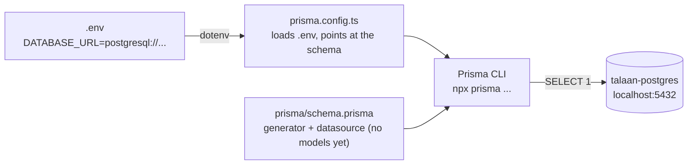

# Step 31: Install Prisma and connect it to the database

## Why

Step 30 gave you a running Postgres. Your Next.js code still can't talk to it. You could write raw SQL strings by hand (`SELECT * FROM ...`), but then TypeScript has no idea what comes back, and a typo in a column name only shows up when a user hits that page.

**Prisma** is an ORM (object-relational mapper). It solves that in three parts, and this step installs the first one:

1. **The Prisma CLI** (this step) reads your config, connects to the database, and later creates tables for you (migrations, Step 32).
2. **The schema file** (`prisma/schema.prisma`, started in this step) describes your tables in one readable file. It's the single source of truth for the database's shape.
3. **Prisma Client** (Step 33) is TypeScript code generated *from* that schema, so `prisma.school.findMany()` is fully typed.

This step only proves the CLI can reach the database. There are no tables yet.



**Prisma 7 changed how setup works.** Most tutorials online are for Prisma 5 or 6. Three differences matter here:
- The database URL now lives in `prisma.config.ts`, not in `schema.prisma`.
- Prisma no longer reads `.env` by itself. The config file loads it with `dotenv`.
- The generated client is written into your own project folder (you choose where), not hidden inside `node_modules`.

## What you'll need

- Step 30 done: `docker ps` shows `talaan-postgres` as `Up`, and `.env` has `DATABASE_URL`.
- About 10 minutes.

## Steps

### 1. Make sure the database is running

```bash
docker start talaan-postgres
docker ps
```

`docker start` does nothing if it's already running, so it's safe to run every time.

### 2. Install the Prisma CLI and dotenv

```bash
npm install --save-dev prisma@7 dotenv
```

**Why each part:**
- `prisma` is the command-line tool. It's a **dev dependency** (`--save-dev`): you use it while developing and building, and the running app never imports it.
- `@7` is important. On 2026-10-05, npm's `latest` tag for `prisma` points at **8.0.0-rc.19**, a *release candidate* (a test version), while every other Prisma package is still on 7.10.0. A plain `npm install prisma` would give you a mismatched CLI. `@7` means "the newest 7.x".
- `dotenv` reads `.env` into `process.env`. Next.js does this for the app automatically, but the Prisma CLI runs outside Next.js, so it needs `dotenv`.

Check the version:

```bash
npx prisma --version
```

The first line should say `prisma : 7.10.0` (or a later 7.x).

`npm install` may print "N vulnerabilities". The 9 high ones in the `braces` chain were already there before this step (see `docs/BUILD-LOG.md`, "Before Step 30"). **Never run `npm audit fix --force`**: it downgrades packages.

### 3. Don't run `npx prisma init`

Most guides start with `npx prisma init`. In 7.10 it does more than set up Prisma. It also writes a `.env` with a different, Prisma-hosted database URL, edits `.gitignore`, and installs AI-assistant "skill" folders into `.claude/`, `.agents/` and `.windsurf/`. You only need two small files, and writing them yourself teaches you what each line does.

### 4. Create `prisma/schema.prisma`

Create a folder `prisma` in the project root, and in it a file `schema.prisma`:

```prisma
generator client {
  provider = "prisma-client"
  output   = "../src/generated/prisma"
}

datasource db {
  provider = "postgresql"
}
```

**Why each part:**
- `generator client`: what Prisma should *generate* from this file. `prisma-client` is the Prisma 7 generator, which writes plain TypeScript files. (The old `prisma-client-js` is deprecated, and you'll see it in older tutorials.)
- `output = "../src/generated/prisma"`: where those files go. The path is relative to this schema file, so `..` goes up to the project root and then into `src/generated/prisma`. Code will import from `@/generated/prisma/client`. Nothing is generated yet; that's Step 33.
- `datasource db { provider = "postgresql" }`: which kind of database. There's no `url` here any more; in Prisma 7 that moved to the config file.

VS Code tip: install the **Prisma** extension (by Prisma) for colors and formatting in `.prisma` files.

### 5. Create `prisma.config.ts`

In the project root (next to `package.json`):

```ts
import "dotenv/config";
import { defineConfig } from "prisma/config";

export default defineConfig({
  schema: "prisma/schema.prisma",
  migrations: {
    path: "prisma/migrations",
  },
  datasource: {
    url: process.env.DATABASE_URL,
  },
});
```

**Why each line:**
- `import "dotenv/config";` loads `.env` before anything else, so `process.env.DATABASE_URL` has a value.
- `schema` and `migrations.path` tell the CLI where the schema lives and where Step 32's migration files will go.
- `url: process.env.DATABASE_URL` is the connection string from Step 30.

**Why not Prisma's `env("DATABASE_URL")` helper?** You'll see it in Prisma's docs. It throws an error when the variable is missing, and that includes `prisma generate`, which doesn't even need a database. On a fresh clone or in CI (no `.env`), that breaks `npm install` once Step 33 runs `prisma generate` automatically. With plain `process.env`, only the commands that actually need the database complain.

### 6. Check the schema and the connection

```bash
npx prisma validate
```

You should see `The schema at prisma/schema.prisma is valid 🚀`. This checks the files only; it doesn't connect.

Now actually connect:

```bash
echo "SELECT 1;" | npx prisma db execute --stdin
```

**Why:** `db execute` runs a piece of SQL against the database in `DATABASE_URL`. `SELECT 1` is the smallest possible query. It touches no tables and just asks Postgres to answer. The `|` ("pipe") sends the output of `echo` into the next command, and `--stdin` tells Prisma to read the SQL from there. You should see `Script executed successfully.`

## Verify it worked

- `npx prisma --version` shows 7.x for `prisma`.
- `npx prisma validate` says the schema is valid.
- `echo "SELECT 1;" | npx prisma db execute --stdin` says `Script executed successfully.`
- `npm run lint` and `npm run typecheck` still pass. `prisma.config.ts` is TypeScript, so it's type-checked too.
- `git status` shows `package.json`, `package-lock.json`, `prisma.config.ts` and `prisma/` as changed or new. It does **not** show `.env`.

Then tell me what you saw (or paste the exact error).

## If something goes wrong

- **`Can't reach database server at localhost:5432`**: the container isn't running. `docker start talaan-postgres`, then retry. If Docker itself isn't running, open Docker Desktop first.
- **`Authentication failed against database server`**: the password in `.env` doesn't match the one the container was created with (`devpassword` in Step 30). Fix the line in `.env`. Changing `POSTGRES_PASSWORD` later has no effect on an existing volume; the password is set only when the database is first created.
- **`The datasource.url property is required in your Prisma config file`**: `DATABASE_URL` is empty. Check that `.env` is in the project root (not inside `prisma/`), that the line is spelled exactly `DATABASE_URL=`, and that `prisma.config.ts` starts with `import "dotenv/config";`.
- **`npx prisma --version` shows `8.0.0-rc…`**: you installed without `@7`. Run `npm install --save-dev prisma@7` again.
- **`Failed to load config file … prisma.config.ts`** with a syntax error: compare your file line by line with step 5. A missing comma or brace is the usual cause.

## What you just learned

- **ORM:** a tool that turns database rows into typed objects in your code, so you write `prisma.school.findMany()` instead of SQL strings.
- **CLI vs. client:** the CLI is a dev tool you run in the terminal. The client (Step 33) is code your app imports at runtime.
- **Config vs. secrets:** `prisma.config.ts` (committed) says *where to look*. `.env` (never committed) holds the actual value.

## What's next

Step 32 adds the first table, `School`, to `schema.prisma` and creates it in the database with a migration.
