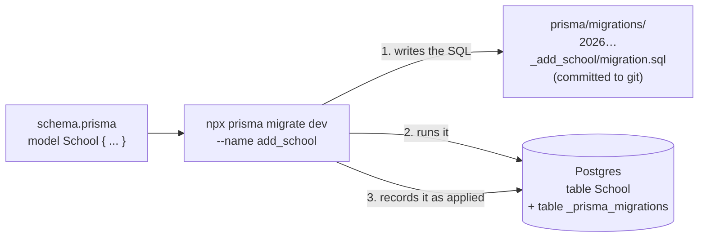

# Step 32: First Prisma model (`School`) and first migration

## Why

The database is empty. This step creates its first real table, `School`, which every other table will point to through `schoolId`.

You don't write `CREATE TABLE` by hand. You describe the table as a **model** in `schema.prisma`, then run a **migration**: Prisma compares your schema with the database, writes the SQL needed to make them match, saves that SQL as a file, and runs it.

That saved file matters. Migrations are the database's version history, the same way commits are your code's. Your laptop, CI (Step 34) and Heroku all run the same migration files in the same order, so every database ends up with exactly the same shape.



**Why `School` first:** it's the root of the multi-tenant design (every row carries a `schoolId`). It's also the simplest model: no foreign keys of its own.

## What you'll need

- Step 31 done: `echo "SELECT 1;" | npx prisma db execute --stdin` succeeds.
- `talaan-postgres` running (`docker start talaan-postgres`).

## Steps

### 1. Look at the shape you're matching

Open `src/features/schools/schemas.ts` and find `schoolSchema`. Phase 1 already decided what a school is:

| Field | Phase 1 type | In the database |
|---|---|---|
| `id` | string | text, primary key |
| `name` | string | text |
| `theme` | `{ kind: "preset", presetId }` or `{ kind: "custom", brandColor }` | **JSON** (see below) |
| `logoUrl` | optional string | text, nullable |
| `showDepedLogo` | boolean | boolean, default false |
| `notificationPreference` | `"off"`, `"time_in_only"` or `"time_in_and_time_out"` | **enum** |

### 2. Add the enum and the model to `prisma/schema.prisma`

Add this below the `datasource` block:

```prisma
enum NotificationPreference {
  off
  time_in_only
  time_in_and_time_out
}

model School {
  id                     String                 @id @default(uuid())
  name                   String
  theme                  Json
  logoUrl                String?
  showDepedLogo          Boolean                @default(false)
  notificationPreference NotificationPreference @default(time_in_only)
  createdAt              DateTime               @default(now())
  updatedAt              DateTime               @updatedAt
}
```

**Why each part:**
- `enum NotificationPreference`: Postgres itself refuses any value not in this list, so a typo like `"time_in"` can never be saved. The values are spelled exactly like Phase 1's strings, so no translation is needed between the app and the database.
- `id String @id @default(uuid())`: `@id` makes it the primary key (unique, never empty). The app already creates its own ids (`crypto.randomUUID()` in `createSchool`, and fixed ids like `school-balanga` in the seed data), so the column is text rather than a number. `@default(uuid())` only fills it in when nobody supplied one.
- `theme Json`: a theme is one of two shapes, and Postgres has no "either this or that" column type. Storing the whole object as JSON keeps it exactly as the app uses it. The trade-off is that the database doesn't check what's inside. Step 35 makes the app check it with the same Zod schema the forms use, every time a row is read.
- `String?`: the `?` means nullable. A school without a logo stores `NULL`.
- `@default(false)`, `@default(time_in_only)`: the same defaults `createSchool` already uses.
- `createdAt` / `updatedAt`: not in Phase 1's type, but almost every real table has them. `@default(now())` fills in the creation time, and `@updatedAt` makes Prisma set the time on every update. They cost nothing and answer "when did this change?" later.

Then tidy the file:

```bash
npx prisma format
```

It lines up the columns and catches typos, the same way Prettier does for TypeScript.

### 3. Create and apply the migration

```bash
npx prisma migrate dev --name add_school
```

**Why:** `migrate dev` is the *development* command. It compares the schema with the database, writes a new migration file, and applies it. `--name add_school` becomes part of the folder name, so the history reads like commit messages. Use short, snake_case names that describe the change.

You should see:

```
Applying migration `20261005xxxxxx_add_school`
…
Your database is now in sync with your schema.
```

**Prisma 7 note:** older guides say `migrate dev` also regenerates Prisma Client. In Prisma 7 it doesn't. Generating is its own command, in Step 33.

### 4. Read the SQL it wrote

Open `prisma/migrations/<timestamp>_add_school/migration.sql`. It should be:

```sql
-- CreateEnum
CREATE TYPE "NotificationPreference" AS ENUM ('off', 'time_in_only', 'time_in_and_time_out');

-- CreateTable
CREATE TABLE "School" (
    "id" TEXT NOT NULL,
    "name" TEXT NOT NULL,
    "theme" JSONB NOT NULL,
    "logoUrl" TEXT,
    "showDepedLogo" BOOLEAN NOT NULL DEFAULT false,
    "notificationPreference" "NotificationPreference" NOT NULL DEFAULT 'time_in_only',
    "createdAt" TIMESTAMP(3) NOT NULL DEFAULT CURRENT_TIMESTAMP,
    "updatedAt" TIMESTAMP(3) NOT NULL,

    CONSTRAINT "School_pkey" PRIMARY KEY ("id")
);
```

Reading this every time is a good habit. It's exactly what will run against the production database later. Notice:
- `Json` became `JSONB`, Postgres's binary JSON type, which is faster to query than plain `JSON`.
- `updatedAt` has no database default. Prisma Client fills it in, not Postgres.
- There's also a `migration_lock.toml` next to the folder. It records that this project uses PostgreSQL. Commit it too.

**Never edit a migration after it has been applied.** If something is wrong, change `schema.prisma` and run `migrate dev` again with a new name. That creates a second migration that fixes the first, just as you'd fix a bug with a new commit rather than by rewriting an old one.

### 5. See the table in the database

```bash
docker exec -it talaan-postgres psql -U postgres -d talaan
```

At the `talaan=#` prompt:

```sql
\dt
\d "School"
SELECT * FROM "School";
\q
```

- `\dt` should list two tables: `School` and `_prisma_migrations`. The second is Prisma's own record of which migrations have run.
- `\d "School"` shows every column, its type and its default.
- `SELECT * FROM "School";` returns `(0 rows)`. The table is real but empty; Step 33 fills it.

**About the quotes:** Postgres folds unquoted names to lowercase, so `SELECT * FROM School;` looks for a table called `school` and fails. Prisma keeps your model's exact name (`School`), so in raw SQL you always quote it: `"School"`, `"notificationPreference"`. Inside your TypeScript code you never notice this, because Prisma writes the SQL for you.

## Verify it worked

- `npx prisma migrate status` says `1 migration found in prisma/migrations` and `Database schema is up to date!`
- In `psql`, `\dt` lists `School` and `_prisma_migrations`, and `SELECT * FROM "School";` returns 0 rows.
- `git status` shows `prisma/schema.prisma` changed and a new `prisma/migrations/` folder.

Then tell me what you saw (or paste the exact error).

## If something goes wrong

- **`ERROR: relation "school" does not exist`** in `psql`: you left out the quotes. Use `"School"`.
- **`Error code: P1012` … `Type "Jsonn" is neither a built-in type, nor refers to another model…`** (or similar): a typo in the schema. The `-->` line under it gives the file and line number.
- **`Drift detected` / `We need to reset the "public" schema`** with a prompt asking to reset: the database has changes that no migration file explains, usually from editing or deleting a migration folder after it ran. The local database holds nothing you need yet, so answering `y` is safe **here**. It drops everything and re-applies the migrations. Never answer `y` to this on a database with real data.
- **`Can't reach database server at localhost:5432`**: `docker start talaan-postgres`.
- **You ran it without `--name`**: Prisma asks for a name interactively. Type `add_school` and press Enter.

## What you just learned

- **Model → table:** each `model` in `schema.prisma` becomes one table, each field one column, and `?` decides whether it can be empty.
- **Migration:** a saved, ordered SQL file that changes the database's shape. Committed to git and replayed on every database, so all of them match.
- **`migrate dev` vs. `migrate deploy`:** `dev` creates *and* applies migrations, for your laptop only. `deploy` (Step 34, and Heroku later) only applies the ones already written, and never creates new ones.
- **Enum and JSON columns:** an enum lets the database itself enforce a fixed list of values. A JSON column stores structured data the database doesn't check, so the app must validate it.

## Everyday commands from now on

| You want to… | Run |
|---|---|
| Change the database's shape | Edit `schema.prisma`, then `npx prisma migrate dev --name <what_changed>` |
| See which migrations have run | `npx prisma migrate status` |
| Format the schema | `npx prisma format` |

## Before you commit

Run these once "Verify it worked" passes. They're the same checks CI runs, in the same order. [docs/LEARNING-LOG.md](../LEARNING-LOG.md#the-routine-to-run-before-every-commit-and-push-owner-question) explains what each one catches.

```bash
docker start talaan-postgres
npm run lint && npm run check:tokens && npm run typecheck && npm run test && npm run build
```

Before you push, also run the browser tests. They take a few minutes and use the build from the line above:

```bash
npx playwright test
```

If one fails, fix it and rerun that one command, then rerun the whole line before committing. If you're stuck, share the exact error.

## What's next

Step 33 generates Prisma Client from this schema and uses it in a seed script to put Phase 1's three demo schools into the real table, then reads them back.
