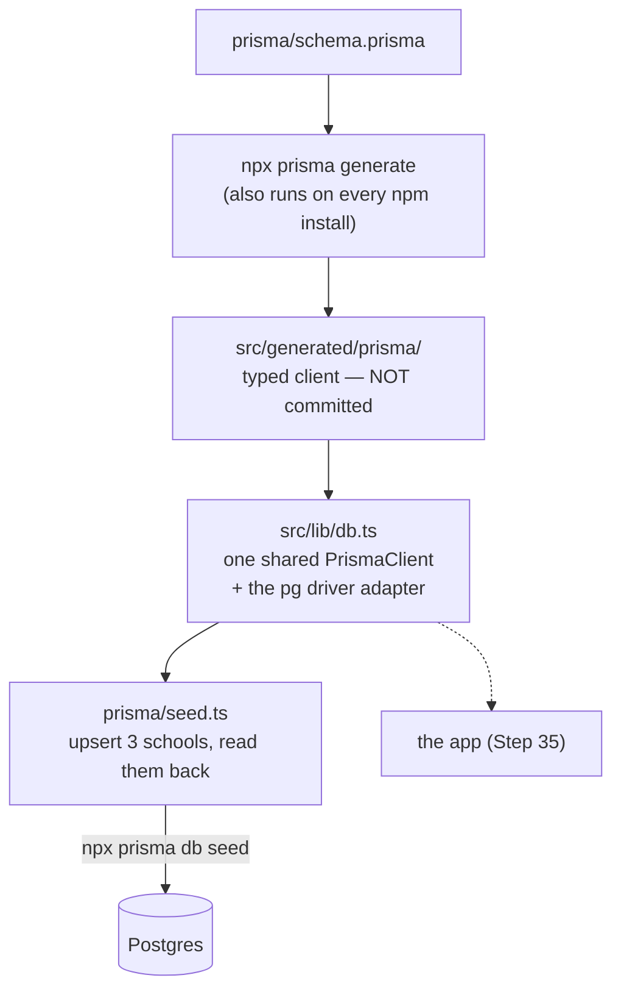

# Step 33: Generate Prisma Client and prove it end to end

## Why

You have a `School` table. Now your TypeScript code needs a way to use it. That's **Prisma Client**: code that Prisma *generates* from `schema.prisma`, so every query is typed. Write `prisma.school.findMany()` and TypeScript knows you get back `id`, `name`, `theme` and so on. Misspell a field and it's a red underline, not a runtime crash.

This step proves the whole chain works, from TypeScript to the database and back, with a **seed script**. A seed script puts known starting data into the database. Here it copies Phase 1's three demo schools in and reads them back out. It keeps their exact ids (`school-balanga`, …), so in Step 35, when schools come from the database while staff and students still come from the mock arrays, the two still line up.



## What you'll need

- Step 32 done: `npx prisma migrate status` says the database is up to date.
- `talaan-postgres` running.

## Steps

### 1. Install the runtime packages

```bash
npm install @prisma/client@7 @prisma/adapter-pg@7
npm install --save-dev tsx
```

**Why each:**
- `@prisma/client` is the runtime that the generated code builds on. It's a regular dependency (not `--save-dev`), because the running app needs it.
- `@prisma/adapter-pg` connects Prisma to Postgres through `pg`, the standard Node.js Postgres driver (installed along with it). Prisma 7 always uses a driver adapter like this. Older versions used a hidden Rust engine instead.
- `tsx` runs a `.ts` file directly (`tsx prisma/seed.ts`). Unlike plain `node`, it understands this project's `@/…` import shortcuts from `tsconfig.json`, so the seed script can import the real seed data. It's a dev dependency: only scripts use it.
- `@7` again keeps every Prisma package on the same major version as the CLI (see Step 31).

### 2. Generate the client

```bash
npx prisma generate
```

You should see `✔ Generated Prisma Client (7.x.x) to ./src/generated/prisma`. Open `src/generated/prisma/models/School.ts` and look around. It's ordinary TypeScript, written for you. Never edit it: the next `generate` overwrites it.

### 3. Keep generated code out of git and Prettier

Add this to the end of `.gitignore`:

```
# Prisma Client, regenerated from prisma/schema.prisma (npm install runs it)
/src/generated/
```

And to the end of `.prettierignore`:

```
src/generated/
```

**Why not commit it:** it's a build product of `schema.prisma`, like `.next/`. Committing it means a huge diff on every schema change, and a stale copy whenever someone forgets to regenerate. Prettier skips it so that `npm run format` never rewrites hundreds of generated lines.

### 4. Regenerate on every install

In `package.json`, add a `postinstall` line to `"scripts"` (put it right after `"start"`):

```json
"postinstall": "prisma generate",
```

**Why:** npm runs a script named `postinstall` automatically after every `npm install` / `npm ci`. A fresh clone, CI (Step 34) and Heroku all start without `src/generated/`, because it's gitignored. Without this line, their first `typecheck` or `build` fails with `Cannot find module '@/generated/prisma/client'`. `generate` doesn't need a database, which is why Step 31 used plain `process.env` in the config.

Check it works:

```bash
rm -rf src/generated
npm install
ls src/generated/prisma
```

The folder should be back, with `client.ts` in it.

### 5. Create the shared client: `src/lib/db.ts`

```ts
import { PrismaPg } from "@prisma/adapter-pg";
import { PrismaClient } from "@/generated/prisma/client";

/**
 * The one Prisma Client the whole app shares. In development, Next.js
 * re-runs this file on every hot reload; keeping the client on globalThis
 * stops each reload from opening a fresh pool of database connections.
 */
const globalForPrisma = globalThis as unknown as { prisma?: PrismaClient };

function createPrismaClient() {
  const adapter = new PrismaPg({ connectionString: process.env.DATABASE_URL });
  return new PrismaClient({ adapter });
}

export const prisma = globalForPrisma.prisma ?? createPrismaClient();

if (process.env.NODE_ENV !== "production") {
  globalForPrisma.prisma = prisma;
}
```

**Why each part:**
- **One shared client.** A `PrismaClient` holds a *pool* of open database connections. Postgres allows a limited number (100 by default, fewer on a small Heroku plan). If every file made its own client, you'd run out. One client is not one connection: the `pg` adapter opens up to 10 by default (pass `max` to `PrismaPg` to change it), and requests take turns using them.
- **`globalThis`.** When you save a file, `npm run dev` reloads your modules but keeps the same Node.js process running. A plain `const prisma = new PrismaClient()` would make a new client, and a new pool, on every save. After enough saves you'd see `too many clients already`. `globalThis` survives reloads, so the first client is reused. In production nothing hot-reloads, so the cache isn't needed there.
- **`PrismaPg({ connectionString })`.** This is the adapter from step 1, given the same `DATABASE_URL`. Inside the app, Next.js loads `.env` for you, so no `dotenv` import is needed here.

### 6. Create the seed script: `prisma/seed.ts`

```ts
import "dotenv/config";
import { prisma } from "@/lib/db";
import { seedSchools } from "@/data/seed";

/**
 * Copies Phase 1's demo schools into the real database, keeping the same
 * ids ("school-balanga", ...) so the mock staff, students and taps that
 * still point at those ids keep lining up. Safe to run again: upsert
 * updates an existing row instead of failing on a duplicate id.
 */
async function main() {
  for (const school of seedSchools) {
    await prisma.school.upsert({
      where: { id: school.id },
      update: {},
      create: {
        id: school.id,
        name: school.name,
        theme: school.theme,
        logoUrl: school.logoUrl,
        showDepedLogo: school.showDepedLogo,
        notificationPreference: school.notificationPreference,
      },
    });
  }

  const schools = await prisma.school.findMany({ orderBy: { createdAt: "asc" } });
  console.log(`Seeded ${schools.length} schools:`);
  for (const school of schools) {
    console.log(`- ${school.id}: ${school.name} (${school.notificationPreference})`);
  }
}

main()
  .catch((error) => {
    console.error(error);
    process.exitCode = 1;
  })
  .finally(() => prisma.$disconnect());
```

**Why each part:**
- `import "dotenv/config"`: this script runs outside Next.js, so it loads `.env` itself, as `prisma.config.ts` does.
- `upsert` = "update if it exists, insert if it doesn't". `update: {}` means "if it's already there, leave it alone". That makes the script safe to run twice. A plain `create` would fail the second time with a duplicate-id error.
- `theme: school.theme`: the theme object goes straight into the `Json` column.
- `findMany` afterwards is the "read it back" half of the proof. `school.notificationPreference` is typed. Hover it in VS Code and you'll see the three allowed values, taken from your enum.
- `prisma.$disconnect()` closes the connection pool, so the script exits instead of hanging.
- Why `main().catch()` and not `await` at the top level: `tsx` runs this project's `.ts` files as CommonJS, which doesn't allow top-level `await`.

### 7. Tell Prisma how to run it

In `prisma.config.ts`, add a `seed` line inside `migrations`:

```ts
  migrations: {
    path: "prisma/migrations",
    seed: "tsx prisma/seed.ts",
  },
```

`npx prisma db seed` is a built-in Prisma command, not an npm script, so nothing goes in `package.json`. The command reads this `seed` line and runs it. (Older Prisma versions kept it in `package.json` under `"prisma": { "seed": … }`, which is what most tutorials still show. Prisma 7 moved it here.)

### 8. Run it

```bash
npx prisma db seed
```

You should see:

```
Running seed command `tsx prisma/seed.ts` ...
Seeded 3 schools:
- school-balanga: Balanga City National Science High School (time_in_and_time_out)
- school-oceanview: Oceanview National High School (time_in_only)
- school-crimsonridge: Crimson Ridge National High School (off)

🌱  The seed command has been executed.
```

Run it a **second time**. It should print the same three schools, not six, and not an error. That's `upsert` working.

Prisma 7 doesn't run the seed for you after a migration. Run `npx prisma db seed` yourself whenever you start from an empty database.

## Verify it worked

- `npx prisma db seed` twice prints the same 3 schools both times.
- In `psql` (`docker exec -it talaan-postgres psql -U postgres -d talaan`):

  ```sql
  SELECT id, name, theme, "notificationPreference" FROM "School";
  ```

  shows 3 rows, with themes like `{"kind": "preset", "presetId": "school"}`.
- `npm run lint`, `npm run typecheck`, `npm run test`, `npm run check:tokens` and `npm run build` all still pass. The app itself doesn't use the database yet; that's Step 35.
- `git status` does **not** list `src/generated/`.

Then tell me what you saw (or paste the exact error).

## If something goes wrong

- **`Cannot find module '@/generated/prisma/client'`**: the client hasn't been generated. Run `npx prisma generate`. If it keeps coming back, check the `output` path in `schema.prisma` (`../src/generated/prisma`).
- **`Top-level await is currently not supported with the "cjs" output format`**: you used `await` outside a function. Keep the `async function main()` wrapper.
- **`sh: tsx: command not found`** when seeding: step 1's `npm install --save-dev tsx` didn't run. Run it.
- **`Unique constraint failed on the fields: (id)`**: you used `create` instead of `upsert`.
- **`Can't reach database server`**: `docker start talaan-postgres`.
- **The seed "hangs" after printing**: the `.finally(() => prisma.$disconnect())` line is missing.

## What you just learned

- **Generated code:** Prisma writes typed TypeScript from your schema. It's rebuilt, never edited and never committed, and `postinstall` keeps every machine up to date.
- **Connection pool, and why there's one client:** opening a database connection is slow and limited, so one shared client reuses a few connections for everything.
- **Seed data:** a repeatable script that puts a database into a known state. `upsert` makes it safe to re-run.

## Everyday commands from now on

| You want to… | Run |
|---|---|
| Regenerate the client after editing the schema | `npx prisma generate` (also runs on `npm install`) |
| Put the demo schools in an empty database | `npx prisma db seed` |

## What's next

Step 34 gives CI its own Postgres, so GitHub Actions can apply your migrations and run the seed on every push, before the app depends on a database in Step 35.
