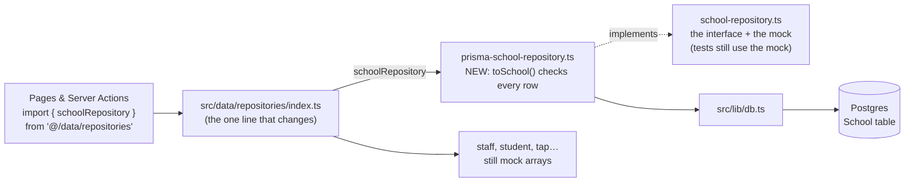

# Step 35: Swap the school repository for a real, Prisma-backed one

## Why

This is the payoff for Phase 1's repository pattern. Every page and Server Action reads schools through one interface, `SchoolRepository` (`list`, `getById`, `update`, `create`), never through the seed array directly. So you can write a second implementation of that same interface, backed by Prisma, change **one export line**, and every screen that shows a school reads from Postgres. No page changes.

After this step, change a school's notification setting, restart the dev server, and **it's still saved**. That has never been true before. Everything else (staff, students, taps…) stays on the mock for now, one repository per later step.



Two things only show up once real database code is in the app. You'll fix both first (parts A and B) so the build stays green:

- **Server code leaking into the browser.** One file that client components import also imports the repositories. With mock arrays that was harmless. With Prisma it would pull the Postgres driver into the browser bundle, and the build fails with `Can't resolve 'util/types'`.
- **A page frozen at build time.** `/parent/signup` doesn't read cookies, so Next.js pre-renders it once, during `npm run build`. Its school list would be fixed until the next deploy, and building would need a database.

## What you'll need

- Steps 31–34 done, with Step 34's CI run green.
- `talaan-postgres` running and seeded (`npx prisma db seed`).

## Steps

### Part A: keep the parent notification helpers browser-safe

`src/features/parents/notifications-data.ts` mixes two kinds of code: `getParentNotifications` (server-only, it calls repositories) and small display helpers (`notificationKindLabel`, `countUnreadNotifications`) that the bell and the list, both client components (`"use client"`), also import. In a client component, importing *anything* from a file pulls in that whole file and its imports, and so the repositories, Prisma and `pg` would come along. Fix: move the helpers into their own file that imports no repositories.

**A1.** Create `src/features/parents/notification-format.ts`:

```ts
import type { Student } from "@/features/students/types";
import type { Notification } from "./types";

/** A notification joined with the child it's about, ready to render. */
export type ParentNotificationItem = { notification: Notification; student: Student };

export function countUnreadNotifications(items: ParentNotificationItem[]): number {
  return items.filter((item) => !item.notification.read).length;
}

/** The plain-language verb a parent reads, e.g. "tapped in" — sentence case, matching the app's copy style. */
export function notificationKindLabel(kind: Notification["kind"]): string {
  return kind === "time_in" ? "tapped in" : "tapped out";
}
```

**A2.** In `src/features/parents/notifications-data.ts`:
- Delete the `ParentNotificationItem` type and the two functions `countUnreadNotifications` and `notificationKindLabel` (with their comments). They now live in the new file.
- Replace the two `import type` lines (`Student` and `Notification`) with:

  ```ts
  import type { ParentNotificationItem } from "./notification-format";

  export { countUnreadNotifications, notificationKindLabel, type ParentNotificationItem } from "./notification-format";
  ```

  The re-export means server files that already import these from `notifications-data` (like the notifications page) keep working unchanged.

**A3.** In `src/features/parents/notification-list.tsx` and `src/features/parents/notifications-bell.tsx` (the two `"use client"` files), change every `from "./notifications-data";` to `from "./notification-format";`.

### Part B: render the signup page per request

In `src/app/parent/signup/page.tsx`, add this import at the top:

```ts
import { connection } from "next/server";
```

and make the start of the component read:

```ts
export default async function ParentSignupPage() {
  // Render on every request, not once at build time: the school list now
  // comes from the database, and a school added later must show up here.
  await connection();
  const schools = await schoolRepository.list();
```

**Why:** `connection()` tells Next.js "wait for a real request before going further", so this page is rendered fresh each time, like pages that read cookies already are. In the build output, `/parent/signup` changes from `○ (Static)` to `ƒ (Dynamic)`.

### Part C: the Prisma-backed repository

Create `src/data/repositories/prisma-school-repository.ts`:

```ts
import { Prisma, type PrismaClient, type School as SchoolRow } from "@/generated/prisma/client";
import { schoolSchema } from "@/features/schools/schemas";
import type { School } from "@/features/schools/types";
import { prisma } from "@/lib/db";
import type { SchoolRepository } from "./school-repository";

/**
 * A database row → the app's own `School` type. The row has extra columns
 * the app doesn't use (createdAt, updatedAt), stores "no logo" as null
 * rather than leaving it out, and keeps the theme as untyped JSON — so
 * every row is checked against the same Zod schema the forms use. A row
 * that somehow holds a bad theme fails loudly here instead of reaching
 * a page.
 */
export function toSchool(row: SchoolRow): School {
  return schoolSchema.parse({
    id: row.id,
    name: row.name,
    theme: row.theme,
    logoUrl: row.logoUrl ?? undefined,
    showDepedLogo: row.showDepedLogo,
    notificationPreference: row.notificationPreference,
  });
}

/** The app's `School` → the columns Prisma writes. The reverse of `toSchool`. */
export function toSchoolData(school: School) {
  return {
    name: school.name,
    theme: school.theme,
    logoUrl: school.logoUrl ?? null,
    showDepedLogo: school.showDepedLogo,
    notificationPreference: school.notificationPreference,
  };
}

/** Prisma's error code for "the record you asked to update doesn't exist". */
const RECORD_NOT_FOUND = "P2025";

export function createPrismaSchoolRepository(db: PrismaClient = prisma): SchoolRepository {
  return {
    async list() {
      const rows = await db.school.findMany({ orderBy: { createdAt: "asc" } });
      return rows.map(toSchool);
    },
    async getById(id) {
      const row = await db.school.findUnique({ where: { id } });
      return row ? toSchool(row) : null;
    },
    async update(school) {
      try {
        const row = await db.school.update({ where: { id: school.id }, data: toSchoolData(school) });
        return toSchool(row);
      } catch (error) {
        if (error instanceof Prisma.PrismaClientKnownRequestError && error.code === RECORD_NOT_FOUND) {
          return null;
        }
        throw error;
      }
    },
    async create(school) {
      // Idempotent by id, like the mock: a repeated create leaves the
      // existing row alone instead of failing on a duplicate primary key.
      const row = await db.school.upsert({
        where: { id: school.id },
        update: {},
        create: { id: school.id, ...toSchoolData(school) },
      });
      return toSchool(row);
    },
  };
}

/** The one instance the rest of the app actually imports. */
export const schoolRepository = createPrismaSchoolRepository();
```

**Why each part:**
- **`toSchool` is the boundary check.** The database speaks "rows" (nullable columns, a JSON blob, timestamps). The app speaks `School`. Translating in exactly one function means no page ever sees a raw row. `schoolSchema.parse` re-checks the JSON `theme` that Postgres can't check (Step 32), so a bad value throws here with a clear Zod error instead of half-rendering a page.
- **`null` ↔ `undefined`:** Prisma uses `null` for an empty column, while Phase 1's type uses a missing (`undefined`) `logoUrl`. Converting both ways also means saving a school with no logo *clears* the column. (Passing `undefined` to Prisma means "don't touch this column".)
- **Same behavior as the mock, method by method.** The interface's comments promise `update` returns `null` for an unknown id, and `create` is idempotent. Prisma's `update` *throws* error `P2025` instead, so you catch exactly that code, return `null`, and re-throw anything else. Swallowing every error would hide real problems, like the database being down.
- **`db: PrismaClient = prisma`:** the same "pass in your dependency, default to the real one" shape as `createMockSchoolRepository(data = seedSchools)`.
- **`orderBy: createdAt`:** the mock returned schools in insertion order, and the seed inserted them in that order, so lists look the same as before.

### Part D: a unit test for the translation

Create `src/data/repositories/prisma-school-repository.test.ts`:

```ts
import { describe, expect, it } from "vitest";
import type { School as SchoolRow } from "@/generated/prisma/client";
import type { School } from "@/features/schools/types";
import { toSchool, toSchoolData } from "./prisma-school-repository";

const row: SchoolRow = {
  id: "school-a",
  name: "School A",
  address: null,
  theme: { kind: "preset", presetId: "ocean" },
  logoUrl: null,
  showDepedLogo: false,
  notificationPreference: "time_in_only",
  createdAt: new Date("2026-10-05T00:00:00Z"),
  updatedAt: new Date("2026-10-05T00:00:00Z"),
};

describe("toSchool", () => {
  it("turns a database row into the app's School, dropping the timestamps", () => {
    expect(toSchool(row)).toEqual({
      id: "school-a",
      name: "School A",
      theme: { kind: "preset", presetId: "ocean" },
      showDepedLogo: false,
      notificationPreference: "time_in_only",
    });
  });

  it("keeps a logo when the row has one", () => {
    expect(toSchool({ ...row, logoUrl: "https://example.com/logo.png" }).logoUrl).toBe(
      "https://example.com/logo.png",
    );
  });

  it("rejects a row whose theme isn't a valid theme", () => {
    expect(() => toSchool({ ...row, theme: { kind: "preset", presetId: "not-a-preset" } })).toThrow();
  });
});

describe("toSchoolData", () => {
  it("stores a missing logo as null, so an update can clear it", () => {
    const school: School = {
      id: "school-a",
      name: "School A",
      theme: { kind: "preset", presetId: "violet" },
      showDepedLogo: true,
      notificationPreference: "off",
    };
    expect(toSchoolData(school).logoUrl).toBeNull();
  });
});
```

**Why only the translation is tested:** these tests need no database, so `npm run test` stays fast and works anywhere. The database calls themselves are covered by the Playwright tests, which now run against the real Postgres (Step 34). (Use a preset theme, not a hex color, in tests: `npm run check:tokens` rejects hex values outside the theme files.)

### Part E: flip the switch

**E1.** In `src/data/repositories/index.ts`, replace the first line:

```ts
export { schoolRepository, createMockSchoolRepository, type SchoolRepository } from "./school-repository";
```

with:

```ts
export { createMockSchoolRepository, type SchoolRepository } from "./school-repository";
export { schoolRepository, createPrismaSchoolRepository } from "./prisma-school-repository";
```

**E2.** In `src/data/repositories/school-repository.ts`, delete the last two lines (the mock singleton):

```ts
/** The one instance the rest of the app actually imports. */
export const schoolRepository = createMockSchoolRepository();
```

Nothing uses it any more, and the project doesn't keep dead code. The interface and `createMockSchoolRepository` stay: the tests still use the mock.

That's the whole swap. Every `import { schoolRepository } from "@/data/repositories"` in the app now gets the Prisma one.

## Verify it worked

1. Checks. All should pass, with 4 more tests than before:

   ```bash
   npm run lint && npm run check:tokens && npm run typecheck && npm run test && npm run build
   ```

   In the build's route list, `/parent/signup` shows `ƒ`.
2. The real proof, persistence:
   - `npm run dev`, sign in as the Balanga principal (dev switcher), open **Settings → Notifications**, change it to **Time in only** and save.
   - Stop the dev server (Ctrl+C) and start it again. Reload Settings: still **Time in only**. With the mock, a restart always reset it.
   - In `psql`: `SELECT id, "notificationPreference", "updatedAt" FROM "School";` shows the new value and a fresh `updatedAt`.

     > **Opening `psql`.** Docker must be running (if `docker ps` doesn't list `talaan-postgres`, run `docker start talaan-postgres` first).
     >
     > ```bash
     > docker exec -it talaan-postgres psql -U postgres -d talaan
     > ```
     >
     > The prompt changes to `talaan=#`. Type `\q` to leave. What each part of the command means: [Learning log: getting into `psql`](../LEARNING-LOG.md#getting-into-psql-and-what-each-part-of-the-command-means-owner-question).

   - Set it back to **Time in and time out** afterwards. (Rerunning the seed won't reset it: `update: {}` leaves existing rows alone.)
3. `/parent/signup` lists the three schools.
4. Optional, slow: `npm run test:e2e` locally (Docker must be running). It takes a while, so CI is the main check.
5. Commit and push. CI is green.

Then tell me what you saw (or paste the exact error).

## If something goes wrong

- **Build fails: `Module not found: Can't resolve 'util/types'`** with an import trace through `notification-list.tsx` or `notifications-bell.tsx`: Part A isn't complete. Some client component still imports from `./notifications-data`. The trace's `[Client Component Browser]` lines name the file.
- **Every page shows the error screen, and the terminal says `Can't reach database server at localhost:5432`**: Docker or the container isn't running. From now on the app needs the database: `docker start talaan-postgres`.
- **A page says the school isn't found, or lists are empty**: the table is empty (for example, after a reset). Run `npx prisma db seed`.
- **`ZodError` … `presetId`** in the terminal: a row holds a theme the app doesn't accept. That's `toSchool` doing its job. Check the row in `psql` and fix or delete it.
- **Typecheck: `Property 'address' is missing in type`** in the test file: the test's `row` must list every column the `School` table has, including `address` (added by the `add_school_address` migration). Add `address: null,` under `name`.
- **Typecheck: `Module '"@/generated/prisma/client"' has no exported member 'School'`**: the client is stale. Run `npx prisma generate`.
- **Typecheck (or a red squiggle in VS Code): `Object literal may only specify known properties, and 'address' does not exist in type`** on the test's `address: null`: the opposite of the "missing" error above. The schema and migration have `address`, but the generated client in `src/generated/prisma` was built before that migration. Run `npx prisma generate`. If VS Code still underlines it, run **TypeScript: Restart TS Server** from the command palette.
- **A newly added school's principal disappears after a restart**: expected for now. The school is in Postgres, but staff are still mock (in memory). It's fixed when staff move to Prisma.

## What you just learned

- **Programming to an interface:** the pages depended on `SchoolRepository`, not on "an array". Replacing what's behind it was one export line.
- **The boundary check:** data from outside your code (a database, a request, a file) gets validated once, where it enters. JSON columns especially.
- **Server-only vs. client code:** a `"use client"` file drags everything it imports, directly or indirectly, into the browser bundle. Keep database code out of anything a client component imports.
- **Static vs. dynamic pages:** Next.js pre-renders a page at build time unless it reads request data. `connection()` opts a page out when its data can change.

## Before you commit

Run these once "Verify it worked" passes. They're the same checks CI runs, in the same order. [docs/LEARNING-LOG.md](../LEARNING-LOG.md#the-routine-to-run-before-every-commit-and-push-owner-question) explains what each one catches.

```bash
docker start talaan-postgres
npm run lint && npm run check:tokens && npm run typecheck && npm run test && npm run build
```

Before you push, also run the browser tests. They take a few minutes and use the build from the line above:

```bash
npx playwright test
```

If one fails, fix it and rerun that one command, then rerun the whole line before committing. If you're stuck, share the exact error.

## What's next

Step 36 gives the browser tests their own database that resets before every run, so tests that write data keep passing once that data lives in Postgres. Then Steps 37–40 move staff, students, cards and taps the same way this step moved schools.
