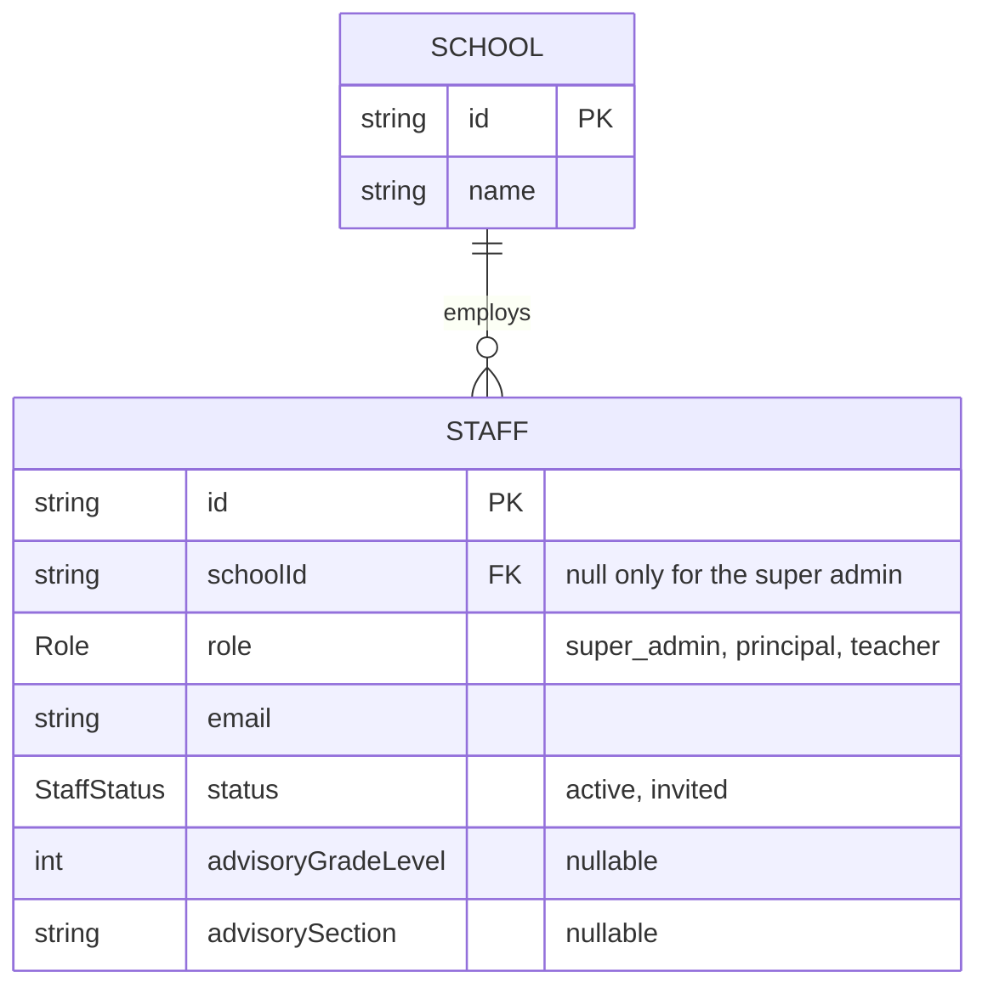

# Step 37: Staff in Postgres, your first relation

## Why

Staff are the first table that **points at another table**: every principal and teacher belongs to a school. In the database that's a **foreign key**: `Staff.schoolId` must hold an id that really exists in `School`. Postgres checks it on every insert and update, so a staff row for a school that doesn't exist simply can't be saved. The mock arrays never checked that.

After this step, inviting a teacher and restarting the dev server keeps them. It also fixes the leftover from Step 35: a newly added school's principal no longer disappears after a restart.



The pattern is the same as Step 35's, and from here on every table follows it: **model → migration → repository with `to…`/`to…Data` → test → flip the export → seed.**

## What you'll need

- Step 36 done and approved.
- `talaan-postgres` running.

## Steps

### 1. The model

In `prisma/schema.prisma`, add one line at the bottom of the `School` model, after `updatedAt`, with a blank line before it:

```prisma

  staff Staff[]
}
```

Then add this at the end of the file:

```prisma
enum Role {
  super_admin
  principal
  teacher
}

enum StaffStatus {
  active
  invited
}

model Staff {
  id                 String      @id @default(uuid())
  // Null only for a super admin, who isn't tied to one school.
  schoolId           String?
  school             School?     @relation(fields: [schoolId], references: [id], onDelete: Restrict)
  role               Role
  firstName          String
  lastName           String
  email              String
  status             StaffStatus @default(invited)
  advisoryGradeLevel Int?
  advisorySection    String?
  createdAt          DateTime    @default(now())
  updatedAt          DateTime    @updatedAt

  @@index([schoolId])
}
```

**Why each part:**
- **`school School? @relation(fields: [schoolId], references: [id])`** is the relation. `schoolId` is the real column. `school` is not a column at all: it's Prisma's way of letting you write `include: { school: true }` later. `staff Staff[]` on `School` is the other side of the same relation. Prisma requires both sides.
- **`String?` / `School?`**: optional, because the super admin isn't tied to any school.
- **`onDelete: Restrict`**: if anyone ever tries to delete a school that still has staff, Postgres refuses. Without it, Prisma's default for an optional relation is `SET NULL`: deleting a school would silently turn its principal into a principal with no school, which the app's rules forbid.
- **`@@index([schoolId])`**: Postgres doesn't index a foreign key by itself. Every staff list is "staff where `schoolId` = …", so this keeps that fast as the table grows.
- **No `@unique` on `email`, yet.** Today's invite form doesn't check for a duplicate email, so a unique rule would turn a second invite into a crash instead of a friendly message. Uniqueness arrives with real sign-in, together with that message.
- **`advisoryGradeLevel Int?`**: Postgres just stores a whole number. "Only 7 to 12" is checked by `staffSchema` when the row is read (step 3).

Tidy the file:

```bash
npx prisma format
```

### 2. The migration

```bash
npx prisma migrate dev --name add_staff
npx prisma generate
```

Open the new `prisma/migrations/<timestamp>_add_staff/migration.sql` and read it. You should find:
- two `CREATE TYPE … AS ENUM` lines for `Role` and `StaffStatus`
- `CREATE TABLE "Staff"`
- `CREATE INDEX "Staff_schoolId_idx"`
- `FOREIGN KEY ("schoolId") REFERENCES "School"("id") ON DELETE RESTRICT`. That's the relation.

(`migrate dev` doesn't regenerate the client in Prisma 7. That's why `generate` follows.)

### 3. The repository

Create `src/data/repositories/prisma-staff-repository.ts`:

```ts
import type { PrismaClient, Staff as StaffRow } from "@/generated/prisma/client";
import { staffSchema } from "@/features/staff/schemas";
import type { Staff } from "@/features/staff/types";
import { prisma } from "@/lib/db";
import type { StaffRepository } from "./staff-repository";

/**
 * A database row → the app's own `Staff` type, checked by the same Zod
 * schema as everywhere else. That check matters more here than for
 * schools: the database can't tell a teacher's advisory grade (any whole
 * number to Postgres) from a real grade 7 to 12, or catch a principal
 * with no school. `staffSchema` can.
 */
export function toStaff(row: StaffRow): Staff {
  return staffSchema.parse({
    id: row.id,
    schoolId: row.schoolId,
    role: row.role,
    firstName: row.firstName,
    lastName: row.lastName,
    email: row.email,
    status: row.status,
    advisoryGradeLevel: row.advisoryGradeLevel ?? undefined,
    advisorySection: row.advisorySection ?? undefined,
  });
}

/** The app's `Staff` → the columns Prisma writes. The reverse of `toStaff`. */
export function toStaffData(staff: Staff) {
  return {
    schoolId: staff.schoolId,
    role: staff.role,
    firstName: staff.firstName,
    lastName: staff.lastName,
    email: staff.email,
    status: staff.status,
    advisoryGradeLevel: staff.advisoryGradeLevel ?? null,
    advisorySection: staff.advisorySection ?? null,
  };
}

/** Oldest first, the same order the mock kept: the order people were added. */
const OLDEST_FIRST = [{ createdAt: "asc" as const }, { id: "asc" as const }];

export function createPrismaStaffRepository(db: PrismaClient = prisma): StaffRepository {
  return {
    async listBySchool(schoolId) {
      const rows = await db.staff.findMany({ where: { schoolId }, orderBy: OLDEST_FIRST });
      return rows.map(toStaff);
    },
    async getById(id) {
      const row = await db.staff.findUnique({ where: { id } });
      return row ? toStaff(row) : null;
    },
    async list() {
      const rows = await db.staff.findMany({ orderBy: OLDEST_FIRST });
      return rows.map(toStaff);
    },
    async create(staff) {
      const row = await db.staff.upsert({
        where: { id: staff.id },
        update: {},
        create: { id: staff.id, ...toStaffData(staff) },
      });
      return toStaff(row);
    },
    async remove(id) {
      // deleteMany, not delete: removing someone who's already gone is a
      // no-op (0 rows), the same as the mock, instead of a P2025 error.
      await db.staff.deleteMany({ where: { id } });
    },
  };
}

/** The one instance the rest of the app actually imports. */
export const staffRepository = createPrismaStaffRepository();
```

**Why each part:**
- **`schoolId: row.schoolId`** passes `null` straight through. Unlike `logoUrl`, the app's own `Staff` type uses `null` for "no school" too (the super admin), so there's nothing to convert.
- **`OLDEST_FIRST` has two keys.** `createdAt` keeps the order people were added, which the mock had and the dev switcher's persona list shows. `id` only breaks a tie if two rows ever share a timestamp, so the order is always the same, never "whatever Postgres felt like".
- **`as const`** tells TypeScript `"asc"` is exactly the word `"asc"`, not any string. That's what Prisma's `orderBy` type wants.
- **`deleteMany` for `remove`:** the interface promises "a no-op for an unknown id, so a repeated click can't fail". `delete` would throw `P2025` for a missing row. `deleteMany` just deletes zero rows.

### 4. A test for the translation

Create `src/data/repositories/prisma-staff-repository.test.ts`:

```ts
import { describe, expect, it } from "vitest";
import type { Staff as StaffRow } from "@/generated/prisma/client";
import type { Staff } from "@/features/staff/types";
import { toStaff, toStaffData } from "./prisma-staff-repository";

const row: StaffRow = {
  id: "staff-a",
  schoolId: "school-a",
  role: "teacher",
  firstName: "Ana",
  lastName: "Reyes",
  email: "ana@school-a.example",
  status: "active",
  advisoryGradeLevel: 7,
  advisorySection: "Rizal",
  createdAt: new Date("2026-10-08T00:00:00Z"),
  updatedAt: new Date("2026-10-08T00:00:00Z"),
};

describe("toStaff", () => {
  it("turns a database row into the app's Staff, dropping the timestamps", () => {
    expect(toStaff(row)).toEqual({
      id: "staff-a",
      schoolId: "school-a",
      role: "teacher",
      firstName: "Ana",
      lastName: "Reyes",
      email: "ana@school-a.example",
      status: "active",
      advisoryGradeLevel: 7,
      advisorySection: "Rizal",
    });
  });

  it("leaves out an advisory class the row doesn't have", () => {
    const staff = toStaff({ ...row, role: "principal", advisoryGradeLevel: null, advisorySection: null });
    expect(staff.advisoryGradeLevel).toBeUndefined();
    expect(staff.advisorySection).toBeUndefined();
  });

  it("rejects an advisory grade outside 7 to 12", () => {
    expect(() => toStaff({ ...row, advisoryGradeLevel: 13 })).toThrow();
  });

  it("rejects a principal with no school", () => {
    expect(() => toStaff({ ...row, role: "principal", schoolId: null })).toThrow();
  });
});

describe("toStaffData", () => {
  it("stores a missing advisory class as null", () => {
    const staff: Staff = {
      id: "staff-b",
      schoolId: "school-a",
      role: "principal",
      firstName: "Ben",
      lastName: "Santos",
      email: "ben@school-a.example",
      status: "invited",
    };
    expect(toStaffData(staff)).toMatchObject({ advisoryGradeLevel: null, advisorySection: null });
  });
});
```

The last two `toStaff` tests are the point of the boundary check: they're exactly the bad rows Postgres would happily store.

### 5. Flip the switch

**5a.** In `src/data/repositories/index.ts`, replace:

```ts
export { staffRepository, createMockStaffRepository, type StaffRepository } from "./staff-repository";
```

with:

```ts
export { createMockStaffRepository, type StaffRepository } from "./staff-repository";
export { staffRepository, createPrismaStaffRepository } from "./prisma-staff-repository";
```

**5b.** In `src/data/repositories/staff-repository.ts`, delete the last line (the mock singleton) and the blank line above it:

```ts
export const staffRepository = createMockStaffRepository();
```

### 6. Seed the staff

In `prisma/demo-data.ts`:

**6a.** Change the seed import to also bring in `seedStaff`, and import `toStaffData`:

```ts
import { seedSchools, seedStaff } from "@/data/seed";
import { toSchoolData } from "@/data/repositories/prisma-school-repository";
import { toStaffData } from "@/data/repositories/prisma-staff-repository";
```

**6b.** In `insertDemoData`, after the schools loop (still inside the function), add:

```ts

  for (const staff of seedStaff) {
    await db.staff.upsert({
      where: { id: staff.id },
      update: {},
      create: { id: staff.id, ...toStaffData(staff) },
    });
  }
```

**6c.** In `printDemoDataSummary`, add:

```ts
  console.log(`Staff: ${await db.staff.count()}`);
```

**Why after the schools:** the foreign key. A staff row can only be inserted once its school exists.

**Why one at a time:** the dev switcher lists staff in seed order (super admin, then each school's principal and teacher). Inserting them one by one gives each row its own `createdAt`, so `OLDEST_FIRST` reproduces that order. Seven rows, so speed doesn't matter. (Step 38 shows the fast way for many rows, and why it's fine there.)

## Verify it worked

1. Seed, twice:

   ```bash
   npx prisma db seed
   npx prisma db seed
   ```

   Both print `Schools: 3` and `Staff: 7`.

2. See the foreign key in action, in `psql`.

   > **Opening `psql`.** Docker must be running (if `docker ps` doesn't list `talaan-postgres`, run `docker start talaan-postgres` first).
   >
   > ```bash
   > docker exec -it talaan-postgres psql -U postgres -d talaan
   > ```
   >
   > The prompt changes to `talaan=#`. Type `\q` to leave. What each part of the command means: [Learning log: getting into `psql`](../LEARNING-LOG.md#getting-into-psql-and-what-each-part-of-the-command-means-owner-question).

   Then run:

   ```sql
   SELECT "firstName", role, "schoolId" FROM "Staff";
   INSERT INTO "Staff" (id, "schoolId", role, "firstName", "lastName", email, "updatedAt")
   VALUES ('x', 'no-such-school', 'teacher', 'X', 'Y', 'x@y.z', now());
   ```

   The first lists seven people, one with an empty `schoolId` (the super admin). The insert fails with `violates foreign key constraint "Staff_schoolId_fkey"`. That's Postgres refusing a teacher at a school that doesn't exist. `\q` to leave.

3. Checks. All pass, with 5 more tests than after Step 35:

   ```bash
   npm run lint && npm run check:tokens && npm run typecheck && npm run test && npm run build
   ```

4. Persistence: `npm run dev`, sign in as the Balanga principal, **Staff → Invite staff**, invite a teacher. Stop the server (Ctrl+C), start it again: the invited teacher is still listed. Remove them from the ⋮ menu afterwards.

5. The dev switcher still lists every persona in the same order as before.

6. Browser tests, as in Step 36: `npx playwright test`.

Then tell me what you saw (or paste the exact error).

## If something goes wrong

- **`Foreign key constraint violated`** when seeding: the staff loop runs before the schools loop. Schools must come first.
- **Typecheck: `Module '"@/generated/prisma/client"' has no exported member 'Staff'`**: run `npx prisma generate`.
- **`ZodError` mentioning `advisoryGradeLevel` or `schoolId`** in the terminal: a row breaks the app's rules (for example one you inserted by hand in `psql`). That's `toStaff` doing its job. Fix or delete the row.
- **`migrate dev` asks to reset the database** ("drift detected"): something in the database doesn't match the migration files, usually a table made by hand. Answer **no**, and share the exact message.
- **Every page errors with `Cannot find module './staff-repository'`… or `staffRepository is not exported`:** step 5a and 5b don't match. `index.ts` must export `staffRepository` from `./prisma-staff-repository`.

## What you just learned

- **Foreign keys:** the database itself guarantees a staff row points at a real school, no matter which code writes it.
- **Relation fields vs. columns:** `schoolId` is stored, `school`/`staff` are Prisma's navigation helpers.
- **`onDelete`:** what happens to the children when a parent row is deleted. `Restrict` refuses, which is the safe default for school data.
- **Indexes on foreign keys:** Postgres doesn't add them for you.
- **The boundary check earns its keep:** some rules (grade 7 to 12, "a principal has a school") live in Zod, so every row is checked on the way in.

## Before you commit

Run these once "Verify it worked" passes. They're the same checks CI runs, in the same order. [docs/LEARNING-LOG.md](../LEARNING-LOG.md#the-routine-to-run-before-every-commit-and-push-owner-question) explains what each one catches.

```bash
docker start talaan-postgres
npm run lint && npm run check:tokens && npm run typecheck && npm run test && npm run build
```

Before you push, also run the browser tests. They take a few minutes and use the build from the line above:

```bash
npx playwright test
```

If one fails, fix it and rerun that one command, then rerun the whole line before committing. If you're stuck, share the exact error.

## What's next

Step 38 moves students, the biggest table so far, including the link-a-child lookup and dates without a time of day.
