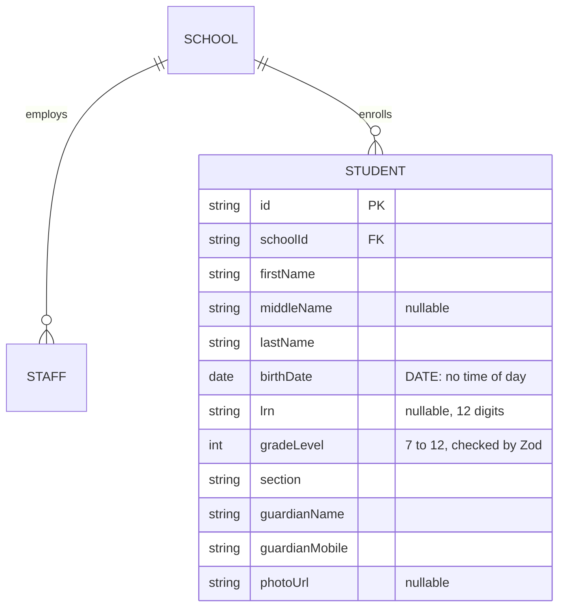

# Step 38: Students in Postgres

## Why

Students are the heart of the app: the dashboard, attendance, the tap station and the parent portal all start from "the students at this school". This step moves them into Postgres, using the same pattern as Step 37, plus three things that are new:

- **A date with no time of day.** A birth date is a calendar day ("2013-04-09"), not a moment in time. Postgres has a `DATE` type for exactly this, and getting it wrong is a classic bug: store it as a timestamp and a student born on 9 April can show up as born on 8 April, depending on the server's time zone.
- **A case-insensitive search**, for the parent's "link a child" lookup (`Cruz` must match `cruz`).
- **Inserting many rows in one query** (`createMany`), instead of one query per row.



## What you'll need

- Step 37 done and approved.
- `talaan-postgres` running.

## Steps

### 1. The model

In `prisma/schema.prisma`, add the other side of the relation to the `School` model, under `staff Staff[]` (`npx prisma format` will line it up):

```prisma
  students Student[]
```

Then add at the end of the file:

```prisma
model Student {
  id             String   @id @default(uuid())
  schoolId       String
  school         School   @relation(fields: [schoolId], references: [id], onDelete: Restrict)
  firstName      String
  middleName     String?
  lastName       String
  // A calendar date with no time of day: Postgres's DATE type.
  birthDate      DateTime @db.Date
  lrn            String?
  gradeLevel     Int
  section        String
  guardianName   String
  guardianMobile String
  photoUrl       String?
  createdAt      DateTime @default(now())
  updatedAt      DateTime @updatedAt

  // Serves both "every student at a school" and the link-a-child lookup.
  @@index([schoolId, lrn])
}
```

**Why each part:**
- **`DateTime @db.Date`**: in Prisma every date is a `DateTime`. `@db.Date` tells Postgres to store only the day. In TypeScript it still arrives as a `Date` object, at midnight UTC, and step 3 turns it back into "YYYY-MM-DD".
- **`String` (required) for `schoolId`** this time: unlike a super admin, every student belongs to a school.
- **One index, two columns.** An index on `(schoolId, lrn)` is sorted by `schoolId` first, so it also serves "every student at this school" on its own. A separate `@@index([schoolId])` would be a second copy of the same information, which Postgres would have to update on every insert for nothing.
- **No `@unique` on `lrn`, yet**, for the same reason as staff emails in Step 37: the add-student form doesn't check for duplicates, so a database rule would show up as a crash rather than a field error.

```bash
npx prisma format
npx prisma migrate dev --name add_student
npx prisma generate
```

Read the migration: `"birthDate" DATE NOT NULL`, one `CREATE INDEX "Student_schoolId_lrn_idx"`, and the foreign key to `School`.

### 2. The repository

Create `src/data/repositories/prisma-student-repository.ts`:

```ts
import { Prisma, type PrismaClient, type Student as StudentRow } from "@/generated/prisma/client";
import { studentSchema } from "@/features/students/schemas";
import type { Student } from "@/features/students/types";
import { prisma } from "@/lib/db";
import type { StudentRepository } from "./student-repository";

/**
 * A DATE column comes back as a JavaScript `Date` at midnight UTC. The app
 * keeps birth dates as plain "YYYY-MM-DD" strings, so take just that part.
 */
function toDateString(date: Date): string {
  return date.toISOString().slice(0, 10);
}

/** "YYYY-MM-DD" → a `Date` at midnight UTC, which Postgres stores as exactly that day. */
function fromDateString(value: string): Date {
  return new Date(`${value}T00:00:00Z`);
}

/** A database row → the app's own `Student`, checked by the same Zod schema the forms use. */
export function toStudent(row: StudentRow): Student {
  return studentSchema.parse({
    id: row.id,
    schoolId: row.schoolId,
    firstName: row.firstName,
    middleName: row.middleName ?? undefined,
    lastName: row.lastName,
    birthDate: toDateString(row.birthDate),
    lrn: row.lrn ?? undefined,
    gradeLevel: row.gradeLevel,
    section: row.section,
    guardianName: row.guardianName,
    guardianMobile: row.guardianMobile,
    photoUrl: row.photoUrl ?? undefined,
  });
}

/** The app's `Student` → the columns Prisma writes. The reverse of `toStudent`. */
export function toStudentData(student: Student) {
  return {
    schoolId: student.schoolId,
    firstName: student.firstName,
    middleName: student.middleName ?? null,
    lastName: student.lastName,
    birthDate: fromDateString(student.birthDate),
    lrn: student.lrn ?? null,
    gradeLevel: student.gradeLevel,
    section: student.section,
    guardianName: student.guardianName,
    guardianMobile: student.guardianMobile,
    photoUrl: student.photoUrl ?? null,
  };
}

const RECORD_NOT_FOUND = "P2025";

/**
 * Oldest first. Seeded students all share one createdAt (one createMany),
 * so the id breaks the tie: "student-0001", "student-0002", ... is the
 * seed's own order.
 */
const OLDEST_FIRST = [{ createdAt: "asc" as const }, { id: "asc" as const }];

export function createPrismaStudentRepository(db: PrismaClient = prisma): StudentRepository {
  return {
    async listBySchool(schoolId) {
      const rows = await db.student.findMany({ where: { schoolId }, orderBy: OLDEST_FIRST });
      return rows.map(toStudent);
    },
    async getById(id) {
      const row = await db.student.findUnique({ where: { id } });
      return row ? toStudent(row) : null;
    },
    async create(student) {
      const row = await db.student.upsert({
        where: { id: student.id },
        update: {},
        create: { id: student.id, ...toStudentData(student) },
      });
      return toStudent(row);
    },
    async update(student) {
      try {
        const row = await db.student.update({ where: { id: student.id }, data: toStudentData(student) });
        return toStudent(row);
      } catch (error) {
        if (error instanceof Prisma.PrismaClientKnownRequestError && error.code === RECORD_NOT_FOUND) {
          return null;
        }
        throw error;
      }
    },
    async findForLink(schoolId, { lrn, lastName, birthDate }) {
      const row = await db.student.findFirst({
        where: {
          schoolId,
          lrn,
          birthDate: fromDateString(birthDate),
          // "cruz" matches "Cruz", like the mock's toLowerCase() comparison.
          lastName: { equals: lastName.trim(), mode: "insensitive" },
        },
      });
      return row ? toStudent(row) : null;
    },
  };
}

/** The one instance the rest of the app actually imports. */
export const studentRepository = createPrismaStudentRepository();
```

**Why each part:**
- **`T00:00:00Z` in `fromDateString`.** The `Z` means UTC. Without it, `new Date("2013-04-09T00:00")` would mean midnight *on your Mac's clock*, which in the Philippines (UTC+8) is 8 April, 4 PM UTC, and Postgres would store 8 April. Always being explicit about UTC means the same day comes back no matter where the server runs (your Mac in Manila, Heroku in the US).
- **`.toISOString().slice(0, 10)`** reads it back: `"2013-04-09T00:00:00.000Z"` → `"2013-04-09"`.
- **`mode: "insensitive"`** is Prisma's case-insensitive comparison (Postgres `ILIKE`). The mock lower-cased both sides. This is the database doing the same thing.
- **`findFirst`, not `findUnique`**: `findUnique` only works on columns marked unique (like `id`). A search on several ordinary columns is `findFirst`.
- **A Prisma gotcha:** in a `where`, a value of `undefined` means "skip this condition", not "match empty". If `lrn` were ever `undefined` here, the search would ignore the LRN entirely and match on name and birth date alone. The interface types `lrn` as `string`, and the form requires 12 digits, so it can't happen today. Keep it in mind whenever a filter value is optional.
- **`update` sends every column, including `schoolId`.** `updateStudent` always passes the student's existing `schoolId`, so it never changes. (Tenant checks get stricter in a later step.)

### 3. A test for the translation

Create `src/data/repositories/prisma-student-repository.test.ts`:

```ts
import { describe, expect, it } from "vitest";
import type { Student as StudentRow } from "@/generated/prisma/client";
import type { Student } from "@/features/students/types";
import { toStudent, toStudentData } from "./prisma-student-repository";

const row: StudentRow = {
  id: "student-a",
  schoolId: "school-a",
  firstName: "Juan",
  middleName: null,
  lastName: "Cruz",
  birthDate: new Date("2013-04-09T00:00:00Z"),
  lrn: "100000000001",
  gradeLevel: 7,
  section: "Rizal",
  guardianName: "Maria Cruz",
  guardianMobile: "09171234567",
  photoUrl: null,
  createdAt: new Date("2026-10-08T00:00:00Z"),
  updatedAt: new Date("2026-10-08T00:00:00Z"),
};

describe("toStudent", () => {
  it("turns a database row into the app's Student", () => {
    expect(toStudent(row)).toEqual({
      id: "student-a",
      schoolId: "school-a",
      firstName: "Juan",
      lastName: "Cruz",
      birthDate: "2013-04-09",
      lrn: "100000000001",
      gradeLevel: 7,
      section: "Rizal",
      guardianName: "Maria Cruz",
      guardianMobile: "09171234567",
    });
  });

  it("rejects a grade outside 7 to 12", () => {
    expect(() => toStudent({ ...row, gradeLevel: 6 })).toThrow();
  });
});

describe("toStudentData", () => {
  const student: Student = {
    id: "student-a",
    schoolId: "school-a",
    firstName: "Juan",
    lastName: "Cruz",
    birthDate: "2013-04-09",
    gradeLevel: 7,
    section: "Rizal",
    guardianName: "Maria Cruz",
    guardianMobile: "09171234567",
  };

  it("stores the birth date as midnight UTC, so the database keeps the same day", () => {
    expect(toStudentData(student).birthDate.toISOString()).toBe("2013-04-09T00:00:00.000Z");
  });

  it("stores a missing LRN and middle name as null", () => {
    expect(toStudentData(student)).toMatchObject({ lrn: null, middleName: null, photoUrl: null });
  });

  it("round-trips: a student saved and read back is the same student", () => {
    const saved = { ...row, ...toStudentData(student), id: student.id };
    expect(toStudent(saved)).toEqual(student);
  });
});
```

The **round-trip** test is the most useful kind for a mapper pair: whatever goes in through `toStudentData` must come back out of `toStudent` unchanged. If someone later adds a field to one function and forgets the other, this fails.

### 4. Flip the switch

**4a.** In `src/data/repositories/index.ts`, replace the five-line student export:

```ts
export {
  studentRepository,
  createMockStudentRepository,
  type StudentRepository,
} from "./student-repository";
```

with:

```ts
export { createMockStudentRepository, type StudentRepository } from "./student-repository";
export { studentRepository, createPrismaStudentRepository } from "./prisma-student-repository";
```

**4b.** In `src/data/repositories/student-repository.ts`, delete the mock singleton at the end:

```ts
export const studentRepository = createMockStudentRepository();
```

### 5. Seed the students

In `prisma/demo-data.ts`:

**5a.** Add `seedStudents` to the seed import, and import `toStudentData`:

```ts
import { seedSchools, seedStaff, seedStudents } from "@/data/seed";
```

```ts
import { toStudentData } from "@/data/repositories/prisma-student-repository";
```

**5b.** In `insertDemoData`, after the staff loop:

```ts

  // 76 students in one query instead of 76. skipDuplicates makes it safe
  // to run again, the same job `update: {}` does for an upsert.
  await db.student.createMany({
    data: seedStudents.map((student) => ({ id: student.id, ...toStudentData(student) })),
    skipDuplicates: true,
  });
```

**5c.** In `printDemoDataSummary`:

```ts
  console.log(`Students: ${await db.student.count()}`);
```

**Why `createMany` here but a loop for staff:** one `createMany` is one `INSERT` with 76 rows, so all 76 share the same `createdAt`. For staff that would have scrambled the order. For students it's fine, because the tie-breaker is the id, and the seed's ids are zero-padded (`student-0001` … `student-0076`), so sorting by id *is* the seed order. That order matters: the tap station picks "the first student who hasn't tapped in yet".

## Verify it worked

1. Seed twice: both print `Students: 76`.

   ```bash
   npx prisma db seed
   npx prisma db seed
   ```

2. Look at a few rows in `psql`.

   > **Opening `psql`.** Docker must be running (if `docker ps` doesn't list `talaan-postgres`, run `docker start talaan-postgres` first).
   >
   > ```bash
   > docker exec -it talaan-postgres psql -U postgres -d talaan
   > ```
   >
   > The prompt changes to `talaan=#`. Type `\q` to leave. What each part of the command means: [Learning log: getting into `psql`](../LEARNING-LOG.md#getting-into-psql-and-what-each-part-of-the-command-means-owner-question).

   Then run:

   ```sql
   SELECT id, "lastName", "birthDate", lrn FROM "Student" ORDER BY id LIMIT 3;
   ```

   `birthDate` shows a plain date like `2014-01-01`, with no time.

3. Checks. 5 more tests than after Step 37:

   ```bash
   npm run lint && npm run check:tokens && npm run typecheck && npm run test && npm run build
   ```

4. In `npm run dev`, as the Balanga principal:
   - **Students**: the list, search, filters and paging look exactly as before.
   - Edit a student (add a middle name), save, restart the dev server: the change is still there. Its birth date hasn't moved by a day. Remove the middle name again.
   - Add a student, restart: still there.

5. Parent link-a-child against the real table: sign out, go to `/parent/signup`, create a parent at Balanga, then link Maria Ramos: LRN `100000000001`, last name typed as `ramos` (lowercase), birth date `2013-02-02`. It links. (The first seed student, Juan Cruz, has no LRN on purpose, so he can't be linked.)

6. Browser tests: `npx playwright test`.

Then tell me what you saw (or paste the exact error).

## If something goes wrong

- **A birth date shows one day early** (for example 8 April instead of 9): `fromDateString` is missing the `Z`, so the date was read in local time.
- **`Invalid value for argument birthDate: premature end of input`** or similar: a value like `"2013-04-09"` reached Prisma without going through `fromDateString`.
- **Typecheck: `'mode' does not exist`**: you're on a stale client. `npx prisma generate`.
- **The tap station picks a different student than before:** the order is off. Check `OLDEST_FIRST` has both `createdAt` and `id`.
- **Link-a-child says not found for the right details:** check the student's `lrn` and `birthDate` in `psql` with the query from check 2. A student with an empty `lrn` can never be linked.

## What you just learned

- **`DATE` vs. timestamp:** a day isn't a moment. Store days as `DATE`, and always convert with an explicit `Z`, so time zones can't shift them.
- **Case-insensitive matching** in the database (`mode: "insensitive"`), instead of loading rows and comparing in JavaScript.
- **`createMany` + `skipDuplicates`:** many rows, one query, and safe to rerun.
- **Composite indexes:** an index on `(a, b)` also serves queries on `a` alone.
- **Round-trip tests** catch two mapper functions drifting apart.

## Before you commit

Run these once "Verify it worked" passes. They're the same checks CI runs, in the same order. [docs/LEARNING-LOG.md](../LEARNING-LOG.md#the-routine-to-run-before-every-commit-and-push-owner-question) explains what each one catches.

```bash
docker start talaan-postgres
npm run lint && npm run check:tokens && npm run typecheck && npm run test && npm run build
```

Before you push, also run the browser tests. They take a few minutes and use the build from the line above:

```bash
npx playwright test
```

If one fails, fix it and rerun that one command, then rerun the whole line before committing. If you're stuck, share the exact error.

## What's next

Step 39 moves ID cards, where the database itself enforces "one active card per student".
