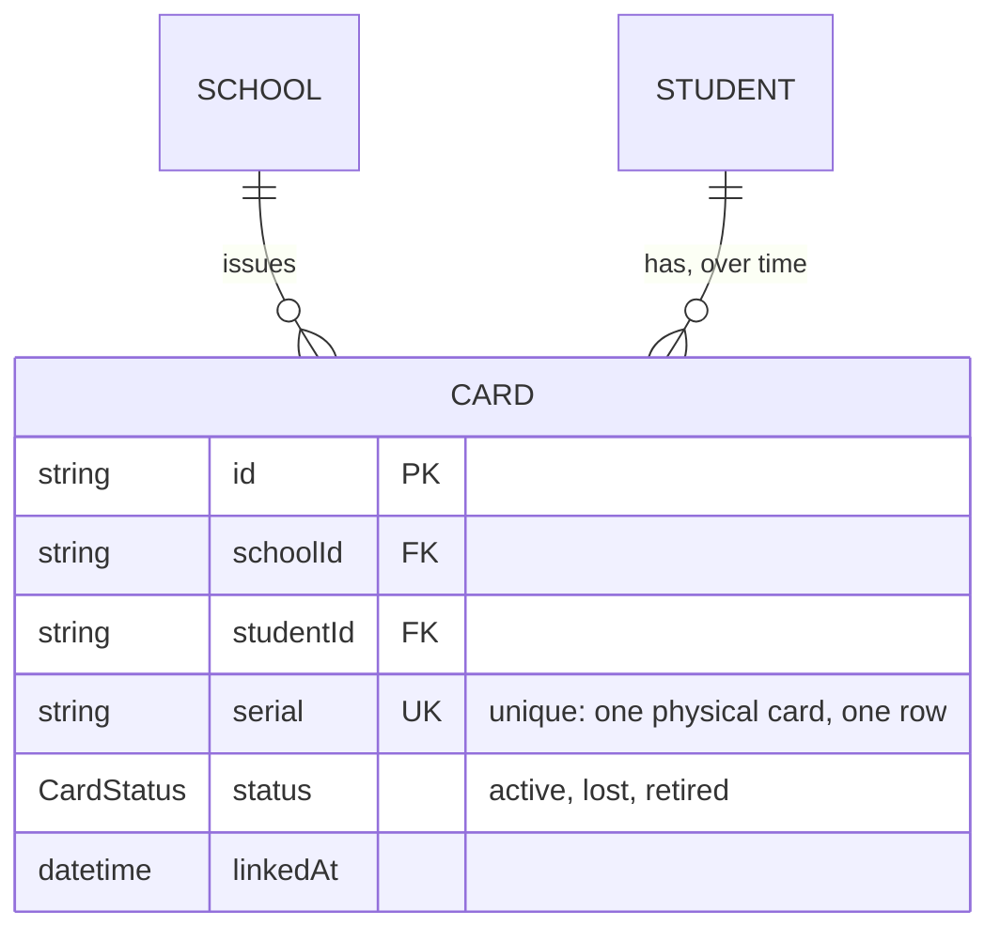

# Step 39: ID cards in Postgres, with "one active card per student" enforced by the database

## Why

Two rules about cards matter a lot at the gate:

1. **A card serial belongs to exactly one card record.** When a tap comes in with serial `04:A3:5F:…`, there must be one answer to "whose card is this?".
2. **A student has at most one active card.** Replacing a card marks the old one lost first. If two cards were ever active at once, a lost card might still let someone in.

The app's code already checks both (`linkCard` refuses a second active card). But code can have bugs, and later a second writer (the gate API) will exist too. This step makes **Postgres itself** refuse to break either rule:

- Rule 1 is a normal **unique** constraint on `serial`.
- Rule 2 is new: a **partial unique index**, "unique `studentId`, but only among rows where `status = 'active'`". A student can have any number of lost or retired cards, but only one active one.



```
studentId     status   serial
student-0001  lost     04:11:6C:…   ┐ any number of lost/retired cards: fine
student-0001  active   04:99:F4:…   ┘ exactly one active card: enforced
student-0001  active   AA:BB:…      ✗ refused by Card_one_active_per_student
```

## What you'll need

- Step 38 done and approved.
- `talaan-postgres` running.

## Steps

### 1. Turn on partial indexes

Prisma can describe a partial index in the schema, but in Prisma 7 it's still a **preview feature**: finished enough to use, but you opt in, and its syntax could still change in a later version. In `prisma/schema.prisma`, change the `generator` block to:

```prisma
generator client {
  provider        = "prisma-client"
  output          = "../src/generated/prisma"
  previewFeatures = ["partialIndexes"]
}
```

(The alternative is writing the index by hand in the migration's SQL. That works, but Prisma doesn't know about it, so a later `migrate dev` may try to drop it. Declaring it in the schema keeps Prisma in charge of it.)

### 2. The model

Add the back-relations: in `School`, under `students Student[]`:

```prisma
  cards    Card[]
```

and in `Student`, after `updatedAt` and before the `@@index` comment, with a blank line before it:

```prisma

  cards Card[]
```

Then at the end of the file:

```prisma
enum CardStatus {
  active
  lost
  retired
}

model Card {
  id        String     @id @default(uuid())
  schoolId  String
  school    School     @relation(fields: [schoolId], references: [id], onDelete: Restrict)
  studentId String
  student   Student    @relation(fields: [studentId], references: [id], onDelete: Restrict)
  // One physical card, one row, forever: a lost card keeps its serial.
  serial    String     @unique
  status    CardStatus @default(active)
  linkedAt  DateTime   @default(now())

  // At most one *active* card per student. Lost and retired cards don't count.
  @@unique([studentId], map: "Card_one_active_per_student", where: { status: "active" })
  @@index([studentId])
}
```

**Why each part:**
- **`serial String @unique`**: a physical card's UID never changes, so the card record keeps it for life, even after it's lost. If a lost card turns up again, the right move is to reactivate that same record, not to link it as a "new" card. (That's not a feature yet, just the reason the rule fits.)
- **`@@unique([studentId], where: { status: "active" })`**: the partial unique index. `where` is the part that makes it partial.
- **`map: "Card_one_active_per_student"`** names the index in the database. Without it Prisma would pick a generic name. With it, the error you'll see in step "Verify" says exactly which rule was broken.
- **`@@index([studentId])` as well**: the partial index only covers active cards. A student's full card history (`listByStudent`, lost cards included) needs a normal index.
- **No index on `schoolId` here**: nothing lists "all cards at a school" yet. Add an index when a query needs one, not before.

```bash
npx prisma format
npx prisma migrate dev --name add_card
npx prisma generate
```

Read the migration. The line to look for:

```sql
CREATE UNIQUE INDEX "Card_one_active_per_student" ON "Card"("studentId") WHERE ("status" = 'active');
```

### 3. The repository

Create `src/data/repositories/prisma-card-repository.ts`:

```ts
import { Prisma, type Card as CardRow, type PrismaClient } from "@/generated/prisma/client";
import { cardSchema } from "@/features/students/schemas";
import type { Card } from "@/features/students/types";
import { prisma } from "@/lib/db";
import type { CardRepository } from "./card-repository";

/** A database row → the app's own `Card`. The app keeps times as ISO strings, the database as real timestamps. */
export function toCard(row: CardRow): Card {
  return cardSchema.parse({
    id: row.id,
    schoolId: row.schoolId,
    studentId: row.studentId,
    serial: row.serial,
    status: row.status,
    linkedAt: row.linkedAt.toISOString(),
  });
}

/** The app's `Card` → the columns Prisma writes. The reverse of `toCard`. */
export function toCardData(card: Card) {
  return {
    schoolId: card.schoolId,
    studentId: card.studentId,
    serial: card.serial,
    status: card.status,
    linkedAt: new Date(card.linkedAt),
  };
}

const RECORD_NOT_FOUND = "P2025";

export function createPrismaCardRepository(db: PrismaClient = prisma): CardRepository {
  return {
    async listByStudent(studentId) {
      const rows = await db.card.findMany({ where: { studentId }, orderBy: { linkedAt: "asc" } });
      return rows.map(toCard);
    },
    async getActiveForStudent(studentId) {
      const row = await db.card.findFirst({ where: { studentId, status: "active" } });
      return row ? toCard(row) : null;
    },
    async getBySerial(serial) {
      const row = await db.card.findUnique({ where: { serial } });
      return row ? toCard(row) : null;
    },
    async create(card) {
      const row = await db.card.upsert({
        where: { id: card.id },
        update: {},
        create: { id: card.id, ...toCardData(card) },
      });
      return toCard(row);
    },
    async markLost(cardId) {
      try {
        const row = await db.card.update({ where: { id: cardId }, data: { status: "lost" } });
        return toCard(row);
      } catch (error) {
        if (error instanceof Prisma.PrismaClientKnownRequestError && error.code === RECORD_NOT_FOUND) {
          return null;
        }
        throw error;
      }
    },
  };
}

/** The one instance the rest of the app actually imports. */
export const cardRepository = createPrismaCardRepository();
```

**Why each part:**
- **`toISOString()` / `new Date(…)`**: the app passes times around as ISO strings (`"2026-06-01T08:00:00Z"`), the database stores real timestamps. Note the database always gives back milliseconds (`"…08:00:00.000Z"`). It's the same moment, only written differently. The app compares times by turning them into dates or by their first 10 characters, so the extra `.000` changes nothing.
- **`findUnique({ where: { serial } })`** works because `serial` is `@unique`. That's also what makes it fast: a unique column always has an index.
- **`getActiveForStudent` uses `findFirst`**, even though the partial index guarantees at most one match. `findUnique` only accepts fully unique columns, and `studentId` alone isn't one.
- **`markLost` updates only `status`**, the one thing that changes. Same "unknown id → `null`" handling as `update` in Steps 35 and 38.
- **Order by `linkedAt`**: a student's card history, oldest first, the same order the mock had.

### 4. A test for the translation

Create `src/data/repositories/prisma-card-repository.test.ts`:

```ts
import { describe, expect, it } from "vitest";
import type { Card as CardRow } from "@/generated/prisma/client";
import { toCard, toCardData } from "./prisma-card-repository";

const row: CardRow = {
  id: "card-a",
  schoolId: "school-a",
  studentId: "student-a",
  serial: "04:A3:5F:2B:91:C0:80",
  status: "active",
  linkedAt: new Date("2026-06-01T08:00:00Z"),
};

describe("toCard", () => {
  it("turns a database row into the app's Card, with the time as an ISO string", () => {
    expect(toCard(row)).toEqual({
      id: "card-a",
      schoolId: "school-a",
      studentId: "student-a",
      serial: "04:A3:5F:2B:91:C0:80",
      status: "active",
      linkedAt: "2026-06-01T08:00:00.000Z",
    });
  });

  it("rejects a serial that isn't uppercase hex pairs", () => {
    expect(() => toCard({ ...row, serial: "04a35f2b" })).toThrow();
  });
});

describe("toCardData", () => {
  it("round-trips: a card saved and read back is the same card", () => {
    const card = toCard(row);
    expect(toCard({ ...row, ...toCardData(card) })).toEqual(card);
  });
});
```

### 5. Flip the switch

**5a.** In `src/data/repositories/index.ts`, replace:

```ts
export { cardRepository, createMockCardRepository, type CardRepository } from "./card-repository";
```

with:

```ts
export { createMockCardRepository, type CardRepository } from "./card-repository";
export { cardRepository, createPrismaCardRepository } from "./prisma-card-repository";
```

**5b.** In `src/data/repositories/card-repository.ts`, delete the mock singleton at the end:

```ts
export const cardRepository = createMockCardRepository();
```

### 6. Seed the cards

In `prisma/demo-data.ts`:

**6a.** Add `seedCards` to the seed import, and import `toCardData`:

```ts
import { seedCards, seedSchools, seedStaff, seedStudents } from "@/data/seed";
import { toCardData } from "@/data/repositories/prisma-card-repository";
```

**6b.** In `insertDemoData`, after the students' `createMany`:

```ts

  await db.card.createMany({
    data: seedCards.map((card) => ({ id: card.id, ...toCardData(card) })),
    skipDuplicates: true,
  });
```

**6c.** In `printDemoDataSummary`:

```ts
  console.log(`Cards: ${await db.card.count()}`);
```

Cards come after students, because each card's `studentId` must already exist.

## Verify it worked

1. Seed twice: both print `Cards: 69`. (Not 76: every ninth student has no card yet, and student-0001 has two, an old lost one and its replacement.)

2. Watch the database enforce the rule, in `psql`.

   > **Opening `psql`.** Docker must be running (if `docker ps` doesn't list `talaan-postgres`, run `docker start talaan-postgres` first).
   >
   > ```bash
   > docker exec -it talaan-postgres psql -U postgres -d talaan
   > ```
   >
   > The prompt changes to `talaan=#`. Type `\q` to leave. What each part of the command means: [Learning log: getting into `psql`](../LEARNING-LOG.md#getting-into-psql-and-what-each-part-of-the-command-means-owner-question).

   Then run:

   ```sql
   SELECT id, serial, status FROM "Card" WHERE "studentId" IN ('student-0001', 'student-0002') ORDER BY "linkedAt";
   INSERT INTO "Card" (id, "schoolId", "studentId", serial) VALUES ('x', 'school-balanga', 'student-0002', 'AA:BB:CC:DD');
   ```

   The first shows student-0001's lost and active cards and student-0002's one active card. The insert, a second **active** card for student-0002, fails:

   ```
   ERROR:  duplicate key value violates unique constraint "Card_one_active_per_student"
   ```

   Now try the same insert with `status` set to `'lost'`: `INSERT INTO "Card" (id, "schoolId", "studentId", serial, status) VALUES ('y', 'school-balanga', 'student-0002', 'AA:BB:CC:DD', 'lost');`. It's accepted, since lost cards don't count. Clean up with `DELETE FROM "Card" WHERE id = 'y';`. Finally, `\d "Card"` lists the index with its `WHERE status = 'active'`.

3. Checks. 3 more tests than after Step 38:

   ```bash
   npm run lint && npm run check:tokens && npm run typecheck && npm run test && npm run build
   ```

4. The replace flow, for real: in `npm run dev` as the Balanga principal, open a student with a linked card, **Card lost? Replace it → Yes**, then **Simulate a card tap**. Restart the dev server and open the student again: the new card is linked and the old one is listed under previous cards.

5. Browser tests: `npx playwright test` (the "replace a student's card" test now writes real rows, which is why Step 36's reset matters).

Then tell me what you saw (or paste the exact error).

## If something goes wrong

- **`Error parsing attribute "@@unique": Partial indexes are a preview feature. Add "partialIndexes" to previewFeatures in your generator block.`**: step 1's `previewFeatures` line is missing or misspelled.
- **Seeding fails with `Unique constraint failed on the constraint: Card_one_active_per_student`**: some student has two active cards. With the seed as-is that can't happen. Check for rows you added by hand.
- **Replacing a card in the app fails with the same error:** the old card wasn't marked lost before the new one was created. `replaceCard` must run (and succeed) before `linkCard`.
- **Typecheck: `Module '"@/generated/prisma/client"' has no exported member 'Card'`**: `npx prisma generate`.

## What you just learned

- **Constraints in the database are the last line of defense.** The app checks the rules, and the database refuses anything that slips past, from any code path.
- **Partial unique indexes** enforce "unique, but only for rows like this". This is the standard tool for "one active X per Y".
- **Preview features:** opt-in Prisma capabilities. Finished enough to use, but read the release notes when upgrading.
- **Naming constraints (`map:`)** makes error messages self-explanatory.
- **The same moment can be written two ways** (`…00Z` and `…00.000Z`). Compare times as times, not as text.

## Before you commit

Run these once "Verify it worked" passes. They're the same checks CI runs, in the same order. [docs/LEARNING-LOG.md](../LEARNING-LOG.md#the-routine-to-run-before-every-commit-and-push-owner-question) explains what each one catches.

```bash
docker start talaan-postgres
npm run lint && npm run check:tokens && npm run typecheck && npm run test && npm run build
```

Before you push, also run the browser tests. They take a few minutes and use the build from the line above:

```bash
npx playwright test
```

If one fails, fix it and rerun that one command, then rerun the whole line before committing. If you're stuck, share the exact error.

## What's next

Step 40 moves taps and alerts, the last tables the gate needs.
