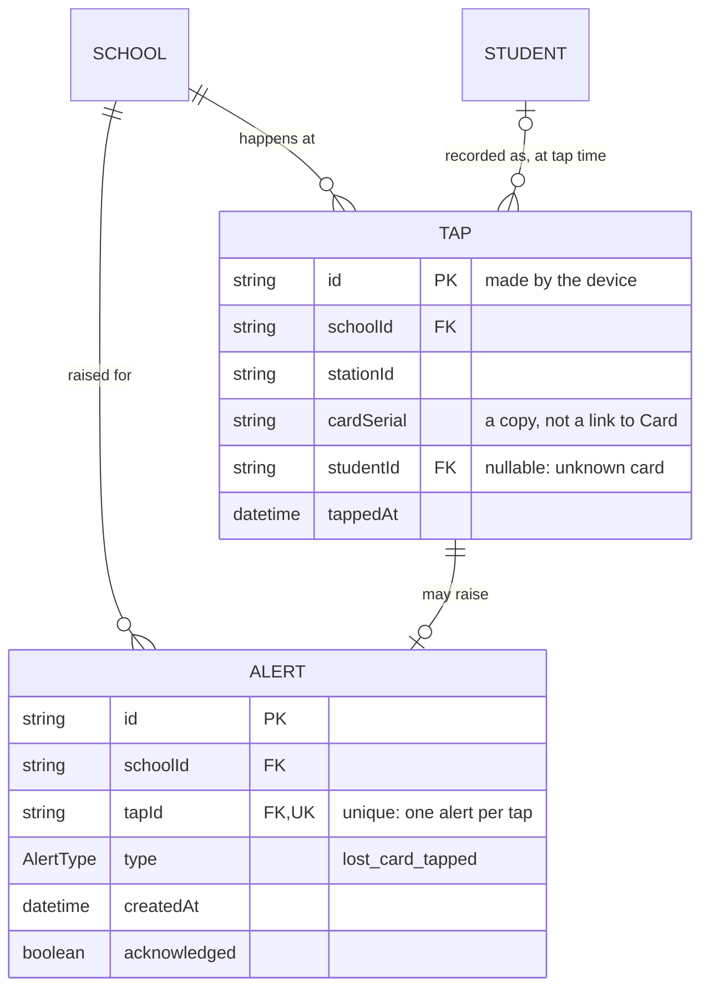

# Step 40: Taps and alerts in Postgres

## Why

A **tap** is the record of one card read at the gate. An **alert** is raised when the card read was a lost one. These are the last tables the gate needs. After this step, every staff-side screen (dashboard, attendance, students, tap station) reads and writes Postgres. Only parents, child links and notifications are still mock, and they move together with parent sign-in.

Taps bring three new ideas:

- **An id made by the device, not the database.** A gate on a bad connection may send the same tap twice. Because the tablet picks the tap's id (a UUID) *before* sending, the second copy has the same id and is ignored. That's called being **idempotent**: doing it twice has the same effect as doing it once.
- **A nullable foreign key.** An unknown card's tap has no student, so `studentId` can be empty. When it's filled, it must point at a real student.
- **A one-to-one relation.** A tap raises at most one alert, and an alert belongs to exactly one tap.



## What you'll need

- Step 39 done and approved.
- `talaan-postgres` running.

## Steps

### 1. The models

Back-relations first. In `School`, under `cards Card[]`:

```prisma
  taps     Tap[]
  alerts   Alert[]
```

In `Student`, under `cards Card[]`:

```prisma
  taps  Tap[]
```

Then at the end of the file:

```prisma
model Tap {
  // Made by the tapping device, not the server: a tap sent twice (a retry
  // after a dropped connection) has the same id, so it's only stored once.
  id         String   @id
  schoolId   String
  school     School   @relation(fields: [schoolId], references: [id], onDelete: Restrict)
  stationId  String
  // Kept as a plain copy, not a link to Card: an unknown card has no row.
  cardSerial String
  // Who the card belonged to at the moment of the tap. Null for an unknown card.
  studentId  String?
  student    Student? @relation(fields: [studentId], references: [id], onDelete: Restrict)
  tappedAt   DateTime
  alert      Alert?

  @@index([schoolId, tappedAt])
  @@index([studentId, tappedAt])
}

enum AlertType {
  lost_card_tapped
}

model Alert {
  id           String    @id @default(uuid())
  schoolId     String
  school       School    @relation(fields: [schoolId], references: [id], onDelete: Restrict)
  // @unique makes this one-to-one: a tap raises at most one alert.
  tapId        String    @unique
  tap          Tap       @relation(fields: [tapId], references: [id], onDelete: Restrict)
  type         AlertType
  createdAt    DateTime  @default(now())
  acknowledged Boolean   @default(false)

  @@index([schoolId])
}
```

**Why each part:**
- **`id String @id` with no `@default`**: every other table lets the database make up an id. Here the caller must always supply it, because the id's whole job is to be the same on a retry.
- **`cardSerial` is plain text, not a relation to `Card`**: a tap from an unknown card still has to be recorded, and there's no card row to point at. It's a copy of what the reader saw.
- **`studentId` is stored, not looked up later**: if the card is re-linked to someone else next month, last month's taps must still say who actually tapped.
- **`stationId` is plain text for now.** Real gate devices get their own table, with their own login token, in the tap API steps. This column becomes a link to it then.
- **`alert Alert?` on `Tap` + `tapId @unique` on `Alert`**: that's how Prisma spells one-to-one. Without `@unique`, one tap could have many alerts (one-to-many).
- **Two-column indexes ending in `tappedAt`**: the app's questions are "this school's taps" and "this student's taps", both read in time order. An index sorted by `(schoolId, tappedAt)` answers the first already in order.
- **`stationId`, `tappedAt` have no defaults**: they always come from the device.

```bash
npx prisma format
npx prisma migrate dev --name add_tap_and_alert
npx prisma generate
```

Read the migration: two tables, `CREATE UNIQUE INDEX "Alert_tapId_key"` (the one-to-one), and four foreign keys. Also notice what it *doesn't* contain: anything about `Card_one_active_per_student`. Prisma knows that index from the schema, so it leaves it alone.

### 2. The tap repository

Create `src/data/repositories/prisma-tap-repository.ts`:

```ts
import type { PrismaClient, Tap as TapRow } from "@/generated/prisma/client";
import { tapSchema } from "@/features/attendance/schemas";
import type { Tap } from "@/features/attendance/types";
import { prisma } from "@/lib/db";
import type { TapRepository } from "./tap-repository";

/** A database row → the app's own `Tap`. */
export function toTap(row: TapRow): Tap {
  return tapSchema.parse({
    id: row.id,
    schoolId: row.schoolId,
    stationId: row.stationId,
    cardSerial: row.cardSerial,
    studentId: row.studentId,
    tappedAt: row.tappedAt.toISOString(),
  });
}

/** The app's `Tap` → the columns Prisma writes. The reverse of `toTap`. */
export function toTapData(tap: Tap) {
  return {
    schoolId: tap.schoolId,
    stationId: tap.stationId,
    cardSerial: tap.cardSerial,
    studentId: tap.studentId,
    tappedAt: new Date(tap.tappedAt),
  };
}

/** Oldest first; the id only breaks a tie between two taps in the same millisecond. */
const EARLIEST_FIRST = [{ tappedAt: "asc" as const }, { id: "asc" as const }];

export function createPrismaTapRepository(db: PrismaClient = prisma): TapRepository {
  return {
    async listBySchool(schoolId) {
      const rows = await db.tap.findMany({ where: { schoolId }, orderBy: EARLIEST_FIRST });
      return rows.map(toTap);
    },
    async listByStudent(studentId) {
      const rows = await db.tap.findMany({ where: { studentId }, orderBy: EARLIEST_FIRST });
      return rows.map(toTap);
    },
    async create(tap) {
      // The device's own id makes this idempotent: a retried tap finds its
      // row already there and changes nothing.
      const row = await db.tap.upsert({
        where: { id: tap.id },
        update: {},
        create: { id: tap.id, ...toTapData(tap) },
      });
      return toTap(row);
    },
  };
}

/** The one instance the rest of the app actually imports. */
export const tapRepository = createPrismaTapRepository();
```

**Why order by time:** the mock returned taps in the order they were added. A database has no such order unless you ask for one. Time order is what every screen means by "the taps", and the screens that show newest-first already sort for themselves.

### 3. The alert repository

Create `src/data/repositories/prisma-alert-repository.ts`:

```ts
import type { Alert as AlertRow, PrismaClient } from "@/generated/prisma/client";
import { alertSchema } from "@/features/attendance/schemas";
import type { Alert } from "@/features/attendance/types";
import { prisma } from "@/lib/db";
import type { AlertRepository } from "./alert-repository";

/** A database row → the app's own `Alert`. */
export function toAlert(row: AlertRow): Alert {
  return alertSchema.parse({
    id: row.id,
    schoolId: row.schoolId,
    tapId: row.tapId,
    type: row.type,
    createdAt: row.createdAt.toISOString(),
    acknowledged: row.acknowledged,
  });
}

/** The app's `Alert` → the columns Prisma writes. The reverse of `toAlert`. */
export function toAlertData(alert: Alert) {
  return {
    schoolId: alert.schoolId,
    tapId: alert.tapId,
    type: alert.type,
    createdAt: new Date(alert.createdAt),
    acknowledged: alert.acknowledged,
  };
}

export function createPrismaAlertRepository(db: PrismaClient = prisma): AlertRepository {
  return {
    async listBySchool(schoolId) {
      const rows = await db.alert.findMany({ where: { schoolId }, orderBy: { createdAt: "asc" } });
      return rows.map(toAlert);
    },
    async create(alert) {
      const row = await db.alert.upsert({
        where: { id: alert.id },
        update: {},
        create: { id: alert.id, ...toAlertData(alert) },
      });
      return toAlert(row);
    },
  };
}

/** The one instance the rest of the app actually imports. */
export const alertRepository = createPrismaAlertRepository();
```

### 4. Tests for the translations

Create `src/data/repositories/prisma-tap-repository.test.ts`:

```ts
import { describe, expect, it } from "vitest";
import type { Tap as TapRow } from "@/generated/prisma/client";
import { toTap, toTapData } from "./prisma-tap-repository";

const row: TapRow = {
  id: "00000000-0000-4000-8000-000000000001",
  schoolId: "school-a",
  stationId: "station-main-gate",
  cardSerial: "04:A3:5F:2B:91:C0:80",
  studentId: "student-a",
  tappedAt: new Date("2026-06-20T07:56:00Z"),
};

describe("toTap", () => {
  it("turns a database row into the app's Tap, with the time as an ISO string", () => {
    expect(toTap(row)).toEqual({
      id: "00000000-0000-4000-8000-000000000001",
      schoolId: "school-a",
      stationId: "station-main-gate",
      cardSerial: "04:A3:5F:2B:91:C0:80",
      studentId: "student-a",
      tappedAt: "2026-06-20T07:56:00.000Z",
    });
  });

  it("keeps an unknown card's tap, with no student", () => {
    expect(toTap({ ...row, studentId: null }).studentId).toBeNull();
  });

  it("rejects an id that isn't a UUID", () => {
    expect(() => toTap({ ...row, id: "tap-1" })).toThrow();
  });
});

describe("toTapData", () => {
  it("round-trips: a tap saved and read back is the same tap", () => {
    const tap = toTap(row);
    expect(toTap({ ...row, ...toTapData(tap) })).toEqual(tap);
  });
});
```

Create `src/data/repositories/prisma-alert-repository.test.ts`:

```ts
import { describe, expect, it } from "vitest";
import type { Alert as AlertRow } from "@/generated/prisma/client";
import { toAlert, toAlertData } from "./prisma-alert-repository";

const row: AlertRow = {
  id: "alert-a",
  schoolId: "school-a",
  tapId: "00000000-0000-4000-8000-000000000008",
  type: "lost_card_tapped",
  createdAt: new Date("2026-06-20T08:05:00Z"),
  acknowledged: false,
};

describe("toAlert", () => {
  it("turns a database row into the app's Alert", () => {
    expect(toAlert(row)).toEqual({
      id: "alert-a",
      schoolId: "school-a",
      tapId: "00000000-0000-4000-8000-000000000008",
      type: "lost_card_tapped",
      createdAt: "2026-06-20T08:05:00.000Z",
      acknowledged: false,
    });
  });
});

describe("toAlertData", () => {
  it("round-trips: an alert saved and read back is the same alert", () => {
    const alert = toAlert(row);
    expect(toAlert({ ...row, ...toAlertData(alert) })).toEqual(alert);
  });
});
```

The "rejects an id that isn't a UUID" test protects idempotency: the app relies on tap ids being device-made UUIDs, and `tapSchema` is what holds that line.

### 5. Flip both switches

**5a.** In `src/data/repositories/index.ts`, replace:

```ts
export { tapRepository, createMockTapRepository, type TapRepository } from "./tap-repository";
export { alertRepository, createMockAlertRepository, type AlertRepository } from "./alert-repository";
```

with:

```ts
export { createMockTapRepository, type TapRepository } from "./tap-repository";
export { tapRepository, createPrismaTapRepository } from "./prisma-tap-repository";
export { createMockAlertRepository, type AlertRepository } from "./alert-repository";
export { alertRepository, createPrismaAlertRepository } from "./prisma-alert-repository";
```

**5b.** Delete the mock singleton at the end of `src/data/repositories/tap-repository.ts`:

```ts
export const tapRepository = createMockTapRepository();
```

and at the end of `src/data/repositories/alert-repository.ts`:

```ts
export const alertRepository = createMockAlertRepository();
```

### 6. Seed taps and alerts

In `prisma/demo-data.ts`:

**6a.** The seed import becomes:

```ts
import { seedAlerts, seedCards, seedSchools, seedStaff, seedStudents, seedTaps } from "@/data/seed";
```

and add two imports:

```ts
import { toAlertData } from "@/data/repositories/prisma-alert-repository";
```

```ts
import { toTapData } from "@/data/repositories/prisma-tap-repository";
```

**6b.** In `insertDemoData`, after the cards' `createMany`:

```ts

  await db.tap.createMany({
    data: seedTaps.map((tap) => ({ id: tap.id, ...toTapData(tap) })),
    skipDuplicates: true,
  });

  // After the taps: an alert points at the tap that raised it.
  await db.alert.createMany({
    data: seedAlerts.map((alert) => ({ id: alert.id, ...toAlertData(alert) })),
    skipDuplicates: true,
  });
```

**6c.** In `printDemoDataSummary`:

```ts
  console.log(`Taps: ${await db.tap.count()}`);
  console.log(`Alerts: ${await db.alert.count()}`);
```

## Verify it worked

1. Seed twice: both runs end with `Taps: 56` and `Alerts: 1`.

2. Your first **join**, in `psql`: taps with the name of who tapped.

   > **Opening `psql`.** Docker must be running (if `docker ps` doesn't list `talaan-postgres`, run `docker start talaan-postgres` first).
   >
   > ```bash
   > docker exec -it talaan-postgres psql -U postgres -d talaan
   > ```
   >
   > The prompt changes to `talaan=#`. Type `\q` to leave. What each part of the command means: [Learning log: getting into `psql`](../LEARNING-LOG.md#getting-into-psql-and-what-each-part-of-the-command-means-owner-question).

   Then run:

   ```sql
   SELECT t."tappedAt", s."firstName", s."lastName", t."cardSerial"
   FROM "Tap" t
   LEFT JOIN "Student" s ON s.id = t."studentId"
   ORDER BY t."tappedAt"
   LIMIT 5;
   ```

   `JOIN … ON` matches each tap to its student. `LEFT` keeps a tap even when it has no student (an unknown card), with empty name columns. This is the question the app asks constantly, answered by the database in one query.

   And the alert with the tap that raised it:

   ```sql
   SELECT a.type, a."createdAt", t."cardSerial" FROM "Alert" a JOIN "Tap" t ON t.id = a."tapId";
   ```

3. Checks. 6 more tests than after Step 39:

   ```bash
   npm run lint && npm run check:tokens && npm run typecheck && npm run test && npm run build
   ```

4. In `npm run dev` as the Balanga principal:
   - **Dashboard → Simulate a tap**. Restart the dev server: the tap is still on the dashboard and in Attendance.
   - **Tap station → Lost card**: an alert appears. Restart: it's still there. In `psql`, `SELECT count(*) FROM "Alert";` is now 2.
   - Afterwards, put the demo data back with `npm run db:reset`.

5. Browser tests, **twice in a row**. This is the reason for Step 36: the tap-station tests use up untapped students, and now those taps are saved.

   ```bash
   npx playwright test
   npx playwright test
   ```

   Both runs pass.

Then tell me what you saw (or paste the exact error).

## If something goes wrong

- **Seeding fails with `Foreign key constraint violated` on `Alert_tapId_fkey`**: the alerts are inserted before the taps. Taps first.
- **`Foreign key constraint violated` on `Tap_studentId_fkey`** when tapping: the tap names a student that isn't in the `Student` table, for example after a manual delete. `npm run db:reset` puts the demo data back.
- **The second Playwright run fails with "Nothing to simulate" or "everyone has tapped in"**: the reset didn't run. Check Step 36's `globalSetup` line in `playwright.config.ts`, and that `E2E_DATABASE_URL` is in `.env`.
- **`ZodError` … `Invalid UUID`** from `toTap`: a tap with a made-up id like `tap-1` got into the table, for example by hand in `psql`. Delete it.
- **Typecheck: no exported member `Tap` or `Alert`**: `npx prisma generate`.

## What you just learned

- **Idempotency by a client-made id:** the safe way to accept retries from a device on a flaky connection.
- **Nullable foreign keys:** "maybe linked, but if linked, linked to something real".
- **One-to-one in Prisma:** an optional relation on one side, `@unique` on the foreign key on the other.
- **Joins:** `JOIN` / `LEFT JOIN` combine rows from two tables. Prisma's `include` does the same thing for you when the app needs it.
- **No implicit order:** a database returns rows in whatever order is convenient unless you say `ORDER BY`.

## Before you commit

Run these once "Verify it worked" passes. They're the same checks CI runs, in the same order. [docs/LEARNING-LOG.md](../LEARNING-LOG.md#the-routine-to-run-before-every-commit-and-push-owner-question) explains what each one catches.

```bash
docker start talaan-postgres
npm run lint && npm run check:tokens && npm run typecheck && npm run test && npm run build
```

Before you push, also run the browser tests. They take a few minutes and use the build from the line above:

```bash
npx playwright test
```

If one fails, fix it and rerun that one command, then rerun the whole line before committing. If you're stuck, share the exact error.

## What's next

The hardware. Before the gate's tap API can be written, the app needs to know exactly what your NFC reader types when a card is tapped (see `docs/ARCHITECTURE.md`'s open question 1). Plug the reader into a computer, open any plain text editor, tap a card three times, and paste exactly what appears, including whether each tap ends with a new line. That sample decides how the gate turns the reader's output into a card serial.
