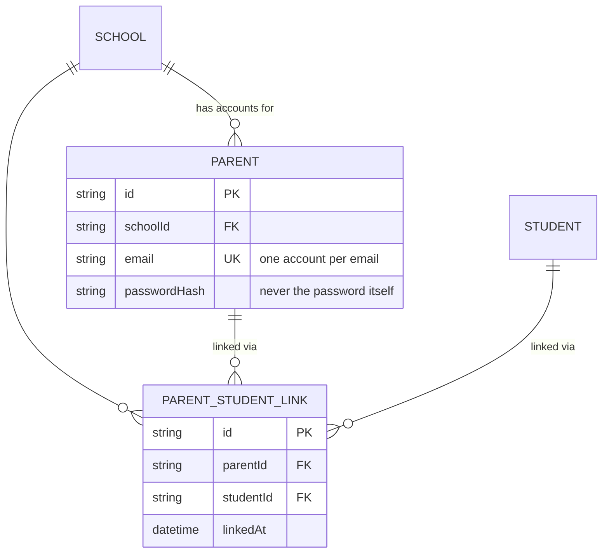
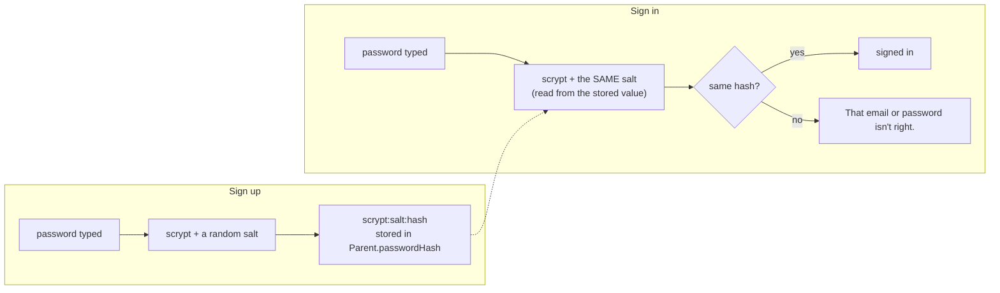

# Step 41: Parents and parent–child links in Postgres, with hashed passwords

> **Fast-track recipe.** Written before the code, for you to approve, then built for you. If building it turns up a difference, this file gets corrected to match what was actually built, and `docs/BUILD-LOG.md` says what changed.

## Why

Parent accounts are still in the in-memory mock. That has two problems:

- **A parent who signs up is gone after a restart.** Same story as schools and staff before Steps 35 and 37.
- **Passwords are stored as plain text.** The mock keeps a `Map` from parent id to the actual password. That was fine for a demo with no database. It's not fine once accounts are real: anyone who can read the database (a backup, a leaked dump, a curious admin) would see every parent's password, and people reuse passwords.

This step moves `Parent` and `ParentStudentLink` into Postgres, and stores only a **password hash**: a scrambled, one-way version of the password. At sign-in, the typed password is scrambled the same way and the two scrambles are compared. The password itself is never stored anywhere.





## What you'll need

- Step 40 done and approved.
- `talaan-postgres` running.

## Steps

### 1. The password helper

Create `src/lib/password.ts`:

```ts
import { randomBytes, scrypt, timingSafeEqual } from "node:crypto";
import { promisify } from "node:util";

const scryptAsync = promisify(scrypt);
const KEY_LENGTH = 64;

/**
 * Turns a password into something safe to store: `scrypt:<salt>:<hash>`.
 * scrypt is deliberately slow (tens of milliseconds) so someone holding a
 * copy of the database can't try billions of guesses. The random salt
 * means two parents with the same password still get different hashes.
 * Built into Node, so no extra dependency.
 */
export async function hashPassword(password: string): Promise<string> {
  const salt = randomBytes(16);
  const hash = (await scryptAsync(password, salt, KEY_LENGTH)) as Buffer;
  return `scrypt:${salt.toString("base64")}:${hash.toString("base64")}`;
}

/** True when `password` is the one `stored` was made from. */
export async function passwordMatches(password: string, stored: string): Promise<boolean> {
  const [algorithm, salt, hash] = stored.split(":");
  if (algorithm !== "scrypt" || !salt || !hash) return false;
  const expected = Buffer.from(hash, "base64");
  const actual = (await scryptAsync(password, Buffer.from(salt, "base64"), expected.length)) as Buffer;
  return timingSafeEqual(actual, expected);
}
```

**Why each part:**
- **A hash, not encryption.** Encryption can be undone with a key. A hash can't be undone at all: the only way to check a password is to hash it again and compare. That's exactly what a login needs, and nothing more.
- **scrypt** is one of the standard password hashes (with bcrypt and Argon2). It ships with Node, so nothing to install.
- **The salt** is 16 random bytes, made fresh for every password and stored next to the hash. Without it, everyone whose password is `Talaan123!` would have the same hash, and one cracked hash would crack them all.
- **`scrypt:` at the start** says which method made the hash. If it's ever upgraded (say, to Argon2), old and new hashes can be told apart.
- **`timingSafeEqual`** compares the two hashes in the same amount of time whether they differ in the first byte or the last. A normal `===` stops at the first difference, and an attacker timing many attempts could learn something from that.
- **`promisify`** turns Node's older callback-style `scrypt` into one you can `await`.

Staff sign-in, later in Phase 2, reuses these two functions.

### 2. A test for the helper

Create `src/lib/password.test.ts`:

```ts
import { describe, expect, it } from "vitest";
import { hashPassword, passwordMatches } from "./password";

describe("hashPassword / passwordMatches", () => {
  it("accepts the right password and rejects a wrong one", async () => {
    const stored = await hashPassword("Talaan123!");
    await expect(passwordMatches("Talaan123!", stored)).resolves.toBe(true);
    await expect(passwordMatches("talaan123!", stored)).resolves.toBe(false);
  });

  it("never stores the password itself, and salts every hash", async () => {
    const first = await hashPassword("Talaan123!");
    const second = await hashPassword("Talaan123!");
    expect(first).not.toContain("Talaan123!");
    expect(first).not.toBe(second);
  });

  it("rejects a stored value it doesn't recognise", async () => {
    await expect(passwordMatches("Talaan123!", "Talaan123!")).resolves.toBe(false);
  });
});
```

The last test is the "old plain-text password" case: if a row ever held the password itself, it must not count as a match.

### 3. The models

In `prisma/schema.prisma`, add to the `School` model, under `alerts Alert[]`:

```prisma
  parents            Parent[]
  parentStudentLinks ParentStudentLink[]
```

and to the `Student` model, under `taps Tap[]`:

```prisma
  parentLinks ParentStudentLink[]
```

Then at the end of the file:

```prisma
model Parent {
  id           String              @id @default(uuid())
  schoolId     String
  school       School              @relation(fields: [schoolId], references: [id], onDelete: Restrict)
  firstName    String
  lastName     String
  mobile       String
  // One account per email. Signup already checks this and shows a friendly
  // message; the database guarantees it even if two signups race.
  email        String              @unique
  // Never the password itself: see src/lib/password.ts.
  passwordHash String
  createdAt    DateTime            @default(now())
  updatedAt    DateTime            @updatedAt
  links        ParentStudentLink[]

  @@index([schoolId])
}

model ParentStudentLink {
  id        String   @id @default(uuid())
  schoolId  String
  school    School   @relation(fields: [schoolId], references: [id], onDelete: Restrict)
  parentId  String
  parent    Parent   @relation(fields: [parentId], references: [id], onDelete: Restrict)
  studentId String
  student   Student  @relation(fields: [studentId], references: [id], onDelete: Restrict)
  linkedAt  DateTime @default(now())

  // A parent links each child once. The link-a-child form already says
  // "already linked"; this makes it impossible, not just unlikely.
  @@unique([parentId, studentId])
  @@index([schoolId])
  @@index([studentId])
}
```

**Why each part:**
- **`email @unique` here, when Step 37 left staff emails alone:** the signup action already checks for an existing email and shows "An account with this email already exists." So a unique rule can't turn into a crash for a normal user, only for two signups at the exact same moment.
- **`ParentStudentLink` is its own table** because the relationship is many-to-many: one parent, several children; one child, several guardians. A many-to-many always needs a table in the middle.
- **`@@unique([parentId, studentId])`** is the same idea: the action already refuses a second link to the same child, and now the database does too.
- **Indexes:** the unique index starts with `parentId`, so it already serves "this parent's children". `studentId` gets its own index for "this child's guardians" (who to notify after a tap).
- **`onDelete: Restrict` everywhere**, like every relation so far. Deleting a parent account (the privacy step, later) will remove its links on purpose, in the same transaction, rather than having it happen silently.

```bash
npx prisma format
npx prisma migrate dev --name add_parent_and_link
npx prisma generate
```

Read the migration: two tables, `CREATE UNIQUE INDEX "Parent_email_key"`, `CREATE UNIQUE INDEX "ParentStudentLink_parentId_studentId_key"`, and five foreign keys.

### 4. The parent repository

Create `src/data/repositories/prisma-parent-repository.ts`:

```ts
import type { Parent as ParentRow, PrismaClient } from "@/generated/prisma/client";
import { parentSchema } from "@/features/parents/schemas";
import type { Parent } from "@/features/parents/types";
import { prisma } from "@/lib/db";
import { hashPassword, passwordMatches } from "@/lib/password";
import type { ParentRepository } from "./parent-repository";

/** A database row → the app's own `Parent`. The password hash never leaves this file. */
export function toParent(row: ParentRow): Parent {
  return parentSchema.parse({
    id: row.id,
    schoolId: row.schoolId,
    firstName: row.firstName,
    lastName: row.lastName,
    mobile: row.mobile,
    email: row.email,
  });
}

/** The app's `Parent` → the columns Prisma writes (the hash is added by `create`). */
export function toParentData(parent: Parent) {
  return {
    schoolId: parent.schoolId,
    firstName: parent.firstName,
    lastName: parent.lastName,
    mobile: parent.mobile,
    email: parent.email,
  };
}

const OLDEST_FIRST = [{ createdAt: "asc" as const }, { id: "asc" as const }];

export function createPrismaParentRepository(db: PrismaClient = prisma): ParentRepository {
  /** Case-insensitive, like the mock: "Ana@Example.com" finds "ana@example.com". */
  function findRowByEmail(email: string) {
    return db.parent.findFirst({ where: { email: { equals: email.trim(), mode: "insensitive" } } });
  }

  return {
    async listBySchool(schoolId) {
      const rows = await db.parent.findMany({ where: { schoolId }, orderBy: OLDEST_FIRST });
      return rows.map(toParent);
    },
    async getById(id) {
      const row = await db.parent.findUnique({ where: { id } });
      return row ? toParent(row) : null;
    },
    async findByEmail(email) {
      const row = await findRowByEmail(email);
      return row ? toParent(row) : null;
    },
    async create(parent, password) {
      const row = await db.parent.upsert({
        where: { id: parent.id },
        update: {},
        create: { id: parent.id, ...toParentData(parent), passwordHash: await hashPassword(password) },
      });
      return toParent(row);
    },
    async verifyPassword(email, password) {
      const row = await findRowByEmail(email);
      if (!row) return null;
      return (await passwordMatches(password, row.passwordHash)) ? toParent(row) : null;
    },
  };
}

/** The one instance the rest of the app actually imports. */
export const parentRepository = createPrismaParentRepository();
```

**Why each part:**
- **`toParent` drops `passwordHash`.** The app's `Parent` type has no password field at all, so a page can never accidentally show or send it. Only `verifyPassword`, inside this file, ever reads the hash.
- **`mode: "insensitive"`** makes Postgres compare emails ignoring upper/lower case, the same as the mock's `.toLowerCase()`. It's a `findFirst`, not `findUnique`, because `findUnique` only does exact matches.
- **The signup action doesn't change.** It still calls `parentRepository.create(parent, password)` with the plain password. Hashing happens in here, at the last moment before saving, so no caller can forget it.

### 5. The link repository

Create `src/data/repositories/prisma-parent-student-link-repository.ts`:

```ts
import type { ParentStudentLink as LinkRow, PrismaClient } from "@/generated/prisma/client";
import { parentStudentLinkSchema } from "@/features/parents/schemas";
import type { ParentStudentLink } from "@/features/parents/types";
import { prisma } from "@/lib/db";
import type { ParentStudentLinkRepository } from "./parent-student-link-repository";

/** A database row → the app's own `ParentStudentLink`. */
export function toParentStudentLink(row: LinkRow): ParentStudentLink {
  return parentStudentLinkSchema.parse({
    id: row.id,
    schoolId: row.schoolId,
    parentId: row.parentId,
    studentId: row.studentId,
    linkedAt: row.linkedAt.toISOString(),
  });
}

/** The app's `ParentStudentLink` → the columns Prisma writes. */
export function toParentStudentLinkData(link: ParentStudentLink) {
  return {
    schoolId: link.schoolId,
    parentId: link.parentId,
    studentId: link.studentId,
    linkedAt: new Date(link.linkedAt),
  };
}

/** In the order the links were made; the id breaks ties between seed rows. */
const FIRST_LINKED_FIRST = [{ linkedAt: "asc" as const }, { id: "asc" as const }];

export function createPrismaParentStudentLinkRepository(db: PrismaClient = prisma): ParentStudentLinkRepository {
  return {
    async listByParent(parentId) {
      const rows = await db.parentStudentLink.findMany({ where: { parentId }, orderBy: FIRST_LINKED_FIRST });
      return rows.map(toParentStudentLink);
    },
    async listByStudent(studentId) {
      const rows = await db.parentStudentLink.findMany({ where: { studentId }, orderBy: FIRST_LINKED_FIRST });
      return rows.map(toParentStudentLink);
    },
    async listBySchool(schoolId) {
      const rows = await db.parentStudentLink.findMany({ where: { schoolId }, orderBy: FIRST_LINKED_FIRST });
      return rows.map(toParentStudentLink);
    },
    async create(link) {
      const row = await db.parentStudentLink.upsert({
        where: { id: link.id },
        update: {},
        create: { id: link.id, ...toParentStudentLinkData(link) },
      });
      return toParentStudentLink(row);
    },
  };
}

/** The one instance the rest of the app actually imports. */
export const parentStudentLinkRepository = createPrismaParentStudentLinkRepository();
```

**About the order:** the seed's links all share one `linkedAt` (`2026-06-01T08:00:00Z`), so the id decides. For one parent's or one student's links, id order is the seed order. For a whole school it isn't quite (`link-balanga-1c` now comes before `link-balanga-2`), but nothing in the app lists a school's links in order, so nothing changes on screen.

### 6. Tests for the translations

Create `src/data/repositories/prisma-parent-repository.test.ts`:

```ts
import { describe, expect, it } from "vitest";
import type { Parent as ParentRow } from "@/generated/prisma/client";
import { toParent, toParentData } from "./prisma-parent-repository";

const row: ParentRow = {
  id: "parent-a",
  schoolId: "school-a",
  firstName: "Liza",
  lastName: "Cruz",
  mobile: "09170000001",
  email: "liza@school-a.example",
  passwordHash: "scrypt:c2FsdA==:aGFzaA==",
  createdAt: new Date("2026-10-09T00:00:00Z"),
  updatedAt: new Date("2026-10-09T00:00:00Z"),
};

describe("toParent", () => {
  it("turns a row into the app's Parent, without the password hash", () => {
    const parent = toParent(row);
    expect(parent).toEqual({
      id: "parent-a",
      schoolId: "school-a",
      firstName: "Liza",
      lastName: "Cruz",
      mobile: "09170000001",
      email: "liza@school-a.example",
    });
    expect(parent).not.toHaveProperty("passwordHash");
  });

  it("rejects a mobile number the app wouldn't accept", () => {
    expect(() => toParent({ ...row, mobile: "12345" })).toThrow();
  });
});

describe("toParentData", () => {
  it("never includes a password field", () => {
    expect(toParentData(toParent(row))).not.toHaveProperty("passwordHash");
  });
});
```

Create `src/data/repositories/prisma-parent-student-link-repository.test.ts`:

```ts
import { describe, expect, it } from "vitest";
import type { ParentStudentLink as LinkRow } from "@/generated/prisma/client";
import { toParentStudentLink, toParentStudentLinkData } from "./prisma-parent-student-link-repository";

const row: LinkRow = {
  id: "link-a",
  schoolId: "school-a",
  parentId: "parent-a",
  studentId: "student-a",
  linkedAt: new Date("2026-06-01T08:00:00Z"),
};

describe("toParentStudentLink", () => {
  it("turns linkedAt into an ISO string", () => {
    expect(toParentStudentLink(row).linkedAt).toBe("2026-06-01T08:00:00.000Z");
  });

  it("round-trips through toParentStudentLinkData", () => {
    const link = toParentStudentLink(row);
    expect(toParentStudentLinkData(link).linkedAt).toEqual(row.linkedAt);
  });
});
```

### 7. Flip the switch

**7a.** In `src/data/repositories/index.ts`, replace:

```ts
export { parentRepository, createMockParentRepository, type ParentRepository } from "./parent-repository";
export {
  parentStudentLinkRepository,
  createMockParentStudentLinkRepository,
  type ParentStudentLinkRepository,
} from "./parent-student-link-repository";
```

with:

```ts
export { createMockParentRepository, type ParentRepository } from "./parent-repository";
export { parentRepository, createPrismaParentRepository } from "./prisma-parent-repository";
export {
  createMockParentStudentLinkRepository,
  type ParentStudentLinkRepository,
} from "./parent-student-link-repository";
export {
  parentStudentLinkRepository,
  createPrismaParentStudentLinkRepository,
} from "./prisma-parent-student-link-repository";
```

**7b.** Delete the last line (and the blank line above it) of both mock files:

- `src/data/repositories/parent-repository.ts`: `export const parentRepository = createMockParentRepository();`
- `src/data/repositories/parent-student-link-repository.ts`: `export const parentStudentLinkRepository = createMockParentStudentLinkRepository();`

`SEED_PARENT_PASSWORD` stays in `parent-repository.ts`: the seed uses it next.

### 8. Seed parents and links

In `prisma/demo-data.ts`:

**8a.** Add `seedParents` and `seedParentStudentLinks` to the `@/data/seed` import, and add:

```ts
import { SEED_PARENT_PASSWORD } from "@/data/repositories/parent-repository";
import { toParentData } from "@/data/repositories/prisma-parent-repository";
import { toParentStudentLinkData } from "@/data/repositories/prisma-parent-student-link-repository";
import { hashPassword } from "@/lib/password";
```

**8b.** In `insertDemoData`, after the alerts' `createMany`:

```ts

  // Every demo parent signs in with the same demo password, stored hashed
  // like any real one. One hash for all six keeps the seed quick.
  const demoPasswordHash = await hashPassword(SEED_PARENT_PASSWORD);
  for (const parent of seedParents) {
    await db.parent.upsert({
      where: { id: parent.id },
      update: {},
      create: { id: parent.id, ...toParentData(parent), passwordHash: demoPasswordHash },
    });
  }

  // After parents and students: a link points at both.
  await db.parentStudentLink.createMany({
    data: seedParentStudentLinks.map((link) => ({ id: link.id, ...toParentStudentLinkData(link) })),
    skipDuplicates: true,
  });
```

**8c.** In `printDemoDataSummary`:

```ts
  console.log(`Parents: ${await db.parent.count()}`);
  console.log(`Parent–child links: ${await db.parentStudentLink.count()}`);
```

**Why one shared hash in the seed:** the six demo parents share one password anyway, and hashing it once instead of six times keeps `db:reset` (which runs before every browser test run) fast. A real signup always gets its own salt through `create`.

## Verify it worked

1. Seed twice: both print `Parents: 6` and `Parent–child links: 10`, after the earlier tables.

   ```bash
   npx prisma db seed
   npx prisma db seed
   ```

2. Look at a stored password in `psql`.

   > **Opening `psql`.** Docker must be running (if `docker ps` doesn't list `talaan-postgres`, run `docker start talaan-postgres` first).
   >
   > ```bash
   > docker exec -it talaan-postgres psql -U postgres -d talaan
   > ```
   >
   > The prompt changes to `talaan=#`. Type `\q` to leave. What each part of the command means: [Learning log: getting into `psql`](../LEARNING-LOG.md#getting-into-psql-and-what-each-part-of-the-command-means-owner-question).

   ```sql
   SELECT email, left("passwordHash", 30) FROM "Parent";
   ```

   Every row starts with `scrypt:`. Nowhere does it say `Talaan123!`.

3. Checks:

   ```bash
   npm run lint && npm run check:tokens && npm run typecheck && npm run test && npm run build
   ```

4. By hand, in `npm run dev`:
   - Sign in at `/parent/login` as `parent-one@balanga.example` / `Talaan123!`. A wrong password shows "That email or password isn't right."
   - Sign out, sign up a new parent, link a child (an LRN, last name and birth date from the Students page). Restart the dev server: you can still sign in as that parent, and the child is still linked.
   - Try linking the same child again: "… is already linked to your account."

5. Browser tests: `npx playwright test`.

## If something goes wrong

- **Typecheck: `Module '"@/generated/prisma/client"' has no exported member 'Parent'`**: run `npx prisma generate`.
- **Seeding fails with `Foreign key constraint violated` on `ParentStudentLink`**: the links ran before parents or students. They go last.
- **`Unique constraint failed on the fields: (email)` while seeding**: a parent with one of the demo emails was created by hand earlier with a different id. `npm run db:reset` puts the demo data back.
- **Sign-in with `Talaan123!` fails for a demo parent:** the row was created before this step by something that stored a different hash. `npm run db:reset`.

## What you just learned

- **Hash, don't store.** A password is only ever checked, never read back, so only a one-way hash is kept.
- **Salt** makes the same password hash differently every time.
- **Many-to-many** needs a table in the middle, with a foreign key to each side.
- **A unique constraint backs up a friendly check.** The form explains the problem; the database guarantees it.
- **Case-insensitive lookups** with `mode: "insensitive"`.

## Before you commit

```bash
docker start talaan-postgres
npm run lint && npm run check:tokens && npm run typecheck && npm run test && npm run build
npx playwright test
```

## What's next

Step 42 moves parent notifications into Postgres, the last of Phase 1's mock tables.
