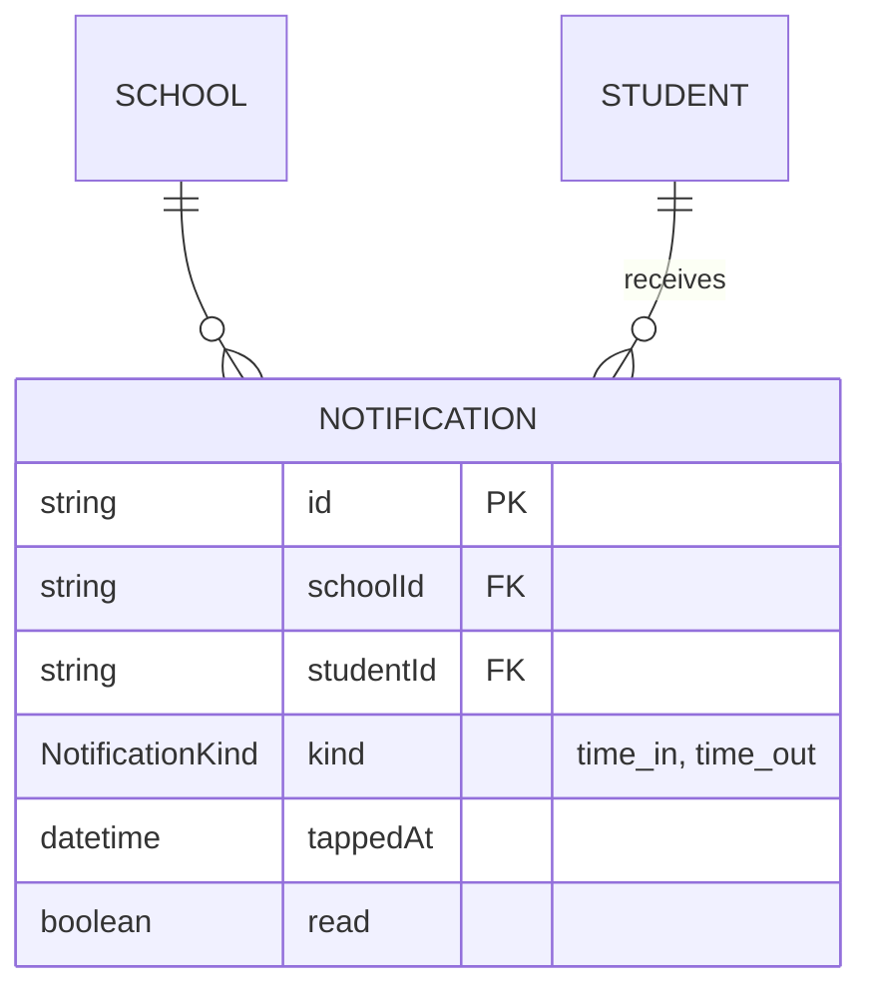

# Step 42: Parent notifications in Postgres

> **Fast-track recipe.** Written before the code, for you to approve, then built for you. If building it turns up a difference, this file gets corrected to match what was actually built, and `docs/BUILD-LOG.md` says what changed.

## Why

The notification bell is the last thing still reading from the in-memory mock. After this step, **every table in the app lives in Postgres**: a simulated tap's notification, and whether a parent has read it, survive a restart.

It's deliberately a straight move, the same shape as Steps 37–41. Later steps add more to this table: a link to the tap that caused it, and the outbox columns (`status`, `attempts`, `sentAt`) that let a worker send real push notifications. Each of those gets added in the step that first needs it, so you see why each column exists.



A parent's feed is "every notification for each of my linked children": `ParentStudentLink` (Step 41) → `studentId` → `Notification`. That join already lives in `src/features/parents/notifications-data.ts`, and it doesn't change.

## What you'll need

- Step 41 done and approved.
- `talaan-postgres` running.

## Steps

### 1. The model

In `prisma/schema.prisma`, add to `School`, under `parentStudentLinks ParentStudentLink[]`:

```prisma
  notifications      Notification[]
```

and to `Student`, under `parentLinks ParentStudentLink[]`:

```prisma
  notifications Notification[]
```

Then at the end of the file:

```prisma
enum NotificationKind {
  time_in
  time_out
}

model Notification {
  id        String           @id @default(uuid())
  schoolId  String
  school    School           @relation(fields: [schoolId], references: [id], onDelete: Restrict)
  studentId String
  student   Student          @relation(fields: [studentId], references: [id], onDelete: Restrict)
  kind      NotificationKind
  // A copy of the tap's time, so the feed can say "arrived 7:56 AM"
  // without looking the tap up.
  tappedAt  DateTime
  read      Boolean          @default(false)
  createdAt DateTime         @default(now())

  @@index([studentId, tappedAt])
  @@index([schoolId])
}
```

**Why each part:**
- **`@@index([studentId, tappedAt])`**: the feed asks "this child's notifications, in time order", once per linked child, every time a parent opens the app or the bell. That's the query to make fast.
- **`read` lives on the notification**, so two guardians of the same child share one read state. That's Phase 1's approved model. Per-parent read state comes with the parent app, if it's wanted.
- **No `updatedAt`:** the only change a notification ever gets is `read` flipping to true.

```bash
npx prisma format
npx prisma migrate dev --name add_notification
npx prisma generate
```

Read the migration: `CREATE TYPE "NotificationKind"`, one table, two indexes, two foreign keys.

### 2. The repository

Create `src/data/repositories/prisma-notification-repository.ts`:

```ts
import type { Notification as NotificationRow, PrismaClient } from "@/generated/prisma/client";
import { notificationSchema } from "@/features/parents/schemas";
import type { Notification } from "@/features/parents/types";
import { prisma } from "@/lib/db";
import type { NotificationRepository } from "./notification-repository";

/** A database row → the app's own `Notification`. */
export function toNotification(row: NotificationRow): Notification {
  return notificationSchema.parse({
    id: row.id,
    schoolId: row.schoolId,
    studentId: row.studentId,
    kind: row.kind,
    tappedAt: row.tappedAt.toISOString(),
    read: row.read,
  });
}

/** The app's `Notification` → the columns Prisma writes. */
export function toNotificationData(notification: Notification) {
  return {
    schoolId: notification.schoolId,
    studentId: notification.studentId,
    kind: notification.kind,
    tappedAt: new Date(notification.tappedAt),
    read: notification.read,
  };
}

const EARLIEST_FIRST = [{ tappedAt: "asc" as const }, { id: "asc" as const }];

export function createPrismaNotificationRepository(db: PrismaClient = prisma): NotificationRepository {
  return {
    async listBySchool(schoolId) {
      const rows = await db.notification.findMany({ where: { schoolId }, orderBy: EARLIEST_FIRST });
      return rows.map(toNotification);
    },
    async listByStudent(studentId) {
      const rows = await db.notification.findMany({ where: { studentId }, orderBy: EARLIEST_FIRST });
      return rows.map(toNotification);
    },
    async getById(id) {
      const row = await db.notification.findUnique({ where: { id } });
      return row ? toNotification(row) : null;
    },
    async create(notification) {
      const row = await db.notification.upsert({
        where: { id: notification.id },
        update: {},
        create: { id: notification.id, ...toNotificationData(notification) },
      });
      return toNotification(row);
    },
    async markRead(id) {
      // updateMany, like Step 37's deleteMany: an unknown id changes 0 rows
      // instead of throwing, and the interface promises `null` for that.
      const { count } = await db.notification.updateMany({ where: { id }, data: { read: true } });
      if (count === 0) return null;
      const row = await db.notification.findUniqueOrThrow({ where: { id } });
      return toNotification(row);
    },
  };
}

/** The one instance the rest of the app actually imports. */
export const notificationRepository = createPrismaNotificationRepository();
```

**Why `Notification as NotificationRow`:** the generated type and the app's type have the same name, and browsers also have a built-in `Notification`. Renaming the import keeps it clear which one each line means.

**Why the feed doesn't need a new sort:** `getParentNotifications` already sorts newest first itself, after combining several children's lists.

### 3. A test for the translation

Create `src/data/repositories/prisma-notification-repository.test.ts`:

```ts
import { describe, expect, it } from "vitest";
import type { Notification as NotificationRow } from "@/generated/prisma/client";
import { toNotification, toNotificationData } from "./prisma-notification-repository";

const row: NotificationRow = {
  id: "notification-a",
  schoolId: "school-a",
  studentId: "student-a",
  kind: "time_out",
  tappedAt: new Date("2026-06-20T16:05:00Z"),
  read: false,
  createdAt: new Date("2026-06-20T16:05:01Z"),
};

describe("toNotification", () => {
  it("turns a row into the app's Notification, dropping createdAt", () => {
    expect(toNotification(row)).toEqual({
      id: "notification-a",
      schoolId: "school-a",
      studentId: "student-a",
      kind: "time_out",
      tappedAt: "2026-06-20T16:05:00.000Z",
      read: false,
    });
  });

  it("round-trips the tap time through toNotificationData", () => {
    expect(toNotificationData(toNotification(row)).tappedAt).toEqual(row.tappedAt);
  });
});
```

### 4. Flip the switch

**4a.** In `src/data/repositories/index.ts`, replace:

```ts
export {
  notificationRepository,
  createMockNotificationRepository,
  type NotificationRepository,
} from "./notification-repository";
```

with:

```ts
export { createMockNotificationRepository, type NotificationRepository } from "./notification-repository";
export { notificationRepository, createPrismaNotificationRepository } from "./prisma-notification-repository";
```

**4b.** In `src/data/repositories/notification-repository.ts`, delete the last line and the blank line above it:

```ts
export const notificationRepository = createMockNotificationRepository();
```

`notify-parents.test.ts` keeps using `createMockNotificationRepository()`, so its tests stay fast and need no database.

### 5. Seed the notifications

In `prisma/demo-data.ts`:

**5a.** Add `seedNotifications` to the `@/data/seed` import, and add:

```ts
import { toNotificationData } from "@/data/repositories/prisma-notification-repository";
```

**5b.** In `insertDemoData`, after the links' `createMany`:

```ts

  await db.notification.createMany({
    data: seedNotifications.map((notification) => ({ id: notification.id, ...toNotificationData(notification) })),
    skipDuplicates: true,
  });
```

**5c.** In `printDemoDataSummary`:

```ts
  console.log(`Notifications: ${await db.notification.count()}`);
```

## Verify it worked

1. Seed twice: both end with `Notifications: 3`.

   ```bash
   npx prisma db seed
   npx prisma db seed
   ```

2. Checks:

   ```bash
   npm run lint && npm run check:tokens && npm run typecheck && npm run test && npm run build
   ```

3. By hand, in `npm run dev`:
   - Sign in as `parent-one@balanga.example` / `Talaan123!`. The bell shows 2 unread.
   - Open the feed and mark everything read. Restart the dev server: still 0 unread.
   - As the Balanga principal, "Simulate a tap" on the dashboard. As `parent-one@balanga.example`, the bell shows a new time-in for the linked child. Restart: still there.

4. Every mock singleton is gone. This should print nothing:

   ```bash
   grep -n "= createMock" src/data/repositories/*.ts | grep -v test
   ```

5. Browser tests: `npx playwright test`, twice.

## If something goes wrong

- **`TypeError: Cannot read properties of undefined (reading 'findMany')`** at `db.notification` while `npm run dev` is running: the dev server was already running when the migration and `npx prisma generate` ran. It keeps its old Prisma Client (cached on `globalThis` in `src/lib/db.ts`), which has no `notification` yet. Stop the dev server (Ctrl+C) and start it again. The same applies after any step that adds a model.
- **Typecheck: `has no exported member 'Notification'`** from `@/generated/prisma/client`: run `npx prisma generate`.
- **The bell shows the old count after marking read:** the page was served from the browser's back/forward cache. Reload. If it persists after a reload, share what you clicked.
- **`grep` in Verify 4 prints a line:** that mock file still has its `export const … = createMock…()` line. Delete it, and check `index.ts` exports the Prisma one instead.

## What you just learned

- **The pattern, one last time:** model → migration → repository with `to…`/`to…Data` → test → flip the export → seed. Every Phase 1 table has now gone through it.
- **`updateMany` for "update if it exists"** without catching an error.
- **Adding columns when they're needed, not before.** The outbox columns this table will grow later each come with the feature that uses them.

## Before you commit

```bash
docker start talaan-postgres
npm run lint && npm run check:tokens && npm run typecheck && npm run test && npm run build
npx playwright test
```

## What's next

Step 43 adds the first table that Phase 1 never had: gate devices, each with its own login token, and the first `/api/v1` endpoint.
