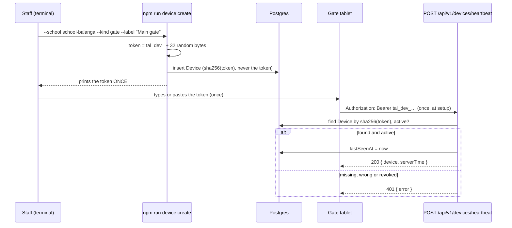

# Step 43: Gate devices, their tokens, and the first `/api/v1` endpoint

> **Fast-track recipe.** Written before the code, for you to approve, then built for you. If building it turns up a difference, this file gets corrected to match what was actually built, and `docs/BUILD-LOG.md` says what changed.

## Why

The gate tablet and the guardhouse monitor aren't people, so they can't sign in like a principal. Nobody should type a password into a gate tablet every morning, and a staff login left open on a tablet at the gate would let anyone walk up and open the admin pages.

Instead, each device gets its own **token**: a long random string, created once by staff, entered once on the device, and sent with every request the device makes. The server stores only a **hash** of it (like Step 41's passwords), so a copy of the database can't be used to impersonate a gate.

This step builds the three pieces every later gate step needs:

1. **A `Device` table**: which school it belongs to, what it is (gate or monitor), its token hash, and when it last checked in.
2. **A way to create one**: a command (`npm run device:create`) that prints the token exactly once. An admin screen for this can come later; the command works today, and works on the production server too.
3. **The first `/api/v1` endpoint**: `POST /api/v1/devices/heartbeat`. The gate's setup screen calls it once, when the token is entered, to check the token works and show which device it belongs to. It also records "last seen". (Decided 2026-10-09: no timer. Every recorded tap marks the gate as seen too, and the guardhouse monitor sends no heartbeat at all.) It's the simplest possible endpoint that still needs the token, so it's the right place to learn how an API route checks who's calling before the tap endpoint does the same with more at stake.



## What you'll need

- Step 42 done and approved.
- `talaan-postgres` running.

## Steps

### 1. The model

In `prisma/schema.prisma`, add to `School`, under `notifications Notification[]`:

```prisma
  devices            Device[]
```

Then at the end of the file:

```prisma
enum DeviceKind {
  gate
  monitor
}

enum DeviceStatus {
  active
  revoked
}

model Device {
  id         String       @id @default(uuid())
  schoolId   String
  school     School       @relation(fields: [schoolId], references: [id], onDelete: Restrict)
  // What staff call it: "Main gate tablet", "Guardhouse monitor".
  label      String
  kind       DeviceKind
  // sha256 of the token. The token itself is shown once and never stored.
  tokenHash  String       @unique
  status     DeviceStatus @default(active)
  // Set by every heartbeat. Null until the device first checks in.
  lastSeenAt DateTime?
  createdAt  DateTime     @default(now())
  updatedAt  DateTime     @updatedAt

  @@index([schoolId])
}
```

**Why each part:**
- **`tokenHash @unique`**: every request looks the device up *by its token hash*, so it needs an index anyway, and two devices can never share a token.
- **`status` instead of deleting**: a lost or stolen tablet gets `revoked`. Its row stays, so its past taps still say which device they came from (the tap step links them).
- **`lastSeenAt` nullable**: a freshly created device hasn't checked in yet. "Never seen" and "seen an hour ago" are different things for staff to know.

```bash
npx prisma format
npx prisma migrate dev --name add_device
npx prisma generate
```

Read the migration: two `CREATE TYPE`s, the table, `CREATE UNIQUE INDEX "Device_tokenHash_key"`, `Device_schoolId_idx`, one foreign key.

### 2. The app's `Device` type

Create `src/features/devices/schemas.ts`:

```ts
import { z } from "zod";

/** A gate station (`/gate`, records taps) or a guardhouse monitor (`/gate/display`, only watches). */
export const deviceKindSchema = z.enum(["gate", "monitor"]);

/** A revoked device's token stops working at once; its row stays so old taps still name it. */
export const deviceStatusSchema = z.enum(["active", "revoked"]);

/**
 * A physical device a school owns. It signs in with its own token, never a
 * staff login. The token's hash is deliberately not part of this type: it
 * stays inside the repository, the same way a parent's password hash does.
 */
export const deviceSchema = z.object({
  id: z.string().min(1),
  schoolId: z.string().min(1),
  label: z.string().trim().min(1, "Enter a label"),
  kind: deviceKindSchema,
  status: deviceStatusSchema,
  lastSeenAt: z.iso.datetime().nullable(),
});
```

Create `src/features/devices/types.ts`:

```ts
import type { z } from "zod";
import type { deviceKindSchema, deviceSchema } from "./schemas";

export type Device = z.infer<typeof deviceSchema>;
export type DeviceKind = z.infer<typeof deviceKindSchema>;
```

### 3. The repository

Phase 1 never had devices, so there's no mock to replace: just an interface and the Prisma version.

Create `src/data/repositories/device-repository.ts`:

```ts
import type { Device } from "@/features/devices/types";

export interface DeviceRepository {
  /** The device a token belongs to, by the token's hash. Revoked devices are returned too; the caller decides. */
  findByTokenHash(tokenHash: string): Promise<Device | null>;
  /** Stores a new device with its token hash (never the token). */
  create(device: Device, tokenHash: string): Promise<Device>;
  /** Marks the device as seen at `at`. A no-op for an unknown id. */
  recordHeartbeat(id: string, at: string): Promise<void>;
}
```

Create `src/data/repositories/prisma-device-repository.ts`:

```ts
import type { Device as DeviceRow, PrismaClient } from "@/generated/prisma/client";
import { deviceSchema } from "@/features/devices/schemas";
import type { Device } from "@/features/devices/types";
import { prisma } from "@/lib/db";
import type { DeviceRepository } from "./device-repository";

/** A database row → the app's own `Device`, without the token hash. */
export function toDevice(row: DeviceRow): Device {
  return deviceSchema.parse({
    id: row.id,
    schoolId: row.schoolId,
    label: row.label,
    kind: row.kind,
    status: row.status,
    lastSeenAt: row.lastSeenAt?.toISOString() ?? null,
  });
}

export function createPrismaDeviceRepository(db: PrismaClient = prisma): DeviceRepository {
  return {
    async findByTokenHash(tokenHash) {
      const row = await db.device.findUnique({ where: { tokenHash } });
      return row ? toDevice(row) : null;
    },
    async create(device, tokenHash) {
      const row = await db.device.create({
        data: {
          id: device.id,
          schoolId: device.schoolId,
          label: device.label,
          kind: device.kind,
          status: device.status,
          tokenHash,
        },
      });
      return toDevice(row);
    },
    async recordHeartbeat(id, at) {
      await db.device.updateMany({ where: { id }, data: { lastSeenAt: new Date(at) } });
    },
  };
}

/** The one instance the rest of the app actually imports. */
export const deviceRepository = createPrismaDeviceRepository();
```

In `src/data/repositories/index.ts`, add at the end:

```ts
export { type DeviceRepository } from "./device-repository";
export { deviceRepository, createPrismaDeviceRepository } from "./prisma-device-repository";
```

**Why `create`, not `upsert` like the others:** every other `create` is idempotent by id because the same id can arrive twice (a retried tap, a double-clicked form). A device is only ever created by the command below, with a fresh id each time, so a plain insert is the honest version.

### 4. The token helpers (the start of `src/services/`)

This is the first file in `src/services/`, the layer `docs/ARCHITECTURE.md` describes: plain functions holding the real rules, callable from an API route, a Server Action or a script alike.

Create `src/services/devices/device-token.ts`:

```ts
import { createHash, randomBytes } from "node:crypto";

/**
 * A new device token: `tal_dev_` plus 32 random bytes. The prefix makes a
 * leaked token easy to recognise (in a log, a screenshot, a chat) and to
 * search for.
 */
export function generateDeviceToken(): string {
  return `tal_dev_${randomBytes(32).toString("base64url")}`;
}

/**
 * What the database stores and looks up. sha256 is enough here, unlike a
 * password: the token is 32 truly random bytes, so there's nothing to
 * guess, and the lookup needs the same input to give the same hash every
 * time (no salt).
 */
export function hashDeviceToken(token: string): string {
  return createHash("sha256").update(token).digest("hex");
}

/** The token from an `Authorization: Bearer <token>` header, or null. */
export function readBearerToken(authorization: string | null): string | null {
  const match = authorization?.match(/^Bearer\s+(\S+)$/i);
  return match ? match[1] : null;
}
```

**Why a fast hash here but scrypt for passwords:** scrypt is slow on purpose because people pick guessable passwords, and slowness makes guessing expensive. A device token is 256 random bits; there's no list of likely tokens to try. A fast hash still means a stolen database can't be turned back into working tokens, and it lets the lookup be a plain `WHERE "tokenHash" = …`.

Create `src/services/devices/authenticate-device.ts`:

```ts
import { deviceRepository, type DeviceRepository } from "@/data/repositories";
import type { Device } from "@/features/devices/types";
import { hashDeviceToken, readBearerToken } from "./device-token";

/**
 * Who is calling, from the request's `Authorization` header: the active
 * device the token belongs to, or null for a missing, unknown or revoked
 * token. Every `/api/v1` route a device calls starts with this.
 */
export async function authenticateDevice(
  authorization: string | null,
  devices: Pick<DeviceRepository, "findByTokenHash"> = deviceRepository,
): Promise<Device | null> {
  const token = readBearerToken(authorization);
  if (!token) return null;

  const device = await devices.findByTokenHash(hashDeviceToken(token));
  return device?.status === "active" ? device : null;
}
```

**Why `devices` is a parameter with a default:** the app calls `authenticateDevice(header)` and gets the real database. The test passes a tiny fake instead, so it runs without Postgres. Same idea as `notifyParentsForTap(tap, deps)`.

**Why one `null` for every failure:** a caller with a bad token learns nothing about *why* (no such token? revoked?). The route just answers 401.

### 5. Tests

Create `src/services/devices/device-token.test.ts`:

```ts
import { describe, expect, it } from "vitest";
import { generateDeviceToken, hashDeviceToken, readBearerToken } from "./device-token";

describe("generateDeviceToken", () => {
  it("makes a long, prefixed, different token every time", () => {
    const first = generateDeviceToken();
    expect(first).toMatch(/^tal_dev_[A-Za-z0-9_-]{43}$/);
    expect(generateDeviceToken()).not.toBe(first);
  });
});

describe("hashDeviceToken", () => {
  it("gives the same hash for the same token, and never the token itself", () => {
    const hash = hashDeviceToken("tal_dev_abc");
    expect(hashDeviceToken("tal_dev_abc")).toBe(hash);
    expect(hash).toMatch(/^[0-9a-f]{64}$/);
    expect(hashDeviceToken("tal_dev_abd")).not.toBe(hash);
  });
});

describe("readBearerToken", () => {
  it("reads the token from a Bearer header", () => {
    expect(readBearerToken("Bearer tal_dev_abc")).toBe("tal_dev_abc");
    expect(readBearerToken("bearer tal_dev_abc")).toBe("tal_dev_abc");
  });

  it("returns null for anything else", () => {
    expect(readBearerToken(null)).toBeNull();
    expect(readBearerToken("tal_dev_abc")).toBeNull();
    expect(readBearerToken("Basic dXNlcjpwYXNz")).toBeNull();
    expect(readBearerToken("Bearer ")).toBeNull();
  });
});
```

Create `src/services/devices/authenticate-device.test.ts`:

```ts
import { describe, expect, it } from "vitest";
import type { Device } from "@/features/devices/types";
import { authenticateDevice } from "./authenticate-device";
import { hashDeviceToken } from "./device-token";

const gate: Device = {
  id: "device-a",
  schoolId: "school-a",
  label: "Main gate tablet",
  kind: "gate",
  status: "active",
  lastSeenAt: null,
};

/** A stand-in for the database: knows exactly one token. */
function devicesWith(device: Device, token: string) {
  return {
    async findByTokenHash(tokenHash: string) {
      return tokenHash === hashDeviceToken(token) ? device : null;
    },
  };
}

describe("authenticateDevice", () => {
  it("finds the active device a token belongs to", async () => {
    const devices = devicesWith(gate, "tal_dev_good");
    await expect(authenticateDevice("Bearer tal_dev_good", devices)).resolves.toEqual(gate);
  });

  it("rejects a wrong or missing token", async () => {
    const devices = devicesWith(gate, "tal_dev_good");
    await expect(authenticateDevice("Bearer tal_dev_bad", devices)).resolves.toBeNull();
    await expect(authenticateDevice(null, devices)).resolves.toBeNull();
  });

  it("rejects a revoked device's token", async () => {
    const devices = devicesWith({ ...gate, status: "revoked" }, "tal_dev_good");
    await expect(authenticateDevice("Bearer tal_dev_good", devices)).resolves.toBeNull();
  });
});
```

And one for the row translation, `src/data/repositories/prisma-device-repository.test.ts`:

```ts
import { describe, expect, it } from "vitest";
import type { Device as DeviceRow } from "@/generated/prisma/client";
import { toDevice } from "./prisma-device-repository";

const row: DeviceRow = {
  id: "device-a",
  schoolId: "school-a",
  label: "Main gate tablet",
  kind: "gate",
  tokenHash: "a".repeat(64),
  status: "active",
  lastSeenAt: null,
  createdAt: new Date("2026-10-09T00:00:00Z"),
  updatedAt: new Date("2026-10-09T00:00:00Z"),
};

describe("toDevice", () => {
  it("leaves the token hash behind", () => {
    expect(toDevice(row)).not.toHaveProperty("tokenHash");
  });

  it("keeps 'never seen' as null and a heartbeat as an ISO time", () => {
    expect(toDevice(row).lastSeenAt).toBeNull();
    const seen = toDevice({ ...row, lastSeenAt: new Date("2026-10-09T07:30:00Z") });
    expect(seen.lastSeenAt).toBe("2026-10-09T07:30:00.000Z");
  });
});
```

### 6. The command that creates a device

Create `scripts/create-device.ts`:

```ts
import "dotenv/config";
import { parseArgs } from "node:util";
import { deviceRepository, schoolRepository } from "@/data/repositories";
import { deviceKindSchema } from "@/features/devices/schemas";
import { prisma } from "@/lib/db";
import { generateDeviceToken, hashDeviceToken } from "@/services/devices/device-token";

/**
 * Creates a gate or monitor device and prints its token, once. Usage:
 *
 *   npm run device:create -- --school school-balanga --kind gate --label "Main gate tablet"
 *
 * Runs against whatever DATABASE_URL points at, so the same command sets up
 * a device locally or (later) on the production server.
 */
async function main() {
  const { values } = parseArgs({
    options: {
      school: { type: "string" },
      kind: { type: "string" },
      label: { type: "string" },
    },
  });

  const kind = deviceKindSchema.safeParse(values.kind);
  if (!values.school || !kind.success || !values.label?.trim()) {
    throw new Error('Usage: npm run device:create -- --school <schoolId> --kind gate|monitor --label "<label>"');
  }

  const school = await schoolRepository.getById(values.school);
  if (!school) throw new Error(`No school with id "${values.school}".`);

  const token = generateDeviceToken();
  const device = await deviceRepository.create(
    {
      id: crypto.randomUUID(),
      schoolId: school.id,
      label: values.label.trim(),
      kind: kind.data,
      status: "active",
      lastSeenAt: null,
    },
    hashDeviceToken(token),
  );

  console.log(`Created ${device.kind} "${device.label}" for ${school.name}.`);
  console.log(`Device id: ${device.id}`);
  console.log("");
  console.log("Token (shown only this once; enter it on the device, then don't keep a copy):");
  console.log(token);
}

main()
  .catch((error) => {
    console.error(error instanceof Error ? error.message : error);
    process.exitCode = 1;
  })
  .finally(() => prisma.$disconnect());
```

In `package.json`'s `"scripts"`, after `"db:reset"`:

```json
"device:create": "tsx scripts/create-device.ts",
```

**Why each part:**
- **`parseArgs`** is Node's built-in reader for `--name value` options. The `--` after `npm run device:create` tells npm "everything after this goes to the script, not to npm".
- **`deviceKindSchema.safeParse`**: the same Zod enum the app uses, so the command can't create a kind the app doesn't know.
- **The token is printed and then gone.** Only its hash was saved. If it's lost, create a new device and revoke the old one; there's no "show me the token again", on purpose.
- **No localhost guard**, unlike `db:reset`: this command only *adds* a row, and creating devices on the real server is exactly what it's for.

### 7. The heartbeat endpoint

Create `src/app/api/v1/devices/heartbeat/route.ts`:

```ts
import { deviceRepository } from "@/data/repositories";
import { authenticateDevice } from "@/services/devices/authenticate-device";

/**
 * A device checks in: "this token works, and I'm online." The gate's setup
 * screen calls it once when a token is entered, and shows the device's own
 * details it answers with ("Connected as Main gate tablet"). There's no
 * timer: during the day every recorded tap marks the gate as seen too.
 * Also answers with the server's clock, so a device can notice its own
 * clock is wrong.
 */
export async function POST(request: Request) {
  const device = await authenticateDevice(request.headers.get("authorization"));
  if (!device) {
    return Response.json({ error: "Missing, unknown or revoked device token." }, { status: 401 });
  }

  const now = new Date().toISOString();
  await deviceRepository.recordHeartbeat(device.id, now);

  return Response.json({
    device: { id: device.id, schoolId: device.schoolId, label: device.label, kind: device.kind },
    serverTime: now,
  });
}
```

**Why each part:**
- **`route.ts` in `app/api/v1/devices/heartbeat/`**: the folder path is the URL. `export async function POST` answers `POST` requests there; any other method gets `405 Method Not Allowed` from Next.js automatically.
- **Thin on purpose:** check the token, do one thing, answer. The rule for "who is this" lives in `authenticateDevice`, which the tap endpoint will reuse unchanged.
- **`Response.json(body, { status })`** is the standard web `Response`, no Next.js-specific helper needed. 401 means "I don't know who you are", which is the right answer for a bad token.
- **POST, not GET:** it changes something (`lastSeenAt`), and a POST route is never cached.
- **`serverTime`** lets a device notice its own clock is wrong, which matters once taps carry the device's time.

## Verify it worked

1. Create a gate device for Balanga:

   ```bash
   npm run device:create -- --school school-balanga --kind gate --label "Main gate tablet"
   ```

   It prints the school, a device id, and a token starting `tal_dev_`. Copy the token into a variable for the next commands (replace the example with yours):

   ```bash
   TOKEN=tal_dev_paste_yours_here
   ```

2. Start the app (`npm run dev`), and in a second terminal:

   ```bash
   curl -i -X POST http://localhost:3000/api/v1/devices/heartbeat -H "Authorization: Bearer $TOKEN"
   ```

   `HTTP/1.1 200 OK`, then JSON with your device's label and a `serverTime`.

3. The failures:

   ```bash
   curl -i -X POST http://localhost:3000/api/v1/devices/heartbeat
   curl -i -X POST http://localhost:3000/api/v1/devices/heartbeat -H "Authorization: Bearer tal_dev_wrong"
   curl -i http://localhost:3000/api/v1/devices/heartbeat -H "Authorization: Bearer $TOKEN"
   ```

   `401`, `401`, and `405` (a GET, which this route doesn't answer).

4. In `psql`:

   > **Opening `psql`.** Docker must be running (if `docker ps` doesn't list `talaan-postgres`, run `docker start talaan-postgres` first).
   >
   > ```bash
   > docker exec -it talaan-postgres psql -U postgres -d talaan
   > ```
   >
   > The prompt changes to `talaan=#`. Type `\q` to leave. What each part of the command means: [Learning log: getting into `psql`](../LEARNING-LOG.md#getting-into-psql-and-what-each-part-of-the-command-means-owner-question).

   ```sql
   SELECT label, kind, status, "lastSeenAt", left("tokenHash", 12) FROM "Device";
   UPDATE "Device" SET status = 'revoked' WHERE label = 'Main gate tablet';
   ```

   The first shows `lastSeenAt` set by step 2, and a hash that looks nothing like your token. After the `UPDATE`, step 2's `curl` answers `401`: a revoked tablet is locked out at once.

5. Checks:

   ```bash
   npm run lint && npm run check:tokens && npm run typecheck && npm run test && npm run build
   ```

Devices aren't part of the demo data, so `npm run db:reset` removes any you've made. Run `device:create` again afterwards.

## If something goes wrong

- **`Usage: npm run device:create -- …`**: a missing option, or a kind other than `gate`/`monitor`. Check the `--` after `device:create`.
- **`No school with id "…"`**: use an id like `school-balanga`, not the school's name.
- **`curl` says `Could not resolve host` or connection refused:** the dev server isn't running, or runs on another port (check what `npm run dev` printed).
- **Always `401` even with the right token:** an extra quote or space got into `TOKEN`. `echo "$TOKEN"` should print just `tal_dev_…`. Or the device was revoked or removed by a `db:reset`.
- **`404` instead of `401`:** the file isn't at exactly `src/app/api/v1/devices/heartbeat/route.ts`.

## What you just learned

- **Device tokens:** a machine's long-lived login, shown once, stored hashed, revoked instead of deleted.
- **Which hash when:** slow and salted for passwords people choose, fast for long random tokens.
- **Route handlers:** a `route.ts` file exporting `POST` is an API endpoint at that folder's URL.
- **The `Authorization: Bearer` header**, the standard way an API caller says who it is.
- **The service layer's first file:** rules in `src/services/`, routes kept thin.

## Before you commit

```bash
docker start talaan-postgres
npm run lint && npm run check:tokens && npm run typecheck && npm run test && npm run build
npx playwright test
```

## What's next

Step 44 replaces Phase 1's fixed demo date with the real clock, in Philippine time, so a tap at 7:50 AM in Balanga lands on the right day. Every step after it records real taps, so this has to come first.
