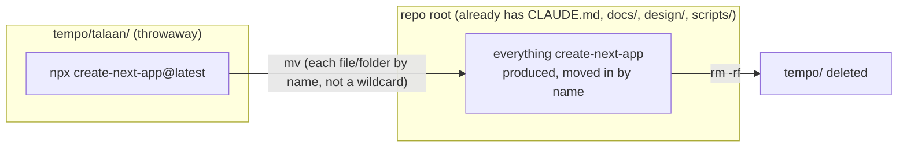

# Recipe: Step 1 — Scaffold the Next.js project

A literal, ordered checklist of what actually happened for this step — reconstructed from its real commit (`1913d75`, `chore: scaffold Nextjs app`) rather than from memory, so it's accurate to what's really in the repo. Follow it in order on a clean checkout and you get the same result.

**What this is, and isn't:** this is the *how* — exact commands, and what ended up in each file and why. For the *why* behind a choice between alternatives, see `docs/BUILD-LOG.md`'s Step 1 entry. This recipe only covers what a developer rebuilding the actual app needs — it leaves out anything that was purely about setting up Claude's own tooling (for example, the shadcn MCP server connection), since that has nothing to do with the app itself.

## Starting point

Before this step, the repo contained only what the owner's own first commit added (`5c8e63a`, `initial setup`) — no Next.js app yet:
```
.claude/settings.json
CLAUDE.md                  (already had "@AGENTS.md" at the top)
design/assets/*.jpg,.png
design/school-portal-prototype.html
docs/OWNER-GUIDE.md
docs/PLAN.md
scripts/progress.mjs
```

## Diagram



## Checklist

1. **Scaffold into a throwaway folder, not the repo root** — `create-next-app` doesn't know this folder already has files in it, so it's run somewhere separate first:
   ```bash
   npx create-next-app@latest tempo/talaan
   ```
   The flags that reproduce this exact output (confirmed from the committed `tsconfig.json`/`package.json` — the literal command line itself wasn't recorded verbatim at the time, since this step predates the Build Log's live-recording habit):
   - TypeScript: yes
   - ESLint: yes
   - Tailwind CSS: yes
   - `src/` directory: yes
   - App Router: yes
   - Import alias: `@/*`
   - Package manager: npm

2. **Delete the scaffold's own `.git` folder** before moving anything — the real repo's history already exists; a nested one would conflict.
   ```bash
   rm -rf tempo/talaan/.git
   ```

3. **Move each generated file/folder into the repo root by name, not with a wildcard** — a wildcard (`mv tempo/talaan/* ./`) would silently skip dotfiles like `.gitignore`, and risks overwriting something already there.
   ```bash
   mv tempo/talaan/.gitignore ./
   mv tempo/talaan/AGENTS.md ./
   mv tempo/talaan/README.md ./
   mv tempo/talaan/eslint.config.mjs ./
   mv tempo/talaan/next.config.ts ./
   mv tempo/talaan/package.json ./
   mv tempo/talaan/package-lock.json ./
   mv tempo/talaan/postcss.config.mjs ./
   mv tempo/talaan/tsconfig.json ./
   mv tempo/talaan/public ./
   mv tempo/talaan/src ./
   ```
   Nothing already at the repo root gets touched — in particular, the existing `CLAUDE.md` is left exactly as-is (it already had `@AGENTS.md` at the top from the owner's own initial commit, so there was nothing to add there).

4. **Delete the now-empty throwaway folder.**
   ```bash
   rm -rf tempo
   ```

5. **Add one script to `package.json`'s `"scripts"` block** — the only manual edit to a scaffolded file in this step:
   ```json
   "progress": "node scripts/progress.mjs"
   ```
   Runs `scripts/progress.mjs` (already in the repo from the owner's initial commit) to regenerate `docs/PLAN.md`'s progress table from its checkboxes.

6. **Install dependencies** (the scaffold's own `package-lock.json` was committed, but `node_modules` itself never is):
   ```bash
   npm install
   ```

7. **Verify the three commands `docs/PLAN.md`'s "Done when" line names:**
   ```bash
   npm run dev     # confirm the starter page loads at localhost:3000, then stop it
   npm run lint
   npm run build
   ```

8. **Tick this step's build-task checkboxes** in `docs/PLAN.md` (not "Owner review" — that box stays unchecked until the owner actually says "approved"), then regenerate the progress block:
   ```bash
   npm run progress
   ```

9. **Stop and report** — plain-language summary of what changed, how to see it running, and the suggested commit message. Wait for the owner to review before anything is committed.

## What ended up in each file, and why

Everything below is `create-next-app`'s own output — nothing here was hand-written this step, except the one `package.json` line in step 5 above.

| File | What's in it | Why |
|---|---|---|
| `.gitignore` | Ignores `node_modules`, `.next`/`out`/`build` (build output), `*.tsbuildinfo`, `next-env.d.ts`, `.env*`, OS/editor junk (`.DS_Store`). | Standard for any Next.js project — none of these belong in version control (build output is regenerated, `node_modules` is reinstalled from the lockfile). |
| `tsconfig.json` | `"strict": true`; `"paths": { "@/*": ["./src/*"] }`; `target: ES2017`, `moduleResolution: "bundler"`. | Strict mode is a hard requirement (CLAUDE.md: "TypeScript with `strict`"). The `@/*` alias is what makes `import { Button } from "@/components/ui/button"` work anywhere in the app instead of long relative paths like `../../../components/ui/button`. |
| `eslint.config.mjs` | Flat config (`defineConfig([...])`) extending `eslint-config-next`'s `core-web-vitals` and `typescript` rule sets. | This is Next 16's current config format (a plain array of rule sets), not the older `.eslintrc.json` file format — using the outdated format would silently not apply Next's own React/accessibility rules. |
| `postcss.config.mjs` | One plugin: `"@tailwindcss/postcss"`. | This is what actually turns Tailwind's `@import "tailwindcss"` (in `globals.css`) into real CSS at build time — without this, Tailwind classes would do nothing. |
| `next.config.ts` | An empty `NextConfig` object — no options set yet. | Nothing to configure yet; later steps add to this file only when a specific setting is actually needed. |
| `package.json` scripts | `dev`, `build`, `start`, `lint` (from the scaffold) + `progress` (added this step). | `lint` runs ESLint only — `format`, `typecheck` and `test` scripts don't exist yet; Step 2 adds them. |
| `AGENTS.md` | A short note explaining this Next.js version may differ from an AI assistant's training data, and to check `node_modules/next/dist/docs/` first. | Generated automatically by Next.js itself (not by `create-next-app` once and done — `next dev` re-writes this file's block every time it starts, which is why `AGENTS.md` shows up as "changed" in `git status` after running `npm run dev`, even with no real edits). It exists purely to guide an AI coding assistant working in this repo; a human developer can ignore it. |
| `README.md` | `create-next-app`'s own default readme (generic "this is a Next.js project" text). | Left as the default for this step — Step 2 rewrites it with the project's real name, setup steps and a table of every script. |
| `public/*.svg`, `src/app/favicon.ico` | The default Next.js/Vercel logo icons. | Scaffold placeholders, never referenced by the real app; safe to ignore (and eventually delete, though nothing has yet). |
| `src/app/globals.css` | Tailwind's `@import "tailwindcss"` plus a couple of default CSS variables. | Replaced wholesale in Step 4 once the project's own design tokens exist. |
| `src/app/layout.tsx`, `src/app/page.tsx` | The default "Get started by editing `src/app/page.tsx`" starter page. | Also replaced in Step 4 — this step's only job is proving the scaffold itself works, not building real UI. |

## Verification

Same three commands as checklist step 7. `npm run build` succeeding is the real signal the scaffold is sound; `npm run dev` is just eyeballing that the default Next.js starter page renders.
