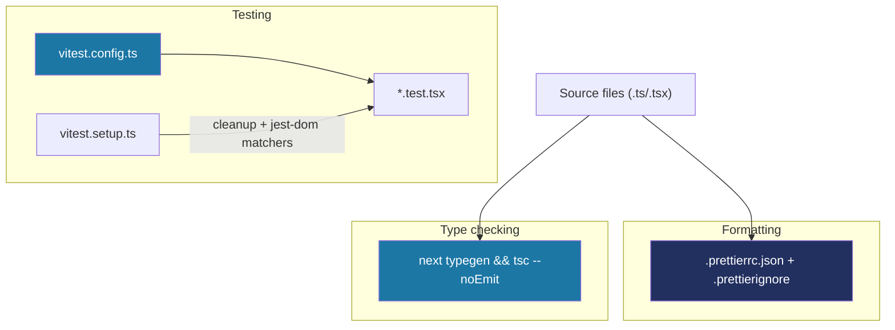

# Recipe: Step 2 — Formatting, type-check and test tooling

Reconstructed from the real commit (`c64022e`, `chore: add formatting, typecheck and test tooling`), with one correction folded in: this step originally shipped a `typecheck` script that a later step (Step 3, CI) found to be broken on a clean checkout. Rather than have you hit that same failure, this recipe gives the corrected script directly. If you want the full story of *why* it was wrong, see `docs/BUILD-LOG.md`'s Step 3 entry, "A real bug the CI caught."

**Left out on purpose:** the shadcn MCP server connection (`.mcp.json`, the `shadcn` devDependency) landed in this same real commit, but it's Claude's own tooling setup, not part of the app — not covered here.

## Starting point

Step 1's scaffold: a working `dev`/`lint`/`build`, no formatter, no type-check script, no tests.

## Diagram



## Checklist

1. **Confirm the machine's Node version is 24 or newer** before installing anything (`node -v`). This project's floor is Node 24, kept identical between your machine and CI on purpose, so a dependency that only works on newer Node never passes locally and then fails in CI (or vice versa).

2. **Install the formatting and testing dependencies, with two versions pinned deliberately:**
   ```bash
   npm install --save-dev prettier vitest@^4.1.11 @vitejs/plugin-react@^4.7.0 jsdom @testing-library/react @testing-library/jest-dom
   ```
   - `vitest` is pinned to the `4.x` line, not "latest" (`5.x`) — Vitest 5 requires `@types/node@^22`, and this project's `@types/node@^20` would conflict. (Since CLAUDE.md now sets the Node floor at 24, a future bump to `@types/node@^22`+ and Vitest 5 is a reasonable deliberate upgrade — just update both together.)
   - `@vitejs/plugin-react` is pinned to the `4.x` line, not "latest" (`6.x`) — the newest major optionally pulls in a Babel version that conflicts with another already-installed tool.

   You may see npm report that it blocked a couple of packages' `postinstall` scripts (`esbuild`, `unrs-resolver`) under its install-script allowlist — that's expected and fine to leave blocked; nothing in this project's test suite needs them to run.

3. **Add `.prettierrc.json`** (small, explicit config — double quotes, semicolons, 2-space indent):
   ```json
   {
     "semi": true,
     "singleQuote": false,
     "trailingComma": "all",
     "tabWidth": 2,
     "printWidth": 80
   }
   ```

4. **Add `.prettierignore`**, scoped so a repo-wide `format` run only ever touches actual source code:
   ```
   node_modules
   .next
   out
   build
   coverage
   package-lock.json
   next-env.d.ts

   # Owner-authored instructions and reference files — Claude edits these
   # directly when a step calls for it, not through a repo-wide format pass.
   CLAUDE.md
   AGENTS.md
   docs/
   design/
   ```
   Without the `CLAUDE.md`/`AGENTS.md`/`docs/`/`design/` lines, running `npm run format` reformats *every* file it can parse — including the owner's own instructions and the reference prototype — not just source code. Excluding them up front avoids ever finding that out the hard way.

5. **Add `vitest.config.ts`** — React support, a browser-like test environment, and the same `@/` alias `tsconfig.json` already defines:
   ```ts
   import { defineConfig } from "vitest/config";
   import react from "@vitejs/plugin-react";
   import path from "node:path";

   export default defineConfig({
     plugins: [react()],
     test: {
       environment: "jsdom",
       setupFiles: ["./vitest.setup.ts"],
     },
     resolve: {
       alias: {
         "@": path.resolve(__dirname, "./src"),
       },
     },
   });
   ```

6. **Add `vitest.setup.ts`** — registers matchers like `.toBeInTheDocument()`, and un-renders each test's component afterward so tests can't leak state into each other:
   ```ts
   import { afterEach } from "vitest";
   import { cleanup } from "@testing-library/react";
   import "@testing-library/jest-dom/vitest";

   afterEach(() => {
     cleanup();
   });
   ```
   Deliberately *not* using Vitest's `globals: true` option (which would let test files skip importing `describe`/`it`/`expect`) — keeping the imports explicit means ESLint can still catch a typo'd test function name.

7. **Add one sample test**, `src/app/page.test.tsx`, proving the pipeline actually works end to end:
   ```tsx
   import { describe, expect, it } from "vitest";
   import { render, screen } from "@testing-library/react";
   import Home from "./page";

   describe("Home page", () => {
     it("renders a heading and the Next.js logo", () => {
       render(<Home />);

       expect(screen.getByRole("heading", { level: 1 })).toBeInTheDocument();
       expect(screen.getByAltText("Next.js logo")).toBeInTheDocument();
     });
   });
   ```

8. **Add three scripts to `package.json`:**
   ```json
   "format": "prettier --write .",
   "typecheck": "next typegen && tsc --noEmit",
   "test": "vitest run"
   ```
   `typecheck` runs `next typegen` first — this generates a hidden `.next/types` folder containing Next-specific helper types (like page/layout prop types). A bare `tsc --noEmit` only works locally by accident, once that folder already exists from an earlier `npm run dev`/`build`; on a genuinely clean checkout there's nothing there yet, and type-checking fails on types that don't exist.

9. **Add `.env.example`**, tracked in git despite the `.env*` pattern in `.gitignore` — add an explicit exception so it isn't accidentally ignored along with real `.env` files:
   ```gitignore
   .env*
   !.env.example
   ```
   ```
   # Talaan environment variables
   #
   # Phase 1 (front end only, mock data) does not need any environment
   # variables to run. This file exists so there is a template ready for
   # Phase 2, when a real database and authentication are added.
   # See docs/PLAN.md for the phase plan.
   ```

10. **Rewrite `README.md`** — the project's real name and description, a Requirements section (Node 24+), setup steps, and a table of every `npm` script (including `progress`, from Step 1).

11. **Verify all four checks:**
    ```bash
    npm run lint
    npm run typecheck
    npm run test
    npm run build
    ```

12. **Tick this step's build-task checkboxes** in `docs/PLAN.md`, then:
    ```bash
    npm run progress
    ```

13. **Stop and report**, same as every step. Wait for "approved" before anything gets ticked further or committed.

## What ended up in each file, and why

| File | What's in it | Why |
|---|---|---|
| `.prettierrc.json` | Double quotes, semicolons, trailing commas, 2-space indent, 80-char lines. | Matches the code style the scaffold's own files already used — no reformat war with `create-next-app`'s defaults. |
| `.prettierignore` | Build output, lockfile, plus `CLAUDE.md`/`AGENTS.md`/`docs/`/`design/`. | See checklist step 4 — without this, a `format` run touches files it has no business touching. |
| `vitest.config.ts` | React plugin, `jsdom` test environment, `@/` alias. | `jsdom` simulates a browser DOM in Node so component tests can render and query elements; the alias keeps test-file imports consistent with the app's own `@/...` imports. |
| `vitest.setup.ts` | `jest-dom` matchers + `cleanup()` after each test. | Without `cleanup()`, a component rendered in one test can still be sitting in the DOM when the next test runs, causing false failures (or false passes) that depend on test order. |
| `package.json` scripts | `+format`, `+typecheck`, `+test`. | The three checks CLAUDE.md's own step protocol runs on every step, alongside `lint` and `build`. |
| `.env.example` | A comment explaining Phase 1 needs no environment variables yet. | Exists now so Phase 2 (real database, real auth) has an obvious place to document required variables, without anyone needing to invent the file from scratch later. |
| `README.md` | Project description, Requirements, Setup, npm scripts table, Project guide links. | This step's own "Done when" line requires it; also the first thing anyone (including a future Claude session) reads before touching the repo. |

## Verification

Same four commands as checklist step 11.
