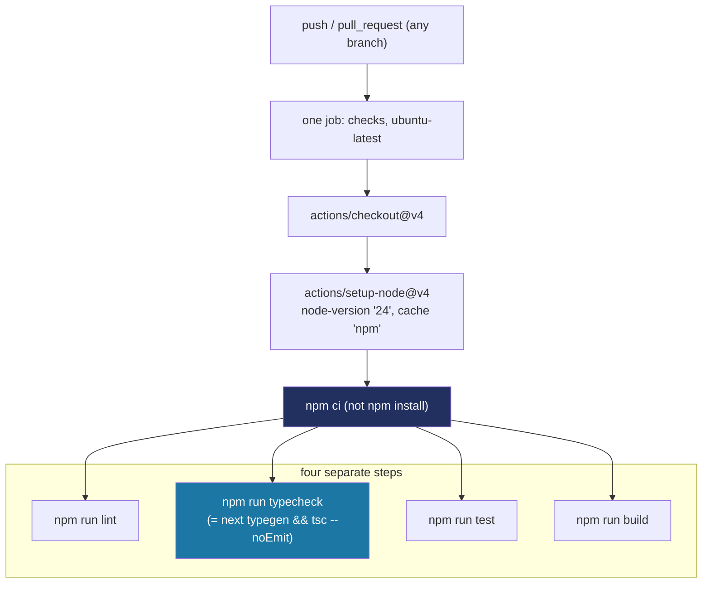

# Recipe: Step 3 — Continuous integration

## What this step is for

Every step so far has been verified by *you* running `lint`, `typecheck`, `test` and `build` by hand and looking at the output. This step makes that automatic: every push and every pull request runs all four checks on GitHub's servers and reports pass/fail, so a broken change is caught the moment it's pushed rather than days later on someone else's machine. The entire deliverable is a single GitHub Actions workflow file — no repository settings (branch protection, required checks) are touched, because those belong to the repo owner.

## Starting point

Step 2 left a working `lint`, `typecheck`, `test` and `build` all passing *locally* — but nothing ran them automatically on every push. This step is file-only by design: it adds a GitHub Actions workflow, and never touches repository settings (branch protection, required checks), which CLAUDE.md is explicit the owner owns.

## Diagram



## Checklist

1. **Create `.github/workflows/ci.yml`** — one job, one OS, one Node version. Deliberately no test matrix: the plan only asks to prove the four checks pass, not to test cross-platform compatibility.
   ```yaml
   name: CI

   on:
     push:
     pull_request:

   jobs:
     checks:
       runs-on: ubuntu-latest
       steps:
         - name: Checkout
           uses: actions/checkout@v4

         - name: Set up Node
           uses: actions/setup-node@v4
           with:
             node-version: "24"
             cache: "npm"

         - name: Install dependencies
           run: npm ci

         - name: Lint
           run: npm run lint

         - name: Typecheck
           run: npm run typecheck

         - name: Test
           run: npm run test

         - name: Build
           run: npm run build
   ```
   Two choices worth naming: `npm ci` (not `npm install`) installs *exactly* what `package-lock.json` says and fails if the lockfile is out of sync — the right behavior for CI, where a silently-updated lockfile would mean "green locally, broken for everyone else." And the four checks are four *separate* steps (not one `&&`-joined line) so a failure names which check broke instead of just "the combined command exited non-zero."

2. **The typecheck script this relies on is broken on a clean checkout — fix it before you think you're done.** Step 2 shipped `"typecheck": "tsc --noEmit"`. On the owner's first push, CI went red with:
   ```
   Error: src/app/layout.tsx(20,50): error TS2304: Cannot find name 'LayoutProps'.
   ```
   `LayoutProps` is a Next.js-generated helper type that only exists inside a hidden `.next/types` folder, and that folder is only created by running `next dev`, `next build`, or `next typegen`. Locally it worked because `.next` already existed from earlier runs; a fresh CI checkout has no `.next` folder yet, so `tsc` can't find the type. Next.js's own docs name this exact situation and the fix — run `next typegen` first:
   ```diff
   - "typecheck": "tsc --noEmit",
   + "typecheck": "next typegen && tsc --noEmit",
   ```
   This is the same correction Step 2's recipe already folds in — one latent bug, caught here, fixed once.

3. **A second CI failure: two dependencies had drifted onto Node-22-only versions.** After the typecheck fix, `test` failed in CI with `TypeError: webidl.util.markAsUncloneable is not a function`, which did *not* reproduce locally — because local runs Node 24 while the workflow then pinned Node 20. `worker_threads.markAsUncloneable` only exists from Node ~22.5 onward; `jsdom@30.1.0` (installed "latest" in Step 2, unpinned) calls it unconditionally. Pinning the offending dependencies back to their last Node-20-compatible lines, rather than raising the floor:
   ```diff
   - "@testing-library/jest-dom": "^7.0.1",
   + "@testing-library/jest-dom": "^6.9.1",
   ```
   ```diff
   - "jsdom": "^30.1.0",
   + "jsdom": "^29.1.1",
   ```
   `@testing-library/jest-dom@7.0.1` had the same class of problem (its `engines` floor was raised to Node 22 between 6.9.1 and 6.10.0) — caught while fixing jsdom, since `npm install` warned about it.

4. **Decide the Node floor, once, instead of managing a recurring version-switch habit.** The owner reasonably didn't want to "switch Node before every push" forever. Rather than keep Node 20 as the floor and manage around it, move the floor to what's actually installed — Node 24 — in *both* places at once so local and CI always match:
   ```diff
   -          node-version: "20"
   +          node-version: "24"
   ```
   ```diff
   - Next.js (latest stable, App Router), React, TypeScript with `strict`. Node 20.9 or newer. Package manager: npm.
   + Next.js (latest stable, App Router), React, TypeScript with `strict`. Node 24 or newer (current LTS — kept in sync with CI, so local and CI always run the same version). Package manager: npm.
   ```
   All three of these changes go together — pin the two dependencies back and raise the Node floor in the workflow *and* in CLAUDE.md's stated minimum, so local and CI never disagree again.

5. **Verify locally — the only verification available before the owner pushes.** No push access exists to trigger GitHub Actions from here, so the step is confirmed two ways: the four commands the workflow runs all still pass locally (`npm run lint`, `npm run typecheck`, `npm run test`, `npm run build`), and the YAML follows the very common `checkout` + `setup-node` pattern with no custom scripting (low syntax-error risk). The real pass/fail signal only exists once the owner pushes and GitHub actually runs it — that's the plan's own "Done when" condition, confirmed by the owner, not here.

6. **Tick this step's build-task checkboxes** in `docs/PLAN.md` (not "Owner review" — that stays unchecked until the owner says "approved"), then:
   ```bash
   npm run progress
   ```

7. **Stop and report** — plain-language summary of what changed, how to see it working (push and watch the Actions tab), and the suggested commit message. Wait for the owner to review before anything is committed.

## What ended up in each file, and why

| File | What's in it | Why |
|---|---|---|
| `.github/workflows/ci.yml` | One job, `ubuntu-latest`, `checkout@v4` → `setup-node@v4` (Node 24, npm cache) → `npm ci` → four separate steps: lint, typecheck, test, build. | The whole point of the step — prove the four checks pass automatically on every push and PR, with no repository-settings changes. |
| `package.json` | `typecheck` script changed to `next typegen && tsc --noEmit`; `@testing-library/jest-dom` pinned to `^6.9.1`; `jsdom` pinned to `^29.1.1`. | Three corrections CI caught: the typecheck script needed `next typegen` first (route types don't exist on a clean checkout), and two dependencies had drifted onto Node-22-only versions that crash on Node 20. |
| `CLAUDE.md` | Node floor line changed from "Node 20.9 or newer" to "Node 24 or newer (current LTS — kept in sync with CI…)". | The Node floor moved to match the dev machine so local and CI never disagree again — updated in the one place that documents the floor, alongside the workflow. |

## Verification

Same four commands as checklist step 5 (`npm run lint`, `npm run typecheck`, `npm run test`, `npm run build`), all green. The genuinely load-bearing confirmation — that the workflow actually goes green on GitHub — happens on the owner's push, which is exactly what the plan's "Done when: the workflow file is correct. (I confirm it is green after I push.)" line hands to the owner, not to this step's local checks.
