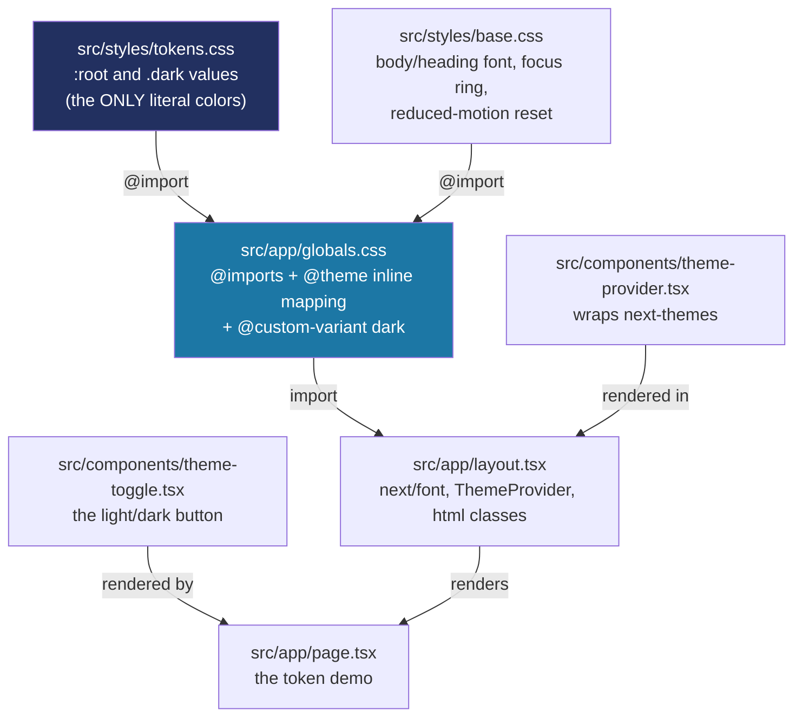

# Recipe: Step 4 — Design tokens, fonts and dark mode

## What this step is for

Until now the app used `create-next-app`'s default styling — a fixed look with no real color system. This step replaces that with the design system's foundation: named CSS-variable *tokens* for every color, radius, shadow and motion value (so nothing in the app hardcodes a color), two self-hosted fonts, and a working light/dark toggle that applies without a flash of the wrong theme on load. It's the first time the app has a second color mode at all — the prototype only ever had one.

## Starting point

The starter page from Step 1, untouched since. `src/app/globals.css` was just Tailwind's `@import "tailwindcss"` plus a couple of default CSS variables; `layout.tsx` used the default Inter font; there was no `src/styles/` folder and no `next-themes`.

## Diagram



The one idea to hold on to: a CSS custom property (`--primary`, say) is a *named value that can change*. `:root { --primary: ... }` is the default; `.dark { --primary: ... }` overrides it only when `<html>` carries the `dark` class. Every component just asks for "primary" and the cascade decides which value that resolves to right now — so no component ever knows light from dark.

## Checklist

1. **Create `src/styles/tokens.css`** — the only file allowed to contain a literal color. Light values come from the brand colors in CLAUDE.md (`#223060` / `#1C77A5` / `#F9E321`) and the approved prototype's palette, converted to OKLCH (not eyeballed — converted with Björn Ottosson's sRGB→OKLab→OKLCH formulas, then contrast-checked). Dark values are the prototype's own worked-out dark palette, same treatment:
   ```css
   :root {
     --background: oklch(97.5% 0.006 255.5);
     --foreground: oklch(25.2% 0.061 262.8);
     --card: oklch(100% 0 0);
     --primary: oklch(32.5% 0.087 268.9);
     --primary-foreground: oklch(100% 0 0);
     /* ...muted, accent, border, ring... */
     --status-present: oklch(51.2% 0.121 154.1);
     --status-late: oklch(50.8% 0.108 73.3);
     --status-absent: oklch(51.8% 0.179 23.5);
     --status-idle: oklch(49.3% 0.046 260);
     --radius: 0.625rem;
     --duration-fast: 100ms;
     --duration-base: 200ms;
     --duration-slow: 300ms;
     --ease-standard: cubic-bezier(0.2, 0, 0, 1);
   }

   .dark {
     --background: oklch(19.8% 0.037 264.2);
     --foreground: oklch(95.1% 0.016 262.8);
     --primary: oklch(67.5% 0.081 231.4);
     /* ... */
   }
   ```
   The four `--status-*` colors are deliberately *fixed* — same meaning in every future theme, never swapped by a preset (CLAUDE.md's rule that present/late/absent/idle must keep their meaning). Radius/shadow/motion are here too so no one invents one-off values later.

2. **Create `src/styles/base.css`** — apply tokens to the raw HTML elements that need styling before any component renders:
   ```css
   body {
     background: var(--background);
     color: var(--foreground);
     font-family: var(--font-body);
   }

   h1, h2, h3, h4, h5, h6 {
     font-family: var(--font-heading);
   }

   :focus-visible {
     outline: 2px solid var(--ring);
     outline-offset: 2px;
   }

   @media (prefers-reduced-motion: reduce) {
     *, *::before, *::after {
       animation-duration: 0.01ms !important;
       animation-iteration-count: 1 !important;
       transition-duration: 0.01ms !important;
       scroll-behavior: auto !important;
     }
   }
   ```
   It references `--font-body` and `--font-heading`, which don't exist in `tokens.css` — they're defined one file over, in `globals.css`'s `@theme inline` block, because they depend on values that only exist inside a React component (the `next/font` step below). CSS doesn't care which file a property was declared in, only that it's declared somewhere before use.

3. **Rewrite `src/app/globals.css`** — three jobs: import everything in order, teach Tailwind what "dark" means, and map tokens to utilities:
   ```css
   @import "tailwindcss";
   @import "../styles/tokens.css";
   @import "../styles/base.css";

   @custom-variant dark (&:where(.dark, .dark *));

   @theme inline {
     --color-background: var(--background);
     --color-foreground: var(--foreground);
     --color-primary: var(--primary);
     --color-primary-foreground: var(--primary-foreground);
     /* ...every token... */
     --font-heading: var(--font-lexend);
     --font-body: var(--font-atkinson);
     --duration-fast: var(--duration-fast);
   }
   ```
   `@custom-variant dark` is what makes `dark:bg-card` work at all — by default Tailwind v4 only knows `prefers-color-scheme`, so this line tells it "dark = `.dark` class (or a descendant of it)", which is what `next-themes` actually sets on `<html>`. `@theme inline` is what turns `--primary` into a usable `bg-primary` class; `inline` means "emit a live `var(--primary)` reference, don't bake in a value" — required because the real value depends on light/dark at runtime.

4. **Install and wire `next-themes`** — add it as a dependency, then create a thin project-local wrapper so the rest of the app imports one component instead of the library directly:
   ```bash
   npm install next-themes
   ```
   ```tsx
   // src/components/theme-provider.tsx
   "use client";
   import { ThemeProvider as NextThemesProvider } from "next-themes";
   import type { ComponentProps } from "react";

   export function ThemeProvider({ children, ...props }: ComponentProps<typeof NextThemesProvider>) {
     return (
       <NextThemesProvider attribute="class" defaultTheme="system" enableSystem {...props}>
         {children}
       </NextThemesProvider>
     );
   }
   ```
   `attribute="class"` is what makes next-themes add/remove the literal `dark` string on `<html>`'s class; `defaultTheme="system"` means "follow the OS until the user explicitly picks one."

5. **Create `src/components/theme-toggle.tsx`** — the button that calls `setTheme`:
   ```tsx
   "use client";
   import { useEffect, useState } from "react";
   import { useTheme } from "next-themes";

   export function ThemeToggle() {
     const { resolvedTheme, setTheme } = useTheme();
     const [mounted, setMounted] = useState(false);

     useEffect(() => {
       // next-themes' documented hydration-avoidance pattern
       // eslint-disable-next-line react-hooks/set-state-in-effect
       setMounted(true);
     }, []);

     if (!mounted) return <button disabled aria-hidden>Toggle theme</button>;

     const isDark = resolvedTheme === "dark";
     return (
       <button onClick={() => setTheme(isDark ? "light" : "dark")}>
         {isDark ? "Switch to light mode" : "Switch to dark mode"}
       </button>
     );
   }
   ```
   The `mounted` dance (disabled placeholder until `useEffect` fires once) exists because the *server* can't know the user's saved preference — it always renders not-yet-knowing. If it showed "Switch to light/dark" immediately, the first server render might disagree with what the browser decides after reading `localStorage`, and React throws a hydration-mismatch warning. This is next-themes' own pattern, and it trips the `react-hooks/set-state-in-effect` lint rule, so it carries a targeted `eslint-disable-next-line` with a one-line reason rather than removing the pattern.

6. **Rewrite `src/app/layout.tsx`** — self-host the two fonts with `next/font`, and wire the provider in:
   ```tsx
   import { Atkinson_Hyperlegible, Lexend } from "next/font/google";
   import { ThemeProvider } from "@/components/theme-provider";

   const lexend = Lexend({ variable: "--font-lexend", subsets: ["latin"], weight: ["500", "600", "700"] });
   const atkinsonHyperlegible = Atkinson_Hyperlegible({ variable: "--font-atkinson", subsets: ["latin"], weight: ["400", "700"] });

   export default function RootLayout({ children }: LayoutProps<"/">) {
     return (
       <html
         lang="en"
         className={`${lexend.variable} ${atkinsonHyperlegible.variable} h-full antialiased`}
         suppressHydrationWarning
       >
         <body className="min-h-full flex flex-col">
           <ThemeProvider>{children}</ThemeProvider>
         </body>
       </html>
     );
   }
   ```
   `next/font` downloads the fonts at *build* time (self-hosted, per CLAUDE.md — nothing fetched from Google at runtime) and each `variable` is a CSS class that defines `--font-lexend`/`--font-atkinson` scoped to `<html>` — the missing link that `base.css` and `globals.css` were already referencing. `suppressHydrationWarning` on `<html>` tells React "don't panic if this element's class changes before hydration" — needed because next-themes' inline script edits `<html>`'s class before React attaches.

7. **Replace `src/app/page.tsx`** with a token demo — the starter "Get started" page becomes a page showing every token (core colors, status colors, elevation, type) so the tokens can actually be *seen* in both modes. Every swatch is built only from token classes (`bg-primary`, `bg-status-present-bg`, `shadow-md`, …), never a raw color.

8. **Verify all four checks:**
   ```bash
   npm run lint
   npm run typecheck
   npm run test
   npm run build
   ```

9. **Browser-check at 360px and 1280px, in light and dark** — toggle light/dark and confirm every swatch recolors, fonts load, and the console stays clean. Drive the toggle directly (`document.querySelector(...).click()` and read `document.documentElement.classList`) rather than trusting the OS-level `prefers-color-scheme`, which can flake in a headless browser.

10. **Tick this step's build-task checkboxes** in `docs/PLAN.md`, then:
    ```bash
    npm run progress
    ```

11. **Stop and report**, same as every step.

## What ended up in each file, and why

| File | What's in it | Why |
|---|---|---|
| `src/styles/tokens.css` | `:root` + `.dark` values for every color/radius/shadow/motion token, plus the fixed status colors. | The single source of truth for "what each token is" in both modes — and the only file allowed a literal color. |
| `src/styles/base.css` | Body/heading fonts, focus ring, reduced-motion reset. | Applies tokens to raw HTML elements that need styling before any component renders. |
| `src/app/globals.css` | Imports, `@custom-variant dark`, `@theme inline` mapping. | The hub that connects tokens → Tailwind utilities and teaches Tailwind what "dark" means. |
| `src/components/theme-provider.tsx` | Thin wrapper over `next-themes`. | One local import point so a default change (say `defaultTheme="light"`) is a one-line edit, not a sweep. |
| `src/components/theme-toggle.tsx` | The light/dark button. | The only component that ever flips the theme — everything else just re-renders from the cascade. |
| `src/app/layout.tsx` | Self-hosted fonts, `<ThemeProvider>`, `suppressHydrationWarning`. | Self-hosts fonts at build time; mounts the provider so `useTheme()` works anywhere. |
| `src/app/page.tsx` | The token demo page. | Replaces the starter page so tokens can be verified visually in both modes. |
| `package.json` | `next-themes@^0.4.6` added. | The dark-mode library, added per CLAUDE.md's stack list. |

## Verification

Same four commands as checklist step 8, plus the browser pass in step 9. The real signal the step's "Done when" asks for — "the demo page looks right in light and dark and uses only token classes" — is confirmed by opening the page in both modes and seeing every swatch recolor with no raw color anywhere in the demo's JSX.


