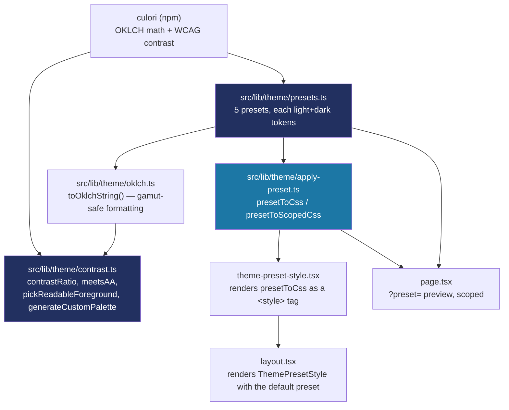

# Recipe: Step 5 — Theme presets and contrast helper

## What this step is for

Step 4 gave the app one hardcoded theme — Balanga's colors, baked straight into `tokens.css`. This step turns "one fixed theme" into five swappable *presets* (`school`, `ocean`, `emerald`, `crimson`, `violet`), and adds a contrast helper that checks every one of them against WCAG AA automatically, instead of eyeballing. The end goal (CLAUDE.md's design-system rule 1) is that colors are never hardcoded and "a theme is data" — a school picks a preset and the whole app recolors. This step builds the data side and the accessibility checker; the actual picker UI is a later step.

## Starting point

Step 4's token mechanism (CSS variables, `@theme inline`, next-themes toggle) all works, but only ever renders the one palette written into `tokens.css`. There is no concept of "which theme is active" yet, and nothing programmatically checks a palette for contrast.

## Diagram



## Checklist

1. **Add `culori` (and its types) as a dependency** — this step needs real OKLCH↔sRGB conversion and the WCAG contrast formula. Writing that math by hand (Björn Ottosson's published formulas, the approach Step 4's one-off script took) is a plausible place for a subtle bug to hide in code whose whole job is accessibility correctness. `culori` is a small, stable, tree-shaken package that does exactly this, so it was approved as a new dependency rather than re-rolled:
   ```bash
   npm install culori
   npm install --save-dev @types/culori
   ```
   `culori` ships **no TypeScript types of its own**, so `@types/culori` (the same approach as `@types/node`/`@types/react`) is required alongside it. Before writing code against it, verify the actual API rather than trusting memory: `oklch()`, `wcagContrast()`, `clampChroma()`, `displayable()`.

2. **Create `src/lib/theme/oklch.ts`** — the shared, gamut-safe CSS-string formatter. It exists because of a real bug: rounding a clamped color can push it back *out* of gamut. Clamp chroma *first*, round the clamped result *down* (never up):
   ```ts
   import { clampChroma } from "culori";

   export function toOklchString(l: number, c: number, h: number): string {
     const roundedL = Math.round(l * 1000) / 1000;
     const roundedH = Math.round(h * 10) / 10;
     const clamped = clampChroma({ mode: "oklch", l: roundedL, c, h: roundedH }, "oklch");
     const safeChroma = Math.floor(clamped.c * 1000) / 1000;
     return `oklch(${(roundedL * 100).toFixed(1)}% ${safeChroma.toFixed(3)} ${roundedH.toFixed(1)})`;
   }
   ```
   `l` is a fraction (0–1), matching culori's own Oklch representation. Rounding lightness/hue *first*, clamping chroma against those already-rounded numbers, then flooring chroma means the string actually written is guaranteed displayable — a saturated color authored by hand can sit just outside what a screen can show, and a browser would silently render a slightly different (and slightly different-contrast) color than what the AA math was run against.

3. **Create `src/lib/theme/presets.ts`** — the five presets. A `ThemePreset` is `{ id, name, light, dark }`, where `light`/`dark` cover only the *themed* color tokens (`background`, `foreground`, `card`, `primary`, `link`, `highlight`, `muted`, `accent`, `border`, `ring`, and each `-foreground` pair). Radius, shadow, motion and the four status colors stay in `tokens.css`, identical across every preset:
   ```ts
   export type ThemePresetId = "school" | "ocean" | "emerald" | "crimson" | "violet";

   function oklchToken(l: number, c: number, h: number): string {
     return toOklchString(l / 100, c, h);
   }

   const schoolPreset: ThemePreset = {
     id: "school",
     name: "School",
     light: {
       background: "oklch(97.5% 0.006 255.5)",
       foreground: "oklch(25.2% 0.061 262.8)",
       primary: "oklch(32.5% 0.087 268.9)",
       primaryForeground: "oklch(100% 0 0)",
       /* ... */
     },
     dark: { /* ... */ },
   };
   ```
   `school`'s values are copied byte-for-byte from `tokens.css`'s current `:root`/`.dark` — so picking it is a no-op, and `presets.test.ts` asserts the two can't silently drift. The other four are built with `oklchToken(l, c, h)`, which routes every value through `toOklchString`'s gamut-clamping. The `highlight` token is deliberately a shared constant (`HIGHLIGHT`) identical across every preset — the same "flagged" accent reasoning as the fixed status colors.

4. **Create `src/lib/theme/contrast.ts`** — the accessibility checker, four pieces built on culori:
   ```ts
   export function contrastRatio(a: string, b: string): number {
     return wcagContrast(a, b);
   }

   export function meetsAA(ratio: number, options: { largeText?: boolean } = {}): boolean {
     return ratio >= (options.largeText ? 3 : 4.5);
   }

   export function pickReadableForeground(
     background: string,
     candidates: string[] = [],
     options: { largeText?: boolean } = {},
   ): string {
     for (const candidate of candidates) {
       if (meetsAA(contrastRatio(background, candidate), options)) return candidate;
     }
     const toWhite = contrastRatio(background, PURE_WHITE);
     const toBlack = contrastRatio(background, PURE_BLACK);
     return toWhite >= toBlack ? PURE_WHITE : PURE_BLACK;
   }
   ```
   `pickReadableForeground`'s black/white fallback is provably always AA-safe: the worst case works out to ~4.58:1, just above the 4.5 threshold. `generateCustomPalette(brandColor)` (for Step 21's future "Custom" picker) derives a full light+dark token set from one brand color, nudging any color that doesn't naturally pass AA rather than leaving it failing — the "adjust or reject" rule.

5. **Add `src/lib/theme/presets.test.ts`** — this is what actually *enforces* "every preset passes AA," not a manual check. It loops all 5 presets × both modes × every foreground/background pairing and fails with the exact pairing and ratio if one clears below 4.5:1. It also checks `school`'s values still match `tokens.css` literally, so the two can't drift apart.

6. **Create `src/lib/theme/apply-preset.ts`** — turn a preset into CSS text, with a specificity trick so it beats `tokens.css`:
   ```ts
   export function presetToCss(preset: ThemePreset): string {
     return `:root:root{${declarationsFor(preset.light)}}.dark.dark{${declarationsFor(preset.dark)}}`;
   }

   export function presetToScopedCss(preset: ThemePreset, selector: string): string {
     return `${selector}{${declarationsFor(preset.light)}}.dark ${selector}{${declarationsFor(preset.dark)}}`;
   }
   ```
   `:root:root` (and `.dark.dark`) repeat the selector on purpose — it still matches the same `<html>`, but raises specificity to (0,2,0), which reliably beats `tokens.css`'s plain `:root`/`.dark` (0,1,0) regardless of which `<style>` the browser parses first. `presetToScopedCss` is the same declarations scoped to a selector, for previewing a preset without touching the document root.

7. **Create `src/lib/theme/theme-preset-style.tsx`** — render that CSS as a `<style>` tag:
   ```tsx
   export function ThemePresetStyle({ presetId = DEFAULT_THEME_PRESET_ID }: { presetId?: string }) {
     const preset = getThemePreset(presetId);
     return (
       <style id="theme-preset" dangerouslySetInnerHTML={{ __html: presetToCss(preset) }} />
     );
   }
   ```
   `dangerouslySetInnerHTML` is used because the CSS string must be set verbatim (not HTML-escaped); it's never user input, so that's safe.

8. **Wire it into `layout.tsx`** — render `<ThemePresetStyle presetId={DEFAULT_THEME_PRESET_ID} />` as the first thing inside `<body>`, before `<ThemeProvider>`. No client script needed: the preset id is a plain server-side constant, so the server renders the final correct CSS in the first response — unlike light/dark (a client preference), there's nothing to patch after paint.

9. **Add a temporary `?preset=` preview to `page.tsx`** — clearly commented as a Step 5 verification aid, not the real picker (that's Step 11/21). It reads `?preset=` from the URL (only a `page.tsx` can do this; a `layout.tsx` never gets search params), scopes the recoloring to its own content via `presetToScopedCss`, and never touches `<html>`:
   ```tsx
   export default async function Home({ searchParams }: PageProps<"/">) {
     const params = await searchParams;
     const requestedPreset = typeof params.preset === "string" ? params.preset : undefined;
     const preset = getThemePreset(requestedPreset);
     const previewCss = presetToScopedCss(preset, PREVIEW_SELECTOR);
     // renders <style>{previewCss}</style> and ?preset= links inside a
     // div carrying the PREVIEW_SELECTOR data attribute
   }
   ```

10. **Verify all four checks:**
    ```bash
    npm run lint
    npm run typecheck
    npm run test
    npm run build
    ```
    (`test` is 24 tests by the end — `presets.test.ts`, `contrast.test.ts`, `apply-preset.test.ts`.)

11. **Browser-check at 360px and 1280px, light and dark** — the default view should be *visually identical* to Step 4 (since `school` is a byte-for-byte copy of `tokens.css`), and each of the four new presets (`/?preset=ocean`, `emerald`, `crimson`, `violet`) should be legible and calm in both modes.

12. **Tick this step's build-task checkboxes** in `docs/PLAN.md`, then `npm run progress`.

13. **Stop and report**, same as every step.

## What ended up in each file, and why

| File | What's in it | Why |
|---|---|---|
| `src/lib/theme/presets.ts` | 5 presets, `ThemeColorTokens`/`ThemePreset` types, `getThemePreset`. | The data — "a theme is data." `school` is a no-op copy of `tokens.css`; the rest use the gamut-safe `oklchToken`. |
| `src/lib/theme/oklch.ts` | `toOklchString()`. | The one gamut-safe formatter, so what's written to the page always matches what's contrast-checked. |
| `src/lib/theme/contrast.ts` | `contrastRatio`, `meetsAA`, `pickReadableForeground`, `generateCustomPalette`. | The accessibility half — checks every palette and computes readable foregrounds. |
| `src/lib/theme/apply-preset.ts` | `presetToCss`, `presetToScopedCss`. | Turns a preset into CSS text, with the `:root:root` specificity trick to beat `tokens.css`. |
| `src/lib/theme/theme-preset-style.tsx` | `ThemePresetStyle` component. | Renders the preset's CSS as a `<style>` tag, server-side, no flash. |
| `presets.test.ts` / `contrast.test.ts` / `apply-preset.test.ts` | 24 tests. | Enforce "every preset passes AA" and "`school` matches `tokens.css`" on every run, not once by hand. |
| `src/app/layout.tsx` | Renders `ThemePresetStyle` with the default preset. | Applies the preset document-wide. |
| `src/app/page.tsx` | `?preset=` scoped preview links. | A temporary verification aid so all 5 presets can be seen before the real picker exists. |
| `package.json` | `culori` + `@types/culori`. | The color-math library (and its types). |

## Verification

Same four commands as checklist step 10, plus the browser pass in step 11. The step's "Done when" — "switching the preset in code recolors the demo page, every preset passes AA, and the tests pass" — is confirmed by the 24 passing tests (the AA guarantee is *enforced*, not eyeballed) and by opening `/?preset=ocean` etc. and seeing each recolor correctly in both modes.

