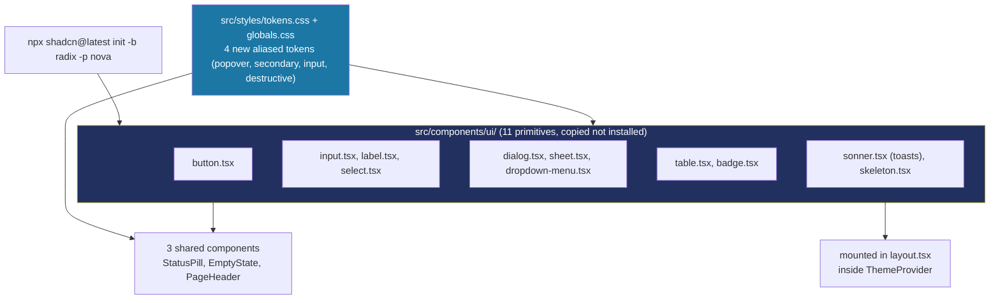

# Recipe: Step 6 — shadcn/ui and base components

## What this step is for

Steps 4–5 built the color system; this step builds the first real interactive UI pieces on top of it — buttons, inputs, dialogs, dropdowns, tables, badges, toasts and skeletons — plus three shared components (`StatusPill`, `EmptyState`, `PageHeader`) every future screen will reuse. The goal is a component library whose classes (`bg-primary`, `border-border`, `text-muted-foreground`) already reference the token names Steps 4–5 defined, so every component automatically works under all 5 presets and both color modes with no extra work.

## Starting point

A working token system and 5 presets, but no reusable components — `page.tsx`'s token demo hand-rolled its own swatches. No `components.json`, no `src/components/ui/`, no `cn()` helper.

## Diagram



## Checklist

1. **Initialize shadcn/ui with the Radix engine.** The installed CLI (`shadcn@4.21.0`) is a newer redesign that asks which accessibility engine powers each component (`-b`): Radix UI, Base (shadcn's new in-house primitives), or React Aria. Radix was chosen (matches the already-configured shadcn MCP server's default, and has the largest body of examples for debugging later). It also asks a "preset" (`-p`) for a starter font/color theme — `-p nova` (Lucide icons, matching CLAUDE.md's icon choice):
   ```bash
   npx shadcn@latest init -b radix -p nova -y
   ```
   **Immediately diff every file it touched** (`git status` / `git diff`) before adding a single component. `shadcn init` is *not* blank-slate safe on a project with existing tokens: it appended a second generic `:root`/`.dark` color block (flat greys) that would outrank the real brand colors, injected its own radius scale into `@theme inline`, and swapped Lexend for a Geist font. All of that was manually removed. What was kept: `@import "tw-animate-css"` and `@import "shadcn/tailwind.css"` (animation keyframes and `data-state` variants Radix uses — no colors, no conflict), `components.json`, and `src/lib/utils.ts`.

2. **Add the `cn()` helper**, `src/lib/utils.ts`:
   ```ts
   export { cn } from "cn";
   ```
   `cn` is a genuine, official, zero-dependency npm package by shadcn himself — not the hand-written `clsx`/`tailwind-merge` combo older guides describe. (Note the generated UI components import it as `from "cn"` directly, while the hand-written shared components import `from "@/lib/utils"` — same function, two import paths.)

3. **Add the 11 UI primitives** with `npx shadcn@latest add ... -y`: button, input, label, select, sheet, dialog, dropdown-menu, table, badge, sonner, skeleton. These are *copied* source files (not installed as a black box) — `button.tsx` is a real file you can open and edit:
   ```tsx
   import { cva, type VariantProps } from "class-variance-authority"
   import { cn } from "cn"
   import { Slot } from "radix-ui"

   const buttonVariants = cva(
     "group/button inline-flex shrink-0 items-center justify-center rounded-lg ...",
     {
       variants: {
         variant: {
           default: "bg-primary text-primary-foreground hover:bg-primary/80",
           outline: "border-border bg-background hover:bg-muted ...",
           destructive: "bg-destructive/10 text-destructive ...",
           link: "text-primary underline-offset-4 hover:underline",
         },
         size: { default: "h-8 ...", sm: "h-7 ...", lg: "h-9 ...", icon: "size-8" },
       },
     }
   )
   ```
   Every class references a token name — no component-level styling work was needed for them to work under every preset and mode.

4. **Add four missing tokens as aliases, not new brand colors.** Before adding components, checking which CSS variables they actually reference surfaced four names the Step 4/5 token set didn't have: `popover`, `secondary`, `input`, `destructive`. Rather than hand-pick four new brand colors and extend every preset to cover them, alias each to an existing preset-aware token in `globals.css`'s `@theme inline` block:
   ```css
   --color-popover: var(--card);
   --color-secondary: var(--accent);
   --color-input: var(--border);
   --color-destructive: var(--status-absent);
   --color-destructive-foreground: var(--destructive-foreground);
   ```
   Aliasing means all four track whichever preset and mode is active automatically, with no new preset data and no new AA tests to keep in sync. Only `--destructive-foreground` needed a genuinely new literal (no existing token fits "text color for a solid destructive fill") — added to `tokens.css` next to the status colors (`oklch(100% 0 0)` in light, `oklch(15% 0.02 25)` in dark), and contrast-checked directly: 6.10:1 light, 8.80:1 dark.

5. **Build the three shared components** in `src/components/` (not `ui/` — those are "shared composed components" per CLAUDE.md's code structure):
   - `status-pill.tsx` — a pill for one of the four attendance states, built only on the fixed status tokens (never a preset color):
     ```tsx
     const STATUS_CLASS: Record<AttendanceStatus, string> = {
       present: "bg-status-present-bg text-status-present",
       late: "bg-status-late-bg text-status-late",
       absent: "bg-status-absent-bg text-status-absent",
       idle: "bg-status-idle-bg text-status-idle",
     };
     ```
   - `empty-state.tsx` — an icon, title, optional description, optional action button, for empty lists/results.
   - `page-header.tsx` — a title, optional description, optional right-aligned actions slot, for consistent page tops.
   Each gets a Testing Library test (`.test.tsx`), matching the existing convention.

6. **Mount `<Toaster />` in `layout.tsx`**, *inside* `<ThemeProvider>`:
   ```tsx
   <ThemeProvider>
     {children}
     <Toaster />
   </ThemeProvider>
   ```
   It has to be inside the provider because it calls `useTheme()` from `next-themes` — outside that tree it couldn't read the theme.

7. **Add a "Components (Step 6)" section to `page.tsx`** — one example of every primitive and shared component, so they can be checked under every preset and both modes. This is scaffolding, not the real style guide (Step 7 builds `/design-system`).

8. **Handle the page-shift bug** — a real problem the owner caught during review, worth its own note. When a Dialog/Sheet/Select/DropdownMenu opens, Radix's scroll-lock sets `overflow: hidden` on `<body>`, which hides the real browser scrollbar. That's two separate real effects, and fixing only one makes it *worse*: (1) the scrollbar visibly flickers, and (2) Radix's own `margin-right` compensation — correct while the viewport briefly widens — becomes a content shrink once the scrollbar is permanently reserved. Both must be neutralized at once in `src/styles/base.css`:
   ```css
   html {
     overflow-y: scroll;
   }

   html body[data-scroll-locked] {
     margin-right: 0px !important;
   }
   ```
   The second selector is slightly more specific than react-remove-scroll's own `body[data-scroll-locked]` so it reliably wins regardless of style-injection order. Full dead-end story (a wrong `overflow-y: scroll` fix that shipped before being caught) is in `docs/BUILD-LOG.md`'s Step 6 entry.

9. **Verify all four checks:**
   ```bash
   npm run lint
   npm run typecheck
   npm run test
   npm run build
   ```
   (32 tests by the end — the three shared components' tests plus the existing theme/page tests.)

10. **Browser-check at 360px and 1280px, light and dark** — open the Dialog/Sheet/DropdownMenu/Select, fire a toast, and confirm no page shift on open/close, with a clean console.

11. **Tick this step's build-task checkboxes** in `docs/PLAN.md`, then `npm run progress`.

12. **Stop and report**, same as every step.

## What ended up in each file, and why

| File | What's in it | Why |
|---|---|---|
| `src/components/ui/` (11 files) | button, input, label, select, sheet, dialog, dropdown-menu, table, badge, sonner, skeleton. | The shadcn primitives, copied source, built on the token names from Steps 4–5. |
| `src/lib/utils.ts` | `export { cn } from "cn"`. | The class-merging helper shadcn components need. |
| `src/components/status-pill.tsx` | The four attendance-state pills. | Built only on fixed status tokens — a status means the same thing in every theme. |
| `src/components/empty-state.tsx` | Icon + title + description + optional action. | For empty lists/results in later steps. |
| `src/components/page-header.tsx` | Title + description + actions slot. | For consistent page tops in later steps. |
| `src/styles/tokens.css` | `--destructive-foreground` (light + dark). | The one genuinely new literal — a solid destructive fill's text color. |
| `src/app/globals.css` | 4 aliased tokens (popover/secondary/input/destructive) + the two shadcn `@import`s. | Aliases track every preset/mode automatically; imports add Radix's keyframes and variants. |
| `src/app/layout.tsx` | `<Toaster />` inside `<ThemeProvider>`. | Toasts need `useTheme()`, so they must live inside the provider tree. |
| `components.json` | shadcn config (`"style": "radix-nova"`). | Records the Radix + nova choices so future `add` commands match. |
| `src/styles/base.css` | `overflow-y: scroll` + the `data-scroll-locked` margin cancel. | Fixes the scrollbar flicker and the content shrink, together (Step 6 fixup). |

## Verification

Same four commands as checklist step 9, plus the browser pass in step 10. The step's "Done when" — "components render correctly under every preset, in light and dark" — is confirmed by opening the demo under `?preset=ocean` etc. and seeing every primitive and shared component recolor correctly, with status pills staying fixed while everything else changes.

