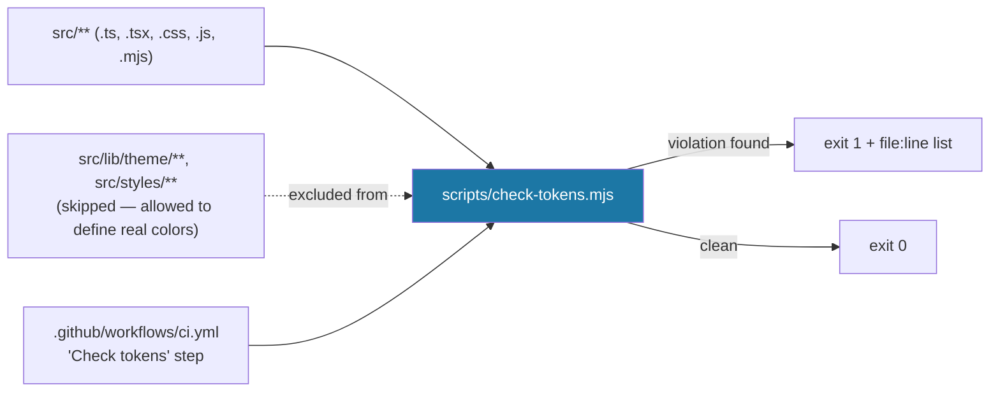

# Recipe: Step 7 — Style guide page and token check

## What this step is for

Steps 4–6 built the tokens, presets and components — but nothing makes sure they stay correct as the app grows. This step adds two guards: a dev-only `/design-system` page that shows *every* token and component together (so a theme change can be checked before it ships), and a `check:tokens` script that fails the build if a raw color sneaks into a component — enforcing CLAUDE.md's "no raw colors outside the theme files" rule automatically instead of relying on someone noticing during review.

## Starting point

Step 6's demo page had a "Components" section, but it was scaffolding — one example of each thing, under one preset at a time, with no dedicated home and no automated enforcement of the no-raw-colors rule.

## Diagram



## Checklist

1. **Write `scripts/check-tokens.mjs`** — a small standalone Node script (same style as `scripts/progress.mjs`), not an ESLint rule, since it's too targeted to warrant a new dependency. It walks every `.ts`/`.tsx`/`.css`/`.js`/`.mjs` file under `src/`, skips `src/lib/theme/` and `src/styles/` (the two places CLAUDE.md's rule 7 explicitly allows real colors), and flags two things line by line:
   ```js
   const ALLOWED_DIRS = [path.join(SRC_DIR, 'lib', 'theme'), path.join(SRC_DIR, 'styles')];

   const COLOR_FUNCTIONS = ['rgb', 'rgba', 'hsl', 'hsla', 'oklch', 'oklab', 'lab', 'lch'];

   const HEX_COLOR = /#[0-9a-fA-F]{3,8}\b/g;
   const COLOR_FUNCTION_CALL = new RegExp(`\\b(?:${COLOR_FUNCTIONS.join('|')})\\(\\s*[\\d.]`, 'g');
   ```
   Three patterns, matching CLAUDE.md's wording exactly:
   - a hex literal (`#fff`, `#223060`, `#223060ff`),
   - a color function called with a literal number right after the paren (`rgb(`, `oklch(`, …),
   - any Tailwind built-in palette class (`bg-blue-500`, `text-emerald-600`, …).
   The color-function regex deliberately requires a digit/decimal *immediately* after the `(` — `color-mix(in oklch, var(--secondary), ...)` (used by `button.tsx`'s outline variant) contains "oklch" but never has `(` right after it, so it correctly doesn't match. That's a real false-positive risk, checked before trusting the regex.

2. **Add the `check:tokens` script** to `package.json`:
   ```json
   "check:tokens": "node scripts/check-tokens.mjs",
   ```

3. **Add it as a CI step**, right after Lint, so a raw color can't merge even if nobody looks at the diff:
   ```yaml
   - name: Check tokens
     run: npm run check:tokens
   ```

4. **Build the `/design-system` page**, `src/app/design-system/page.tsx` — reusing Step 5's `?preset=` + `presetToScopedCss` mechanism, promoted from "temporary verification aid" to "the permanent, dev-only style guide":
   ```tsx
   export default async function DesignSystemPage({ searchParams }: PageProps<"/design-system">) {
     if (process.env.NODE_ENV === "production") {
       notFound();
     }

     const params = await searchParams;
     const requestedPreset = typeof params.preset === "string" ? params.preset : undefined;
     const preset = getThemePreset(requestedPreset);
     const previewCss = presetToScopedCss(preset, PREVIEW_SELECTOR);

     return (
       <div data-design-system className="min-h-full bg-background ...">
         <style dangerouslySetInnerHTML={{ __html: previewCss }} />
         <PageHeader title="Design system" ... actions={<ThemeToggle />} />
         {/* preset switcher links + <StyleGuideContent /> */}
       </div>
     );
   }
   ```
   Color mode still comes from the real `ThemeToggle` — there's no separate light/dark switch on the page. The dev-only guard is `notFound()` *in the component body*, not routing config: it travels with the file, so deleting or editing the page is the only way to change its production behavior (a `middleware`/route-config guard could be silently undone by a later routing refactor).

5. **Build `StyleGuideContent`** (`src/app/design-system/_components/style-guide-content.tsx`) — the big gallery: every radius/elevation/motion token and component *state* (disabled, invalid, focus), not just one example of each.

6. **One design decision, documented rather than fought:** show one active preset+mode at a time, not all 10 combinations side by side. Tailwind's `@custom-variant dark` matches *any* descendant of *any* `.dark` ancestor with no way to "un-dark" a subtree — so a "light-forced" panel nested under `<html class="dark">` would still pick up components' `dark:`-specific utilities. One preset+mode at a time, controlled by the real `<html>` state, has no such gap.

7. **Verify all five checks** (note: five now, with `check:tokens`):
   ```bash
   npm run lint
   npm run typecheck
   npm run test
   npm run build
   npm run check:tokens
   ```

8. **Confirm dev-only-ness for real, not just by reading the code** — run a full production build (`NODE_ENV=production next build`), start it, and confirm `/design-system` returns 404 while `/` still returns 200.

9. **Browser-check at 360px and 1280px, light and dark** — click through the preset switcher and confirm it recolors correctly while staying in whatever mode the toggle is on, clean console.

10. **Tick this step's build-task checkboxes** in `docs/PLAN.md`, then `npm run progress`.

11. **Stop and report**, same as every step.

## What ended up in each file, and why

| File | What's in it | Why |
|---|---|---|
| `scripts/check-tokens.mjs` | The plain-text scan: hex/color-function/palette-class detection, `ALLOWED_DIRS` skip. | Enforces "no raw colors" automatically — a standalone script, no new dependency. |
| `src/app/design-system/page.tsx` | Dev-only guard (`notFound()` in production), `?preset=` switcher, `ThemeToggle`. | The living style guide, reusing Step 5's scoped-preview mechanism. |
| `_components/style-guide-content.tsx` | The full token/component/state gallery. | Shows everything, including states (disabled/invalid/focus), not just one example. |
| `package.json` | `check:tokens` script. | The npm entry point for the scan. |
| `.github/workflows/ci.yml` | "Check tokens" step after Lint. | A raw color can't merge via CI, even if nobody looks at the diff. |

## Verification

Same five commands as checklist step 7 (all green), plus the production-build 404 check in step 8 and the browser pass in step 9. The step's "Done when" — "the page is unreachable in production, and `check:tokens` fails if a hex is added to a component" — is confirmed by the production build returning 404 for `/design-system`, and by deliberately adding a hex to a component and watching `check:tokens` exit non-zero with the exact file:line.
