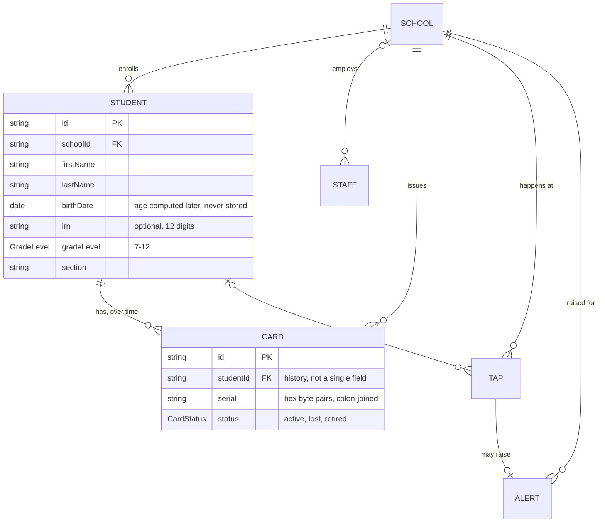

# Recipe: Step 8 — Domain types, schemas and seed data

## What this step is for

Everything so far has been presentation. This step defines what a School, Staff member, Student, Card, Tap and Alert actually *are* (TypeScript types), what makes one *valid* (Zod schemas), and a full set of fake-but-realistic sample records (seed data) standing in for a real database until Phase 2. None of this is the back end — no screen changes, no database — it's the shared vocabulary both sides will eventually agree on: the seed data is built to match it now, and Phase 2's real database will use the same shapes.

## Starting point

A working design system and component library, but no concept of the domain at all — no School/Student/Card/Tap records, no validation rules, nothing for a future screen to read.

## Diagram



The line that matters for later steps is `STUDENT ||--o{ CARD` — a student has a *list* of cards, growing every time one is replaced, so nothing is ever overwritten. This is what makes Step 16's card-replace flow possible, and the seed data demonstrates it today (`student-0001` has both a `lost` card and an `active` one).

## Checklist

1. **Promote `zod` to a direct dependency.** It was already present transitively (pulled in by `eslint-config-next` and `shadcn`), but a transitive version isn't guaranteed to stay put — a future `npm install` on either tool could bump or drop it. Install directly:
   ```bash
   npm install zod
   ```
   Verify the exact v4 API being relied on (`z.email()`, `z.iso.date()`, `z.iso.datetime()`, `z.uuid()` — v4's top-level string-format functions, not the older chained `.email()`/`.datetime()`) before writing any schema.

2. **Put the schema first, derive the type from it** — every feature folder has a `schemas.ts` (the Zod rules) and a `types.ts` that just re-exports what Zod can infer, so the two can never drift apart:
   ```ts
   // src/features/students/schemas.ts
   export const gradeLevelSchema = z.union([
     z.literal(7), z.literal(8), z.literal(9),
     z.literal(10), z.literal(11), z.literal(12),
   ]);
   export const studentSchema = z.object({
     id: z.string().min(1),
     schoolId: z.string().min(1),
     firstName: z.string().min(1, "Enter a first name"),
     middleName: z.string().min(1).optional(),
     lastName: z.string().min(1, "Enter a last name"),
     birthDate: z.iso.date(),          // store the date, never a computed age
     lrn: lrnSchema.optional(),        // exactly 12 digits
     gradeLevel: gradeLevelSchema,
     section: z.string().min(1, "Enter a section"),
     guardianName: z.string().min(1, "Enter a guardian name"),
     guardianMobile: phMobileSchema,
     photoUrl: z.url().optional(),
   });
   ```
   ```ts
   // src/features/students/types.ts
   export type Student = z.infer<typeof studentSchema>;
   ```
   `z.infer` reads the schema's own definition and produces the exact matching type — `gradeLevelSchema` being a literal union means `Student["gradeLevel"]` is `7 | 8 | 9 | 10 | 11 | 12`, not `number`. Add a field once, in the schema, and both compile-time type and runtime validation update together.

3. **Model a card as its own record, not a field on Student.** CLAUDE.md says "replacing a card marks the old one lost" — a student accumulates a *history* of cards, not one. Embedding (`cardSerial`/`cardStatus` on the Student) would mean overwriting that history every replacement. A separate `Card { studentId, status }` record means old `lost` and new `active` cards coexist, which is exactly what Step 16 needs. `Tap` also stores its own `studentId`, captured at tap time rather than looked up later — so re-linking a card can never silently rewrite what an old tap meant.

4. **Enforce `super_admin`'s school-less-ness with `.refine()`, not convention.** CLAUDE.md says keep `schoolId` on every type, but a super admin manages *all* schools. `Staff.schoolId` is `string | null`, and two `.refine()` checks enforce which roles may be null:
   ```ts
   export const staffSchema = z
     .object({ /* ... */ schoolId: z.string().min(1).nullable(), role: roleSchema /* ... */ })
     .refine((staff) => staff.role === "super_admin" || staff.schoolId !== null, {
       message: "Only a super admin can have no school",
       path: ["schoolId"],
     })
     .refine((staff) => staff.role !== "super_admin" || staff.schoolId === null, {
       message: "A super admin isn't scoped to a single school",
       path: ["schoolId"],
     });
   ```
   The type alone (`string | null`) can't express "null only if role is super_admin" — a `.refine()` adds exactly that rule, checked at runtime, and a test proves both directions.

5. **Model a school's brand color as data.** `School.theme` is a discriminated union — either a preset or a custom brand color:
   ```ts
   export const schoolThemeSchema = z.discriminatedUnion("kind", [
     z.object({ kind: z.literal("preset"), presetId: z.enum(presetIds) }),
     z.object({ kind: z.literal("custom"), brandColor: z.string().regex(/^#([0-9a-fA-F]{3}|[0-9a-fA-F]{6})$/) }),
   ]);
   ```
   `presetIds` is derived from the real `themePresets` array, not hand-copied. This is why `check:tokens` needed a new exemption: a `schemas.ts` file legitimately contains a hex string as *data being modeled*, not a hardcoded styling choice — CLAUDE.md's rule reads "no raw colors... **in components or pages**." Narrowed `scripts/check-tokens.mjs`'s exemption to also skip any `schemas.ts`/`schemas.test.ts` file.

6. **Build the seed data deterministically** (no `Math.random()`) so it's identical on every run and every test run:
   - `names.ts` — a hand-picked pool of Filipino first/last names, paired by index (`nameAt(index)`, with the last name scrambled via `index * 7 + 3`).
   - `students.ts` — `SECTION_SLOTS` (12 sections × 6 students = 72): Balanga has all six grades, the two demo schools split the other six. Birth dates computed backward from `SCHOOL_YEAR_START = 2026` and a typical age per grade — never a stored "age."
   - `cards.ts` — most students get one `active` card (deterministic 7-byte hex serial via `cardSerialAt(index)`); every 9th student is left cardless ("not yet issued"); `student-0001` gets the full `lost` + `active` history.
   - `taps.ts` — a sample morning: on-time taps, one late tap, and the lost-card scenario (tapping `student-0001`'s old card, paired with a matching `seedAlerts` entry).

7. **Add `seed.test.ts`** — tests that schemas can't: facts about the *whole* generated set. Exactly 3 schools/7 staff/72 students, every record's `schoolId` points at a real seed school, exactly one super admin, no student with two active cards at once, no two cards sharing a serial. These catch the off-by-one/id-collision mistakes that only show up once something actually counts the data (see BUILD-LOG Step 8 for the `07:510` tap-time bug this principle caught).

8. **Verify all five checks:**
   ```bash
   npm run lint
   npm run typecheck
   npm run test
   npm run build
   npm run check:tokens
   ```
   (77 tests by the end — a `schemas.test.ts` per feature, plus `seed.test.ts`.)

9. **Tick this step's build-task checkboxes** in `docs/PLAN.md`, then `npm run progress`.

10. **Stop and report**, same as every step.

## What ended up in each file, and why

| File | What's in it | Why |
|---|---|---|
| `src/features/{schools,staff,students,attendance}/schemas.ts` | The Zod schemas (student, card, staff, role, school, schoolTheme, tap, alert). | The single source of truth for validity — types derive from them, so nothing drifts. |
| `src/features/*/types.ts` | `z.infer` re-exports (Student, Card, Staff, School, Tap, Alert, …). | The compile-time types, derived from the schemas rather than hand-written twice. |
| `src/features/*/schemas.test.ts` | Valid + invalid cases per schema. | Prove the rules, including the `super_admin` `.refine()` both directions. |
| `src/data/seed/names.ts` | Filipino name pools + `nameAt()`. | Deterministic name generation — no randomness, identical every run. |
| `src/data/seed/students.ts` | `SECTION_SLOTS` + 72 students. | The roster; ages derived from a fixed school-year anchor, never stored. |
| `src/data/seed/cards.ts` | `cardSerialAt()` + card list, one `lost`+`active` history. | Demonstrates the card-history shape Step 16 will rely on. |
| `src/data/seed/taps.ts` | Sample morning taps + the lost-card `seedAlerts`. | A real tap→alert chain, not just records that parse. |
| `src/data/seed/index.ts` | Re-exports everything. | The single entry point future repositories will import. |
| `src/data/seed/seed.test.ts` | Whole-set invariants (counts, referential integrity). | Catches generator-code mistakes schemas can't see. |
| `package.json` | `zod` as a direct dependency. | Promoted from transitive so its version is stable. |
| `scripts/check-tokens.mjs` | `schemas.ts` exemption. | A school's brand color is data, not a hardcoded styling choice. |

## Verification

Same five commands as checklist step 8, all green (77 tests). The step's "Done when" — "types and schemas compile, and schema tests pass" — is confirmed by the passing schema and seed tests; `seed.test.ts`'s whole-set invariants are the real proof the generated data is coherent, not just parseable.
