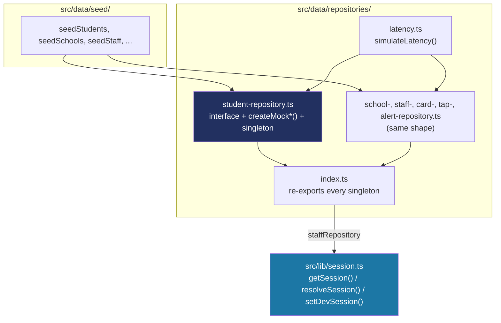

# Recipe: Step 9 — Mock repositories and session

## What this step is for

Step 8 defined what the data *is*; this step builds how it gets *read*. It adds a repository layer — an interface + mock implementation per entity — that sits between the seed data and everything that will use it, plus `getSession()`, the dev-only stand-in for real login. The single rule this establishes is what makes Phase 2's swap to a real database possible without touching any UI: nothing outside `src/data/` imports seed data directly; everything talks to `studentRepository.listBySchool(...)` instead.

## Starting point

Step 8's seed data exists, but nothing reads it. There's no way for a future page to fetch students/schools/staff, and no concept of "who's signed in."

## Diagram



## Checklist

1. **Create `src/data/repositories/latency.ts`** — every mock method awaits this before returning, so nothing can silently assume data arrives instantly:
   ```ts
   export function simulateLatency(latencyMs: number): Promise<void> {
     if (latencyMs <= 0) return Promise.resolve();
     const jitter = Math.random() * latencyMs * 0.4;
     return new Promise((resolve) => setTimeout(resolve, latencyMs + jitter));
   }

   export const DEFAULT_LATENCY_MS = 150;
   ```
   A real database call over a real network never returns instantly, and code that forgot to `await` a repository call would work by accident against an instant mock and break against a real one. The default is 150ms; `latencyMs: 0` short-circuits (which every test passes) so the simulation never slows `npm run test`.

2. **Write one `{entity}-repository.ts` per Step 8 entity** (school, staff, student, card, tap, alert), each the same three-part shape — interface, factory, singleton. Taking `student-repository.ts` as the example:
   ```ts
   export interface StudentRepository {
     listBySchool(schoolId: string): Promise<Student[]>;
     getById(id: string): Promise<Student | null>;
   }

   export function createMockStudentRepository(
     data: Student[] = seedStudents,
     options: { latencyMs?: number } = {},
   ): StudentRepository {
     const latencyMs = options.latencyMs ?? DEFAULT_LATENCY_MS;
     return {
       async listBySchool(schoolId) {
         await simulateLatency(latencyMs);
         return data.filter((student) => student.schoolId === schoolId);
       },
       async getById(id) {
         await simulateLatency(latencyMs);
         return data.find((student) => student.id === id) ?? null;
       },
     };
   }

   export const studentRepository = createMockStudentRepository();
   ```
   - The **interface** is the real contract — Phase 2's Prisma-backed implementation will satisfy the same one, so a page written against `StudentRepository` never changes when the mock is replaced.
   - The **factory function** takes its data as a parameter (defaulting to the seed data) so a test can hand it three students instead of all 72 — small, focused, fast, no dependency on the real seed set.
   - The **singleton** is just `createMock*()` called once — the one instance the app actually imports.

3. **Keep every repository read-only.** Tempting to add `create`/`update` while designing, but Step 9's done-when criterion ("no UI code talks to seed data directly") only needs reads, and nothing exercises a write yet. A speculative `StudentRepository.create()` with no caller would be exactly the half-finished surface CLAUDE.md warns against — each later step that needs a write adds it when it needs it.

4. **Create `src/lib/session.ts`** — split into a testable half and a Next.js-glue half:
   ```ts
   export async function resolveSession(
     staffId: string | undefined,
     repository: StaffRepository,
   ): Promise<Session> {
     const staff =
       (staffId ? await repository.getById(staffId) : null) ??
       (await repository.getById(DEFAULT_DEV_STAFF_ID));
     if (!staff) throw new Error(/* ... */);
     return { userId: staff.id, role: staff.role, schoolId: staff.schoolId };
   }

   export async function getSession(): Promise<Session> {
     const cookieStore = await cookies();
     const staffId = cookieStore.get(DEV_SESSION_COOKIE)?.value;
     return resolveSession(staffId, staffRepository);
   }
   ```
   The actual decisions (missing cookie → fall back to the default persona; stale id → fall back too) are pulled into `resolveSession`, a plain function that takes its inputs as arguments and is fully unit-tested with a fake `StaffRepository`. `getSession`/`setDevSession` are left as thin wrappers that call `cookies()` and hand off — correct by inspection, not worth mocking Next internals to cover.

5. **Guard the dev-session switch so it's impossible in production:**
   ```ts
   export function assertDevSessionMutationAllowed(): void {
     if (process.env.NODE_ENV === "production") {
       throw new Error("Dev session switching is disabled in production.");
     }
   }

   export async function setDevSession(staffId: string): Promise<void> {
     "use server";
     assertDevSessionMutationAllowed();
     const cookieStore = await cookies();
     cookieStore.set(DEV_SESSION_COOKIE, staffId, { httpOnly: true, sameSite: "lax", path: "/" });
   }
   ```
   The guard lives *inside the function*, not just in whatever UI calls it — a Server Function is reachable by a direct POST from anywhere, not only from a button that happens not to render. Note the `"use server"` is **inline** (inside the function body), not at the top of the file: `session.ts` also exports plain types and functions that aren't actions, and a file-level directive would require every export to be async. Confirmed this actually compiles with `npm run build`, not just trusted from the docs.

6. **Add a test per repository**, each passing `{ latencyMs: 0 }` and small fixture data — `school-repository.test.ts` constructs a repository from two hand-written schools instead of all three, proving the factory shape is what makes tests cheap.

7. **Verify all five checks:**
   ```bash
   npm run lint
   npm run typecheck
   npm run test
   npm run build
   npm run check:tokens
   ```
   (104 tests by the end — 27 new.)

8. **Tick this step's build-task checkboxes** in `docs/PLAN.md`, then `npm run progress`.

9. **Stop and report**, same as every step.

## What ended up in each file, and why

| File | What's in it | Why |
|---|---|---|
| `src/data/repositories/latency.ts` | `simulateLatency` + `DEFAULT_LATENCY_MS`. | Realistic delay on every call, zero cost in tests. |
| `src/data/repositories/{entity}-repository.ts` × 6 | interface + `createMock*()` + singleton per entity. | The read layer — Phase 2 swaps the mock for a real DB behind the same interface. |
| `src/data/repositories/index.ts` | Re-exports every singleton. | The single import point for `studentRepository`, `staffRepository`, etc. |
| `src/lib/session.ts` | `resolveSession`, `getSession`, `setDevSession`, `assertDevSessionMutationAllowed`. | The dev stand-in for login; logic split out for testability, guarded for production. |
| `{entity}-repository.test.ts` × 6 + `session.test.ts` | Unit tests with small fixtures, `latencyMs: 0`. | Prove the filtering/session logic without the real 72-student seed or real latency. |

## Verification

Same five commands as checklist step 7, all green (104 tests). The step's "Done when" — "tests pass and no UI code talks to seed data directly" — is confirmed by the 27 new tests and by the fact that nothing outside `src/data/` imports `seedStudents` (or any other seed array): every future consumer goes through a repository singleton.
