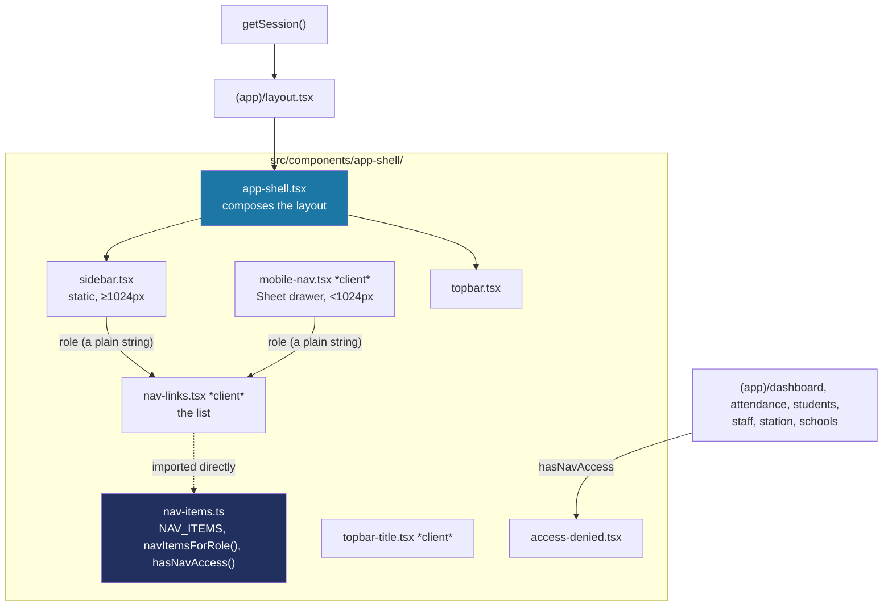

# Recipe: Step 10 — App shell and navigation

## What this step is for

Every screen the app will have — dashboard, attendance, students, staff, tap station, schools — renders inside the same "chrome": a sidebar, a top bar, and role-based navigation. This step builds that shell, plus route guards so a role can't reach a page its own menu never links to. It's the first time the app actually *does* something with `getSession()` (Step 9) and the first real multi-screen structure.

## Starting point

`getSession()` and the repositories exist, but no screen uses them. There's a single root layout and a single page (`/` = the token demo). No sidebar, no top bar, no concept of "signed in and navigating."

## Diagram



## Checklist

1. **Create `nav-items.ts`** — the single list every nav decision reads from, so the sidebar, the mobile drawer and the route guards can never drift apart:
   ```ts
   export const NAV_ITEMS: readonly NavItem[] = [
     { segment: "schools", href: "/schools", label: "Schools", icon: School, roles: ["super_admin"] },
     { segment: "dashboard", href: "/dashboard", label: "Dashboard", icon: LayoutDashboard, roles: ALL_ROLES },
     { segment: "attendance", href: "/attendance", label: "Attendance", icon: CalendarCheck, roles: ALL_ROLES },
     { segment: "students", href: "/students", label: "Students", icon: Users, roles: ALL_ROLES },
     { segment: "staff", href: "/staff", label: "Staff", icon: IdCard, roles: SCHOOL_STAFF_ROLES },
     { segment: "station", href: "/station", label: "Tap station", icon: Nfc, roles: SCHOOL_STAFF_ROLES },
   ];

   export function navItemsForRole(role: Role): NavItem[] {
     return NAV_ITEMS.filter((item) => item.roles.includes(role));
   }

   export function hasNavAccess(role: Role, segment: NavSegment): boolean {
     const item = NAV_ITEMS.find((candidate) => candidate.segment === segment);
     return item ? item.roles.includes(role) : true;
   }
   ```
   `navItemsForRole` drives what renders in the sidebar/drawer; `hasNavAccess` drives the route guards. Same source list, two different questions.

2. **Avoid the icon-passing bug before it bites.** A Server Component (`Sidebar`) can't hand its resolved nav list — each item carrying an actual `lucide-react` icon component — to a Client Component (`NavLinks`) as a prop, because a component reference is a function and functions can't be serialized across the Server→Client boundary. The fix is structural: `NavLinks` (and `MobileNav`, one layer up) don't *receive* the list at all — they import `navItemsForRole` themselves (a plain shared module, no directive) and take only `role: Role`, a plain string:
   ```tsx
   "use client";
   export function NavLinks({ role, onNavigate, className }: { role: Role; ... }) {
     const pathname = usePathname();
     const items = navItemsForRole(role);  // resolved here, in the browser bundle
     // ...
   }
   ```

3. **Build the top bar title as a Client Component** (`topbar-title.tsx`) — layouts can't read the current pathname (they don't rerender on navigation), so `useSelectedLayoutSegment()` looks up the active label from `NAV_ITEMS` and renders it as the page's one true `<h1>`.

4. **Give `PageHeader` an `as` prop** so pages inside the shell don't double up on `<h1>`s. The top bar already renders an `<h1>` with the page title; a page's own `PageHeader` must render `<h2>` instead (the reference prototype already models this — its top bar is `<h1>`, its page functions are `<h2>`):
   ```tsx
   export function PageHeader({ title, description, actions, className, as: Heading = "h1" }: {...}) {
     return (
       // ...
       <Heading className="font-heading text-2xl font-semibold text-foreground">{title}</Heading>
     );
   }
   ```
   Default stays `"h1"` so the two standalone usages (`/`, `/design-system`) are unaffected.

5. **Build the shell components** — `app-shell.tsx` (composes sidebar + topbar around `{children}`), `sidebar.tsx` (static, `hidden lg:flex`), `mobile-nav.tsx` (a shadcn `Sheet` drawer, `lg:hidden`, `onNavigate` closes it), `access-denied.tsx` (the "you're not allowed" panel).

6. **Write the route guards per page** — each restricted page checks `hasNavAccess(session.role, "staff")` at the top and renders `AccessDenied` with a reason naming the actual role/page instead of redirecting or 404-ing:
   ```tsx
   // src/app/(app)/staff/page.tsx
   const session = await getSession();
   if (!hasNavAccess(session.role, "staff")) {
     return <AccessDenied reason="Teacher accounts don't manage staff at this school — that needs a principal or super admin sign-in." />;
   }
   ```
   A silent redirect hides *why* nothing happened; `notFound()` pretends the page doesn't exist. A plain message with a way back is the accurate choice for a school app where roles aren't secret.

7. **Create the route group `(app)/layout.tsx`** — an async layout that resolves the session and school, then renders `AppShell`:
   ```tsx
   export default async function AppLayout({ children }: { children: ReactNode }) {
     const session = await getSession();
     const school = session.schoolId ? await schoolRepository.getById(session.schoolId) : null;
     return <AppShell role={session.role} school={school}>{children}</AppShell>;
   }
   ```
   `(app)` is a route group — adds no URL segment — so this is a nested layout under the root, not a second root. Add `loading.tsx`, `error.tsx`, and the six placeholder pages (`dashboard`, `attendance`, `students`, `staff`, `station`, `schools`), each a stub naming the step that actually builds it.

8. **Add the root `not-found.tsx`** — a plain branded 404 outside the shell (not every visitor is "in" the app). Only a root `app/not-found.tsx` catches unmatched URLs automatically; a nested one only fires from an explicit `notFound()` call.

9. **Verify all five checks:**
   ```bash
   npm run lint
   npm run typecheck
   npm run test
   npm run build
   npm run check:tokens
   ```
   (114 tests — 10 new.)

10. **Browser-check at 360px and 1280px, light and dark** — full nav for the default (Balanga principal) session; set `talaan-dev-session` to a teacher id and confirm nav drops to Dashboard/Attendance/Students and `/staff`/`/station` show the access-denied panel; mobile drawer opens, closes on navigation, and traps focus.

11. **Tick this step's build-task checkboxes** in `docs/PLAN.md`, then `npm run progress`.

12. **Stop and report**, same as every step.

## What ended up in each file, and why

| File | What's in it | Why |
|---|---|---|
| `src/components/app-shell/nav-items.ts` (+ test) | `NAV_ITEMS`, `navItemsForRole`, `hasNavAccess`. | One list, three jobs (sidebar, drawer, guards) — they can't drift apart. |
| `src/components/app-shell/nav-links.tsx` | The `<Link>` list, resolves items client-side. | Takes `role` (a string) instead of the list, dodging the Server→Client serialization bug. |
| `src/components/app-shell/sidebar.tsx` / `mobile-nav.tsx` | Static sidebar vs. Sheet drawer, both render `NavLinks`. | Same nav, two breakpoints — CSS media query, no JS for the split itself. |
| `src/components/app-shell/topbar.tsx` / `topbar-title.tsx` | Sticky bar + the page's `<h1>`. | The title is a client component because layouts can't read the pathname. |
| `src/components/app-shell/access-denied.tsx` | The "not allowed" panel. | An honest in-shell message, deliberately *not* built on `EmptyState`. |
| `src/app/(app)/layout.tsx` | Resolves session + school, renders `AppShell`. | The authenticated shell; `(app)` is a route group (no URL segment). |
| `src/app/(app)/{dashboard,attendance,students,staff,station,schools}/page.tsx` | Placeholder pages, last three guarded. | Real routes now exist; content comes in later steps. |
| `src/app/(app)/loading.tsx`, `error.tsx`, `src/app/not-found.tsx` | Loading/error/404 states. | Every screen needs them per CLAUDE.md's UX bar. |
| `src/components/page-header.tsx` | New `as?: "h1" \| "h2"` prop. | So shell pages use `<h2>`, not a second `<h1>`. |

## Verification

Same five commands as checklist step 9, plus the two-role browser pass in step 10. The step's "Done when" — "all three roles see the right menu, a teacher cannot open Staff, and it works at 360px and 1280px" — is confirmed by the teacher-session browser check (restricted nav + access-denied panel) and the responsive drawer check at both breakpoints.
