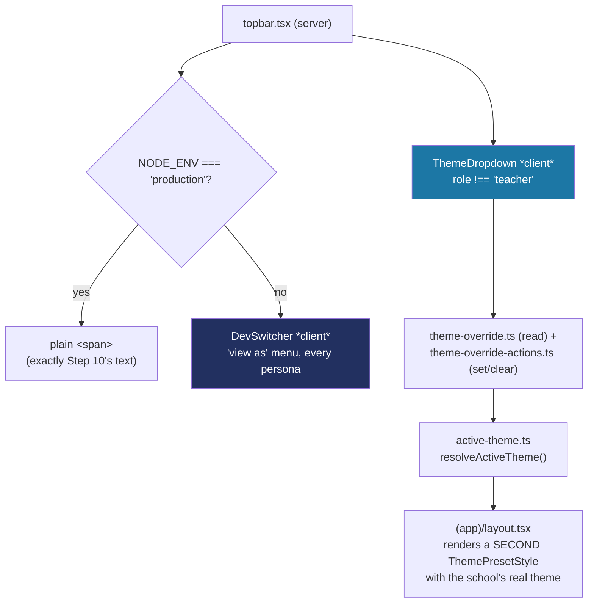

# Recipe: Step 11 — Dev switchers and theme dropdown

## What this step is for

Two things become interactive in the top bar. First, the static "Principal, Balanga City NSHS" text becomes a dev-only "view as" switcher — a stand-in for real login (Phase 2) that lets you flip between any staff persona to see the app as they'd see it. Second, a compact theme dropdown lets a principal/super admin preview a preset live. And for the first time, the signed-in school's *actual* saved theme loads for real, instead of the hardcoded default the shell has shown since Step 4.

## Starting point

Step 10's shell renders the right nav per role, but the top bar's right side is a static text span, there's no way to switch persona, and `(app)/layout.tsx` always renders the default `school` preset regardless of which school is signed in.

## Diagram



## Checklist

1. **Split `setDevSession` out of `session.ts` into `src/lib/session-actions.ts`.** This is the first time a *Client Component* imports a Server Action directly (rather than receiving it as a prop from a Server Component). Next.js only allows that for a function in its own file with a top-of-file `"use server"`:
   ```ts
   "use server";
   import { cookies } from "next/headers";
   import { assertDevSessionMutationAllowed, DEV_SESSION_COOKIE } from "./session";

   export async function setDevSession(staffId: string): Promise<void> {
     assertDevSessionMutationAllowed();
     const cookieStore = await cookies();
     cookieStore.set(DEV_SESSION_COOKIE, staffId, { httpOnly: true, sameSite: "lax", path: "/" });
   }
   ```
   It can't stay in `session.ts` because that file also exports a plain type and non-async functions, and a file-level `"use server"` requires every export to be async. The inline `"use server"` Step 9 used only works for an action a Server Component defines and passes *down* — not for a Client Component reaching *up* to import it by name.

2. **Do the same split for the theme preview** — `theme-override.ts` keeps the read side (`THEME_OVERRIDE_COOKIE`, `getThemeOverride`), and `theme-override-actions.ts` holds the two actions. Same reason: the file also exports a plain string constant, which the "every export must be async" rule forbids in a `"use server"` file:
   ```ts
   "use server";
   export async function setThemeOverride(presetId: ThemePresetId): Promise<void> {
     const session = await getSession();
     if (session.role === "teacher") throw new Error("Teacher accounts can't change the theme.");
     const cookieStore = await cookies();
     cookieStore.set(THEME_OVERRIDE_COOKIE, presetId, { httpOnly: true, sameSite: "lax", path: "/" });
   }

   export async function clearThemeOverride(): Promise<void> {
     const cookieStore = await cookies();
     cookieStore.delete(THEME_OVERRIDE_COOKIE);
   }
   ```

3. **Avoid the near-cycle in the design.** The natural instinct is to have `setDevSession` call `clearThemeOverride()` internally, so switching persona always resets the preview. That would make `session-actions.ts` import from `theme-override-actions.ts`, which already imports `getSession` *from* `session.ts` — the two would import each other. Instead, keep `clearThemeOverride` independently callable and have `dev-switcher.tsx`'s own click handler call both in sequence:
   ```tsx
   function switchTo(staffId: string) {
     startTransition(async () => {
       await setDevSession(staffId);
       await clearThemeOverride();
     });
   }
   ```
   Same observed behavior (persona switch always clears the preview), no cycle to reason about.

4. **Build `src/lib/theme/active-theme.ts`** — "what theme is on screen right now," layering the preview over the school's own theme over the default:
   ```ts
   export function resolveActiveTheme(school: School | null, overridePresetId?: ThemePresetId): ResolvedTheme {
     if (overridePresetId) {
       const preset = getThemePreset(overridePresetId);
       return { light: preset.light, dark: preset.dark };
     }
     if (school) return resolveSchoolTheme(school.theme);
     return resolveSchoolTheme({ kind: "preset", presetId: DEFAULT_THEME_PRESET_ID });
   }
   ```
   `resolveSchoolTheme` is the first real caller of Step 5's `generateCustomPalette` outside its own test — a school's `theme` field is a discriminated union (`preset` or `custom` brand color), and this is where it finally resolves into actual colors.

5. **Widen `ThemePresetStyle` from `presetId` to `tokens`.** Steps 4–5 gave it a `presetId` and had it look the preset up internally — fine when the only source was `getThemePreset()`. Step 11 needs to feed it a *custom* palette too, which isn't a named preset. It now just takes the already-resolved `{ light, dark }` tokens:
   ```tsx
   export function ThemePresetStyle({ tokens, id = "theme-preset" }: {
     tokens: { light: ThemeColorTokens; dark: ThemeColorTokens };
     id?: string;
   }) {
     return <style id={id} dangerouslySetInnerHTML={{ __html: presetToCss(tokens) }} />;
   }
   ```
   `presetToCss` needed the same widening — it only ever read those two fields anyway.

6. **Render a *second* `ThemePresetStyle` in `(app)/layout.tsx`, not a changed one in the root.** The obvious approach — make the root layout resolve the session's school and pass a real preset — would also change what `/` and `/design-system` render (standalone pages with their own scoped-preview mechanism, unrelated to who's signed in). Instead `(app)/layout.tsx` (already async) renders its own `<ThemePresetStyle id="theme-preset-active" tokens={resolveActiveTheme(school, overridePresetId)} />`. Both use the `:root:root` specificity tie, but this one comes later in the HTML source, so it wins for every page inside the shell while the standalone pages keep just the default. Root `layout.tsx` changes by exactly one line (the `ThemePresetStyle` call site, to match the new `tokens` prop).

7. **Build `DevSwitcher`** — the "view as" menu, grouped by school (a "Platform" group for the school-less super admin). It calls `setDevSession` + `clearThemeOverride` inside `startTransition`, and `topbar.tsx` only renders it when `NODE_ENV !== "production"` — falling back to Step 10's exact static text otherwise. No `router.refresh()` is needed: setting a cookie inside a Server Action makes Next re-render the page automatically.

8. **Build `ThemeDropdown`** — a compact `Select` of the 5 presets, rendered whenever `role !== "teacher"` (in production or not, since it's a real future feature). It calls `setThemeOverride` (a cookie, never a repository write — saving to the school record is Step 21's job), then toasts the new name. Its own Server Action checks the role server-side too, independently of the UI.

9. **Add `StaffRepository.list()`** (and a test) — the dev switcher's full, every-school persona list.

10. **Verify all five checks:**
    ```bash
    npm run lint
    npm run typecheck
    npm run test
    npm run build
    npm run check:tokens
    ```
    (121 tests — 7 new.)

11. **Browser-check at 360px and 1280px, light and dark** — open the dev switcher, pick Oceanview's principal: sidebar/logo/theme-dropdown-value/topbar all update in one navigation, no flash. Pick a preset from the dropdown: recolors live, toast, persona unchanged (it's a preview, not an identity change). Switch persona again and confirm the preview is gone, replaced by the new persona's own theme. As a teacher, the theme dropdown disappears entirely.

12. **Confirm the production guard for real** — `npm run build && npm run start`, then confirm the dev switcher's menu text is completely absent from the HTML and the identity renders as a plain `<span>`.

13. **Tick this step's build-task checkboxes** in `docs/PLAN.md`, then `npm run progress`.

14. **Stop and report**, same as every step.

## What ended up in each file, and why

| File | What's in it | Why |
|---|---|---|
| `src/lib/theme/active-theme.ts` (+ test) | `resolveSchoolTheme`, `resolveActiveTheme`. | Resolves override → school → default into real colors; first real caller of `generateCustomPalette`. |
| `src/lib/theme/theme-override.ts` | `THEME_OVERRIDE_COOKIE`, `getThemeOverride`. | The read side of the live preview cookie. |
| `src/lib/theme/theme-override-actions.ts` | `setThemeOverride`, `clearThemeOverride`. | The write side, in its own `"use server"` file. |
| `src/lib/session-actions.ts` | `setDevSession`. | Moved out of `session.ts` so a Client Component can import it directly. |
| `src/components/app-shell/dev-switcher.tsx` | The "view as" persona menu. | Stand-in for real login; calls both actions in sequence to avoid the cycle. |
| `src/components/app-shell/theme-dropdown.tsx` | The compact preset `Select`. | Live preview via cookie; never writes the school record (Step 21). |
| `src/components/app-shell/topbar.tsx` | Gates `DevSwitcher` on `NODE_ENV`, renders `ThemeDropdown` when `role !== "teacher"`. | The dev switcher must never exist in production; the theme dropdown is a real feature. |
| `src/lib/theme/theme-preset-style.tsx` / `apply-preset.ts` | `tokens` prop instead of `presetId`. | So it can render a custom palette, not just a named preset. |
| `src/app/(app)/layout.tsx` | Second `ThemePresetStyle` with the resolved theme. | The school's real theme, winning the specificity tie by being later in the HTML. |
| `src/data/repositories/staff-repository.ts` (+ test) | `list()`. | The dev switcher's every-school persona list. |

## Verification

Same five commands as checklist step 10, plus the browser pass in step 11 and the production-guard check in step 12. The step's "Done when" — "switching school changes logo and colors with no flash, and the dropdown recolors everything live" — is confirmed by switching personas and presets in the browser and seeing each recolor in one navigation with no reload flash.
