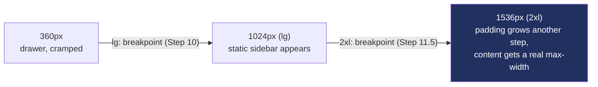

# Recipe: Step 11.5 — Responsive scaling, small screen to big screen

## What this step is for

The app had only ever been checked at two sizes (360px and 1280px), and past 1280px nothing changed — on a genuinely large monitor (1920px+) the sidebar stayed 256px, text stayed exactly its 1280px size, and the content area showed a large empty rectangle. This step makes the app grow sensibly up through a big desktop/laptop monitor: content uses width better, page titles scale up, and everything stops growing at a sane cap rather than stretching edge-to-edge on an ultrawide.

## Starting point

Step 10–11's shell, frozen at 1280px. A `grep -rn "xl:\|2xl:" src` came back completely empty — nothing past Tailwind's `lg` (1024px) had ever been given a value anywhere.

## Diagram



## Checklist

1. **Confirm the target before designing anything.** "Big screen" is genuinely ambiguous: a bigger desktop monitor (viewed up close, wants width used well) and a wall-mounted lobby TV (viewed from across a room, wants a "10-foot UI" with much bigger text) call for near-opposite treatments. Confirm it's the desktop-monitor case. That rules out the instinct to inflate body text broadly, and points at "use width well, cap it at a sane point, grow only a few specific things."

2. **Cap and pad the shell's `<main>`** in `app-shell.tsx` — below 2xl (1536px) it's unchanged; at 2xl and up, padding grows a step and content stops at 1600px:
   ```tsx
   <main className="flex-1 px-4 py-6 sm:px-6 lg:px-8 lg:py-8 2xl:px-12 2xl:py-10">
     <div className="w-full 2xl:max-w-[1600px]">{children}</div>
   </main>
   ```
   No `mx-auto`: the cap doesn't center the content, it just stops it stretching further, so it stays flush with the full-width top bar above it rather than becoming a disconnected island. This is what real dashboard products do — chrome (sidebar, top bar) stays constant; only the content area grows, and even it stops at a sane point because very long line lengths and very wide tables get harder to scan.

3. **Grow `PageHeader`'s title and description**, continuing the pattern `TopbarTitle` started in Step 10 (`sm:text-xl`):
   ```tsx
   <Heading className="font-heading text-2xl font-semibold text-foreground lg:text-3xl 2xl:text-4xl">
     {title}
   </Heading>
   <p className="text-sm text-muted-foreground lg:text-base">{description}</p>
   ```
   Nothing else grows — body copy stays put, since (per the target) that's the text someone reads up close.

4. **Upgrade the six placeholder pages from a bare `<p>` to an `EmptyState` panel.** With next to no real content yet, a wider container alone wouldn't visibly demonstrate anything. Each placeholder's plain note becomes an `EmptyState` (icon + "Not built yet" + the same copy) — genuinely the right component here ("nothing built here yet" is exactly what `EmptyState` means, unlike Step 10's `AccessDenied`, which deliberately avoided it because "empty, add content" was the wrong metaphor for "blocked"):
   ```tsx
   <EmptyState
     icon={LayoutDashboard}
     title="Not built yet"
     description="The live attendance summary, grade-level breakdown and tap feed are built in Step 13."
   />
   ```
   This is honest scope, not a trick: the real payoff lands once Steps 13+ add cards/tables/grids that use the reclaimed width — this step makes sure they inherit good behavior automatically instead of every future page re-deciding it.

5. **Verify all five checks:**
   ```bash
   npm run lint
   npm run typecheck
   npm run test
   npm run build
   npm run check:tokens
   ```
   (121 tests, unchanged — this step is styling/layout only, no new test surface.)

6. **Browser-check across a real range, not just 360px/1280px** — 360px (unchanged), 1920px and 2560px, light and dark. At 2560px the content cap visibly engages (a real right margin appears instead of stretching edge-to-edge), `PageHeader` titles are visibly larger, and the placeholders read as intentional "not built yet" cards. Also check `/schools` (the `AccessDenied` page) as a principal at 1920px — its own internal centering still looks correct, no regression.

7. **Tick this step's build-task checkboxes** in `docs/PLAN.md`, then `npm run progress`.

8. **Stop and report**, same as every step.

## What ended up in each file, and why

| File | What's in it | Why |
|---|---|---|
| `src/components/app-shell/app-shell.tsx` | `<main>` padding grows at `lg`/`2xl`, content wrapped in `w-full 2xl:max-w-[1600px]`. | Use width well, cap it at a sane point, no centering island. |
| `src/components/page-header.tsx` | Title `text-2xl → lg:text-3xl → 2xl:text-4xl`; description `text-sm → lg:text-base`. | Page headings scale; body copy doesn't. |
| `src/app/(app)/*/page.tsx` (6 files) | Bare `<p>` → `EmptyState` panel. | Makes the placeholders read as intentional cards, not text floating in emptiness. |

## Verification

Same five commands as checklist step 5, plus the multi-breakpoint browser pass in step 6. The step's "Done when" — "checked across a real range of sizes… the app visibly grows with the screen instead of leaving large empty space, while staying correct and readable at 360px" — is confirmed by the 1920px/2560px screenshots showing the cap and scaled titles, and the 360px screenshot showing no regression.