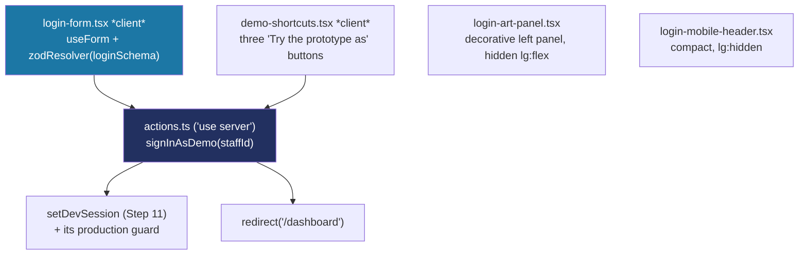

# Recipe: Step 12 — Login page

## What this step is for

The app has an authenticated shell (Step 10) and a dev switcher (Step 11), but no front door. This step builds the login screen — the prototype's two-pane layout: a decorative left panel (product identity + a looping value-prop) and a real sign-in form on the right, with inline validation and "try the prototype as" shortcuts. Phase 1 has no real accounts, so the form validates for real but a valid submission signs in as the demo principal, reusing Step 11's own dev-session mechanism rather than inventing a new one.

## Starting point

`src/app/page.tsx` was still the Step 4–6 design-tokens demo — a temporary verification aid, superseded by `/design-system` since Step 7. No sign-in form existed; the only "login" was the Step 11 dev switcher in the top bar.

## Diagram



## Checklist

1. **Add React Hook Form and its Zod resolver as dependencies.** The usual `npx shadcn add form` silently did nothing (this project's `"style": "radix-nova"` registry hasn't shipped a `form` item), so install the two libraries directly — both already named in CLAUDE.md's stack list — and build the form against the existing `Input`/`Label` by hand:
   ```bash
   npm install react-hook-form @hookform/resolvers
   ```

2. **Write the login schema**, `src/features/auth/schemas.ts` — valid for real even though there's nothing to check against yet:
   ```ts
   export const loginSchema = z.object({
     email: z.email("Enter a valid email address"),
     password: z.string().min(1, "Enter your password"),
   });
   ```

3. **Write the sign-in action**, `src/features/auth/actions.ts` — reuses Step 11's `setDevSession` (and its production guard) instead of duplicating cookie logic, then redirects:
   ```ts
   "use server";
   import { redirect } from "next/navigation";
   import { setDevSession } from "@/lib/session-actions";

   export async function signInAsDemo(staffId: string): Promise<void> {
     await setDevSession(staffId);
     redirect("/dashboard");
   }
   ```

4. **Define the demo personas**, `src/features/auth/demo-personas.ts` — read from Step 8's seed ids, not re-typed:
   ```ts
   export const DEMO_PERSONAS = [
     { role: "principal", label: "Principal", staffId: "staff-principal-school-balanga" },
     { role: "teacher", label: "Teacher", staffId: "staff-teacher-school-balanga" },
     { role: "super_admin", label: "Super admin", staffId: "staff-0001" },
   ] as const;

   export const DEFAULT_SIGN_IN_STAFF_ID = DEMO_PERSONAS[0].staffId;
   ```

5. **Build `login-form.tsx`** — React Hook Form + `zodResolver`, inline errors on both fields, a show/hide password toggle, a disabled + "Signing in…" state while pending, and a "Forgot your password?" toast. It takes a `signInEnabled` prop: when `false` (production), the buttons stay visible (so the page still looks right) but show a toast — "Sign-in isn't connected yet — that's Phase 2" — instead of calling the action.

6. **Replace `src/app/page.tsx` with the login page** — the old design-tokens demo is superseded by `/design-system`, so `/` becomes the real front door rather than leaving the demo orphaned at `/login`.

7. **Build the art panel** (`login-art-panel.tsx`) — token-only graph-paper background (`color-mix(in oklch, var(--border) ...)`, so it passes `check:tokens` with no new asset), an `Nfc` icon-badge (the product's defining mechanic, not a building/school icon), the headline, a tagline, and the three value props. Below `lg` it's `hidden lg:flex` — the full desktop art panel stacked above the form on a phone pushes "Sign in" off the first screen, so a compact `login-mobile-header.tsx` (just the heading) renders instead.

8. **Fix the real focus-ring bug surfaced here — the ring wasn't too thick, it was doubled.** `src/styles/base.css`'s `:focus-visible { outline: ... }` was imported as plain, unlayered CSS, and per the CSS Cascade Layers spec an unlayered rule beats *any* layered rule — so it was unconditionally overriding every component's own `outline-none` (a Tailwind `utilities`-layer class), stacking the native outline *on top of* the component's box-shadow ring. Fix: wrap all of `base.css` in `@layer base { ... }` so it joins Tailwind's layer stack at the lowest priority — the outline still works as a fallback for anything that doesn't set its own ring, but Button/Input/Select now win as intended.

9. **Size up the primary controls at the template level, not per-call-site.** The shadcn `input.tsx`/`button.tsx`/`select.tsx` all inherited an `h-8` (32px) height and a 3px focus ring since Step 6 — below the 44px touch-target guidance, and cramped next to a label. Rather than mask it with one-off classNames on the login page (leaving every other screen undersized), edit the real templates: `input.tsx` gets a `size` variant (`default` = unchanged, `lg` = `h-11`/44px) with an `Omit<React.ComponentProps<"input">, "size">` to dodge the native `size` attribute's type clash; `button.tsx`'s `lg` widens to `h-11`; all three go `ring-3` → `ring-2`.

10. **Verify all five checks:**
    ```bash
    npm run lint
    npm run typecheck
    npm run test
    npm run build
    npm run check:tokens
    ```

11. **Browser-check at 360px, 1280px, 1920px, 2560px, light and dark** — empty submit shows both inline errors + focus to email; a valid submit and each demo shortcut land on `/dashboard` as the right persona; "Forgot your password?" toasts; the production guard (clicking a shortcut in a production build shows the toast, no navigation).

12. **Tick this step's build-task checkboxes** in `docs/PLAN.md`, then `npm run progress`.

13. **Stop and report**, same as every step.

## What ended up in each file, and why

| File | What's in it | Why |
|---|---|---|
| `src/features/auth/schemas.ts` / `types.ts` | `loginSchema` (email + password) and its inferred type. | Valid for real; a valid submit signs in as the demo principal. |
| `src/features/auth/actions.ts` | `signInAsDemo`. | Reuses Step 11's `setDevSession` + guard, then redirects. |
| `src/features/auth/demo-personas.ts` | The three seeded staff ids. | Read from seed data, not re-typed. |
| `src/features/auth/login-form.tsx` | The real form (RHF + Zod, toggle, pending state, "Forgot?" toast). | Phase 1's front door with real validation. |
| `src/features/auth/demo-shortcuts.tsx` | The three "Try the prototype as" buttons. | Each tracks its own pending state, lands as the right persona. |
| `src/features/auth/login-art-panel.tsx` | The decorative left panel. | Token-only, generic (multi-tenant), `hidden lg:flex`. |
| `src/features/auth/login-mobile-header.tsx` | Compact heading below `lg`. | Keeps "Sign in" above the fold on a phone. |
| `src/app/page.tsx` | Rewritten as the login page. | `/` becomes the front door; the demo is superseded by `/design-system`. |
| `src/styles/base.css` | Wrapped in `@layer base`. | Fixes the doubled focus ring (unlayered CSS beating Tailwind utilities). |
| `src/components/ui/input.tsx` / `button.tsx` / `select.tsx` | `size="lg"` variant + `ring-2`. | Sitewide 44px touch targets, fixed at the template level. |
| `src/app/globals.css` | `value-prop-cycle` keyframe + three staggered utilities. | The looping value-prop carousel, with a reduced-motion fallback. |
| `package.json` | `react-hook-form` + `@hookform/resolvers`. | The form libraries (shadcn's `form` item doesn't exist in this registry). |

## Verification

Same five commands as checklist step 10, plus the browser pass in step 11. The step's "Done when" — "it matches the prototype at 360px and 1280px, in light and dark" — is confirmed by the two-pane split stacking correctly below `lg` and the persona checks confirming each shortcut lands in the right role's shell.
