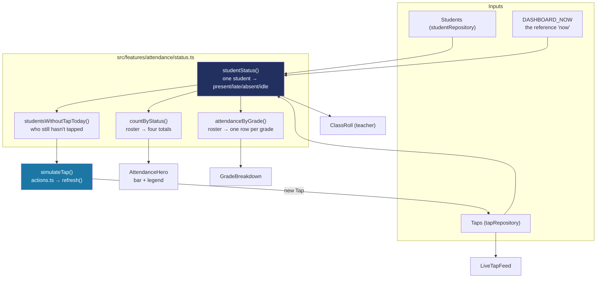

# Recipe: Step 13 — Dashboard

## What this step is for

The first *real* screen: an attendance dashboard with today's counts, a segmented status bar, attendance by grade, a needs-attention list, a live tap feed, and a working "Simulate a tap" button — plus a separate class-scoped variant for teachers. The core idea it establishes (and that every later attendance screen reuses) is that attendance is **never stored, always calculated**: a student's present/late/absent/not-yet-tapped status is derived from the roster + the tap list + "what time is it now," not read from a field.

## Starting point

`(app)/dashboard/page.tsx` was a Step 10 placeholder ("Not built yet"). Step 8's seed taps only ever covered 7 students in two grades, so there was nothing to actually derive a school-wide dashboard from.

## Diagram



## Checklist

1. **Write `status.ts` first** — the pure, unit-tested derivation module (16 tests). Three constants carry the real business rules, each documented in place:
   ```ts
   export const DASHBOARD_NOW = "2026-06-20T09:15:00Z";
   export const LATE_CUTOFF_MINUTES = 8 * 60 + 5; // 8:05 AM
   export const ABSENT_CUTOFF_MINUTES = 9 * 60;  // 9:00 AM

   export function studentStatus(studentId: string, taps: Tap[], now = DASHBOARD_NOW): AttendanceStatus {
     const tap = todaysTap(studentId, taps, now);
     if (tap) {
       return minutesOfDay(tap.tappedAt) <= LATE_CUTOFF_MINUTES ? "present" : "late";
     }
     return minutesOfDay(now) >= ABSENT_CUTOFF_MINUTES ? "absent" : "idle";
   }
   ```
   - `DASHBOARD_NOW` is a fixed clock because Phase 1 has no real one — every seed tap is dated 2026-06-20, so a real `new Date()` would show an empty dashboard any other day. 9:15 AM puts it past both cutoffs so all four statuses show at once.
   - `LATE_CUTOFF_MINUTES` (8:05 AM = 8:00 start + 5-min grace) was set by *reading the seed data's own comments*, not guessing: `taps.ts` calls its 7:56–8:01 taps "on time" and its 8:16 one "late", which puts the boundary between them. The first build used 7:30 and immediately showed "0 Present, 7 Late."
   - Everything reads UTC fields (`getUTCHours`, not `getHours`) — these timestamps represent the school's wall-clock time written as if UTC, so converting to whatever timezone runs the code would show the wrong time to some readers.

2. **Add `tapRepository.create()`** — idempotent by tap id (like a real station's retried upload), the first write method in the app.

3. **Write `simulateTap()`** in `actions.ts` — role-scoped (a teacher only draws from their own advisory class), card-aware (a student with no active card can't tap), and returning a typed result:
   ```ts
   export type SimulateTapResult =
     | { tapped: true; studentName: string }
     | { tapped: false; reason: "no-school" | "everyone-in" }
     | { tapped: false; reason: "no-card"; studentNames: string[] };
   ```
   The `refresh()` line is load-bearing: Step 11's dev switcher got a free re-render because it set a *cookie*, but `simulateTap` changes *data*, not a cookie, so nothing re-renders automatically. `refresh()` from `next/cache` is the explicit ask. Without it the button silently does nothing.

4. **Separate the "everyone's in" and "no card" outcomes.** They're different facts, so they return different results and different messages: "Everyone with a card has already tapped in" vs. naming the cardless student ("Ricardo Marasigan has no ID card yet"). This came from a real owner bug report — a student visibly sat on Absent while the message claimed everyone was in, because that student had no card to tap with. The class roll also reads "No ID card linked yet" for such students instead of "No tap yet," so the reason is visible without clicking.

5. **Extend the seed taps** across every grade and school. Step 8's taps only covered 7 students in grades 7–8, which against a real dashboard read as "four of six grades never showed up." Layer a generated morning (every 7th student absent, every 5th late, everyone else on time, cardless students skipped) *around* the existing hand-written scenarios — arithmetic, not random, so numbers are identical every run. This reopens Step 8's approved seed file, which is flagged in the review rather than done quietly.

6. **Build the dashboard components** — `attendance-hero.tsx`, `segmented-bar.tsx`, `grade-breakdown.tsx`, `needs-attention.tsx`, `live-tap-feed.tsx`, `class-roll.tsx` (teacher), `no-school-selected.tsx`, `simulate-tap-button.tsx` — and wire `dashboard/page.tsx` to branch principal/super-admin vs. teacher. A super admin (`schoolId: null`) gets an honest "Pick a school to view its dashboard" panel rather than a crash or an arbitrary default.

7. **Verify all five checks:**
   ```bash
   npm run lint
   npm run typecheck
   npm run test
   npm run build
   npm run check:tokens
   ```
   (139 tests — 18 new.)

8. **Browser-check at 1440px and 360px, light and dark, both personas** — simulate a tap as principal (counts, grade bars, feed all move) and as teacher (one student goes Absent → Late), then click again with nobody left to confirm the honest "everyone has already tapped in" message. Confirm the counts/grade/feed update *without* a manual reload (that's the `refresh()` line working).

9. **Tick this step's build-task checkboxes** in `docs/PLAN.md`, then `npm run progress`.

10. **Stop and report**, same as every step.

## What ended up in each file, and why

| File | What's in it | Why |
|---|---|---|
| `src/features/attendance/status.ts` (+ 16 tests) | `studentStatus`, `todaysTap`, `countByStatus`, `attendanceByGrade`, `studentsWithoutTapToday`, `formatTapTime`, and the three cutoffs/clock. | The derivation rules — pure and unit-tested, the one place attendance is computed. |
| `src/features/attendance/actions.ts` | `simulateTap`, returning `SimulateTapResult`. | Role-scoped, card-aware, with the load-bearing `refresh()`. |
| `src/data/repositories/tap-repository.ts` | `create()` (idempotent by id). | The first write method, matching a real station's retried upload. |
| `src/data/seed/taps.ts` | Generated morning across all grades/schools. | Step 8's taps were too sparse to demo a dashboard; this fills it deterministically. |
| `attendance-hero/segmented-bar/grade-breakdown/needs-attention/live-tap-feed/class-roll/no-school-selected/simulate-tap-button.tsx` | The dashboard UI pieces. | Each one card/panel; `class-roll` is the teacher variant. |
| `src/app/(app)/dashboard/page.tsx` | Branches principal/super-admin vs. teacher. | The real page, not the Step 10 stub. |

## Verification

Same five commands as checklist step 7, plus the two-persona browser pass in step 8. The step's "Done when" — "the simulated tap updates the counts and the feed for principal and teacher" — is confirmed by clicking the button in both personas and watching counts/grade-bars/feed move with no manual reload.
