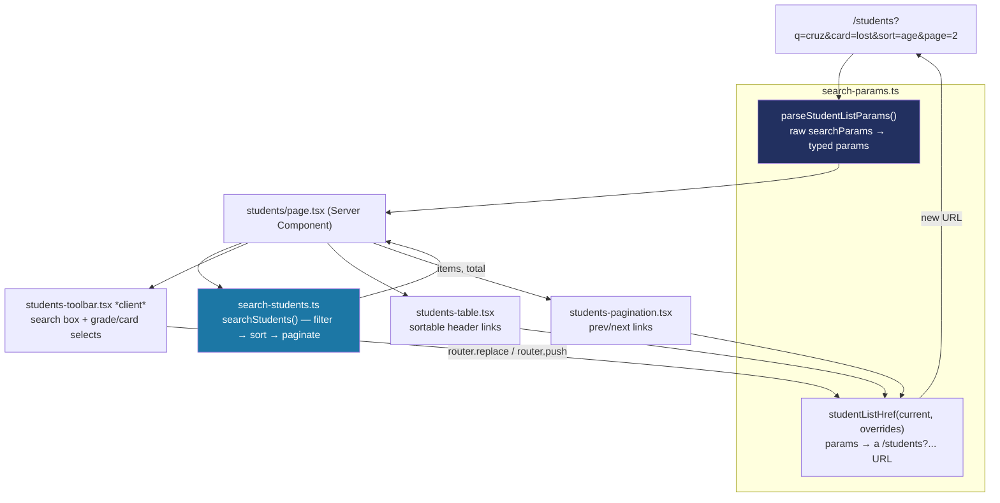

# Recipe: Step 14 — Students list

## What this step is for

The first real *list* screen: a searchable, filterable, sortable, paginated Students table — with every piece of state (search text, grade, card status, sort, page) kept in the URL so the page is shareable and the back button works. This establishes the "URL-driven list" pattern that Step 17's Attendance page (and any future list) reuses. Teachers get a read-only variant scoped to their own advisory class.

## Starting point

`(app)/students/page.tsx` was a Step 10 placeholder. No list screen existed anywhere; the dashboard's `ClassRoll` was the only table-like thing, a plain shadcn `Table` with a manual `.map()`.

## Diagram



## Checklist

1. **Decide against TanStack Table (and say so).** CLAUDE.md's stack list names it, but nothing has installed it, and every piece of state here is server-driven through the URL rather than client-side table state — which is exactly what TanStack Table manages. Its actual value doesn't apply, so leave it out and flag the decision in the review (it's a stack choice CLAUDE.md names explicitly).

2. **Write `search-params.ts`** — the parse/build pair. Parsing never throws: a URL is user-editable text (a bookmark, a typo), so every field falls back to a sane default. Building only writes non-default values, so the plain "show everything" view has no query string:
   ```ts
   export function parseStudentListParams(raw): StudentListParams {
     const q = firstValue(raw.q)?.trim() ?? DEFAULT_PARAMS.q;
     const gradeNumber = /* ... */;
     const grade = gradeNumber !== undefined && GRADE_LEVELS.includes(gradeNumber) ? gradeNumber : DEFAULT_PARAMS.grade;
     // ...same defensive pattern for card, sort, dir, page
   }

   export function studentListHref(current, overrides = {}): string {
     const merged = { ...current, ...overrides };
     const search = new URLSearchParams();
     if (merged.q !== DEFAULT_PARAMS.q) search.set("q", merged.q);
     const query = search.toString();
     return query ? `/students?${query}` : "/students";
   }
   ```

3. **Write `search-students.ts`** — the plain, dependency-injectable composition function. Card status isn't on `Student`, so filtering/sorting by it needs a join: `StudentRepository.listBySchool` plus one `CardRepository.listByStudent` per matching student (the same "small per-student lookup instead of reshaping the repository" precedent the dashboard set). Then the pipeline: teacher restriction → text → grade → card → sort → paginate.

4. **Write `card-status.ts`'s `deriveCardStatus()`** — collapse a student's whole card history to one of three states: active always wins (a replacement already resolved any lost card), otherwise a lost card on file surfaces as `"lost"`, otherwise `"none"`.

5. **Write `age.ts`'s `ageInYears()`** — calendar-aware (accounts for whether the birthday has happened yet this year), defaulting `now` to the same fixed `DASHBOARD_NOW` so displayed ages don't drift with the real date. Age was never computed before — nothing in the dashboard displays it.

6. **Build the one client component, `students-toolbar.tsx`** — the search box. It debounces 300ms then `router.replace` (not `push`, so typing "cruz" doesn't leave the back button stepping through "c", "cr", "cru"); the grade/card selects use `router.push` (each is a deliberate, back-button-worthy change). Syncing the box when the URL changes from elsewhere uses React's "adjust state during render" pattern, not a second `useEffect` — `npm run lint` refuses `setState` in an effect body (`react-hooks/set-state-in-effect`):
   ```tsx
   const [syncedQuery, setSyncedQuery] = useState(params.q);
   if (params.q !== syncedQuery) {
     setSyncedQuery(params.q);
     setQuery(params.q);
   }
   ```

7. **Build the table and pagination as plain `<Link>`s** — `students-table.tsx`'s sortable headers and `students-pagination.tsx`'s prev/next are built with `studentListHref`, real navigations with no client-side sort logic. Clicking a header keeps the current search/filter but changes `sort`/`dir` and resets `page` to 1.

8. **Wire `students/page.tsx`** to branch principal/super-admin vs. teacher the same way the dashboard does — the teacher's list is pre-scoped to their advisory class (via `searchStudents(..., { restrictTo })`), the grade filter is hidden, and "You can view but not edit" copy shows.

9. **Verify all five checks:**
   ```bash
   npm run lint
   npm run typecheck
   npm run test
   npm run build
   npm run check:tokens
   ```
   (166 tests — 27 new.)

10. **Browser-check at 1280px and 360px, light and dark** — search (debounced, focus preserved), grade filter, card filter, every sortable column both directions, pagination — all change the URL; the back button steps correctly; teacher persona is pre-scoped and read-only.

11. **Tick this step's build-task checkboxes** in `docs/PLAN.md`, then `npm run progress`.

12. **Stop and report**, same as every step.

## What ended up in each file, and why

| File | What's in it | Why |
|---|---|---|
| `src/features/students/search-params.ts` (+ test) | `parseStudentListParams`, `studentListHref`, `STUDENTS_PAGE_SIZE`. | The parse/build pair — every field defaults defensively, only non-defaults hit the URL. |
| `src/features/students/search-students.ts` (+ test) | `searchStudents()` — the filter/sort/paginate pipeline. | Plain, injectable, fully unit-tested with small fixture repositories. |
| `src/features/students/card-status.ts` (+ test) | `deriveCardStatus()`. | Collapses card history to active/lost/none for filtering and display. |
| `src/features/students/age.ts` (+ test) | `ageInYears()`. | Calendar-aware age, defaulted to the fixed `DASHBOARD_NOW`. |
| `src/features/students/students-toolbar.tsx` | The search box + grade/card selects. | The one client component — debounced replace for search, push for filters. |
| `src/features/students/students-table.tsx` | Sortable header `<Link>`s. | No client-side sort logic — plain links, back button just works. |
| `src/features/students/students-pagination.tsx` | Prev/next `<Link>`s. | Same mechanism as the sort headers. |
| `src/features/students/card-status-badge.tsx` | The Active/Lost/No card badge. | Reuses the fixed status tokens. |
| `src/app/(app)/students/page.tsx` | Branches principal/super-admin vs. teacher. | The real page, teacher-scoped and read-only. |

## Verification

Same five commands as checklist step 9, plus the browser pass in step 10. The step's "Done when" — "filters survive a page reload and the back button works" — is confirmed by changing filters/sort/page, reloading (the URL re-derives the same view), and stepping back through history to land exactly where expected.
