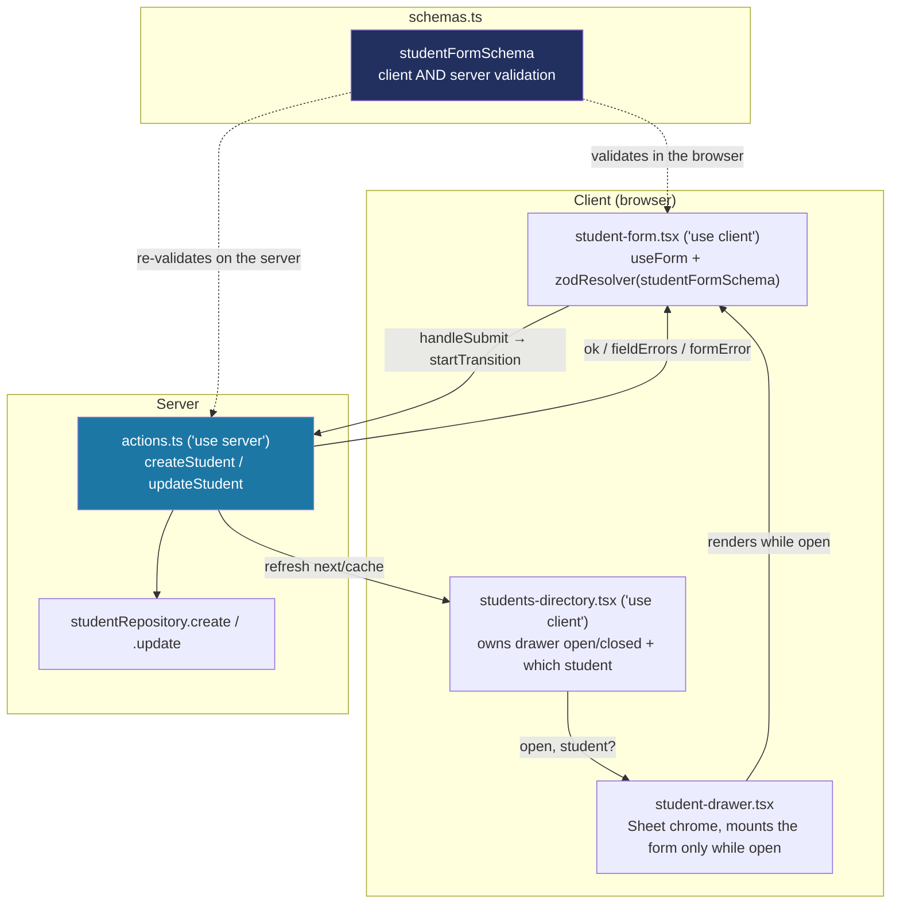

# Recipe: Step 15 — Student form

## What this step is for

The first *write* path in the app — every repository built through Step 14 only ever read. This step adds the "Add student" / "Edit student" drawer: a React Hook Form + Zod form with inline validation, a computed-age hint, and a server action that actually writes to the mock repository. It establishes the drawer-form pattern that Steps 16 (card link), 18 (staff invite), 20 (add school) and 21 (appearance settings) all reuse.

## Starting point

Step 14's students list is read-only — there's no way to add or edit a student. `StudentRepository` has only `listBySchool`/`getById`; no write method exists anywhere.

## Diagram



## Checklist

1. **Add `StudentRepository.create` and `update`** — the repository's first write methods, exactly the ones this step needs (predicted back in Step 9's "read-only until a step needs a write"):
   ```ts
   async create(student) {
     await simulateLatency(latencyMs);
     if (!data.some((existing) => existing.id === student.id)) {
       data.push(student);
     }
     return student;
   },
   async update(student) {
     await simulateLatency(latencyMs);
     const index = data.findIndex((existing) => existing.id === student.id);
     if (index === -1) return null;
     data[index] = student;
     return student;
   },
   ```
   `create` is idempotent by `id` (same shape as `TapRepository.create`); `update` returns `null` if the id doesn't exist — a small but real difference, so a bug that tries to update a student that was never loaded fails loudly instead of silently doing nothing.

2. **Write `studentFormSchema`** — reuses `studentSchema`'s validators but isn't just `.omit()`: a blank LRN/middle name means "not provided," so both end in `.optional().transform((v) => (v ? v : undefined))`, and `birthDate` gets a `.refine()` that it can't be after "today" (the same fixed `DASHBOARD_NOW` sliced to a date):
   ```ts
   lrn: z.union([lrnSchema, z.literal("")]).optional().transform((value) => (value ? value : undefined)),
   birthDate: z.iso.date("Enter a birth date").refine((value) => value <= TODAY, "Birth date cannot be in the future"),
   ```
   The transform means the schema's *input* shape and *output* shape genuinely differ, so `types.ts` exports both — `StudentFormValues` (via `z.input<>`) and `StudentFormInput` (via `z.infer<>`) — named for which side of the transform each is on.

3. **Give `useForm` all three generics** so the resolver's transform doesn't break the types:
   ```ts
   useForm<StudentFormValues, unknown, StudentFormInput>({
     resolver: zodResolver(studentFormSchema),
     defaultValues: student ? valuesFrom(student) : emptyValues(),
   });
   ```

4. **Wire the grade `Select` through `Controller`, not `register()`.** A shadcn `Select` (Radix-based) isn't a native `<select>` with a ref `register()` can hook into, so `Controller` converts between the Select's string value and the schema's numeric `GradeLevel` at the boundary (`onValueChange={(value) => field.onChange(Number(value))}`).

5. **Use `useWatch`, not `watch`, for the live age hint.** `watch("birthDate")` returns a plain function the React Compiler can't safely memoize, and `npm run lint` flags it (`react-hooks/incompatible-library`). `useWatch({ control, name: "birthDate" })` is the hook equivalent — same live value, no warning.

6. **Lift drawer state above both the header button and the table.** The "Add student" button lives in the page header; the row-click-to-edit lives in the table; both open the *same* drawer with different initial data. So `students-directory.tsx` is a new client component owning `{ open, student? }` state and rendering header, toolbar, table and drawer together. `page.tsx` stays a plain Server Component doing only session/data fetching, passing serializable props down. `students-table.tsx` picks up `"use client"` and an optional `onRowClick` — omitted entirely for teachers, so their table stays exactly as non-interactive as before.

7. **Write `createStudent`/`updateStudent` actions** — every write action does three things in order: check the session (not just the UI — a Server Action is a real endpoint), re-validate with the same schema the client used, then write + `refresh()`:
   ```ts
   export async function createStudent(input: StudentFormInput): Promise<StudentFormActionResult> {
     const session = await getSession();
     if (!session.schoolId || session.role === "teacher") {
       return { ok: false, formError: "You don't have permission to add students." };
     }
     const parsed = studentFormSchema.safeParse(input);
     if (!parsed.success) return { ok: false, fieldErrors: fieldErrorsFrom(parsed.error) };
     await studentRepository.create({ id: crypto.randomUUID(), schoolId: session.schoolId, ...parsed.data });
     refresh();
     return { ok: true };
   }
   ```

8. **Verify all five checks:**
   ```bash
   npm run lint
   npm run typecheck
   npm run test
   npm run build
   npm run check:tokens
   ```
   (176 tests — up from 166.)

9. **Browser-check at 1280px and 360px, light and dark** — "Add student" opens an empty drawer with focus on First name; empty submit shows all seven inline errors at once and moves focus to the first invalid field; a valid submit saves, toasts, closes, and the new student is findable by search; the age hint updates live while typing a birth date; clicking a row opens it pre-filled; the teacher persona has no Add button and no clickable rows.

10. **Tick this step's build-task checkboxes** in `docs/PLAN.md`, then `npm run progress`.

11. **Stop and report**, same as every step.

## What ended up in each file, and why

| File | What's in it | Why |
|---|---|---|
| `src/data/repositories/student-repository.ts` (+ test) | `create` (idempotent), `update` (null on missing id). | The first write methods — added here, not preemptively, exactly as Step 9 predicted. |
| `src/features/students/schemas.ts` (+ test) | `studentFormSchema` with the transforms and the future-birth-date refine. | One schema, both sides validate against it. |
| `src/features/students/types.ts` | `StudentFormValues` (input) + `StudentFormInput` (output). | The transform makes the two shapes differ; both are named for their side. |
| `src/features/students/actions.ts` | `createStudent`, `updateStudent`. | Session guard → re-validate → write → `refresh()`. |
| `src/features/students/student-form.tsx` | The RHF + Zod form body. | `Controller` for the Select, `useWatch` for the age hint. |
| `src/features/students/student-drawer.tsx` | Sheet chrome, mounts the form only while open. | Fresh `defaultValues` each open, no reset effect. |
| `src/features/students/students-directory.tsx` | Owns drawer state, renders header/toolbar/table/drawer. | The one client owner so both the button and the row-click open the same drawer. |
| `src/features/students/students-table.tsx` | `"use client"` + optional `onRowClick`. | Row-click-to-edit for editors, omitted for teachers. |
| `src/app/(app)/students/page.tsx` | Renders `StudentsDirectory`. | Stays a thin Server Component doing session + fetch. |

## Verification

Same five commands as checklist step 8, plus the browser pass in step 9. The step's "Done when" — "invalid input shows clear errors, valid input saves, and focus is handled correctly" — is confirmed by the empty-submit error sweep (seven errors + focus to the first invalid field) and the valid-submit save/search/toast round trip in both personas.
