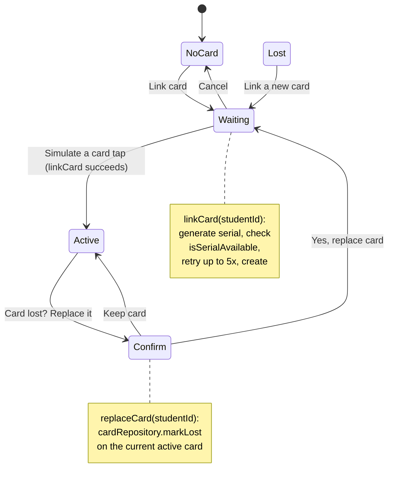

# Recipe: Step 16 — Card link and replace

Written alongside the step itself (the owner asked to resume this from Step 16 on, rather than only backfilling at Step 24), from the actual diff against the previous commit rather than from the plan text alone.

**A decision made before writing any code:** the owner's stated goal is to eventually test this with a real RFID card. Before assuming an approach, this was asked directly: stick to "Simulate a card tap" (the plan's literal text, and what the reference prototype does), add a manual serial-entry field so a real card's UID could be typed in today, or build the Web NFC API for a genuine phone-to-card tap. The owner chose the first. This recipe only covers that.

## Starting point

Step 15's add/edit drawer — Learner and Parent/guardian fieldsets only, no ID card section.

## Diagram



## Checklist

1. **Add two methods to `CardRepository`** (`src/data/repositories/card-repository.ts`), same shape as Step 15's `StudentRepository.create`/`update`:
   ```ts
   async create(card) {
     await simulateLatency(latencyMs);
     if (!data.some((existing) => existing.id === card.id)) data.push(card);
     return card;
   },
   async markLost(cardId) {
     await simulateLatency(latencyMs);
     const index = data.findIndex((existing) => existing.id === cardId);
     if (index === -1) return null;
     data[index] = { ...data[index], status: "lost" };
     return data[index];
   },
   ```
   `markLost`, not a generic `update` — a card's only field that ever actually changes is `status`; naming the method after the real action is clearer at every call site.

2. **Add a pure serial generator and a pure duplicate-check**, `src/features/students/card-serial.ts` — no dependency on the repository or any Next.js API, so both are directly unit-testable:
   ```ts
   export function generateCardSerial(): string {
     const bytes = [0x04, ...Array.from({ length: 6 }, () => Math.floor(Math.random() * 256))];
     return bytes.map(toHexByte).join(":");
   }

   export function isSerialAvailable(serial: string, existingCards: Card[]): boolean {
     return !existingCards.some((card) => card.serial === serial && card.status === "active");
   }
   ```
   **Being honest about what "reject duplicate serials" actually tests:** with a genuinely random 7-byte serial, a real collision essentially never happens in a live click-through — so this behavior is verified with a direct unit test of `isSerialAvailable` (seed a card with a known serial, assert it's unavailable), not by ever actually triggering it in the browser.

3. **Add the two server actions**, `src/features/students/card-actions.ts` (`"use server"`), same `getSession()` → guard → repository call → `refresh()` shape as every other write action in this app:
   ```ts
   export async function linkCard(studentId: string): Promise<CardActionResult> {
     // guard: session has schoolId, role isn't teacher, student belongs to this school
     // guard: refuse if the student already has an active card
     // generate a serial, retry up to 5x against isSerialAvailable
     // cardRepository.create({ id: crypto.randomUUID(), schoolId, studentId, serial, status: "active", linkedAt: new Date().toISOString() })
     // refresh()
   }

   export async function replaceCard(studentId: string): Promise<CardActionResult> {
     // same guards
     // guard: refuse if there's no active card to replace
     // cardRepository.markLost(activeCard.id)
     // refresh()
   }
   ```
   Both return `{ ok: true; card: Card } | { ok: false; formError: string }`. Replacing is deliberately two actions, not one: `replaceCard` only marks the old one lost; linking the actual new card is a second, separate `linkCard` call once the drawer's own UI moves to "waiting" — the same two-step shape the reference prototype uses (`confirmReplace()` then `simCard()`).

4. **Thread each row's full card history down to the drawer, reusing a lookup the app already does.** `search-students.ts` already calls `cardRepository.listByStudent()` per visible row to derive the table's badge — it just discarded the array afterward:
   ```ts
   const rows: StudentRow[] = filteredByGrade.map((student, index) => ({
     student,
     cardStatus: deriveCardStatus(cardsByStudent[index] ?? []),
     cards: cardsByStudent[index] ?? [],   // new
   }));
   ```
   Change `StudentsTable`'s `onRowClick` to hand back the whole `StudentRow` (student + card history), not just the `Student`, so `students-directory.tsx` has both without a second fetch when it opens the drawer.

5. **Build the ID card section as its own component**, `src/features/students/card-box.tsx`, rendered inside `student-form.tsx` right after the "Parent or guardian" fieldset, only when editing an existing student:
   ```tsx
   {student ? <CardBox studentId={student.id} cards={cards ?? []} /> : null}
   ```
   `CardBox` owns a small `idle | waiting | confirm` state machine of its own, entirely separate from the surrounding React Hook Form — linking/replacing saves immediately through its own server actions, not through the form's Save button. It starts from the `cards` prop and updates itself optimistically from whatever `Card` each action returns (append on link, swap on replace), so the box reflects the new state immediately without waiting on a round trip; the actions' own `refresh()` is what keeps the *table's* badge in sync for next time the drawer opens.

6. **Wrap any serial text in `break-all`, and its row in `flex-wrap`.** A 7-byte hex serial (`04:99:F4:4F:AA:05:60`) is a long unbroken string — without this, the ID card box overflows horizontally at 360px. Caught in the actual browser check at 360px, not assumed from the CSS alone:
   ```tsx
   <span className="font-mono text-sm break-all text-foreground">{activeCard.serial}</span>
   ```

7. **Verify all four checks:**
   ```bash
   npm run lint
   npm run typecheck
   npm run test
   npm run build
   ```

8. **Browser-check the full state machine**, at 360px and 1280px, light and dark: link a fresh card on a cardless student; replace it (confirm → marked lost → simulate → new active, old one under "Previous cards"); a seed student with real lost-then-replaced history renders correctly; the table's badge updates after closing the drawer; the teacher persona has no card box reachable at all.

9. **Tick this step's build-task checkbox** in `docs/PLAN.md`, then:
   ```bash
   npm run progress
   ```

10. **Stop and report**, same as every step.

## What ended up in each file, and why

| File | What's in it | Why |
|---|---|---|
| `card-repository.ts` | `create` (idempotent by id), `markLost` (returns `null` if the id doesn't exist). | The only two mutations a card ever needs — a card is never edited field-by-field, only created or marked lost. |
| `card-serial.ts` | `generateCardSerial()`, `isSerialAvailable()`. | Kept pure and dependency-free on purpose, so both can be unit-tested directly rather than only through the untested `"use server"` action that calls them. |
| `card-actions.ts` | `linkCard`, `replaceCard`. | Same session/role/school guard shape as every other write action (`students/actions.ts`, `attendance/actions.ts`) — a Server Action is a real endpoint, reachable directly, not just from whatever button happens to call it. |
| `card-box.tsx` | The drawer's ID card section, its own `idle/waiting/confirm` state. | Deliberately outside the React Hook Form — a card link/replace is its own save operation, not a field on the student form. |
| `search-students.ts` | `cards: Card[]` added to `StudentRow`. | The card history was already being fetched per row for the badge; keeping it around costs nothing and avoids a second fetch when the drawer opens. |
| `students-table.tsx` | `onRowClick` now passes the whole `StudentRow`. | So the caller has the card history without a lookup of its own. |

## Verification

Same four commands as checklist step 7, plus the browser pass in step 8. `isSerialAvailable`'s unit tests are the actual proof "reject duplicate serials" works — not the live browser check, which can't practically force a real collision.
