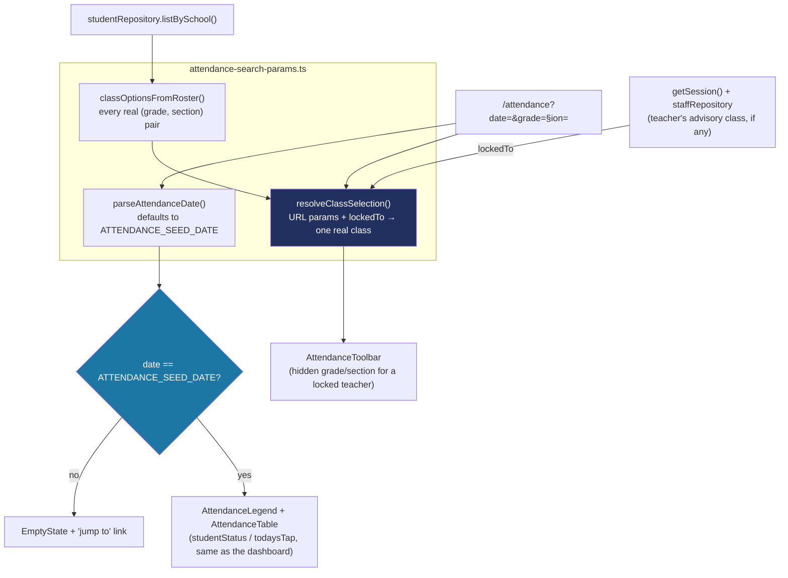

# Recipe: Step 17 — Attendance page

Written alongside the step itself, from the actual diff against the previous commit.

**A rule confirmed before writing any code:** this step's plan-mode proposal should have named `docs/recipes/` as one of its own deliverables — [[feedback_recipes_docs_deferred]] had already made that the standing rule from Step 16 on, but it only lived in memory. Before building, that rule was written into `CLAUDE.md`'s Documentation section as a fourth bullet, so it's no longer something a future session could miss.

## Starting point

`src/app/(app)/attendance/page.tsx` was a stub (`"Not built yet"` `EmptyState`) since the route was scaffolded with the app shell in Step 10. The attendance *derivation* logic it needs (`studentStatus`, `todaysTap`, `countByStatus`, `formatTapTime`) already existed from Step 13's dashboard — this step reuses it rather than rebuilding it.

## Diagram



## Checklist

1. **Write the pure URL-resolution logic first**, `src/features/attendance/attendance-search-params.ts` — no Next.js APIs, no repository calls, so it's directly unit-testable:
   ```ts
   export const ATTENDANCE_SEED_DATE = DASHBOARD_NOW.slice(0, 10); // "2026-06-20"

   export function classOptionsFromRoster(students: Student[]): ClassOption[] {
     // every distinct (gradeLevel, section) that actually has a student,
     // sorted by grade then section name
   }

   export function resolveClassSelection(
     rawGrade, rawSection, options: ClassOption[], lockedTo?: ClassOption,
   ): ClassOption | undefined {
     if (lockedTo) return lockedTo;              // a teacher's own class always wins
     if (options.length === 0) return undefined;  // no students at this school at all
     // else: match the requested grade+section against `options`,
     // falling back to the first real class if either doesn't exist
   }
   ```
   `lockedTo` winning outright, before the URL is even read, is what makes the teacher lock a *server-side* guard rather than a UI-only one — same shape as `searchStudents(..., { restrictTo })` from Step 14.

2. **Build the toolbar as its own client component**, `src/features/attendance/attendance-toolbar.tsx` — a date `<Input type="date">` plus two shadcn `Select`s, each pushing a new `/attendance?date=&grade=&section=` URL on change (`router.push`, a real back-button stop, same as the Students list's grade/card selects):
   ```tsx
   <Select
     value={String(selected.gradeLevel)}
     onValueChange={(value) => {
       const gradeLevel = Number(value) as GradeLevel;
       const firstSection = options.find((o) => o.gradeLevel === gradeLevel)?.section ?? selected.section;
       router.push(attendanceHref({ date, gradeLevel, section: firstSection }));
     }}
   >
   ```
   Changing grade always re-picks a real section for that grade — an old section that doesn't exist under the new grade is never left in the URL. A `showClassPicker` prop hides the whole Grade/Section block for a locked-in teacher, rather than rendering it disabled.

3. **Build the table**, `src/features/attendance/attendance-table.tsx` — Student / Time in / Status / Card, reusing `studentStatus`/`todaysTap`/`formatTapTime` from `status.ts` and `CardStatusBadge`/`deriveCardStatus` from the Students feature. No "Time out" column — `Tap` doesn't model that event yet.

4. **Wire the page**, `src/app/(app)/attendance/page.tsx`, replacing the Step-10 stub:
   ```tsx
   const isTeacher = session.role === "teacher";
   const signedInStaff = isTeacher ? await staffRepository.getById(session.userId) : null;
   const lockedTo = isTeacher && signedInStaff?.advisoryGradeLevel && signedInStaff.advisorySection
     ? { gradeLevel: signedInStaff.advisoryGradeLevel, section: signedInStaff.advisorySection }
     : undefined;

   const allStudents = await studentRepository.listBySchool(session.schoolId);
   const options = classOptionsFromRoster(allStudents);
   const selected = resolveClassSelection(rawParams.grade, rawParams.section, options, lockedTo);
   ```
   Four states to actually handle, in this order: no school selected (super admin) → teacher with no advisory class assigned → school with zero students at all → the real page. Each is its own `EmptyState`/`NoSchoolSelected`, not a silent fallback.

5. **The date check decides the rest of the page.** If `date !== ATTENDANCE_SEED_DATE`, render the empty state with a "jump to \<seed date\>" link (`attendanceHref` back to the same class); otherwise fetch taps and each student's cards and render `AttendanceLegend` + `AttendanceTable`. `now` passed to every derivation call is `` `${date}T09:15:00Z` `` — the seed date's own 9:15 AM, matching `DASHBOARD_NOW` exactly since `date` is confirmed equal to it at that point.

6. **Verify all four checks:**
   ```bash
   npm run lint
   npm run typecheck
   npm run test
   npm run build
   ```

7. **Browser-check both roles**, at 360px and 1280px, light and dark: as principal, switch grade and confirm the section auto-corrects and the URL updates; as teacher, confirm the grade/section `Select`s are gone and hand-editing the URL to a different grade/section has no effect; visit a non-seed date and confirm the empty state and its "jump to" link both work.

8. **Tick this step's build-task checkbox** in `docs/PLAN.md`, then:
   ```bash
   npm run progress
   ```

9. **Stop and report**, same as every step.

## What ended up in each file, and why

| File | What's in it | Why |
|---|---|---|
| `attendance-search-params.ts` | `parseAttendanceDate`, `classOptionsFromRoster`, `resolveClassSelection`, `attendanceHref`, `formatAttendanceDateLabel`, `ATTENDANCE_SEED_DATE`. | Pure functions, unit-tested directly, so the URL/class-resolution rules can't quietly drift from what the tests assert. |
| `attendance-toolbar.tsx` | Date input, grade/section `Select`s, `showClassPicker`. | Client-only piece — the rest of the page is a Server Component. |
| `attendance-table.tsx` | The class roll: Student, Time in, Status, Card. | Reuses `status.ts`'s derivation and the Students feature's card-status badge instead of re-deriving either. |
| `page.tsx` | Session/role branching, class + date resolution, composes toolbar/legend/table or the right empty state. | Same shape as `students/page.tsx` and `dashboard/page.tsx` — session first, then the teacher/principal branch, then the actual data. |

## Verification

Same four commands as checklist step 6, plus the two-role browser pass in step 7. The teacher lock's real proof is in the browser, not just the unit tests: hand-editing the URL's `grade`/`section` while signed in as a teacher and confirming the page doesn't change — `resolveClassSelection`'s unit tests cover the logic, but only the browser check proves the page actually calls it with `lockedTo` set for that role.
