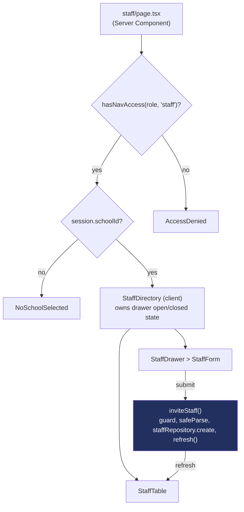

# Recipe: Step 18 — Staff page

Written alongside the step itself, from the actual diff against the previous commit.

## Starting point

`src/app/(app)/staff/page.tsx` was a stub (`"Not built yet"` `EmptyState`) since Step 10, but its role gate was already real: `hasNavAccess(session.role, "staff")` (`nav-items.ts`) already returned `AccessDenied` for a teacher. `staffSchema` (Step 8) already had `status: "invited"` in its enum, anticipating this step.

## Diagram



## Checklist

1. **Add the invite form schema**, `src/features/staff/schemas.ts` — a narrower role than `staffSchema`'s (no `super_admin`, since inviting one isn't a school-scoped action):
   ```ts
   export const staffInviteRoleSchema = z.enum(["principal", "teacher"]);

   export const staffFormSchema = z.object({
     firstName: z.string().trim().min(1, "Enter a first name"),
     lastName: z.string().trim().min(1, "Enter a last name"),
     email: z.email("Enter a valid email address"),
     role: staffInviteRoleSchema,
     advisoryGradeLevel: gradeLevelSchema.optional(),
     advisorySection: z.string().trim().optional().transform((v) => (v ? v : undefined)),
   });
   ```

2. **Add `create` to `StaffRepository`**, same idempotent-by-id shape as every other repository's `create`:
   ```ts
   async create(staff) {
     await simulateLatency(latencyMs);
     if (!data.some((existing) => existing.id === staff.id)) data.push(staff);
     return staff;
   },
   ```

3. **Add the server action**, `src/features/staff/actions.ts` (`"use server"`) — guard, re-validate, create with `status: "invited"`, `refresh()`:
   ```ts
   export async function inviteStaff(input: StaffFormInput): Promise<StaffFormActionResult> {
     const session = await getSession();
     if (!session.schoolId || session.role === "teacher") {
       return { ok: false, formError: "You don't have permission to invite staff." };
     }
     const parsed = staffFormSchema.safeParse(input);
     if (!parsed.success) return { ok: false, fieldErrors: fieldErrorsFrom(parsed.error) };

     const { advisoryGradeLevel, advisorySection, ...rest } = parsed.data;
     await staffRepository.create({
       id: crypto.randomUUID(),
       schoolId: session.schoolId,
       status: "invited",
       ...(rest.role === "teacher" ? { advisoryGradeLevel, advisorySection } : {}),
       ...rest,
     });
     refresh();
     return { ok: true };
   }
   ```
   Advisory fields only survive onto the created record when `role === "teacher"` — a principal invite never gets them, even if a client somehow sent them anyway.

4. **Build the drawer as `StudentDrawer`/`StudentForm`'s shape, minus editing.** `StaffForm` has no `isEditing` branch and no `student`-shaped prop — every open starts from `emptyValues()`. The Role `Select` conditionally reveals a second fieldset:
   ```tsx
   const role = useWatch({ control, name: "role" });
   // ...
   {role === "teacher" ? (
     <fieldset>{/* Grade Select + Section Input, both optional */}</fieldset>
   ) : null}
   ```

5. **Build the table and status badge.** `StaffTable`: Name/Role (`Badge variant="outline"`)/Advisory class (`—` if unset)/Status. `StaffStatusBadge` reuses the same fixed status tokens `CardStatusBadge` does — `status-present` for Active, `status-late` for Invited — rather than inventing a new color pair for "pending."

6. **Wire `StaffDirectory`** (client) — owns `drawerOpen` state, same shape as `StudentsDirectory`: the header's "Invite staff" button and the table share it, though here nothing in the table itself opens the drawer (no edit yet).

7. **Rewrite `page.tsx`**: keep the existing `hasNavAccess` guard, add the same `NoSchoolSelected` guard the dashboard/students/attendance pages already use, then fetch `staffRepository.listBySchool` and render `StaffDirectory`.

8. **Generalize `NoSchoolSelected`, found while wiring step 7.** Its copy was hardcoded to "dashboard" — already slightly wrong on two already-approved pages (Students, Attendance). Added an optional `subject` prop, defaulted to `"dashboard"` so the dashboard's own call site didn't need to change, and updated all three existing call sites plus this one:
   ```tsx
   export function NoSchoolSelected({ subject = "dashboard" }: { subject?: string }) {
     // "Pick a school to view its {subject}" / "a {subject} needs one to show"
   }
   ```

9. **Verify all four checks:**
   ```bash
   npm run lint
   npm run typecheck
   npm run test
   npm run build
   ```

10. **Browser-check**, at 360px and 1280px, light and dark: invite a teacher with an advisory class and confirm "Invited" appears immediately, with a toast, and shows up in the Step 11 dev switcher as "(invited)"; submit blank and confirm all three inline errors appear together; switch the Role select and confirm the Advisory class fieldset appears/disappears; as the teacher persona, confirm `/staff` isn't in the sidebar and visiting it directly shows `AccessDenied`.

11. **Tick this step's build-task checkbox** in `docs/PLAN.md`, then:
    ```bash
    npm run progress
    ```

12. **Stop and report**, same as every step.

## What ended up in each file, and why

| File | What's in it | Why |
|---|---|---|
| `schemas.ts` | `staffInviteRoleSchema`, `staffFormSchema`. | A narrower role enum than the stored-record schema — a super admin invite isn't a school-scoped form action. |
| `staff-repository.ts` | `create`. | Same shape as every other repository's `create` — idempotent by id, behind the same simulated latency. |
| `actions.ts` | `inviteStaff`. | Session guard → re-validate → repository call → `refresh()`, the same shape every write action in this app follows. |
| `staff-form.tsx` | The invite form, conditional advisory fieldset. | Invite-only, so simpler than `StudentForm` — no edit mode to branch on. |
| `staff-status-badge.tsx` | Active/Invited. | Reuses the fixed status tokens rather than a new color pair. |
| `no-school-selected.tsx` | New `subject` prop. | A real copy bug found while reusing this component a fourth time — fixed for all four callers at once, not just papered over for this one. |

## Verification

Same four commands as checklist step 9, plus the browser pass in step 10. The role gate itself (`AccessDenied` for a teacher) predates this step and wasn't re-tested from scratch — just re-confirmed still holds after the rewrite, the same way Step 17 re-confirmed the teacher lock rather than assuming Step 14's pattern still applied unchanged.
