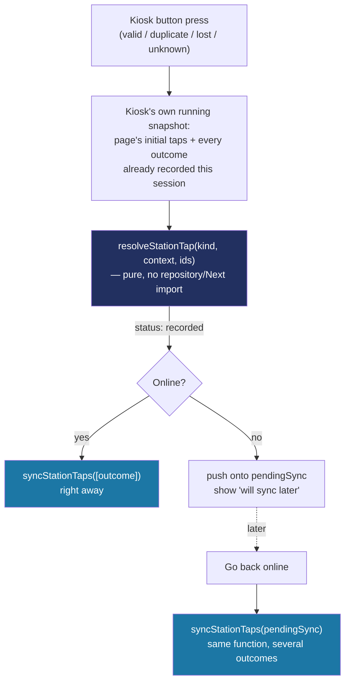

# Recipe: Step 19 — Tap station

Written alongside the step itself, from the actual diff against the previous commit.

## Starting point

`src/app/(app)/station/page.tsx` was a stub since Step 10, but the domain already anticipated this step: `tapSchema`'s own comment already explains `studentId: null` ("an unknown-card result at the station"), and `src/data/seed/taps.ts` already has a hand-written lost-card tap + matching alert as a worked example.

## Diagram



## Checklist

1. **Move the shared station-id constant out of `attendance/actions.ts` first.** It was private there; the tap station needs the exact same one:
   ```ts
   // status.ts, next to DASHBOARD_NOW
   export const MAIN_GATE_STATION_ID = "station-main-gate";
   ```
   Update `attendance/actions.ts` to import it instead of declaring its own copy.

2. **Add `create` to `AlertRepository`**, same idempotent-by-id shape as every other repository:
   ```ts
   async create(alert) {
     await simulateLatency(latencyMs);
     if (!data.some((existing) => existing.id === alert.id)) data.push(alert);
     return alert;
   },
   ```

3. **Write the pure resolver first**, `src/features/station/resolve-station-tap.ts` — this is the piece everything else depends on, and it has zero framework dependencies on purpose:
   ```ts
   export function resolveStationTap(kind, context: { schoolId, students, taps, cards, now }, ids: { tapId, alertId }): StationTapOutcome {
     if (kind === "valid") {
       const student = studentsWithoutTapToday(students, taps, now).find((s) => activeCardFor(s.id, cards));
       if (!student) return { status: "empty", kind };
       // build and return a Tap
     }
     if (kind === "duplicate") { /* find someone with todaysTap() truthy, report it, write nothing */ }
     if (kind === "lost") { /* find a card.status === "lost", tap its owner, build a matching alert */ }
     // "unknown": a serial not on any card at all, studentId: null
   }
   ```
   Test every branch directly, including the two "empty" cases (no waiting student with a card; no lost card on file) — these are real, reachable states in the seed data (only one of three demo schools has a seeded lost card), not just theoretical edge cases.

4. **Write the persistence action**, `src/features/station/station-actions.ts` — deliberately does *not* call `resolveStationTap` itself:
   ```ts
   export async function syncStationTaps(outcomes: StationTapOutcome[]): Promise<{ synced: number }> {
     await assertStationAccess();
     let synced = 0;
     for (const outcome of outcomes) {
       if (outcome.status !== "recorded") continue;
       await tapRepository.create(outcome.tap);
       if (outcome.kind === "lost") await alertRepository.create({ ...outcome.alert, type: "lost_card_tapped", acknowledged: false });
       synced++;
     }
     if (synced > 0) refresh();
     return { synced };
   }
   ```
   One outcome (an online tap) and several outcomes (a synced offline queue) are the same call — this is what collapsing "online" and "offline" into one path actually looks like in code.

5. **Build the kiosk**, `src/features/station/tap-station-kiosk.tsx` (client) — the part that actually decides *when* to call step 4 versus queue for later:
   ```tsx
   function handleSimulate(kind) {
     const effectiveTaps = [...taps, ...recordedTapsFrom(recorded)];
     const outcome = resolveStationTap(kind, { ...context, taps: effectiveTaps }, freshIds());
     showResultThenReset(outcome, isOffline && outcome.status === "recorded");
     if (outcome.status !== "recorded") return;
     setRecorded((current) => [...current, outcome]);
     if (isOffline) { setPendingSync((current) => [...current, outcome]); return; }
     startTransition(() => syncStationTaps([outcome]));
   }
   ```
   `recordedTapsFrom(recorded)` — only outcomes with `status: "recorded"` have a `.tap`; a "duplicate" or "empty" result never happened, so it can't affect who gets picked next.

6. **Wire `page.tsx`** — same session/role guard the Step-10 stub already had, plus the same `NoSchoolSelected` guard every other school-scoped page uses, then fetch the roster/taps/cards (all cards: `Promise.all(students.map(s => cardRepository.listByStudent(s.id))).flat()`, same pattern Step 17/18 already used — there's no school-wide "list every card" method).

7. **Verify all four checks:**
   ```bash
   npm run lint
   npm run typecheck
   npm run test
   npm run build
   ```

8. **Browser-check across schools, not just one.** Only one of the three demo schools has a seeded lost card — checking "Lost card" only on that one school would never exercise the empty-state branch. At 360px and 1280px, light and dark: all four results; two "Valid card" presses in a row picking different students; the lost-card alert actually showing up on `/dashboard`'s "Needs attention" (navigate there and look, don't assume); the offline queue filling and syncing, with the synced taps then visible for real in the live feed; measure the four button heights with `getBoundingClientRect()` rather than eyeballing 44px.

9. **Tick this step's build-task checkbox** in `docs/PLAN.md`, then:
   ```bash
   npm run progress
   ```

10. **Stop and report**, same as every step.

## What ended up in each file, and why

| File | What's in it | Why |
|---|---|---|
| `resolve-station-tap.ts` | `resolveStationTap`, all four kinds. | Pure — no repository/Next import — so it can run identically in the kiosk (offline-capable) and could run server-side too if ever needed. |
| `station-actions.ts` | `syncStationTaps`. | Never re-resolves; only persists outcomes already decided. One function for both "one online tap" and "a synced offline queue." |
| `tap-station-kiosk.tsx` | All interactive state: online/offline, the result display, the queue. | The only place that decides *when* to call `syncStationTaps` versus queue — `resolveStationTap` itself never knows or cares. |
| `status.ts` | `MAIN_GATE_STATION_ID` (moved here). | Now shared by the dashboard and the station instead of duplicated. |

## Verification

Same four commands as checklist step 7, plus the multi-school, two-mode (online/offline) browser pass in step 8. The offline queue's real proof isn't the toast — it's that the synced taps are then visible for real on `/dashboard`, confirmed by actually navigating there rather than trusting the "N taps uploaded" message alone.
