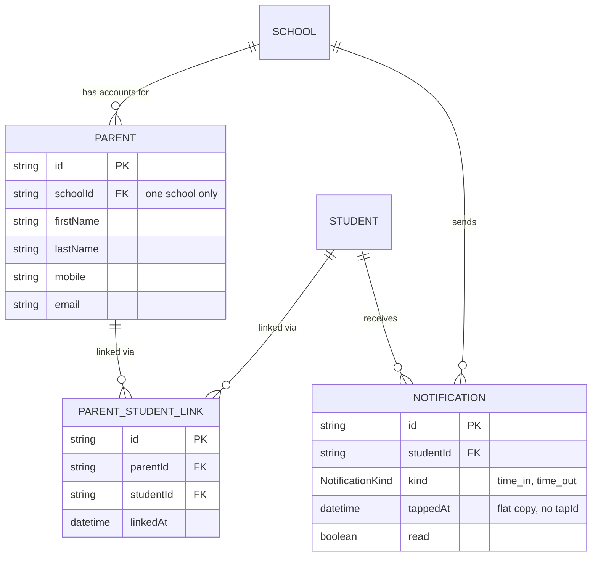

# Recipe: Step 20 — Parent and notification domain

## What this step is for

This is the data layer for the parent side of the app — the other half of the domain that the plan change (SMS → a parent app with in-app notifications) introduced. It defines three new things: `Parent` (a guardian account), `ParentStudentLink` (the many-to-many "this parent is connected to this student" join), and `Notification` (a record in a parent's in-app feed). No UI — just types, Zod schemas, read-only mock repositories, and seed data, so the later parent screens (Steps 22–24) have real shapes and real data to build against.

## Starting point

The domain had `School`, `Staff`, `Student`, `Card`, `Tap` and `Alert` — no concept of a parent account, no way to link a parent to a child, and no notification record. `School.notificationPreference` already existed (Step 8), but nothing consumed it yet.

## Diagram



The two arrows meeting at `PARENT_STUDENT_LINK` are the whole story of a many-to-many: neither the parent nor the student holds the other's id — a third record carries both, and each side is just a query over that record.

## Checklist

1. **Confirm the two data-model decisions first.** A parent belongs to exactly one school (no cross-school parents), and `Parent` uses `firstName`/`lastName` (not a single `name`), matching `Student`/`Staff`. Both were confirmed before writing code.

2. **Write the schemas**, `src/features/parents/schemas.ts` — reusing `phMobileSchema` from the students feature, and putting the schema first so the type derives from it:
   ```ts
   export const parentSchema = z.object({
     id: z.string().min(1),
     schoolId: z.string().min(1),
     firstName: z.string().min(1, "Enter a first name"),
     lastName: z.string().min(1, "Enter a last name"),
     mobile: phMobileSchema,
     email: z.email(),
   });

   export const parentStudentLinkSchema = z.object({
     id: z.string().min(1),
     schoolId: z.string().min(1),
     parentId: z.string().min(1),
     studentId: z.string().min(1),
     linkedAt: z.iso.datetime(),
   });

   export const notificationKindSchema = z.enum(["time_in", "time_out"]);

   export const notificationSchema = z.object({
     id: z.string().min(1),
     schoolId: z.string().min(1),
     studentId: z.string().min(1),
     kind: notificationKindSchema,
     tappedAt: z.iso.datetime(),
     read: z.boolean(),
   });
   ```
   The notification is a **flat copy** of the tap (`studentId` + `tappedAt`) with a derived `kind`, and deliberately has no `tapId` foreign key — an intentional deferral for Phase 2, not an oversight.

3. **Derive the types** from the schemas, `src/features/parents/types.ts`:
   ```ts
   export type Parent = z.infer<typeof parentSchema>;
   export type ParentStudentLink = z.infer<typeof parentStudentLinkSchema>;
   export type NotificationKind = z.infer<typeof notificationKindSchema>;
   export type Notification = z.infer<typeof notificationSchema>;
   ```

4. **Write `schemas.test.ts`** — test invalid *values*, not omitted keys (the codebase convention; a destructure-to-omit pattern trips `no-unused-vars`): `{ ...validParent, schoolId: "" }`, a bad mobile, a bad email, an unknown `kind`.

5. **Write the three read-only repositories**, each the interface + `createMock*` factory + singleton shape. The join repository exposes both directions:
   ```ts
   export interface ParentStudentLinkRepository {
     listByParent(parentId: string): Promise<ParentStudentLink[]>;
     listByStudent(studentId: string): Promise<ParentStudentLink[]>;
     listBySchool(schoolId: string): Promise<ParentStudentLink[]>;
   }
   ```
   `parent-repository` has `listBySchool`/`getById`; `notification-repository` has `listBySchool`/`listByStudent`/`getById`. All read-only — no write methods, since no step here needs one yet.

6. **Seed the data.** `parents.ts` uses `nameAt(index + 500)` — the `+500` offset is deliberately NOT a multiple of 40 (so it can't land on the same first name as a student, the trap Step 14 caught in the guardian names). `parent-student-links.ts` deliberately shows both directions (one parent → two children, and one child → two parents). `notifications.ts` aligns its timestamps to the real seed taps.

7. **Extend `seed.test.ts`** with per-record validity plus shape invariants: links reference real parents/students at the same school, notifications reference real students, and both directions of the many-to-many actually appear.

8. **Verify all five checks:**
   ```bash
   npm run lint
   npm run typecheck
   npm run test
   npm run build
   npm run check:tokens
   ```
   (247 tests, up from 219 — 28 new.)

9. **Tick this step's build-task checkboxes** in `docs/PLAN.md` (not "Owner review"), then `npm run progress`.

10. **Stop and report**, same as every step. No browser check — nothing renders yet.

## What ended up in each file, and why

| File | What's in it | Why |
|---|---|---|
| `src/features/parents/schemas.ts` | `parentSchema`, `parentStudentLinkSchema`, `notificationKindSchema`, `notificationSchema`. | The single source of truth for the parent domain; types derive from it. |
| `src/features/parents/types.ts` | `Parent`, `ParentStudentLink`, `NotificationKind`, `Notification` via `z.infer`. | The compile-time types, derived rather than hand-written twice. |
| `src/features/parents/schemas.test.ts` | Valid + invalid cases per schema. | Proves the rules, matching the codebase's "test invalid values" convention. |
| `src/data/repositories/parent-repository.ts` (+ test) | `listBySchool`, `getById`. | Read-only access to parents. |
| `src/data/repositories/parent-student-link-repository.ts` (+ test) | `listByParent`, `listByStudent`, `listBySchool`. | The join table's two directions plus school scope. |
| `src/data/repositories/notification-repository.ts` (+ test) | `listBySchool`, `listByStudent`, `getById`. | Read-only access to notifications. |
| `src/data/seed/parents.ts` | 6 parents across 3 schools. | Names via `nameAt(+500)` to avoid the multiple-of-40 trap. |
| `src/data/seed/parent-student-links.ts` | 7 links, both many-to-many directions. | Real data for Steps 22–24 to render against. |
| `src/data/seed/notifications.ts` | 3 sample notifications. | Exercises `notificationSchema` in `seed.test.ts`, aligned to seed taps. |
| `src/data/repositories/index.ts`, `src/data/seed/index.ts` | Re-exports the three new singletons / arrays. | The single import points. |
| `src/data/seed/seed.test.ts` | Validity + shape invariants for the new entities. | Catches generator mistakes schemas can't see. |

## Verification

Same five commands as checklist step 8, all green (247 tests). The step's "Done when" — "types and schemas compile, schema tests pass, and no UI code talks to the seed data directly" — is confirmed by the passing schema/repo/seed tests and by the fact that every new record is read through a repository, never by importing a seed array outside `src/data/`.
