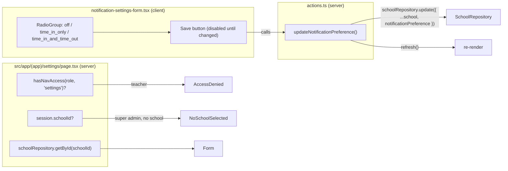

# Recipe: Step 21 — School notification settings

## What this step is for

The first write to the `School` record, and the first "Settings" screen. A principal or super admin visits Settings > Notifications, picks one of three notification preferences (off / time-in only / time-in and time-out), and saves it to the school — so Step 24's notification feed has a per-school preference to honor. It reuses a field that already existed (`School.notificationPreference`, seeded since Step 8) and adds the write path + UI around it.

## Starting point

`School.notificationPreference` (a three-value `z.enum`) already existed and was already seeded with all three values across the three schools. What was missing: `SchoolRepository` was read-only (only `list`/`getById`), there was no "Settings" nav item or page, and no server action to persist a change.

## Diagram



## Checklist

1. **Decide the nav shape first.** The owner chose a single "Settings" nav item → `/settings` (one page showing the Notifications form now), not a nested `/settings/notifications` route — Step 26 will add an "Appearance" section to the same page.

2. **Add the write method** to `SchoolRepository`:
   ```ts
   update(school: School): Promise<School | null>;
   ```
   A full-record replace, same shape as `StudentRepository.update`; returns `null` for an unknown id. Add tests for "updates an existing school" and "returns null for an unknown school".

3. **Add the server action** `src/features/schools/actions.ts`:
   ```ts
   "use server";
   export async function updateNotificationPreference(
     preference: NotificationPreference,
   ): Promise<{ ok: true } | { ok: false; formError?: string }> {
     const session = await getSession();
     if (!session.schoolId || session.role === "teacher") {
       return { ok: false, formError: "You don't have permission to change notification settings." };
     }
     const parsed = notificationPreferenceSchema.safeParse(preference);
     if (!parsed.success) return { ok: false, formError: "That isn't a valid notification preference." };
     const school = await schoolRepository.getById(session.schoolId);
     if (!school) return { ok: false, formError: "Your school could not be found." };
     await schoolRepository.update({ ...school, notificationPreference: parsed.data });
     refresh();
     return { ok: true };
   }
   ```

4. **Add the radio-group primitive** `src/components/ui/radio-group.tsx` — hand-write it (not `npx shadcn add`) so its imports match this codebase's unified package style: `import { RadioGroup as RadioGroupPrimitive } from "radix-ui"` and `import { cn } from "cn"`, the same as the existing `select.tsx`/`label.tsx`.

5. **Add the form** `src/features/schools/notification-settings-form.tsx` — a controlled radio group of three options (each with a label + description) plus a Save button disabled until the value differs from the current one. One enum field, no text input, so React Hook Form is overkill; `useState` + `useTransition` is enough, with a `sonner` toast on success/error.

6. **Add the page** `src/app/(app)/settings/page.tsx` — `hasNavAccess` → `AccessDenied` for teachers, `NoSchoolSelected` for a school-less super admin, then a card with an `<h3>` "Notifications" section and the form pre-selected to the school's current `notificationPreference`.

7. **Register the nav item** in `nav-items.ts`:
   ```ts
   { segment: "settings", href: "/settings", label: "Settings", icon: Settings, roles: SCHOOL_STAFF_ROLES },
   ```
   and add `"settings"` to the `NavSegment` union.

8. **Fix two stale comments** — `layout.tsx` and `theme-dropdown.tsx` both said "Step 21" for the theme "Custom" picker, which is actually Step 26.

9. **Update `nav-items.test.ts`** — adding the segment breaks the two assertions that pin the exact per-role segment list; add `settings` and assert teacher-blocked / principal-allowed.

10. **Verify all five checks:**
    ```bash
    npm run lint
    npm run typecheck
    npm run test
    npm run build
    npm run check:tokens
    ```
    (249 tests, up from 247.)

11. **Tick this step's build-task checkbox** in `docs/PLAN.md`, then `npm run progress`.

12. **Stop and report.**

## What ended up in each file, and why

| File | What's in it | Why |
|---|---|---|
| `src/data/repositories/school-repository.ts` (+ test) | `update(school)`. | The school record's first write; Step 26 reuses it. |
| `src/features/schools/actions.ts` | `updateNotificationPreference`. | The schools feature's first server action; gates + re-validates + writes + `refresh()`. |
| `src/features/schools/notification-settings-form.tsx` | Controlled radio group + Save. | No text input, so no React Hook Form; a toast on result. |
| `src/components/ui/radio-group.tsx` | `RadioGroup`, `RadioGroupItem`. | New shadcn primitive, hand-written to the unified `radix-ui`/`cn` style. |
| `src/app/(app)/settings/page.tsx` | The page + gates. | Matches `/staff` and `/station`'s role/school guards. |
| `src/components/app-shell/nav-items.ts` (+ test) | `settings` segment. | Principal + super admin only. |

## Verification

Same five commands as checklist step 10, all green (249 tests), and `/settings` appears in the production route list. The save path is unit-covered by `school-repository.test.ts`; the on-screen pass (save each option, confirm persistence on reload, confirm teacher `AccessDenied` and school-less-super-admin `NoSchoolSelected`) is the owner's browser review.
