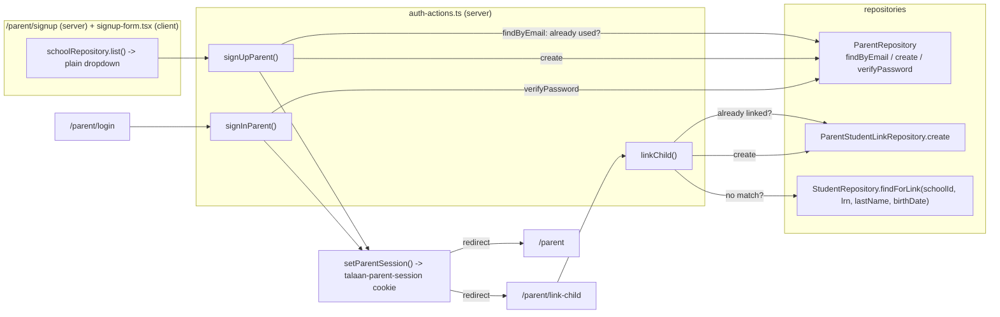

# Recipe: Step 22 — Parent signup, login and link a child

## What this step is for

The parent portal's own real signup and sign-in — separate from staff's demo login — plus a "link a child" flow verified by LRN, last name and birth date, with clear errors for "no match" and "already linked." Unlike every login screen built so far, this one has to actually work: a new account must persist across a sign-out and sign-in, and still show the same linked child.

## Starting point

Step 20 had already built `Parent`/`ParentStudentLink` as read-only mock repositories with no auth fields at all (no password, no signup, no session). Step 9's `getSession()`/staff `Session` type only ever resolves a staff member from `staffRepository` — it has no concept of a parent. There was no `/parent/*` route at all.

## Diagram



## Checklist

1. **Confirm the school-at-signup decision first.** A `Parent` belongs to exactly one school (Step 20's own schema comment), but nothing told the app which school a brand-new parent belongs to. Rather than search every school's students at "link a child" time, the signup form itself asks — a plain text dropdown of school names (`schoolRepository.list()`), no logos, so it doesn't reintroduce single-school branding onto a pre-session screen. This fixes `findForLink` to a single school from then on.

2. **Add the lookup** to `StudentRepository` (`student-repository.ts`):
   ```ts
   findForLink(
     schoolId: string,
     details: { lrn: string; lastName: string; birthDate: string },
   ): Promise<Student | null>;
   ```
   Exact match on `schoolId`/`lrn`/`birthDate`, case-insensitive trimmed match on `lastName`. Add tests: finds within the right school, `null` for the wrong school, `null` for a mismatched detail.

3. **Give `ParentRepository` real auth methods** (`parent-repository.ts`):
   ```ts
   findByEmail(email: string): Promise<Parent | null>;
   create(parent: Parent, password: string): Promise<Parent>;
   verifyPassword(email: string, password: string): Promise<Parent | null>;
   ```
   Keep the password in a separate in-memory `Map<parentId, password>` inside the factory closure — never on the `Parent` type. Seed every parent already in `data` with a fixed demo password, exported as `SEED_PARENT_PASSWORD = "Talaan123!"`, so the pre-existing Step 20 demo accounts (already linked to real students) can also sign in. Add tests for `findByEmail` (case-insensitive), `create` + `getById`, `verifyPassword` (correct, wrong, unknown email).

4. **Give `ParentStudentLinkRepository` a `create`** (`parent-student-link-repository.ts`) — idempotent by `id`, same shape as every other mock repository's `create`. The "already linked" duplicate check is the caller's job (via `listByParent`), the same division of labor `card-actions.ts` uses for its duplicate-serial check. Add tests: creates and shows up both directions, idempotent on a repeated id.

5. **Add the schemas** `src/features/parents/auth-schemas.ts`:
   ```ts
   export const parentSignupSchema = z.object({
     firstName: z.string().trim().min(1, "Enter a first name"),
     lastName: z.string().trim().min(1, "Enter a last name"),
     mobile: phMobileSchema,
     email: z.email("Enter a valid email address"),
     schoolId: z.string().min(1, "Select your child's school"),
     password: z.string().min(8, "Use at least 8 characters"),
     confirmPassword: z.string().min(1, "Confirm your password"),
   }).refine((v) => v.password === v.confirmPassword, {
     message: "Passwords don't match",
     path: ["confirmPassword"],
   });
   export const parentLoginSchema = z.object({ email: z.email(...), password: z.string().min(1, ...) });
   export const linkChildSchema = z.object({ lrn: lrnSchema, lastName: z.string().trim().min(1, ...), birthDate: z.iso.date(...) });
   ```
   None of these transform their input, so `types.ts` only needs one inferred type each (`ParentSignupInput`, `ParentLoginInput`, `LinkChildInput`) — no `Values`/`Input` split like `StudentFormValues`/`StudentFormInput`.

6. **Give parents their own session**, separate from staff's (`src/lib/parent-session.ts` + `parent-session-actions.ts`):
   ```ts
   export const PARENT_SESSION_COOKIE = "talaan-parent-session";
   export type ParentSession = { parentId: string; schoolId: string };
   export async function getParentSession(): Promise<ParentSession | null> { /* cookie -> parentRepository.getById -> null if missing */ }
   ```
   No dev-only production guard (unlike `assertDevSessionMutationAllowed`) — this isn't a shortcut being disabled outside development, it's the real feature. Split into two files for the same reason as `session.ts`/`session-actions.ts`: a file-level `"use server"` directive requires every export to be an async function, and the session type/reader aren't.

7. **Add the server actions** `src/features/parents/auth-actions.ts`: `signUpParent`, `signInParent`, `signOutParent`, `linkChild` — session/permission check (where relevant) → re-validate with the same schema the client checked → write via the repository → `refresh()` → redirect (signup/sign-in) or return a result (`linkChild`, so its own success toast can show before the client navigates). Reuse the `{ ok: true } | { ok: false; formError?; fieldErrors? }` shape.

8. **Build the forms**: `signup-form.tsx`, `login-form.tsx`, `link-child-form.tsx`, `sign-out-button.tsx` — same React Hook Form + Zod + field-error/form-error pattern as `staff-form.tsx`/`student-form.tsx`. The school field uses `Controller` (it's a shadcn `Select`, not a native input) with `schools: { id, name }[]` passed in as a prop from the server page.

9. **Add the routes**:
   - `src/app/parent/signup/page.tsx`, `src/app/parent/login/page.tsx` — public, reuse `LoginArtPanel`/`LoginMobileHeader` from the staff login (already generic, no school branding).
   - `src/app/parent/(protected)/layout.tsx` — `getParentSession()` → redirect to `/parent/login` if `null`; otherwise a minimal header (wordmark + sign-out) wrapping `children`. `(protected)` is a route group, so it covers `/parent` and `/parent/link-child` without covering the public siblings.
   - `src/app/parent/(protected)/page.tsx` — the bare "your linked children" list (name, grade, section only) proving persistence; an empty state when there's nothing linked yet.
   - `src/app/parent/(protected)/link-child/page.tsx`.
   - `src/app/parent/error.tsx` (covers the whole `/parent` subtree, same as `(app)/error.tsx`) and `src/app/parent/(protected)/loading.tsx`.

10. **Cross-link the two logins** — one line on `/` pointing to `/parent/login`, and "Sign in"/"Create an account" links between the parent forms themselves.

11. **Verify all five checks:**
    ```bash
    npm run lint
    npm run typecheck
    npm run test
    npm run build
    npm run check:tokens
    ```
    (260 tests, up from 249.)

12. **Browser-check the real flow** at 360px and 1280px, light and dark: sign up → land on link-child → link a real seed student by LRN/last name/birth date → see it on `/parent` → sign out → sign back in → link still there. Also check both required errors (wrong details → "no match"; same student twice → "already linked"), the unauthenticated redirect, and signing in as a seeded demo parent.

13. **Tick this step's build-task checkbox** in `docs/PLAN.md`, then `npm run progress`.

14. **Stop and report.**

## What ended up in each file, and why

| File | What's in it | Why |
|---|---|---|
| `src/data/repositories/student-repository.ts` (+ test) | `findForLink`. | Step 22's own lookup; scoped to one school since the parent already picked one at signup. |
| `src/data/repositories/parent-repository.ts` (+ test) | `findByEmail`, `create`, `verifyPassword`, `SEED_PARENT_PASSWORD`. | The parent portal's first real auth methods; password kept out of the `Parent` type entirely. |
| `src/data/repositories/parent-student-link-repository.ts` (+ test) | `create`. | "Link a child" itself; duplicate check stays in the action layer. |
| `src/features/parents/auth-schemas.ts` | `parentSignupSchema`, `parentLoginSchema`, `linkChildSchema`. | Shared by client and server validation, same as every other form. |
| `src/features/parents/auth-actions.ts` | `signUpParent`, `signInParent`, `signOutParent`, `linkChild`. | Session/permission gate → re-validate → write → `refresh()`/redirect. |
| `src/features/parents/{signup,login,link-child}-form.tsx`, `sign-out-button.tsx` | The client forms. | Standard RHF + Zod shape. |
| `src/lib/parent-session.ts` + `parent-session-actions.ts` | `getParentSession`, `setParentSession`, `clearParentSession`. | A second, independent session — no production guard, because it's real. |
| `src/app/parent/**` | Routes, protected layout, loading/error. | A new, separate area from `(app)` (staff-only). |

## Verification

Same five commands as checklist step 11, all green (260 tests). Full manual browser pass described in checklist step 12 — signup → link → persistence across sign-out/sign-in, both required error messages, the redirect guard, and the seeded demo parent login — all confirmed with no console errors, at 360px and 1280px, light and dark.
