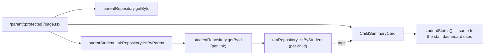

# Recipe: Step 23 — Parent dashboard

## What this step is for

Replace Step 22's placeholder `/parent` page (just a name/grade/section list, built only to prove a link survives sign-out/sign-in) with the real parent home screen: each linked child shown with a read-only attendance summary and history.

## Starting point

`/parent/(protected)/page.tsx` already fetched `parentRepository`, `parentStudentLinkRepository` and `studentRepository` to build the linked-children list. `src/features/attendance/status.ts` already had everything needed to answer "is this student present today" (`studentStatus()`) — built for the staff dashboard/attendance page, but it's a pure function of `(studentId, taps, now)`, nothing staff-specific about it. `TapRepository.listByStudent(studentId)` already existed too (added earlier, never wired to a screen yet).

## Diagram



## Checklist

1. **Reuse, don't rebuild, the status logic.** A parent's "is my kid here today" must always agree with the staff dashboard's answer for the same student — so call the existing `studentStatus(studentId, taps)` from `src/features/attendance/status.ts` rather than writing a second version of the present/late/absent/idle rules.

2. **Add a per-child summary component**, `src/features/parents/child-summary-card.tsx`:
   ```ts
   export function ChildSummaryCard({ student, taps }: { student: Student; taps: Tap[] }) {
     const status = studentStatus(student.id, taps);
     const history = [...taps].sort((a, b) => b.tappedAt.localeCompare(a.tappedAt));
     // name, grade/section, StatusPill, then a plain "Attendance history" list
   }
   ```
   Sort newest-first with a plain string comparison — ISO timestamps sort correctly as strings, no `Date` parsing needed.

3. **Format each history row's date** with a small local helper reading UTC fields (`date.toLocaleDateString(..., { timeZone: "UTC" })`), matching `formatTapTime`'s own UTC convention in `status.ts` — every stored timestamp represents the school's own wall-clock time written *as if* it were UTC, so converting to whatever timezone is running the code would show the wrong time.

4. **Fetch each child's taps in the page**, alongside the student lookup already there:
   ```ts
   const tapsByStudent = await Promise.all(
     linkedStudents.map((student) => tapRepository.listByStudent(student.id)),
   );
   ```
   Then render `<ChildSummaryCard student={student} taps={tapsByStudent[index]} />` per child, replacing the old bare `<li>`.

5. **Don't invent multi-day history.** Phase 1's whole app is fixed to one sample day (`docs/ATTENDANCE-MODEL.md`'s `DASHBOARD_NOW`) — there's no real multi-day seed data yet. Write the history list generically against whatever `listByStudent` returns; it's honest today (mostly one row) and needs no changes once Phase 2's real Tap API produces taps across real days.

6. **No repository or schema changes needed** — `listByStudent` already existed, `studentStatus`/`formatTapTime` already existed and were already tested. This step is pure composition.

7. **Verify all five checks:**
   ```bash
   npm run lint
   npm run typecheck
   npm run test
   npm run build
   npm run check:tokens
   ```
   No new tests were needed — no new branching logic, just calling two already-tested functions.

8. **Browser-check** at 360px and 1280px, light and dark: sign in as a demo parent with two linked children (`parent-one@balanga.example` / `Talaan123!`, Step 20's seed data), confirm both show the correct status and their real tap history.

9. **Tick this step's build-task checkbox** in `docs/PLAN.md`, then `npm run progress`.

10. **Stop and report.**

## What ended up in each file, and why

| File | What's in it | Why |
|---|---|---|
| `src/features/parents/child-summary-card.tsx` | `ChildSummaryCard` — status pill + history list for one child. | New, but built entirely from existing attendance-feature functions. |
| `src/app/parent/(protected)/page.tsx` | Fetches `tapsByStudent` alongside students; renders `ChildSummaryCard` per child. | Step 22's placeholder replaced with the real screen the step asked for. |

## Verification

Same five commands as checklist step 7, all green, no new tests (composition only, over already-tested functions). Manual browser pass at 360px/1280px, light/dark, signed in as `parent-one@balanga.example`: both linked children (Juan Cruz, Maria Ramos) show "Present" with correct times; Juan Cruz's two on-record taps (a normal tap plus Step 8's lost-card scenario tap) both list correctly, demonstrating the history list handles more than one row. No console errors.
